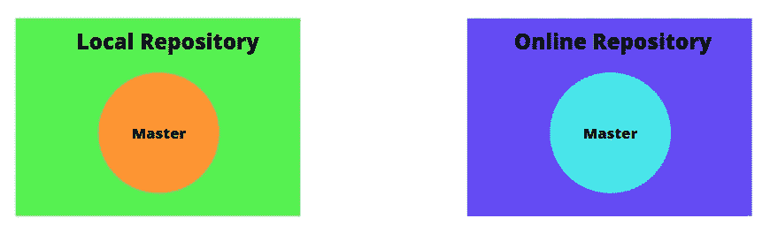
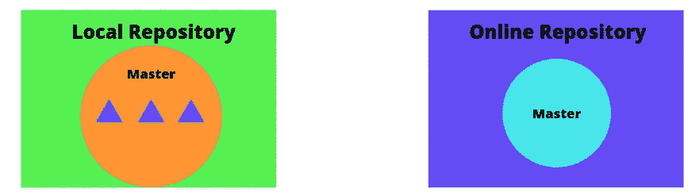
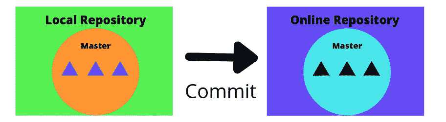
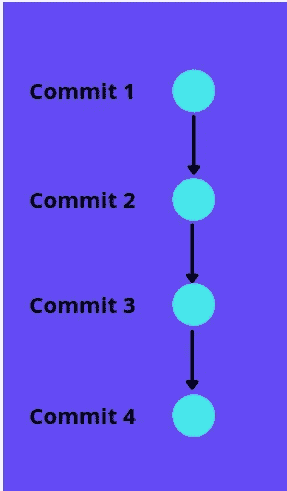
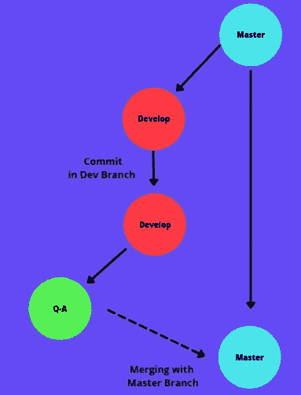

# 理解 GIT 的初学者指南

> 原文：<https://medium.com/geekculture/beginners-guide-to-understanding-git-45db6754ecd4?source=collection_archive---------26----------------------->

软件工程和开发作为一种成功的职业选择正与日俱增。全球数百万人正在学习编程，希望找到一份高薪工作或建立自己的品牌。要找到一份软件开发的好工作，需要的不仅仅是写代码。GIT 就是这样的东西之一。如果你想用你的编码技能成就一份成功的职业，Git 或版本控制可能会在你的简历中加分不少。如果你想从事大型项目并与团队或开发人员合作，理解源代码控制是必不可少的。

# 用 GIT 理解源代码管理

Git 属于一个更广泛的概念，称为“源代码控制”或“版本控制”。源代码管理是一个代码管理系统。Git 是管理和控制代码版本的工具之一。它受欢迎的一个重要原因是它是开源的。我们来简单的理解一下。

# 知识库:有组织生活的开始

在开始编写代码之前，首先要初始化一个存储库。在线创建存储库，并在您的本地设备上创建其副本。可以把它想象成在你的计算机中创建一个文件夹，用来存储你的代码文件。因此，这个存储库将包含链接到该特定项目的所有代码、文件和文件夹。

在存储库初始化之后，您开始编写代码，并将您的初始代码文件保存在您的本地存储库中。在初始化阶段，会在您的存储库中创建一个分支，通常称为主分支。这个主分支通常包含最稳定的代码版本。

Image 1 — Initializing a Repository

# 暂存更改

现在，每当您添加、删除或更新任何文件时，您都需要将这些更改告知您的存储库。您负责存储在存储库中的内容以及要忽略的文件。这部分叫做分期。你所有的代码仍然在你的本地存储库中，比如你的笔记本电脑。因此，登台意味着为您的存储库提供一系列指导。被忽略组件的一些常见例子是安装的依赖项或模块，有时还有多媒体文件。

Image 2- Staging changes in Local Repository

# 代码提交

在登台之后，您提交代码，这将从您的本地系统复制存储库，并根据您的登台(指令)将其存储在云服务器中。

Image 3 —Code Commit

# 提交历史:你真的可以访问过去

代码提交提供了另一个重要的功能。它将提交前编写的代码保存为快照。把这想象成游戏中的关卡。但是在这种情况下，您可以从每个以前的提交/检查点检索代码。

Image 4 — Commit history

例如，在图 4 中，您可以从 1 到 4 返回到任何以前的提交，以防将来出现任何错误。这对解决代码中的任何问题都很有帮助。如果出于某种原因，您的代码停止工作，您可以快速找到出错的地方。

# 分支:实现测试运行的简单方法

让我们假设你有一个顺利运行的项目。现在您想要添加新的特性，但是您需要在添加到现有代码之前首先测试它们。这是您的存储库中需要分支的地方。分支就像现有代码的副本。

Image 5 — Branches

当您的主代码从主分支(在存储库初始化时创建的)启动并平稳运行时，您的新分支(通常命名为“dev”或“development”)将包含您的新特性代码。在您完成开发之后，您可以创建另一个分支作为“质量保证”来测试特性。一旦一切都测试完毕，您就可以用 master 合并您的分支，您的项目就会有一个更新。

# 不同团队的分支

您还可以为不同的团队创建不同的分支，并将它们合并到一个项目中。例如，在图 6 中，三个团队 A、B 和 C 在同一个项目的不同部分工作，一旦团队 A 和 C 完成了他们的代码部分，他们将他们的分支与团队 B 的分支合并，这通常是项目的主要分支。

Image 6 — Branches for different teams

# 源代码管理:生命的救星

源代码控制不仅能帮助你管理你的代码，还能让你有机会与世界各地的开发者合作。github 上有数百万个开源项目，任何人都可以访问代码并贡献自己的一份力量。也帮助开发者提升能力，从“只是另一个开发者”进化为“一个优秀的开发者”。