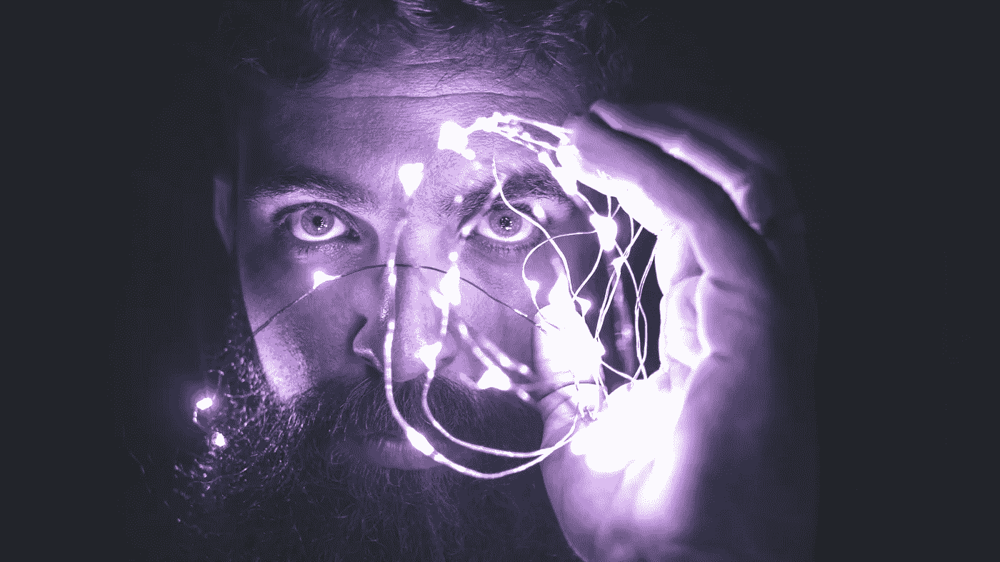
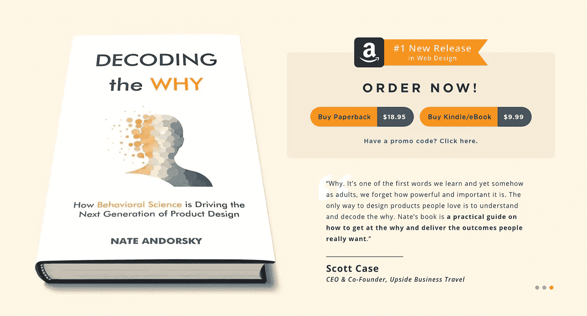

# 行为科学是设计你下一个成功产品的秘密成分

> 原文：<https://medium.com/geekculture/behavioral-science-is-the-secret-ingredient-to-designing-your-next-winning-product-60daf1d0dea7?source=collection_archive---------19----------------------->

我大学一毕业就成了一名科技企业家。很快，我发现我们开发技术产品的方式从一开始就是有缺陷的。

这个剧本听起来熟悉吗？你创造了一项新技术。你接触一群用户或潜在客户。你问他们想要什么。你做一些 A/B 测试。你提炼并发布一个产品。

虽然这是一个崇高的追求，但标准的剧本并没有考虑是什么驱动了人类的行为:为什么人们真的在做他们正在做的决定？

> 为什么人们真的在做他们正在做的决定？

# 行为科学的世界

本质上，行为科学是人类决策的科学。

与任何标准的 UX 测试相比，挖掘人类活动背后的“为什么”可以帮助我们更好地理解人类行为。

这就是为什么我创立了[创意科学](https://creativescience.co/)——向公司展示，当行为科学成为其核心时，技术会更好地发挥作用。

当我读到行为经济学家理查德·h·泰勒和卡斯·r·桑斯坦的《T4 推动 T5》这本书时，我恍然大悟。

随着我对行为科学研究的深入，我意识到我从 UX 商业设计中学到了更多。

我以为很多公司已经在整合产品设计和行为科学了。快讯:他们没有。

# 行为科学应该是 UX 设计的基础

公司通常通过进行调查和用户测试来开始开发新技术。

他们问用户想要什么，然后实现什么。

但是这种方法太肤浅了，因为有一个关键问题:**我们通常没有意识到最初是什么驱动了我们的决策**。

我认为标准流程是一种浪费。你只是在猜测。你在对着墙扔东西，但是你并没有真正理解那些潜在的行为。

**对行为科学概念的深入理解会带来更好的产品。**

# 进行行为技术审计

在[创意科学](https://creativescience.co/)，我们通过同时处理行为科学和技术解决方案来解决这个问题。

首先，我们对客户的产品进行行为审计。

我们构建了一个我们称之为“基础行为模型”的东西，它为客户提供了一个理解是什么因素在驱动用户决策。

然后，我们开始识别用户挑战，并根据我们创建的行为模型识别有助于解决这些挑战的基于产品的解决方案。

然后，我们的客户使用这份建议清单来实施变更。有时公司的内部开发团队和我们一起工作，有时他们雇佣[创意科学](https://creativescience.co/)为他们做开发工作。

# 谁能从行为科学中受益？

任何拥有技术产品的行业都可以从行为科学改革中受益。

到目前为止，我们公司的客户主要集中在非营利组织、健康、教育和金融领域。

创造科学的最终目标是帮助公司成为更好的自我。

在每个行业，这看起来都有所不同。

例如，在金融领域，通常有一些类型的在线平台可以帮助人们节省更多的钱，更明智地消费。在教育领域，有很多电子学习平台。在健康领域，它可能是吃得更好或做得更多。

我们已经帮助许多教育公司激励用户完成他们注册的电子学习课程。

理性的理由并不总是管用。这就是为什么我们可以用行为理论想出更好的战术。

# 工作中的行为科学

团队中有一名行为科学家——无论是雇佣像[创意科学](https://creativescience.co/)这样的公司，还是你自己的内部团队成员——都可以带来创新，否则就不会发生。

在保险公司[柠檬水](https://www.lemonade.com/)，首席行为官丹·艾瑞里想出了一个有效的方法来减少公司收到的欺诈索赔。

丹研究了促使一个人变得值得信任的一些因素的行为方面。

> 丹研究了促使一个人变得值得信任的一些因素的行为方面

他的研究发现的一件事是**对于一个人来说，在镜头前撒谎比他们在声明中写的要困难得多**。

柠檬水的部分索赔流程**要求客户拍摄一段视频**说明他们的保险索赔是什么。

这是一个简单而优雅的解决方案。但是如果没有行为科学家在船上，柠檬水的团队可能永远不会想到这一点。

# 情绪创造行动

寻找更多使用行为科学镜头的好处的证据？

如今，许多组织认为给人们硬数据会激励他们采取行动。

对于非营利组织来说，尤其如此。你想激励人们让世界变得更美好，你认为数字和统计数据可以做到这一点。但那没用。

非营利组织有时会陷入向人们展示问题有多严重的怪圈，抛出统计数据和数字来促使人们采取行动。

作为行为科学出身的人，我们知道这通常是行不通的。

相反，你需要在情感上打动人们。

想想像耐克这样的品牌。他们在广告中不谈论他们产品的特点。他们谈论那些产品会让你有什么感觉。

> 想想像耐克这样的品牌。他们在广告中不谈论他们产品的特点。

# 行为科学将成为商业的基本要素

我的观点是，当谈到商业的未来时，行为科学将开始扮演主角。

只看数据科学。

今天，数据科学被认为是商业难题的关键部分。首席数据科学家是一个热门的新职位。三叶草健康公司的首席执行官马特·沃勒特预测了 CBO 或“首席行为官”的崛起

我的猜测是，在未来 10-15 年，我们将开始看到行为科学成为许多公司的一个专门部门，被视为公司成功的基础支柱。

一旦行为科学成为主流，我们可能会看到它像数据科学一样演变成专业。

例如，在机器学习中，有数据科学家从事自然语言处理等数据科学的特定部分。我们可能会开始看到行为科学家以同样的方式专注于公司的特定领域。

这种雇佣应该谨慎，因为将学术行为科学理论应用到产品和业务用例中需要创造性思维。很难找到既懂行为科学*又精于产品设计的人。*

# 结合行为科学和技术

也许行为科学与技术世界相遇的最大潜力将是改变长期行为的力量。

想想看:科技已经强大到令人难以置信的程度。行为科学可以让它更有效。

我不认为行为科学或行为科学是解决我们所有问题的灵丹妙药。

但是看看许多围绕帮助人们省钱、吃得更健康、锻炼更多或变得更聪明而构建的应用程序和软件，它们中的许多都不是用行为方法构建的。

这意味着很多机会摆在桌面上。

目前，行为科学就像一种装饰品。在顶级产品制造完成后，它会被洒在上面。

如果我们能够从一开始就将行为科学构建到产品的核心，它们将会变得更加强大。

# 解读为什么——行为科学如何驱动下一代产品设计。

如果你有兴趣了解更多，请免费下载我的书 [***【解码为什么***](https://creativescience.co/decoding-the-why/)**——行为科学如何驱动下一代产品设计。**

***促销代码**:中 2021*

*

Decoding the Why Book* 

*如果你想联系我，你可以通过电子邮件([nate@creativescience.co](mailto:nate@creativescience.co))联系我，或者通过 [LinkedIn](https://www.linkedin.com/in/nate-andorsky-16556a8/) 联系我。*