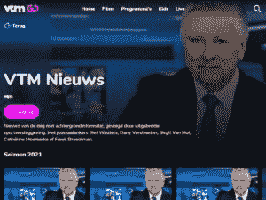

# VTM GO & Streamz 的幕后:iOS 视频开发

> 原文：<https://medium.com/geekculture/behind-the-scenes-of-vtm-go-streamz-ios-development-for-video-213fde8e54cd?source=collection_archive---------16----------------------->

我们的视频团队一直致力于新功能和优化——保密信息，抱歉！但我们认为，带您到我们的爆米花团队幕后看一会儿会很不错，这个团队负责 VTM GO 和 Streamz 等品牌的视频播放器。他们最近在做什么？拿出你的爆米花，享受阅读吧！

Photo by [GR Stocks](https://unsplash.com/@grstocks?utm_source=medium&utm_medium=referral) on [Unsplash](https://unsplash.com?utm_source=medium&utm_medium=referral)

# 运动中的视频小队

在 DPG 传媒，我们在比利时有两个知名的视频品牌。 [VTM GO](https://vtm.be/vtmgo) 和[Streamz](https://www.streamz.be/streamz)(DPG 媒体和 Telenet 的合资企业)，都可以在 Android、iOS 和许多其他平台上使用。VTM GO first 于 2019 年 4 月“播出”，比利时网飞挑战者 Streamz 于 2020 年 9 月发布。

我们有几个班在研究 Streamz 和 VTM 围棋。他们都有不同的专业。例如， *DeVideotheek* 小队负责提供视频文件，确保它们被正确地转码和编码成不同的格式，以便由爆米花小队驱动的视频播放器能够播放视频。

# 快速 iOS 开发

爆米花小分队负责很多平台，其中一个就是苹果生态系统。在这一点上，他们支持 iOS、tvOS 和 Airplay。编程语言是 Swift，团队使用 HTTP Live Streaming (HLS)向用户设备发送直播和点播的音频和视频。

正如您可能知道的，视频包含了许多开发复杂性。只要想想广泛接受和使用的功能，如下载视频供离线使用、视频加密和字幕。当然，有许多设备需要支持:iPad、iPhone、Apple TV 和 AirPlay，但 Chromecast 甚至电视都可能影响代码的行为。

# Streamz —从头开始构建

2020 年最大的发布是全新的 Streamz。它实际上是我们从零开始构建的第一个视频播放器——没有第三方库。由于 Streamz 没有广告，这是一个绝佳的机会来迎接挑战，打造我们自己的播放器。这不仅对技术团队来说非常有教育意义和令人兴奋，而且还使我们能够响应客户的请求，快速优化平台。

# 伪造视频点播新闻——没有#假新闻

爆米花小组面临的另一个挑战是如何通过 VTM GO 快速为 VTM 新闻广播服务。新闻首先在电视上播出，观众也可以在 VTM GO 应用程序中观看直播。但由于技术原因，该新闻的点播版本仅在几个小时后才在网上出现。我们基本上是在为 VTM GO 用户提供旧新闻。

输入“重启电视”，这是我们采用最低可行产品(MVP)理念的解决方案的内部名称。iOS 开发者和 Scrum 大师 Joris Dubois 解释道:“重启是一个具有很高商业价值的新功能。我们不能让观众等上几个小时才能看到新闻，但潜在的复杂性只是花费这么多时间来呈现来自直播流的视频点播。我们也许可以把它调整得更快，但远没有我们的重启电视功能快。现在，有了 MVP，我们为观众提供时移直播流，让他们体验视频点播(VOD)。”

复杂性在于视频播放器在逻辑上将直播流识别为直播。但这意味着，除了别的以外，在视频中不能后退或前进。它没有你所期望的视频点播功能。因此，视频团队必须让视频播放器相信直播流实际上是视频点播，以便用户界面(UI)相应地动作。基本上，VTM GO 提供的是一个假视频点播——一个带有时移的直播流。因为我们不可能永远直播，一旦真正的视频点播可用，直播流就会被真正的视频点播所取代。

# 复杂到极致

你已经读过了:视频的 iOS 开发与“常规”的 iOS 应用程序开发完全不同。它需要创造力、毅力和聪明的头脑。

乔里斯:“我们的视频播放器正变得越来越复杂。我们不仅添加更多功能，苹果还发布更新。当有一个新的测试版本时，我们需要确保我们的功能仍然像预期的那样工作。人们需要能够播放他们的视频，因为没有视频，我们的应用就一文不值。”

*如果你渴望参与我们的视频项目，请关注* [*我们的职位空缺*](https://vacatures.dpgmedia.nl/) *。我们可能会给你提供下一份工作！*

*原发布于*[*https://www . DPG media . nl*](https://www.dpgmedia.nl/werkenbij/blog/vtm-go-streamz-ios-development-video)*。*