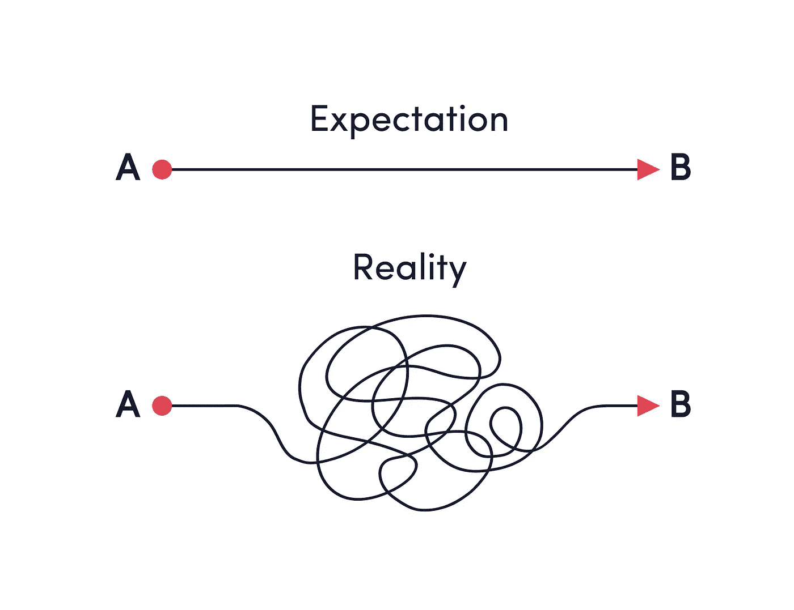

# 成为一名 Web 开发人员:期望与现实

> 原文：<https://medium.com/geekculture/being-a-web-developer-expectations-vs-reality-e73a5fb4c8eb?source=collection_archive---------8----------------------->

## 去马尔代夫之前，沉住气！

[artimir](https://www.freepik.com/artimir) @ Freepik

好的，我很确定大多数有抱负的 web 开发人员已经听过很多关于他们未来职业努力的童话故事。我并不是说*其中有些*是不真实的，但是让我们面对现实:**当谈到 web 开发时，有很多期望**通常结果与现实略有不同。

让我们想象一下鲍勃。

鲍勃是一个好奇又勤奋的家伙，他一直梦想着成功。从孩提时代起，鲍勃就迫不及待地想要长大，并建立一个成功的职业生涯，这将帮助他感到充实、有灵感，而且不仅仅是支付房租。

因此，一旦鲍勃决定是时候开始寻找职业道路了，他就开始做研究。

> 什么样的工作会同样令人满意并以利润为导向？
> 
> 什么职业可以给他弹性工作时间的可能性？
> 
> 什么样的工作能让鲍勃在外面扬名立万？

此外，鲍勃一直是一个很有艺术细胞的人，所以最适合的工作应该是一份有创造性元素的工作。这么多问题，这么多职业可能性。

当 Bob 继续寻找完美的商业机会时，他听说了一个关于一个有抱负的 web 开发人员的故事，他在这个领域只工作了两个月就开始赚大钱。我们就叫他**马修**吧。除了钱之外，马修还设法建立了一些重要的职业关系，赚了足够的钱，让他可以在夏季去马尔代夫工作。

*“丁，”*鲍勃自言自语道。——*“就是那个！那才是最完美的职业！”*

## 你知道鲍勃和马修的主要区别是什么吗？

[diloka107](https://www.freepik.com/diloka107) @ Freepik

我们在生活中的某个时候都是鲍勃，我很确定我们脑子里都有这个马修神话人物。

这里重要的是永远不要忘记马修可能是这个叫做*“嘴对嘴的夸张”*的都市传说的产物。

无论如何，我并不是说见证一夜成功的人不存在。当然，这些幸运的动物绝对是真实的，它们代表了我们职业和精神觉醒的强大理由。以身作则是伟大的。心中有一个鼓舞人心的榜样也很重要。重要的是不要让这张照片让你相信你很快就会成为一名专家，一个月后你会对《纽约时报》封面人物眨眼。

每一个鲍勃都应该努力工作，保持耐心，坚持不懈，不断学习和发展，以成为一名马修。

事实证明，当我们谈论 web 开发时，我们无法避免永无止境的期望与现实之战。这就是为什么我决定看看人们在研究 web 开发职业时可能会遇到的一些最常见的误解。

## 成为一名 web 开发人员:期望与现实

1.  金钱，金钱，金钱，永远是 web dev 世界的阳光~
2.  等我的信号恢复了，我会给你回电话的！
3.  实现这些代码是小菜一碟！
4.  伙计，我告诉你，我有这么多价值数百万美元的商业项目，我不得不把它们搁置起来(在这里随机插入一个名人的名字)
5.  啊，已经一个月了，该是我成立公司的时候了！
6.  投资是什么意思？我已经有一台很棒的笔记本电脑了。
7.  你说提升我的知识是什么意思？
8.  我最好花四个晚上寻找解决方案，而不是向同事寻求建议。或者谷歌。是啊，肯定的！
9.  我好困！我最好把今天的任务推迟到明天，最后期限太早了！

## 金钱，金钱，金钱，在网络开发者的世界里永远充满阳光

好吧，事情是这样的:是的，一个人可以通过网络开发赚很多钱。这里常见的误解是，许多人期望在完成第一个项目后就能马上赚大钱。为了让你成为一名优秀的开发商，让企业开始接近你，首先，你需要努力工作。从本质上来说，积累经验、建立知识、职业道德和发展专业技能需要时间和多个项目的实施。

所以，我的建议是，带着渴望获得成功的心态出发，但也要准备好付出努力、耐心和不断的磨砺。

## 一旦我恢复了我的信号，让我给你回电话

当然，在 web 开发行业获得一份工作通常意味着在任何地方工作的自由。虽然这在某种程度上是正确的(如果你不是自由职业者，这取决于你公司的政策)，但你可以肯定没有“无论何处”这样的事情。

作为一名网络开发人员意味着拥有稳定的联系和完美的在线形象。如果一个客户向你提出一个紧急请求，该怎么办？你肯定能在现场完成你的工作。当然，接收信号差、缺乏稳定网络连接的地方是绝对不能去的。所以，忘了山上那座与世隔绝的别墅吧。

## 实现这些代码是小菜一碟

有抱负的开发人员中有一个普遍的误解，即一旦你学会了某种编程语言或软件，你就万事大吉了，再也没有什么能让你吃惊了。

这与事实相去甚远。Web 开发是如此的动态和千变万化，以至于有时每隔一周就会有新的东西出现。每个项目都是不同的，每个初始任务都需要不同的工作方法。开发人员已经掌握了 C、Python 或 JS 的事实并不一定意味着他们永远不会面临困难。这就是让自己跟上时代如此重要的原因。

## 伙计，我告诉你，我有这么多价值数百万美元的商业项目，我不得不把它们搁置起来(在这里随机插入一个名人的名字)

或许有一天，你真的会拥有一个令人眼花缭乱、激动人心的卓越客户组合。我强烈希望你能做到这一点！

但是，人们不应该期望从一开始就抓住大鱼。大企业和公司更喜欢在几乎任何事情上依赖成熟的专业人士。所以，在希望参与这个庞大的项目之前，你最好问问自己，你是否在专业上做好了准备。通常，开发伙伴为他们的投资组合找到一个主要客户需要相当多的经验。不要仓促行事，而是利用这段时间去学习和成功。

## 啊，已经一个月了，该是我成立公司的时候了

好吧，我完全理解一个人的不耐烦，但让我们先现实一会儿。你真的相信一个月甚至一年的网络开发时间足以让你建立自己的网络开发公司吗？

先参考一下口碑吧。举例来说，你与你所在领域的所有其他 web 开发人员的不同之处在于你的专业方法、解决问题的技能以及与客户的良好沟通。随着时间的推移，你会开始为自己创造一个名字，人们会将它与成功联系起来。但是它需要无数快乐和满足的客户！有时候，建立一个良好的声誉可能需要几年时间，尤其是在商业领域非常拥挤的情况下(web 开发就是这种情况)。慢慢来，在建立一个完整的公司之前，一定要在利基市场为自己创造一个名字。

## 投资是什么意思？我已经有一台杀手级笔记本电脑了

许多人认为，一个网络开发者不需要做任何投资，只要他们身边有一个杀手级的笔记本电脑。

事实当然不是这样。即使你的硬件很棒而且是最新的，也有很多其他的投资可以用于职业发展。我指的是购买软件、插件、终身许可、参加不同的课程和研讨会进行额外的教育等等。事实上，web 开发需要不断的改进，所以开发人员准备投资更新他们的技术和知识是很自然的。

## 你说提升我的知识是什么意思？

另一个巨大的误解与知识升级有关。看，网络开发真的需要不断更新教育。人们不能简单地依赖他们五年前学到的东西。

黄金法则是尝试将编程和开发作为一个整体来理解，并且总是用新的信息来更新你当前的知识。当然，每个开发人员都有自己的专业领域，但是忽视不会伤害任何人。

## 我最好花四个晚上寻找解决方案，而不是向同事寻求建议。或者谷歌。是啊，肯定的！

我真诚地相信，对 web 开发人员最糟糕的期望和误解之一就是认为他们是无所不知的神一样的生物。这种信念导致许多网络开发者完全拒绝向他人寻求帮助和建议。

事实上，当事情走下坡路时，许多 web 开发人员会寻求同事的帮助，甚至使用 Google。不要折磨自己，花几天时间盯着屏幕寻找特定的 bug。相反，寻找可能的解决方案，并自学解决问题的聪明方法。既省时又节能。此外，这样你可以学习新的东西，在职业生涯和经验中成长。

## 我好困！我最好把今天的任务推迟到明天，最后期限太早了！

如果你是一名网络开发自由职业者，却没有一个经理来让你每天“用工作填满 8 个小时”，那么你很可能会拖延。

当然，有时候一个人只是需要休息和一些新鲜空气，但我的建议是避免太频繁地将今天的工作推迟到明天。这实际上会扼杀你的工作节奏。此外，你永远不知道一个项目是否会遇到一些障碍——你最好有足够的时间来解决所有的问题，而不是等到最后一刻。在 web 开发中，工作时间的灵活性是一个很大的优势，但它伴随着责任以及工作和职责的准确分配。

## 简单地

我认为对于有抱负的开发人员来说，看看事物的真实面貌是非常有用的。

有时我们会陷入快速爬上职业阶梯并挣大钱的童话场景。当事实证明略有不同时，我们很有可能会失望，甚至放弃。相反，审视现实是一个很好的方法——知道你的前方是什么，这样你就可以尽可能地为打造一份非凡的职业生涯做好准备。

大家好，我是 Ivan，我在这里与大家分享我对文字、优秀内容、企业家精神、个人发展、管理、爱好以及所有这些方面的热情。

我担任我的 WordPress 开发机构@ [Vipe Studio](https://vipestudio.com/en/) 的首席执行官，在这里我很高兴领导一个多元化的、出色的和充满活力的专家团队。请随时联系我——我很乐意交流新的想法并相互启发！