# 作为“多姆”(国防部)的“堂”。

> 原文：<https://medium.com/geekculture/being-the-don-of-the-dom-dod-a94f6eb9f6c3?source=collection_archive---------23----------------------->

被称为 **DOM** 的**文档对象模型**基本上是 **HTML** 文档的结构化表示，它可以被认为是由浏览器创建的节点或元素的树， **DOM** 是面向对象的，这意味着每个节点都有一组可以更改的值和属性，我们可以使用 **Javascript** 来操作这些 **DOM** 元素/节点。

我将荣幸地向您简要介绍如何使用 **Javascript** 来操作 **DOM** 并成为一名 **DON** 。

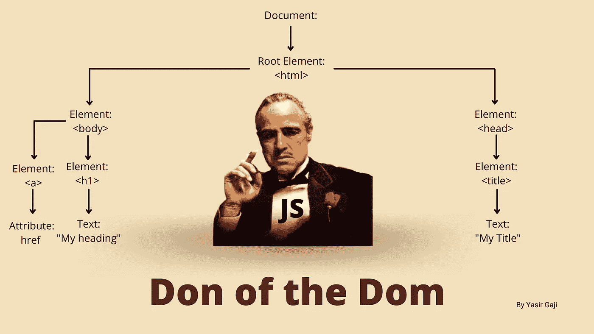

Image representation of DOD by [**Yasir Gaji**](https://yasirgaji.com)

浏览器为我们提供了网页的**窗口对象**，其中有上图所示的**文档对象**，它是根元素(在本例中为 HTML 标签)的父元素，也是两个兄弟元素的父元素，head 和 body 标签是其他元素的父元素，`<a> & <h1>,`和`<title>`分别是兄弟元素的子元素，这些子元素是其他节点/元素、属性和文本的父元素，如上图所示。

有像 **JQUERY** 这样的库，它似乎使 **DOM** 的操作变得容易，但并不完全如此，使用传统的 **Javascript** (vanilla js)来遍历和操作 **DOM** 更有效、更快，如果理解 **Javascript** 语言是你的重点，并且它也使你成为 **DOM** 的 **DON** 的话，这是最佳实践

## **检查文档对象。**

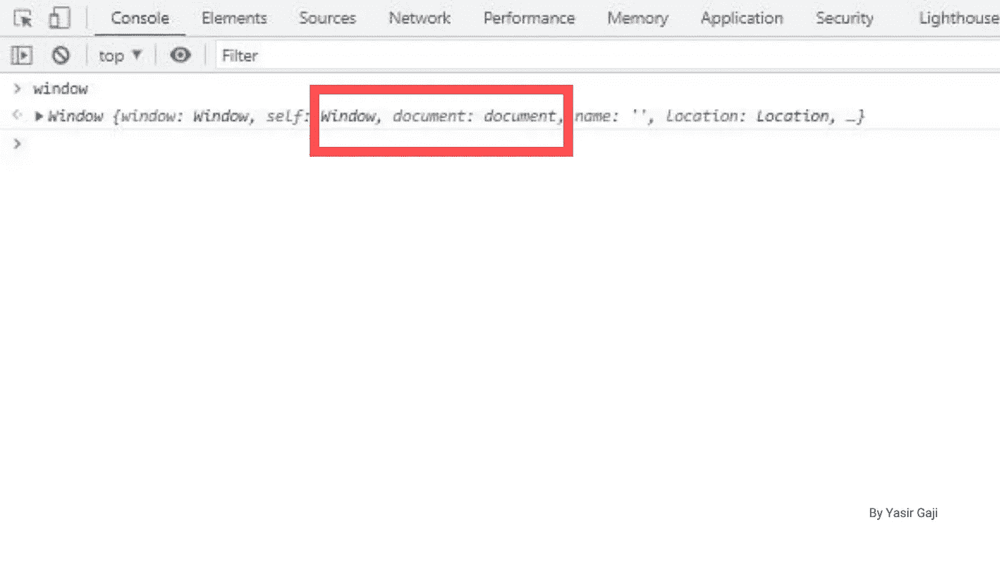

Document object as an object of the window object by [**Yasir Gaji**](https://yasirgaji.com)

文档对象是窗口对象(也称为全局对象)的一个属性，这就是我们要探讨的，在这一节中，我将向您展示如何从中选择项目，检查一个 **DOM** 树使用此代码
`let val;
val = document;
console.log(val);` 我们将在控制台中拥有整个文档对象。

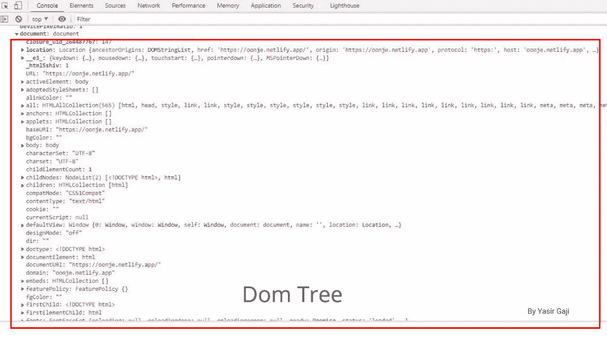

The DOM tree in the browser console image by [**Yasir Gaji**](https://yasirgaji.com)

现在，当使用 **DOM** 时，我们可以得到不同类型的结构，例如，上图中的 HTML 集合像一个数组，但它不是，它只是像数组一样格式化，所以我们不能对它使用像 forEach 循环这样的数组方法。若要获取 HTML 集合，请使用；
`let val;
val = document.all;
console.log(val);` 我们会在控制台中得到以下内容；

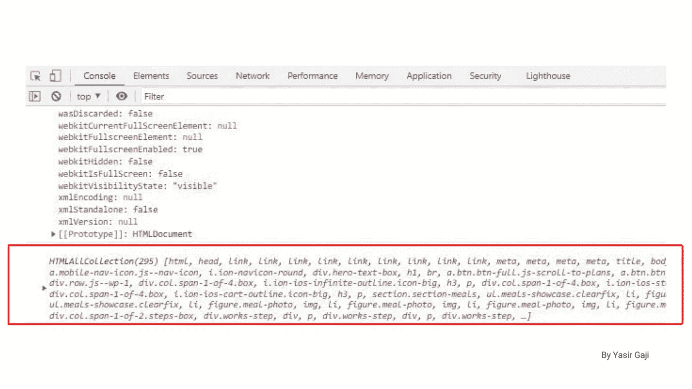

The HTML collection in the DOM image by [**Yasir Gaji**](https://yasirgaji.com)

就像数组一样，我们可以访问 HTML 集合中的某些索引，就像数组一样，它是从零开始的，例如我们有
`let val;
val = document.all[0];
console.log(val);` 或
`let val;
val = document.all[4];
console.log(val);` 我们会得到:

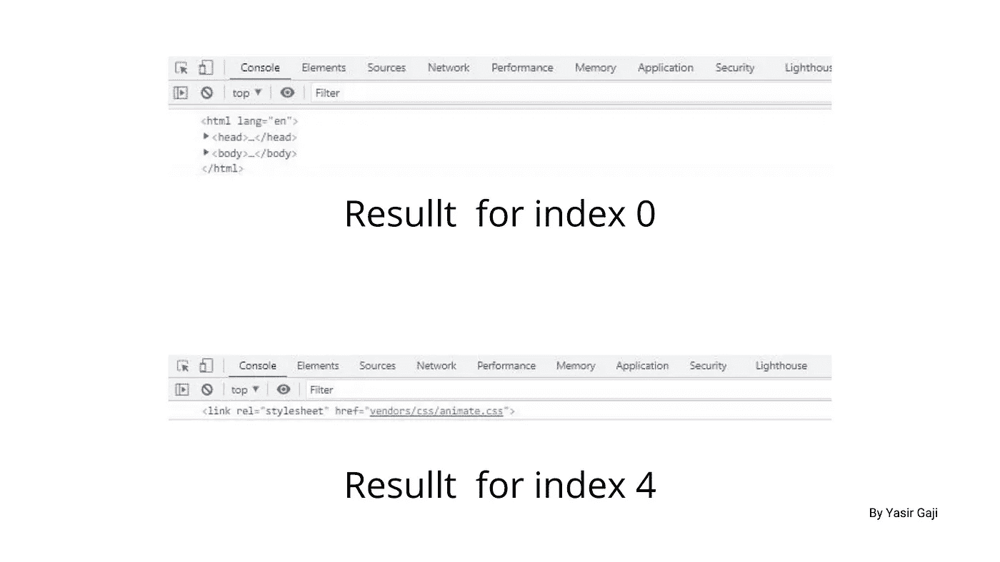

Result for HTML collection index selection image by [**Yasir Gaji**](https://yasirgaji.com)

我们也可以这样检查属性:
`let val;
val = document.all.length;
console.log(val);` 这段代码将检查文档对象中存在的节点/元素的总数，

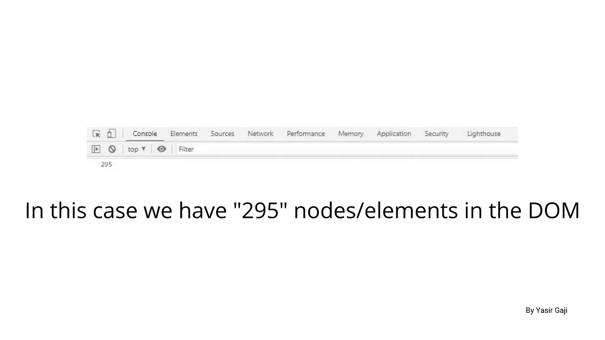

The total number of nodes/elements in the document object image by [**Yasir Gaji**](https://yasirgaji.com)

我们还可以访问单个节点/元素，选择任何特定节点，如域、链接、内容类型、URL、字符集…并为其分配功能，例如
`let val1, val2, val3;
val1 = document.head;
val2 = document.body;
val3 = document.links;
console.log(val1, val2, val3);` 该代码将在控制台中分别打印出这些单个节点:

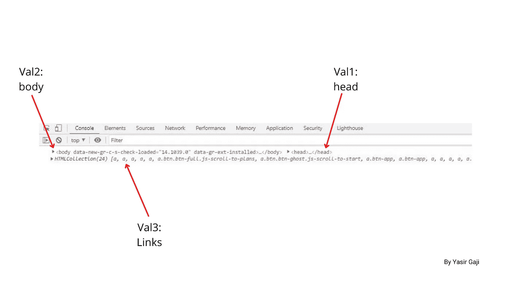

Specific Individual nodes image by [**Yasir Gaji**](https://yasirgaji.com)

下面再介绍几种不使用 javascript 选择器的节点选择方式，例如:
`let val;
val = document.forms;
val = document.forms[0];
val = document.forms.id;
val = document.forms.method;`

`val = document.links;
val = document.links[4];
val = document.links.className;
val = document.links[7].classList.[6];`

`val = document.scripts;
val = document.scripts[1].getAttributes("src");
console.log(val);`

有趣的事实是，做一个 Don 就是制定和破坏规则，Javascript 就是这么做的，我之前说过 HTML 集合只是格式化为一个数组，但它不是一个数组，数组方法不能用在它上面，这个声明有一个技巧，但要证明这个声明，如果我们有
`let val;
val = document.scripts;
val.forEach(function(script) {
console.log(script);
});
console.log(val);` 这里是我们会得到的结果“模块未定义”，如下图所示。

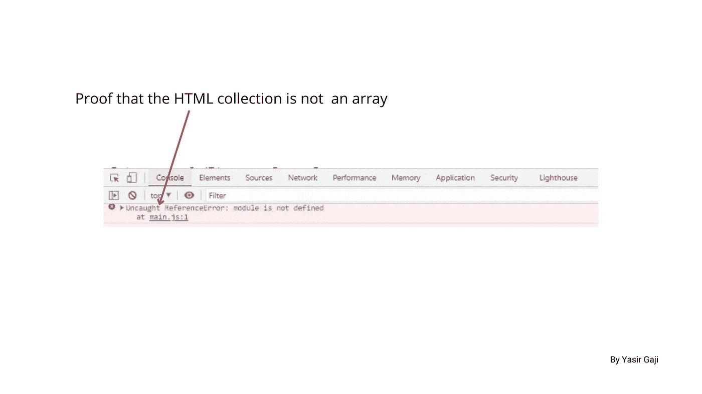

Proof that the HTML collection in the DOM is not an Array by [**Yasir Gaji**](https://yasirgaji.com)

嗯，作为堂，你可以把这一招运用到其中
`let val;
val = document.scripts;
*let scriptsArr = Array.from(val)*
scriptsArr.forEach(function(script) {
console.log(script);
});
console.log(val);`

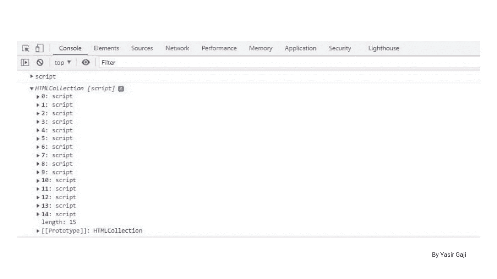

Result of conversion of the HTML collection to an array by [**Yasir Gaji**](https://yasirgaji.com)

太棒了，这是成为**唐**的方式之一。

## 节点/元素的 DOM 选择器。

这些基本上是文档对象方法，允许从 DOM 中选择节点以实现动态功能，在过去，JQUERY 用于完成这项任务，我不推荐它，因为这就像用大锤杀死蚊子，随着传统 javascript (vanilla js)的最新更新，我们有了分为单个和多个选择器的选择器，因此不需要 JQUERY。

**单个选择器**将允许您通过 ID 或类名选择单个元素/节点，它只存储一个东西，因此如果我们对在根文档中出现多次的 ID 或类名使用单个选择器，它将只选择第一个，而多个选择器则正好相反。

我们要看的第一个选择器是`document.getElementById();` ,正如它暗示的那样，它只通过 ID 选择元素。我们不能只选择 ID 来选择类或标记，例如，如果我们从文档对象中选择 ID“box”。
`console.log(document.getElementById('box'));`

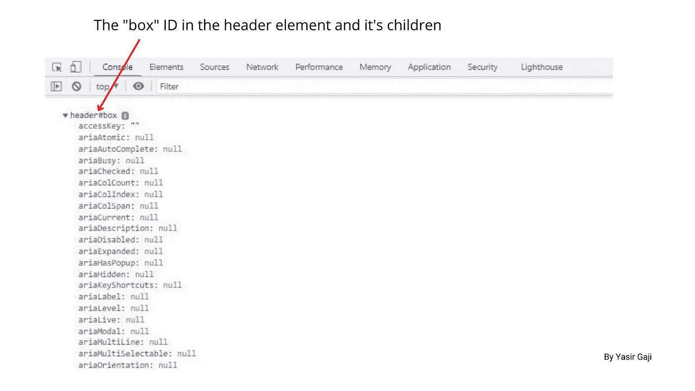

The “box” ID in the header element and its children Image representation by [**Yasir Gaji**](https://yasirgaji.com)

它会在控制台中打印出 ID，我们也可以获得 ID 所在的元素/节点中的任何属性，例如
`console.log(document.getElementById('box').id);
console.log(document.getElementById('box').className);`

我们也可以改变元素的 CSS，比如改变背景颜色，文本颜色，用框的 ID 设置元素的填充，我们可以使用这些代码行
`document.getElementById('box').style.background = '#333';
document.getElementById('box').style.color= 'red';
document.getElementById('box').style.padding= '1.5rem';`

在我们想要通过获取 API 或 AJAX 获取，并且我们想要插入或改变节点/元素的文本内容的情况下，我们可以这样改变文本内容
`document.getElementById('box').innerHtml = '<h3>This is Yasir's article</h3>';`

但是我们可以使用这些语法
`document.getElementById('box').innerText = 'This is Levitan's article';
document.getElementById('box').textContent= 'This is Gaji's article';`正常地改变文本内容

我们要看的第二个选择器的工作方式与 JQUERY 相似，语法与 JQUERY 相似，但它不是，它是`document.querySelector();`这个选择器比初始的选择器更好，我们可以选择任何内容，不仅仅是 ID，例如，要选择 ID、类名和元素本身，我们可以使用下面的代码

`console.log(document.querySelector('#box'));
console.log(document.querySelector('.section-features'));
console.log(document.querySelector('header'));`

我们可以使用`document.getElementById();`和`document.querySelector();`执行每个动态函数，并得到相同的结果。

注意:对于使用`document.querySelector();`的元素选择，如果我们选择一个`li`元素，并且在文档对象中有多个`li`元素，那么它只会选择第一个，这适用于多个 id 和类名。

**多个选择器**将允许您为动态函数选择多个元素/节点。我们要看的第一个选择器是`document.getElementsByClassName()`选择器，它将通过类名选择多个元素，例如使用此代码块
`const meals = document.getElementsByClassName('meals-photo');
console.log(meals);`选择文档对象中的多个图形元素

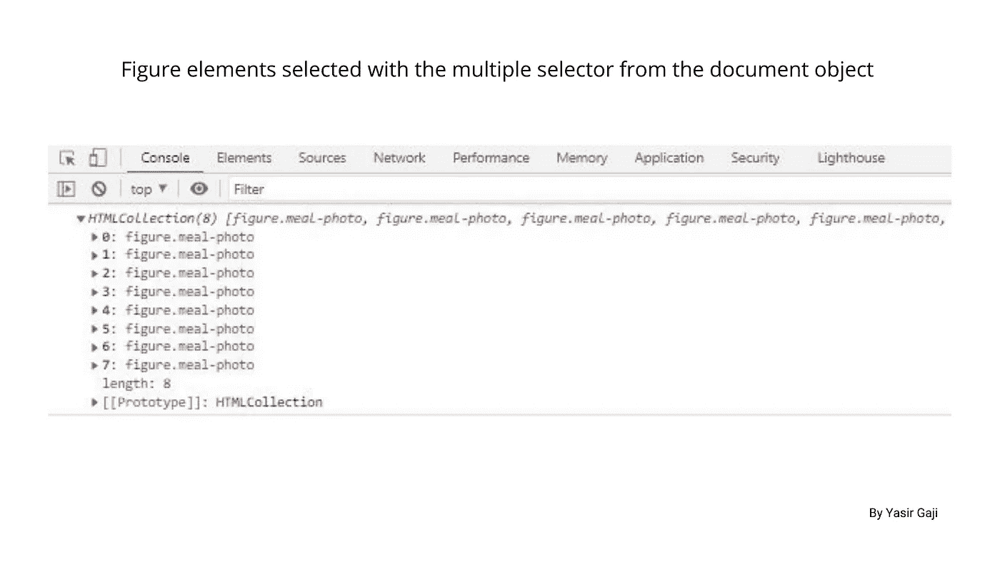

Figure elements selected with the multiple selector from the document object by [**Yasir Gaji**](https://yasirgaji.com)

图形元素将打印在控制台索引中(DOM**是从零开始的),这样我们就可以像访问数组一样访问它们，并为它们分配单独的任务。**

第二个多重选择器是`document.getElementsByTagName();`，它选择标签标题而不是类名，例如
`const meals = document.getElementsByTagName('figure');
console.log(meals);`
，并操作特定的索引，例如
`const meals = document.getElementsByTagName('figure');
meals[1].style.diplay = 'none';`
，这将从索引中取出第二个数字。
作为 don，您可以使用任一选择器将多个选定元素作为一个数组进行操作，例如使用`document.getElementsByTagName();`反转选定的多个元素；
`let meals = document.getElementsByTagName('figure');
meals = Array.from(meals) ;`
`meals = reverse();`

第三个多重选择器是`document.querySelectorAll();`，这个选择器接受标记名、类名和 id，就像 JQUERY 一样。它也返回节点列表，与返回元素列表的两个初始选择器不同，这个选择器将返回被选择的节点内的每个属性。例如
`const info = document.queryselectorAll('ul.meals-showcase li');
console.log(info);`
这将返回

querySelectorAll() returning the selected node from the document object by [**Yasir Gaji**](https://yasirgaji.com)

我们可以使用这个选择器执行动态功能，比如 forEach 循环、样式更改和文本替换，就像我们使用初始选择器一样。

## 结论

就像我在第一段中说的，我将简要地向你介绍如何在 Dom 中导航，通过我分享的这一点知识，我相信我已经做到了。现在，你要做的就是成为老大，随心所欲地扩大这个圈子。

可以从[自由代码营](https://www.freecodecamp.org/)、 [udemy](https://www.udemy.com/) 和 [W3schools](https://www.w3schools.com/) 等平台了解更多。

**参考文献** 自由代码阵营，布拉德·特拉弗斯，和赫米尔·帕特尔。