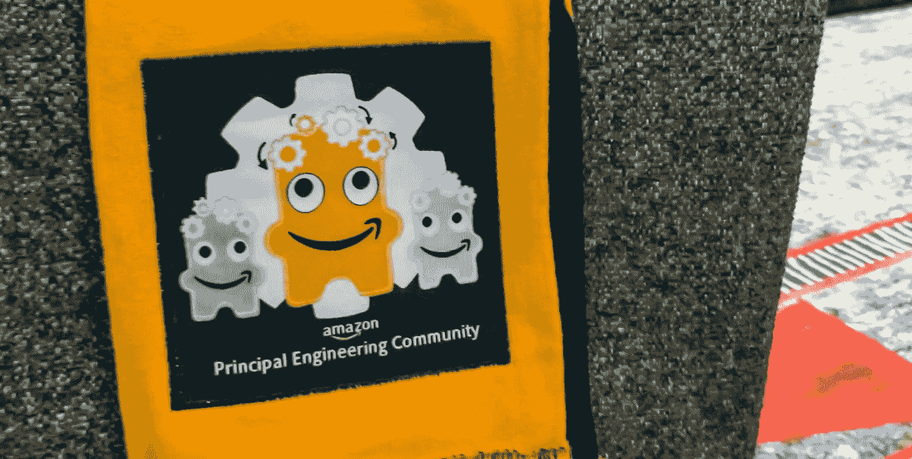
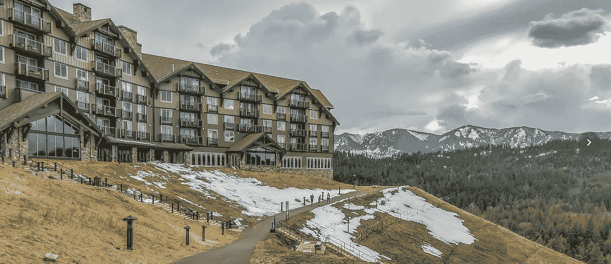
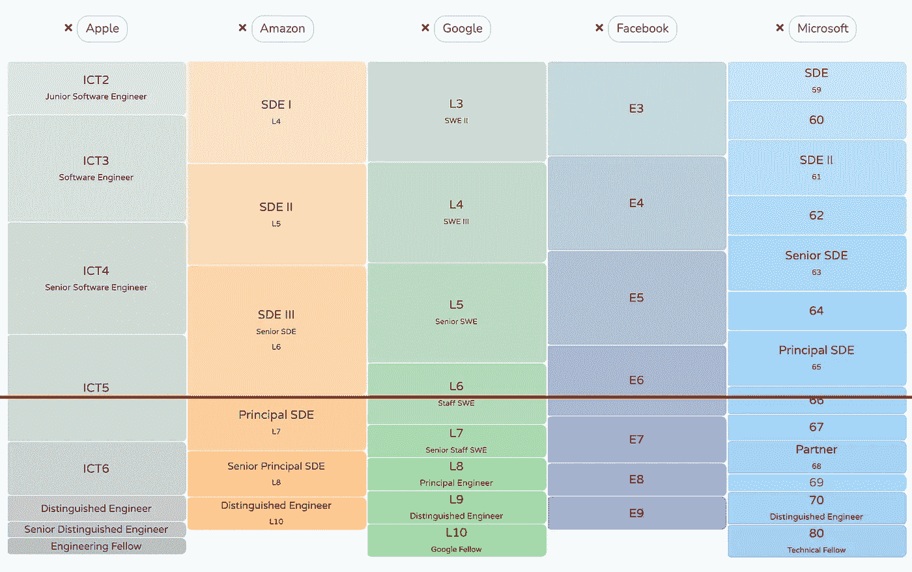
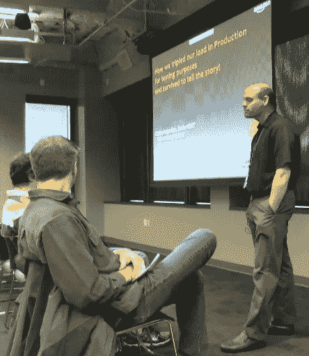
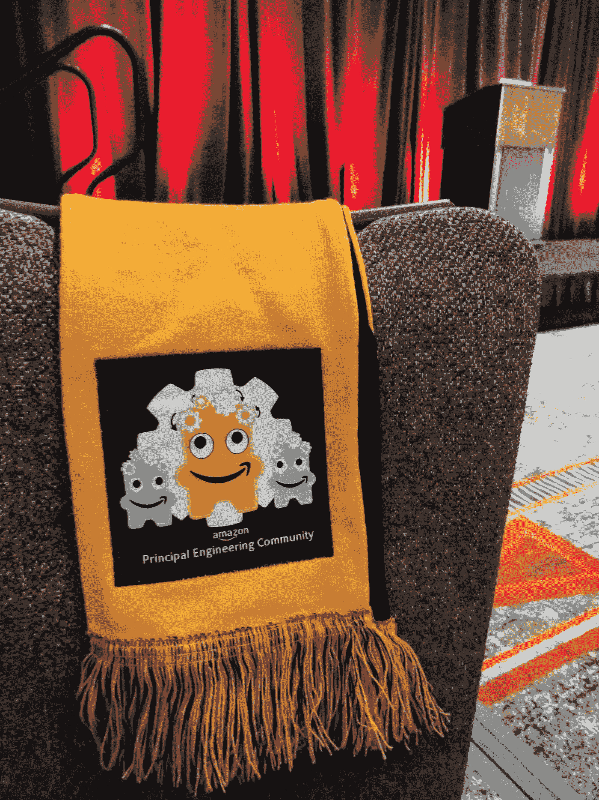

# 属于亚马逊的主要工程社区

> 原文：<https://medium.com/geekculture/belonging-to-amazons-principal-engineering-community-aa8059152fbf?source=collection_archive---------0----------------------->

## “国家是强大的”

亚马逊杰出的工程师之一彼得·沃肖尔(Peter vos shall)用他传统的问候开始了为期三天的异地之旅:*“美国是强大的。”【2014 年末，我们是亚马逊的三百多名首席工程师。我们都聚集在 Suncadia，这是华盛顿东部的一个高档、偏远的山区度假胜地。接下来的 3 天有一个宽松的会谈议程，[开放空间](https://en.wikipedia.org/wiki/Open_Space_Technology)，以及许多建立联系的自由时间，其中很大一部分是在食物、咖啡、威士忌和篝火上。*

Suncadia, remote mountain resort in Eastern Washington and host to our yearly get-togethers

# 我是怎么到那里的？

2009 年至 2020 年，我在亚马逊工作，最后六年是首席工程师。我要澄清一点，亚马逊的[和其他大公司的](https://amazon.jobs/en/landing_pages/principal-engineer-hiring)不一样。比如，门槛明显高于微软，但低于谷歌。这里的红线显示了亚马逊 PE 推广栏相对于其他推广栏的位置。大致是工程人口的前 3%。

这条路一直很紧张。我工作了很长时间，牺牲了很多。我第一次宣传失败了。很久以后，我才知道大多数私人股本公司第一次尝试都失败了。但至少第一次拒绝带来了清晰可行的反馈。差不多了；满足这个和那个的要求；少做 x 和 y；六个月后，我的第二次尝试成功了。

在亚马逊，所有工程师*到高级* *级别的晋升都是一样的:*

*   你的经理写了一份文档(通常在你的帮助下)。
*   doc 需要 5-7 个级别比你高的人支持它(这需要他们的大力支持)。
*   然后，在总监级别召开了推广会议，包括组织中的所有高级经理和首席工程师，审查该方案。经过一番激烈的讨论和集体投票，导演做了最后的决定。

但是校长级别的宣传片需要几个额外的步骤，包括两个评估员，他们深入调查你做过的每一件事 *。他们阅读你的设计文档和白皮书，分析你写的任何代码，阅读你对其他人的代码评审的评论，观看你的演讲，并亲自采访你周围的人。这是一个极其重要的过程。一旦我成为一名 PE，我自己做评估，他们通常需要 20-40 小时的工作，分散在几个月内。两位评估员独立工作，不是你的团队成员，不应该交叉注释，以避免偏见。*

因为这个过程是昂贵的，当一个经理想要为 PE 促销推荐某人时，他们需要向一个小组提交一个评估员的请求，该小组将决定它是否有足够的前景来授权评估员。很多 PE 的推广尝试都在这个阶段夭折了。对于那些有评估员的广告，如果两个评估员都说没有，促销活动就会在下一阶段夭折。如果一个人说是，一个人说不是，这取决于经理的判断是否继续——大多数情况下，一个评估员说不是就注定要失败。你真的需要两个评估员都说是，才能有一个坚实的案例。

在这一点上，PE 促销尝试延续了亚马逊其他促销的标准流程。撰写推广文档，收集同行和合作伙伴的支持，在推广会议上在你的主管和所有主管面前为其辩护。但对于 PE 宣传片，他们继续进行副总裁级别的推广，并在那里得到更多的审查。

然后，就在你以为你已经安全了的时候，最可怕的部分来了！即使在董事和副总裁批准后，他们还有一轮“小组”审查该小组是由来自公司的杰出工程师和副总裁组成的，他们再次确保 PE 宣传片遵循了公司的标准。该小组可以(也经常)否决副总裁批准的晋升。

# ***亚马逊对其 PEs 的迷恋***

这些步骤中的任何一步都可能导致委托人的促销尝试失败。在 Suncadia，Peter 冷静地回顾了当年的国情咨文——有多少人要求评估员，有多少人的促销尝试得到了组织的批准，有多少人被小组接受。“这个周期的新校长，请站起来！”彼得笑着说。

我站起来，脸红了。这是一个强有力的时刻。我意识到那天为了让我来到这个房间，大家付出了多少努力。我工作很努力，但公司也投入了大量资源来帮助我成长，并随后确保我遇到了一个酒吧。很多人花了很多时间观察我职业生涯的方方面面，来决定我是否属于那里。我感到肩上的责任重大。我被期望成为一个榜样。人们期望我表现出沉着冷静和高度的判断力。几十个人仔细检查了我工作的每个方面和我的个性。我将被信任做出影响数百万人生活的决定。我既兴奋又害怕。

而 ***亚马逊对其首席工程师*** 的迷恋就在于此。

亚马逊在提升他们的工程师到 PE 之前做了大量的尽职调查，因为**PE 拥有荒谬的权力**。

我在谷歌工作了一年半，谷歌的目标是通过设立委员会来消除偏见(如招聘、晋升)，在这些委员会中，决策需要公司各个部门的多人达成共识。亚马逊有一个不同的哲学:确保特定的高级人员有高判断力的良好记录，然后给他们过度的权力。每种方法都有优点和缺点，但它们确实位于光谱的相反两端。

让我举一个例子来对比亚马逊和谷歌的哲学:做出雇佣决定。我在亚马逊做了 800 次采访。br 是在汇报期间单独负责做出最终录用/不录用决定的面试官。一个人拥有如此巨大的权力。但是 BR 认证过程是残酷的，我不得不在数十次面试中被跟踪和被跟踪，跟踪指标，导师仔细检查和评论我问的每个问题和我在面试中花的每分钟，并最终签署我满足了成为 BR 的要求。训练和评估某人，如果他们通过了，就让他们开车。谷歌专注于消除偏见，提供包容和公平的体验(这是我非常喜欢的)，所以有一组人面试你，另一组人(一起)根据第一组人的面试反馈做出录用/不录用的决定。我百感交集:我喜欢谷歌对公平的承诺高于一切，但我的亚马逊爬虫般的大脑想知道，如果你和那些一贯表现出极高判断力的人在一起，你是否能做到这一点。

现在我是一名校长，我很快意识到人们会把我说的话当成福音来听。我习惯在开会的时候说 ***最后一个*** ，以免被级别吓倒，压制更多初级工程师的意见。因为这个原因，伟大的亚马逊高层领导总是最后发言。这可能是反直觉的， ***但是越是高层，说的越少，听的越多。*** 我和 [Andy Jassy(亚马逊首席执行官)](https://www.seattletimes.com/business/amazon/as-incoming-amazon-ceo-andy-jassy-steps-into-the-limelight-a-portrait-of-a-leader-much-like-jeff-bezos-emerges/)开过几次会，他在会议的大部分时间里都很安静，若有所思地听着，到处问一些问题，只有在其他人都发言后才陈述自己的观点。

为了对抗等级的诅咒，我最喜欢的校长之一完善了提问而不是陈述观点的艺术。他问的问题显然是为了帮助你得出一个他很久以前就得出的结论，但他并没有告诉你那个结论，而是总是问正确的问题，以便你自己能够得出那个结论。你没有被告知该做什么，而是通过推理去做。

> 随着资历的增长，智慧的金块也随之而来:多听少说。如果一定要讲，多提问，少发表意见。

脸书通过将等级私有化来对抗等级的诅咒。每个人都是“软件工程师”，你不知道你与之交谈的人是初级人员还是高级人员。这个想法是你说的话应该被认为是没有偏见的，因为你的水平。

我喜欢平等主义的观点，但我也有顾虑。回到 90 年代我在微软工作的时候，我们的级别也没有公开。但是大约在 2002 年，微软改变了这一点。我记得那天早上醒来，看看我所有的同事都是什么水平，那是一种享受！！！我们立即开始闲聊起来。“你能相信那个低能儿已经 65 级了吗？他什么都不做！”或者“你能相信努力的人只有 62 级吗？我还以为他们是个 64 呢！”最后，随着时间的推移，我相信它推动了问责制，或者至少它让人们关注到了那些人的表现明显与其水平不符的情况。

在谷歌(我现在的家)，人们可以选择显示或隐藏他们的级别。最终，我相信*问责制和透明度*，所以我选择展示它。

# 2014 年的主要社区

拥有一个 ***单身*** *PE 社区对亚马逊来说极其重要，原因有很多。正是连接组织奇迹般地将公司不协调的部分结合在一起。在很大程度上，亚马逊的运营就像一群混乱的初创公司，他们有自己的议程，但它却表现得很团结。聚醚砜是实现这一目标的粘合剂。当你的团队和另一个团队意见相左，无法解决问题时，两个组织的负责人会一起喝咖啡，冷静地解决界限、妥协和最佳解决方案。吃饭、喝咖啡、喝大量的酒，或者只是在一个偏远的山区度假胜地共享几个晚上的篝火，这些都建立了友谊和关系，你可以不断利用这些来推进你的想法和帮助你的团队。我特意让第一个离开学校的校长去会见和问候我周围的每一位校长。*

但是，亚马逊的增长是扩大 PE 社区的诅咒。2014 年，我第一次走流程的时候，10k 的工程师，300 的 PE，我们还是小的可以认识。有一段时间，公司的规模每年都在翻倍(PE 社区也是如此)。到 2021 年，将有 7 万名工程师，因此可能会有 2000-2500 名工程师。我无法想象当我们 300 人和 2500 人一起工作时会有同样的动力。

同龄人确实设法在一起呆了很长时间。我认为是像彼得(他在亚马逊工作了 22 年后刚刚退休)这样的长期任职者将它维系在一起。

我们每年都试图见面。太阳城是一个大型度假村，但我们的体育社区已经发展不下去了。2014 年 2015 年我们租了一部分；2016 年，整个度假村；2017 年围绕它的任何其他东西。2018 年，我们对社区进行了划分:上半年在周一至周三，而另一半在周三至 Fri，周三是我们再次短暂相聚的一天。2019 年，我们大约有 1200 人，所以我们在西雅图市中心的喜来登酒店租了一整个会议中心。但是小社区的氛围消失了。我认为这对公司和我来说标志着一个时代的结束。

我们每周都有午餐(亚马逊非常以西雅图为中心；此后，它变得更加全球化)。你会把你的食物带到会议室，和你的同事校长进行一个小时的激烈辩论。大多数 PE 都在总部，但也有一些来自世界其他地方的。

我们主持了一个全公司范围的每周技术讲座系列，名为亚马逊的*原则(POA)讲座*。这些活动拥有大约 1000 名观众(室内和远程连接)。任何想在 POA 上发言的人都会收到几个固执己见的 PE 作为教练，他们在无休止的排练中给出了无尽的反馈，最终不得不在上台之前批准它无愧于 POA 品牌。做一次这样的演讲是一种荣誉(我在 2012 年做过一次，很累！).

Giving my Principals of Amazon (POA) talk in December 2012\. “How we tripled our load in production for testing purposes and lived to tell the story”

我们还提供了全公司范围的*设计审查流程*。公司里的任何人都可以提交请求，解释他们在构建什么，他们在寻求什么样的专业知识，我们所有人都会收到通知，如果这符合我们的技能组合，我们任何人都可以报名帮忙。让你的设计评审在主要水平上完成也是一种荣誉。主要的设计评审是作为一个有凝聚力的公司运作的关键，即使我们是数百个小的创业公司。我们把试图建造相似东西的人联系在一起。我们注入了全公司的最佳实践。来自公司各处的意见总能丰富讨论。

参与所有这些全公司范围的计划是双向的。我帮助了别人，但也帮助了我。我成为一名更好的工程师仅仅是因为接触了这么多了不起的人和他们丰富的知识和观点。我觉得每次曝光都是向全公司不同的榜样学习的机会。

我认为随着公司的成长，这些社区会逐渐消失，原因很简单，因为规模机制不再起作用了。您可以应用分片来拥有更小的自治组，然后应用聚合过程来从所有组中带回想法。也许你有每个副总裁的社区，或者一些其他的关系。但就是不一样。加入亚马逊的 PE 社区是一个独特的机会，可以接触到一家公司所有隐藏的角落，就像它达到爆炸式的指数增长一样。

