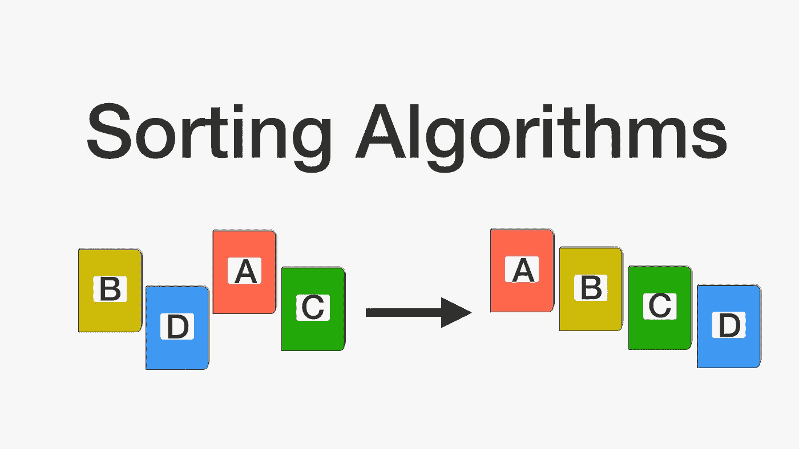
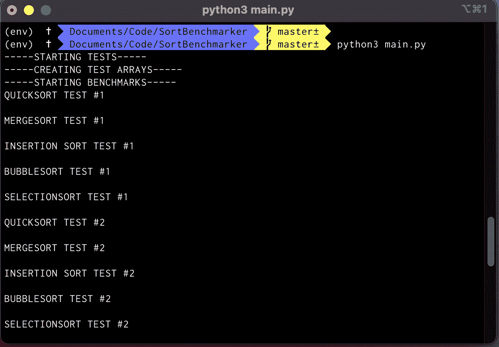
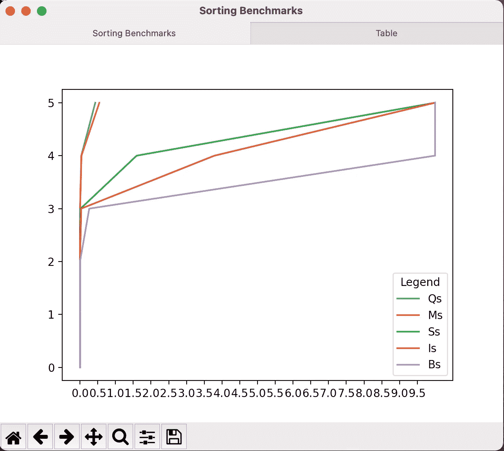
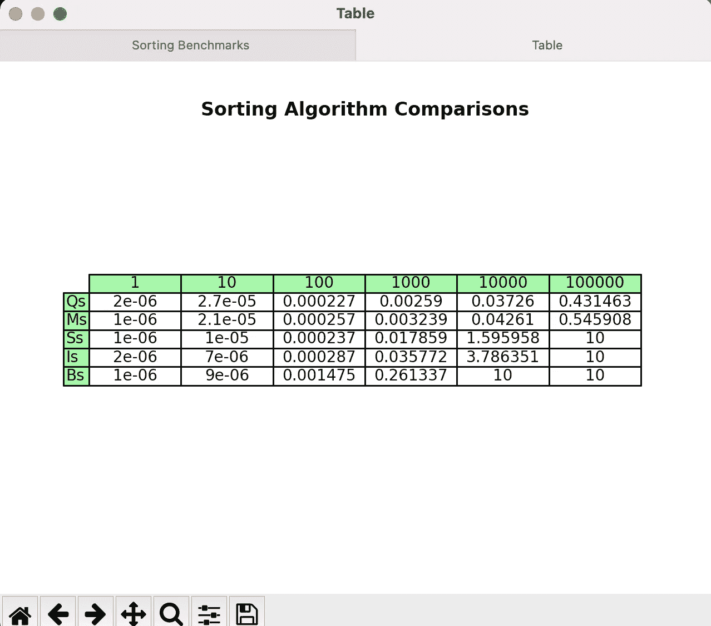

# Python 中的基准排序算法

> 原文：<https://medium.com/geekculture/benchmarking-sorting-algorithms-in-python-437ba864b799?source=collection_archive---------19----------------------->

## 看看有多少种解决排序问题的方法比较

(对于基准测试结果和代码，请滚动到文章的底部)

排序问题是一个不需要介绍的问题，它是给定一个长度为 n 的整数数组 A，其中的元素是未排序的，输出应该是相同的数组 A，其中的元素是已排序的(通常是从最少到最多)。

有许多方法可以解决这个问题，并且已经创建了许多算法，其唯一目的是对数字进行排序。现在，你可能认为这个问题是微不足道的，在某种程度上，它是微不足道的，毕竟人类可以查看集合{5，2，1，6，3}并轻松地将其分类为{1，2，3，5，6}。虽然这是真的，但是当数组开始变大时，真正的问题就出现了。

这就是那些算法的用武之地，它们把数组作为输入，对它进行一些操作，然后数组排序出来。这个解释可能非常简单，为了帮助理解它，我将给出一个这样的算法如何工作的例子。

假设我们有一个数组 A= {6，4，0，3，2}，我们要做的第一件事是找到数组中最小的元素，并把它移到开头。所以最小的元素是 0，所以我们将 0 和 6 互换得到 A = {0，4，6，3，2}，你已经可以看到数组在开始部分是用 0 排序的。然后我们对一个 n-1 大小的数组重复这个过程，所以第一次我们查看整个数组，下一次，我们将查看从 4 到 2(包括 4 和 2)的数组，而不查看 0，因为我们知道它在它的排序位置。

我向您描述的算法称为 Selectionsort，因为它选择数组中的最小元素，并将其放在数组的开头。像选择排序一样，还有许多其他具有相同目的的排序算法。

其他排序算法以类似的方式工作，我将对它们进行快速概述，以便您可以了解它们是如何工作的，但是如果您想要更好、更全面的解释，GeeksforGeeks 是一个很好的来源。

第一种算法是 Quicksort，顾名思义，它对数组进行快速排序。它通过使用 pivot 元素(数组中的任何元素)工作，并将所有小于它的元素放在它的左边，所有大于它的元素放在右边。如果你反复这样做，数组就会被排序。

接下来，我们有 Mergesort，它的工作原理是将数组分成左右两部分，并一直这样做，直到左右数组的大小为 1。然后，它合并数组的左右部分，并有效地对它们进行排序。然后，这个合并过程继续进行，直到整个数组被排序。

如果前两个算法对你来说没有意义，不要担心，因为接下来的两个非常容易理解，但我会告诉你一点关于前两个算法所依赖的概念，这个概念叫做递归，它涉及到通过将问题分成更小的问题并解决它们来解决问题。然后你用这些子问题的解来解决原问题。换句话说，它是根据自身来定义一个功能。了解更多信息的绝佳来源是极客论坛和维基百科，以及一些 Youtube 视频。

下一个算法叫做 Bubblesort，它的工作方式如下，你选择数组中的第一个元素，然后选择紧接其后的元素(索引 I 和 i + 1)。然后你比较两者，如果第一个小于第二个，你交换它们。然后对第二个和第三个元素进行同样的操作，直到最后两个元素。在这一点上，我们有一个部分排序的数组，但是我们需要重复这个过程，直到我们不再需要交换，这时算法就完成了。

最后，我们有 Insertionsort，它首先查看数组中的第二个元素，并将其与第一个元素进行比较，如果小于第一个元素，则将第二个元素放在数组的开头。然后查看数组中的第三个元素，并将其与第二个元素进行比较，如果第三个元素比第二个元素少，则将其放在数组的开头。重复这个过程，直到到达数组的末尾，就完成了！这个算法之所以有效，是因为它对你正在查看的元素后面的所有内容进行排序，最后一个算法是 Selectionsort，我们已经看过了。

(现在为一直在等待结果的人们)

现在您已经知道了我实现了哪些算法以及它们是如何工作的，您应该能够理解基准测试的结果。唯一要记住的是，当算法没有在一定的时间限制内完成执行时，它们会获得 10 秒的运行时间。

Here You can see the benchmarks running on my computer

此外，Github 上提供了所有代码，因此您可以在自己的计算机上运行基准测试，亲自查看算法的性能，如果您喜欢，可以给它打一颗星:)。

 [## sanaynesargi/SortBenchmarker

### 一个测试常用排序算法并显示其整体性能的程序

github.com](https://github.com/sanaynesargi/SortBenchmarker/) 

这里有更多的输出图像，它包含两个图和一个名为 results.json 的 JSON 文件，用于导出数据。同样在线图上，x 轴表示时间，y 轴表示以 10 的幂表示的阵列大小。在表格中，y 轴代表排序算法名称，x 轴代表数组大小，单元格代表排序所用的时间。

The X-axis is time in seconds and Y-axis is for array size in powers of 10

The X-axis is for array size, Y-axis is for sort name, and cells are the sort time

最后，让我们回顾一下基准测试的结果。我们的总体领先优势是 Quicksort，与其他所有算法(除了 Mergesort)相比，它的执行时间非常短，紧随其后的是 Mergesort，它的表现也非常好，与 Mergesort 不相上下，甚至在第一次和第二次测试中击败了它！接下来，我们选择了一种排序方式，它在早期表现不错，但在较大的数组规模上无法与 Mergesort 和 Quicksort 竞争。排在第四位的是 Insertionsort，它在开始和整个基准测试中的性能都比较慢。最后，排在最后的是 Bubblesort，不过根据你的论点，你可以把最后两个调一下，因为 Bubblesort 确实比 Insertionsort 和 Selectionsort(在一个例子中)执行得更好，但是在最后两个测试中没有完成执行。我个人认为这是不可接受的，但你可能会有不同的想法。

我希望你喜欢，并希望学到一些东西。

感谢阅读！