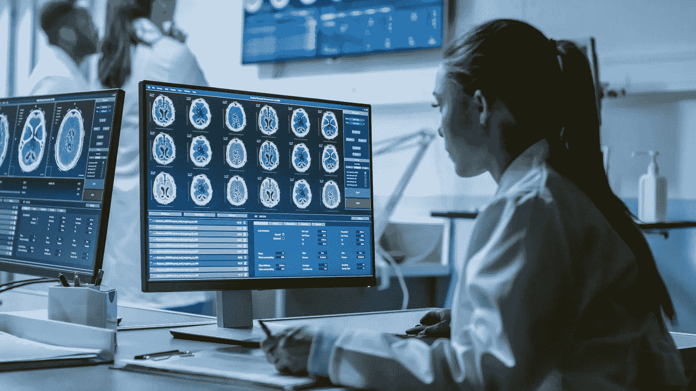
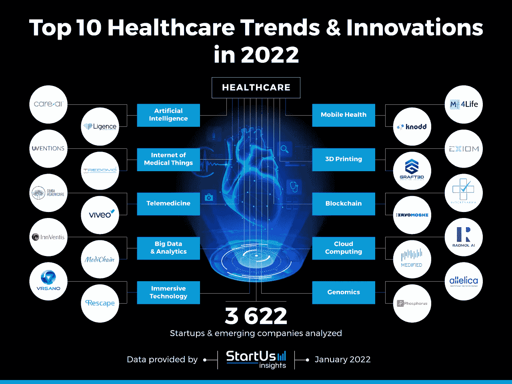
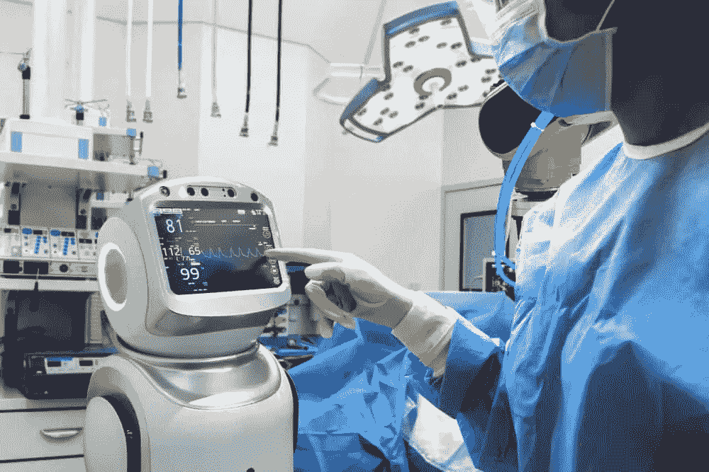
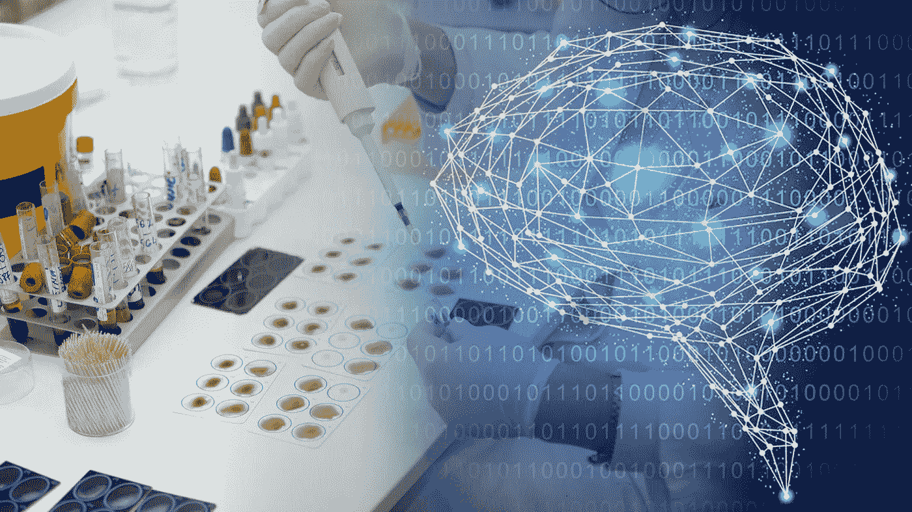

# 2022 年人工智能在医疗保健领域的优势

> 原文：<https://medium.com/geekculture/benefits-of-ai-in-the-healthcare-in-2022-296ec47c689e?source=collection_archive---------11----------------------->

> 从一些关键统计数据开始，医疗保健市场的人工智能在 2020 年的价值为 82.3 亿美元，预计到 2030 年将达到 1944 亿美元，从 2021 年到 2030 年，CAGR 将增长 38.1%。根据定义，人工智能是一种智能系统，它在不同的学科(如生物学、计算机科学、数学、语言学和工程学)中应用各种基于人类智能的功能，如推理、学习和解决问题的技能。

医疗保健中的人工智能利用算法和软件来分析复杂的医疗数据。人工智能和机器人技术在医疗保健领域的潜力是巨大的。就像在我们的日常生活中一样，人工智能和机器人越来越成为我们医疗保健生态系统的一部分。

人工智能医疗保健市场的增长主要是由医疗保健数据量的增加和数据集复杂性的增加推动的，这推动了人工智能在医疗保健市场中的必要性。 [**人工智能技能**](https://www.usaii.org/ai-insights/five-major-technical-skills-required-to-become-an-ai-engineer-in-2021) 在医疗保健行业中被大量利用，以至于人工智能最大的潜在好处之一就是帮助人们保持健康。人工智能和**医疗物联网(IoMT)** 在消费者健康应用中的使用已经极大地帮助了人们。此外，人工智能提高了医疗保健专业人员更好地理解他们所护理的人的日常模式和需求的能力，有了这种理解，他们就能够为保持健康提供更好的反馈、指导和支持。

不仅如此，人工智能已经被用于检测疾病，如癌症，更准确地检测早期疾病。人工智能的使用使乳房 x 光片的检查和翻译速度提高了 30 倍，准确率达到 99%，减少了不必要的活检。与人工智能相结合的消费类可穿戴设备和其他医疗设备的扩散也正被用于监测早期心脏病，使医生和医疗从业者以及护理人员能够在早期可治疗的阶段更好地监测和检测潜在的威胁生命的事件。

自从该领域被科学大规模采用以来，对经过认证的人工智能专业人员 的需求出现了大规模上升趋势。改善医疗保健需要*将大健康数据与适当和及时的决策结合起来，预测分析*可以支持临床决策和行动，并对管理任务进行优先排序。使用模式识别来识别有患病风险的患者，或由于生活方式、环境、基因组或其他因素而导致病情恶化的患者，是人工智能开始在医疗保健领域扎根的另一个领域。

人工智能机器人已经在医学领域应用了三十多年。它们从简单的实验室机器人到高度复杂的外科手术机器人，既可以帮助人类外科医生，也可以自己进行手术。它们也用于医院和实验室的重复性工作、康复、物理治疗以及支持那些患有长期疾病的人。这些机器人有可能彻底改变临终护理，帮助人们更长时间地保持独立，并减少对住院和护理院的需求。人工智能与人形设计的进步相结合，使机器人能够走得更远，与人进行'*对话'*和其他社交互动，以保持衰老的思维敏捷。

有了 [**最佳人工智能认证**](https://www.usaii.org/artificial-intelligence-certifications) 在手，一个有学问的人工智能专家肯定会在医疗保健行业发挥超乎想象的重要作用。来自***USAII*这些在线自定进度的人工智能认证是丰富您的知识库的好方法，而且不会以最具竞争力的价格打乱您的计划，还附带终身数字徽章。**

***药物研究和发现*** 是人工智能在医疗保健领域的其他最新应用。通过引导人工智能的最新进展来简化药物发现和药物再利用过程，有可能大大缩短新药上市时间和成本。人工智能还允许那些在*训练* 的人以简单的计算机驱动算法无法实现的方式进行自然模拟。

自然语言的出现和人工智能计算机在大型场景数据库中即时绘图的能力；意味着受训者对问题、决定或建议的回应可以挑战人类无法挑战的方式。

在详细讨论了 ***人工智能在医疗保健*** 中的作用之后，下面列出了一些要点，这些要点揭示了人工智能在 2022 年医疗保健行业中扮演的关键角色:

*提高诊断过程的效率*

*降低运营业务的总体成本*

*更安全的手术*

*增强的患者护理*

*轻松分享信息*

*更好的预防保健*

随着这些好处的列出，医疗保健中的人工智能也面临一些挑战，包括-

确保患者数据质量面临高风险

缺乏合适的人工智能专家

缺乏工作人员和耐心教育

让病人为新程序做好准备需要时间

个人方法的丧失

错误诊断的可能性

数据丢失的威胁

*虽然人工智能在医学方面面临一些挑战，如确保良好的数据质量和员工获得人工智能专业知识，但它为该行业创造了巨大的潜力，有合适的* ***人工智能专业人员*** *工作，有值得信赖的* [***人工智能认证***](https://www.usaii.org/artificial-intelligence-certifications) *和* ***人工智能技能*** *支持，以培育医疗保健行业蓬勃发展。*