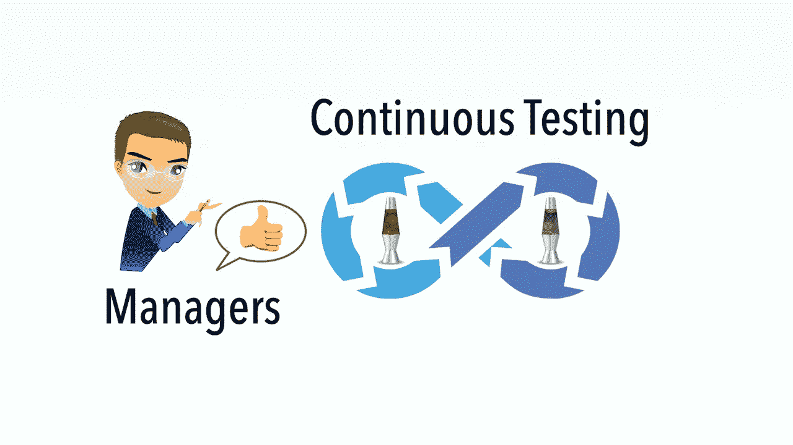

# 持续测试的好处(第 2 部分:给明智的管理者)

> 原文：<https://medium.com/geekculture/benefits-of-continuous-testing-part-2-to-wise-managers-1992487c2ba9?source=collection_archive---------24----------------------->

## 经理们晚上可以睡得很好

持续测试(*使软件团队能够每天将软件更新推向生产，而不是虚假的 CI/CD 会谈。检查出* [*【脸书】*](https://zhiminzhan.medium.com/recommend-a-great-ci-presentation-continuous-integration-at-facebook-6369323da084)*[*【agile way】连续测试分级*](https://zhiminzhan.medium.com/agileway-continuous-testing-grading-f483a870d2e2) )是软件开发过程的核心。它使软件项目的所有利益相关者受益。*