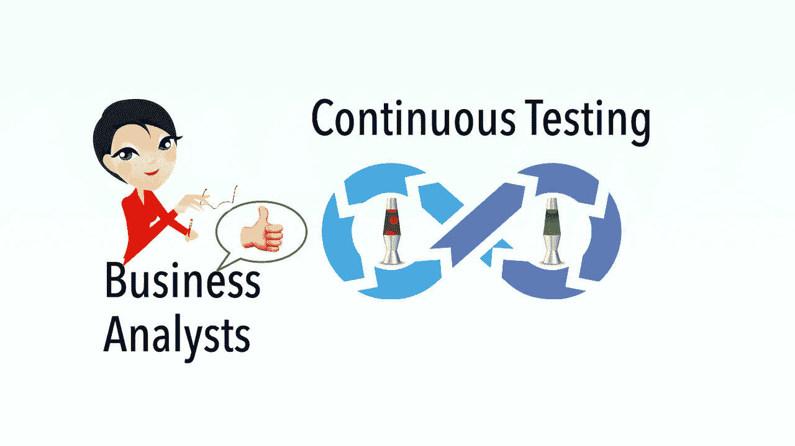

# 持续测试的好处(第 3 部分:对业务分析师而言)

> 原文：<https://medium.com/geekculture/benefits-of-continuous-testing-part-3-to-business-analysts-7c4669eafeb4?source=collection_archive---------44----------------------->

## 更有效率、更有创造力、更快乐

持续测试(*使软件团队能够每天发布产品，而不是虚假的 CI/CD 谈话。检查出* [*【脸书】*](https://zhiminzhan.medium.com/recommend-a-great-ci-presentation-continuous-integration-at-facebook-6369323da084)*[*【agile way】连续测试分级*](https://zhiminzhan.medium.com/agileway-continuous-testing-grading-f483a870d2e2) )是软件开发过程的中心。它有益于软件项目的所有涉众。*