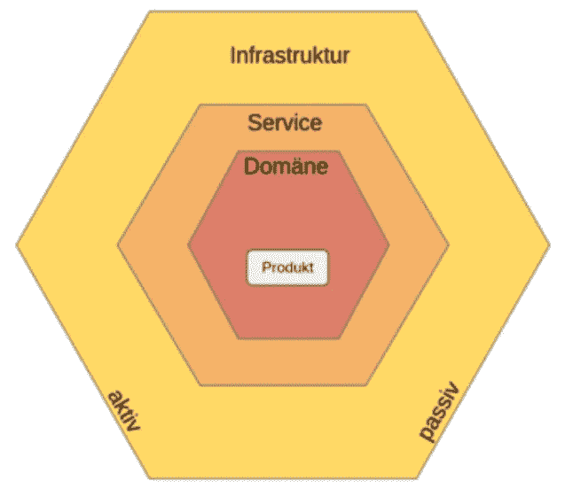
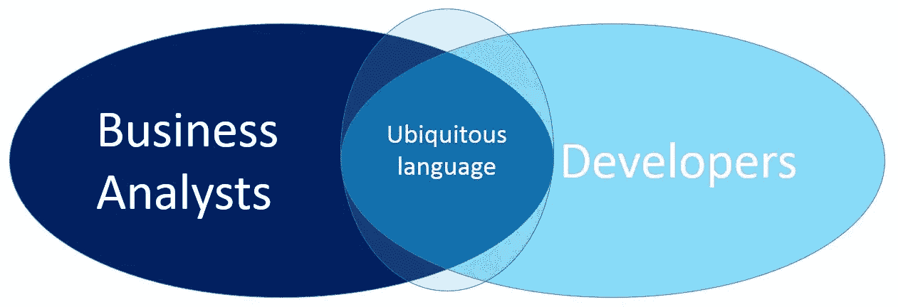
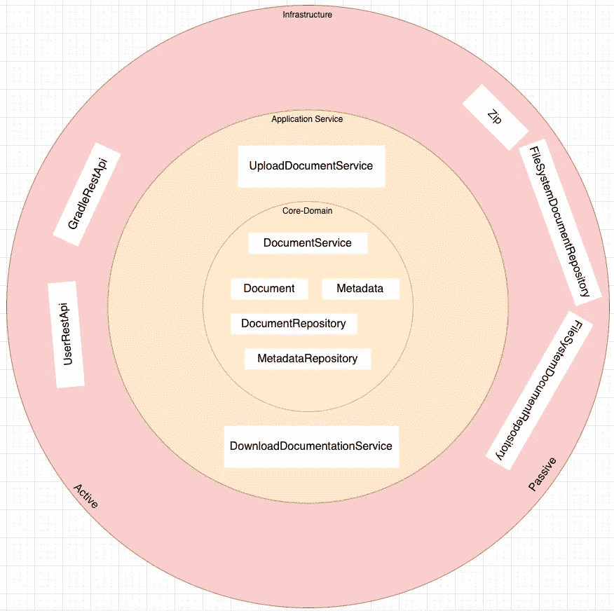

# 领域驱动设计的优势|以及如何使用它

> 原文：<https://medium.com/geekculture/benefits-of-domain-driven-design-and-how-to-use-it-58b9b1606c5a?source=collection_archive---------15----------------------->

首先，我为什么要写这篇文章？我最近在一个小项目上遇到了一个问题，这个问题突然变成了一个大项目，并且变得越来越复杂。因为这个项目包含了我用 Kotlin 写的第一行代码，所以最后变得相当混乱。那么，有什么问题，只要解决这些代码气味，你就可以走了，对不对？..不完全是。导致这些代码气味的主要问题实际上是架构设计决策。其实在这个项目开始的时候，我并没有真正投入很多时间去创作一个好的设计，和项目“刚刚起步”。这正是领域驱动设计发挥作用的地方。

# 什么是领域驱动设计？

领域驱动设计(DDD)是一种为复杂问题开发软件的方法，它将实现与核心业务概念的演进模型紧密联系起来。

DDD 是来解决复杂性问题的。每个项目开始时都很小，然后变得越来越大，其复杂性也是如此。

Eric Evans 在 2003 年创造了 DDD 的概念和同名的书。

# 最重要的关键词

## 业务逻辑

业务逻辑是你应用的目的。这是您的业务规则定义对象和数据处理方式的地方。换句话说，这是你的应用程序的一部分，使它不同于其他预构建的东西。

## 核心域

核心域是业务逻辑所在的地方。你通常有表示业务逻辑的接口或类。

## 普遍存在的语言

无处不在的语言是一种方法论，指的是领域专家和开发人员在谈论他们正在工作的领域时使用的相同语言。这是必要的，因为项目可能会面临语言中断的严重问题。这是因为领域专家使用他们自己的行话。同时，技术专家用他们自己的术语来谈论这个领域。

日常讨论中使用的术语和准则中使用的术语之间存在差距。这就是为什么有必要定义一组每个人都使用的术语。无处不在的语言中的所有术语都是围绕领域模型构建的。

## 实体

实体是数据和行为的组合，就像用户或产品一样。它们代表了模型的核心元素。他们需要有一个身份，就像客户有其 customerId 一样。这些实体包含核心域的逻辑。

## 价值对象

值对象有属性，但不能独立存在。例如，送货地址可以是一个值对象。这些值对象没有身份，大多数只包含其属性的验证逻辑。

## 应用服务程序

应用服务是一个不包含业务逻辑的层。然而，它是基于特定的用例来协调应用程序的活动。一个例子可能是需要执行一个订单。然后，该服务必须持久存储关于该订单的数据，将其从购物车中删除，并发送一封确认电子邮件。为了做到这一点，它使用了一些其他第三方系统，如存储库或邮件处理程序。

## 仓库

存储库模式是简化数据基础设施的业务实体的**集合。它将领域模型从基础设施问题中释放出来。**分层**概念加强了关注点的分离。数据保存在哪里(数据库、文件系统)并不重要。**

# 示例项目

通过我自己的这个小项目，我想告诉你如何在现实世界中使用 DDD。

## 核心领域

在核心域内部，有我们的应用程序使用的最重要的类和接口。它有一个 DocumentService 类，这个类处理我们大部分的业务逻辑。然后我们有实体文档和元数据。这些用来存储关于文档的信息，如 id 或标题。

为了从上面保存这些实体，我们有 DocumentRepository 和 MetadataRepository 接口。这两者的实现是在基础设施层处理的。

## 应用服务

我们只有两个应用服务。第一个处理文档的上传，另一个提供这些文档的下载。他们可以通过使用基础设施中的存储库和 Zip 类来做到这一点。

## 基础设施

Zip 类提供了压缩和解压上传文档的方法。存储库是核心域中存储库接口的实现。它们使用文件系统来保存数据。这三个类都是被动的，只能从应用程序本身触发。

另一方面，restApis 是主动基础架构组件。它们可以由用户从外部触发。例如，gradleRestApi 提供了一种上传和删除文档的方法，而 userRestApi 只对这些文档具有读取权限。

# 反射

## 什么进展顺利？

老实说，在我的设计和学习过程中，我真的遇到了很多问题。唯一真正好的事情是与我的团队讨论设计，我们澄清了所有的不确定性。

## 什么制造了问题？

首先，我的一个主要问题是，我真的不知道我在寻找什么。在弄清楚这一点后，我在寻找一个好的资源以简单易懂的方式学习这类东西时遇到了一些问题。大多数情况下，我找到的资源包含了很多我当时不理解的技术术语。在我最终找到一些[好的和对我来说相关的资源](https://www.informatik-aktuell.de/entwicklung/methoden/domain-driven-design-im-hexagon.html)后，我有一些问题来分配不同的类到正确的层。在与我的团队讨论之后，我认为这些事情现在已经很清楚了。