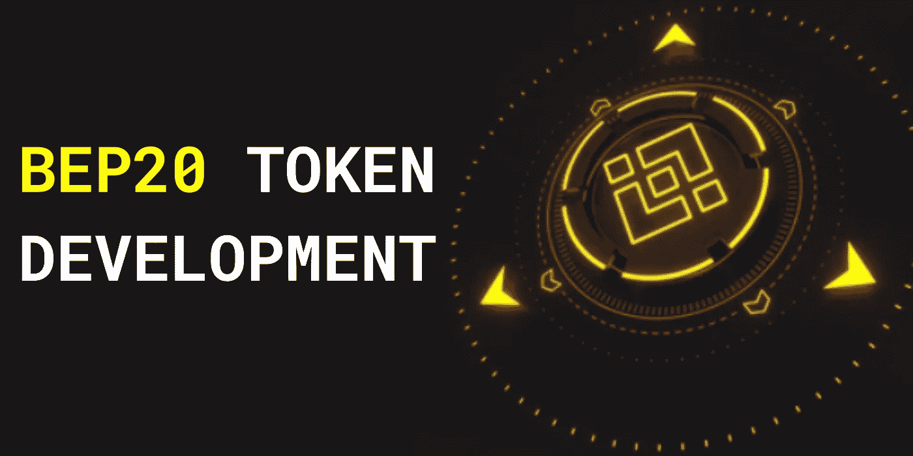

# BEP20 令牌开发

> 原文：<https://medium.com/geekculture/bep20-token-development-4e40974c6a08?source=collection_archive---------15----------------------->

# 2023 年创业者最好的文章

您可以在币安智能链上创建自己的硬币或代币。以太，被认为是币安智能链的本地货币，可以用来支付它们。另一方面，该标准(通常称为 BEP-20 标准)定义了令牌及其属性。在币安智能链区块链上开发的 BEP-20 标准必须得到所有令牌的支持。更不用说，这种合规性保证了交易顺利进行，不会出现任何问题。

# BEP20 令牌开发

尽管 BSC 中有许多元素没有被广泛理解，但它是众所周知的，可能会被许多 Web3 项目使用。然而，币安交易所将为加密货币领域的大多数人所知。此外，币安是币安智能链背后的驱动力，智能链是所有 BEP20 令牌创建功能的基础。现在让我向大家介绍一下 BSC 和币安智能链的发展。

# 币安智能连锁(BSC)

“币安智能链”中的“币安”一词指的是控制币安主要交易所的集团，毫无疑问是现存的最有利的链。然而，这个链条可能不像我们希望的那样分散。然而，根据区块链三元悖论，你可以通过支持去中心化来提高可伸缩性和安全性。这无疑是 BSC 开发者在 2020 年脱离以太坊的区块链并创建 BSC 后的想法。

理解币安连锁和币安智能连锁是两回事也很重要。由币安创建的原始链是较老的链，其创建的唯一重点是记录交换交易。在这个特定的区块链，它无法持有智能合约以及所有不可定义的交易。开发人员想出了一个解决方案，并创建了币安智能链作为一个新的链。

同样重要的是要记住，这两个链现在是并行运行的，每个链都有不同的主要功能。例如，币安连锁店促进贸易，而平衡计分卡则保持智能合同开发。此外，币安生态系统利用了“双链”架构。最后面的能够在两个链条之间轻松切换。因此，通过币安连锁店向 BSC 和其他收款人汇款是一个快捷方便的过程。此外，两个链都使用 BNB，一个类似的本地令牌。

# 如何创建 BEP20 令牌？

如果您想在币安智能链上构建您的令牌，那么您来对地方了。我们是 Osiz 技术公司，一家开发币安智能链的公司。

在创建令牌之前，为了在币安链上创建您的令牌，您必须了解的基本信息列表在下面的部分中提供。

1)令牌名称

2)令牌符号

3)初始供应

4)小数位

**以下设置可用于创建 BEP-20 令牌:**

**1)令牌燃烧**

如果您打算创建一个 burn 模型，必须从设计过程的开始就对标记进行处理。

**2)代币造币厂**

用户可以在这个代币厂“铸造”大量 BEP20 代币，因为 BEP-20 代币最初是以不固定的总供应量制造的。

**3)令牌暂停**

用户可以在一段时间内暂停代币活动，包括消费、造币和刻录。此外，设计可以包含这一特征。

# BEP20 令牌开发的特点

1.快速交易和高可扩展性

2.低交易费用

3.完全分散的解决方案

4.没有中介

5.跨链兼容

6.智能合同

7.双链结构

8.POS 和 DPOS 支持

9.交易所列表

**遗言**

毫无疑问，币安网络以绝对的权威统治了加密交换领域。交易所巨头现在正试图进入 NFT 市场。一旦他们自己的 NFT 市场在 6 月份启动，BEP20 将成为该平台的基本交易单位。币安 NFT 市场的官方货币将是 BNB。

BEP20 令牌是币安智能链上所有可用交易的基础。由于在币安智能链上建立的平台的无限扩展的使用案例和可扩展性，多个分散的金融平台每天都有可能存在。主要建立在币安智能链上的系统使用 BEP20 作为它们的基础或参考硬币。

我们 Wealwin Technologies 是领先的 [**BEP20 令牌开发公司**](https://www.alwin.io/bep20-token-development) ，拥有五年多的令牌生产经验，已经创造并成功推出了 100 多种加密令牌，目前在竞争中脱颖而出。为了给消费者创造一个出色的商业解决方案，我们的认证令牌开发者，他们拥有丰富的区块链技术专业知识，参与了 BEP20 令牌的开发过程。