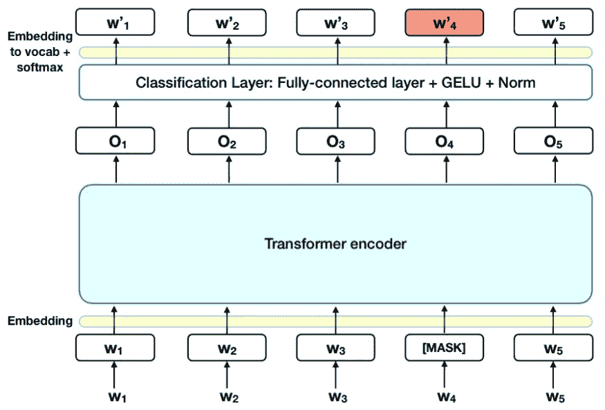

# 伯特

> 原文：<https://medium.com/geekculture/bert-842e956b8c0f?source=collection_archive---------15----------------------->

Source:[https://seofutura.com/what-is-new-with-google-bert-update/](https://seofutura.com/what-is-new-with-google-bert-update/)

> 据估计，在 2025 年，全球范围内使用 NLP 将产生 43289.9 美元的收入。

## 自然语言处理中的 BERT 是什么？

**BERT(来自变形金刚的双向编码器表示)是谷歌 AI 语言研究人员发表的论文。**它在各种各样的 NLP 任务中展示了最先进的结果，包括问题回答、自然语言推理等，在机器学习社区中引起了轰动。

BERT 的关键技术创新是将 Transformer(一种流行的注意力模型)的双向训练应用于语言建模。这与以前从左到右或者结合从左到右和从右到左训练来查看文本序列的努力形成对比。

论文的研究结果表明，双向训练的语言模型比单向训练的语言模型具有更深的语境感和语流感。在论文中，研究人员详细介绍了一种名为**掩蔽 LM (MLM)** 的新技术，这种技术允许在模型中进行双向训练，这在以前是不可能的。

## 伯特是如何工作的？？

Source: Towards Data Science

**伯特利用了一种转换器，这是一种学习文本中单词之间上下文关系的注意力机制**。一般来说，Transformer 包括两个独立的机制——一个读取文本输入的编码器和一个为任务生成预测的解码器。由于 BERT 的目标是生成一个语言模型，所以只有编码器机制是必要的。

与顺序读取文本输入的方向模型相反，Transformer 编码器一次读取整个单词序列。因此，它被认为是双向的，虽然说它是非定向的会更准确。这一特性允许模型基于单词的所有环境来学习单词的上下文。

输入是一系列标记，这些标记首先被嵌入到向量中，然后在神经网络中进行处理。输出是大小为 H 的向量序列，其中每个向量对应于一个具有相同索引的输入令牌。

当训练语言模型时，存在定义预测目标的挑战。许多模型预测序列中的下一个单词，这是一种方向性的方法，固有地限制了上下文学习。为了克服这个挑战， **BERT 使用了屏蔽 LM** :

## **蒙面 LM (MLM)**

Source: Towards Data Science

**在将单词序列输入 BERT 之前，每个序列中有 15%的单词被替换为一个【掩码】标记。**然后，该模型试图根据序列中其他未屏蔽单词提供的上下文来预测屏蔽单词的原始值。在技术术语中，输出字的预测需要:

在编码器输出之上添加分类层。
将输出向量乘以嵌入矩阵，将其转换到词汇维度。
用 SoftMax 计算词汇中每个词的概率。

> *“计算机快得不可思议，准确得不可思议，愚蠢得不可思议；人类慢得不可思议，不准确又聪明；他们在一起的力量超乎想象。”——阿尔伯特·爱因斯坦*