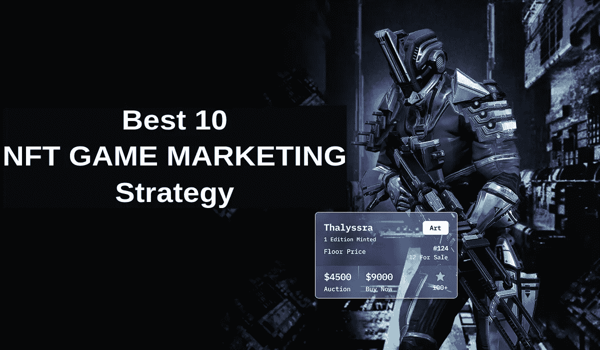

# 最佳 10 款 NFT 游戏营销策略——完全指南

> 原文：<https://medium.com/geekculture/best-10-nft-game-marketing-strategy-a-complete-guide-3daa7527bb8f?source=collection_archive---------7----------------------->

## 这里有**完整的 NFT 游戏营销策略指南**来帮助你掌握 NFTs 的不同元素。

数字时代最显著的变化是，我们现在可以在移动设备上玩画面精美的游戏。由于其民主的货币化特征，NFT 游戏在全世界的游戏玩家中取得了巨大的成功。然而，没有有效的营销，企业就不可能成功。随着对 NFT 游戏兴趣的增加，一个稳定的游戏结合正确的营销方法可能会推动你走向成功的下一个层次。

> 据 [**NFT 今日**](https://nftnewstoday.com/2022/07/10/nft-trends-2023-what-the-future-holds/) 消息，NFT 市场正在快速扩张，每月有超过 **20 万用户**兑换 NFT。NFT 公司的数量也在增加，该行业目前估计价值超过 204.4 亿美元，许多人预计到 2030 年每个公司将达到 2117.4 亿美元。

# NFT 游戏营销

[**NFT 游戏营销**](https://bit.ly/3VqYnfC) 是推广 NFT 项目的一种手段。NFT 游戏营销利用各种营销工具。电子邮件、影响者、内容和社交媒体营销都是这样的例子。

> 根据 Finder 统计报告 显示，在 Finder NFT 游戏采用报告中询问的 26 个国家中，印度排名第一，大约 33.8%的受访者声称他们玩过 NFT 游戏。

这里是**完整的 NFT 游戏营销指南**，帮助你掌握 NFTs 的不同元素。

## 1.社区营销和管理

[**不和**](https://discord.com/) **拥有 1.5 亿活跃用户**。Discord 正迅速成为 NFT 爱好者的中心，拥有大量活跃的游戏玩家，它无疑是营销你的 NFT 游戏的最大区域。我们通过为您的品牌创建一个定制的 Discord 服务器，为您的品牌创建一个忠实的社区。我们用频繁的材料积极地管理服务器，以及积极的社区参与和营销。

不和谐也有其他功能，如不和谐硝基和不和谐经典。升级到这些功能的社区将可以访问高清视频流、直播流和动画表情等服务。

## **不和谐游戏营销技巧**

> 为了增加你的追随者，在你的社区里组织与你的专长相关的竞赛和活动。
> 
> 为您的社区成员购买游戏提供独特的折扣和优惠。
> 
> 给你的社区成员直接的帮助和回答。
> 
> 提供与您的游戏相关的引人注目的信息，如时事通讯、游戏更新和博客。过多的促销信息可能会导致会员窒息。
> 
> 要流游戏和张贴游戏贴纸和表情符号，请使用 Classic 和 Nitro 等 Discord 功能。
> 
> 为你的 NFT 游戏提供游戏描述和信息的商店。
> 
> 你也可以在 discord 游戏社区推广你的游戏。

创建一个独特的脸书小组是让你的社区起步的另一种方法。利用平台的功能，如直播、强大的受众定位和高级发布功能。如果你在所有的社交网站上都有一个强大的挂钩和社区连接，你就可以轻松地为你的 NFT 游戏做广告。

## 2.参与其他社区

你是不确定不和谐还是希望参与各种平台？Reddit 是一个用户生成的内容共享网站和应用程序，允许用户对主题进行投票。当一条内容获得大量投票时，它在 [**Reddit**](https://www.reddit.com/) 排名中上升，变得更加可见。

## 3.在你的游戏社区提供特别优惠。

社区是成功的 NFT 系列的最大目标之一。某些 NFT 的功能相当于社区通行证或会员资格，授予持有者独家访问在线俱乐部或高级设施(如限量版 drops)的权利。

## 4.利用社交媒体

在你自己的院子里开始 [**营销你的 NFT 游戏**](https://bit.ly/3CrKyVL) ！社交网站主宰了数字世界。更正确的说法是，数字环境的兴起归功于社交媒体平台的引入。目前有各种各样的社交网站。最受欢迎和用户友好的网站是脸书、推特和 Instagram。这些平台非常适合 NFT 持有者推广他们的平台，也非常适合企业通过连接到他们的 NFT 站点来增加流量。随着数百万人每天使用这些平台，它现在是任何类型的数字营销的绝佳地点。

考虑使用流行的点击付费渠道，如脸书广告和 Twitter 广告，来宣传你的赞助广告。

## 5.利用影响者进行营销

一个社交媒体影响者拥有大量关注其言论和产品的追随者。选择合适的 NFT 影响者，用积极和忠诚的追随者来推广你的 NFT，可能是一个非常有效的营销策略。

企业应该尽早就 NFT 路线图咨询有影响力的人，并征求反馈和建议。在项目的不同阶段让几个有影响力的人参与进来也是一个聪明的想法。例如，在项目的早期阶段，通过 NFT 影响者培养兴趣，然后在临近发布时重新吸引这些影响者参与品牌召回。

## 6.利用赠品和促销代码。

赠品是一种新颖的策略，可以接触到对不可替代代币既熟悉又陌生的数字受众。这也是一种人人都可能参与的公共营销方式。NFT 持牌人向观众提供免费的 NFT，激起他们的兴趣，鼓励他们参观 NFT 市场。此外，这也是招募新移民到 NFT 并让他们从这一数字现象中获益的好方法。

将你的赠品与有影响力的人联系起来。他们经常以下列形式进行赠送:参与者必须在平台上关注他们，在评论中标记一个朋友，在 Instagram Stories 或 retweet 上分享帖子，并留下评论。有影响力的人也可能在他们的频道上发布折扣券，鼓励他们的观众购买，以免错过机会。

## 7.使潜行峰值可用

为了激发你的观众的好奇心和发展预期，你的社交媒体材料应该包括即将上映的电影的预览。通过消费者感兴趣的独特和吸引人的内容进行病毒式内容和交叉促销，可以吸引他们参与对话或分享你的帖子。你也可以通过在游戏正式发布或首次亮相前提供 VIP 潜行高峰和早期访问 NFTs 来吸引你的观众加入你的社区。

## 8.游戏内广告

[**游戏内广告**](https://bit.ly/3VqYnfC) ，作为一种货币化手段，在手机游戏内提供广告空间。游戏内置广告是广告商与游戏玩家联系的一种高度互动和吸引人的方式。这些广告可以通过奖励玩家观看视频广告而直接集成到游戏中，或者它们可以像标准的横幅广告一样显示在游戏的底部。最有效的游戏内广告策略结合了良好的用户体验和奖励结构。向你的玩家提供高价值的奖励可能会让他们在更长的时间内保持参与，激励他们回来玩你的游戏。

## 9.利用电子邮件营销和时事通讯。

电子邮件营销是最具成本效益的数字营销方法之一，具有惊人的投资回报。首先，确定你的目标受众，以及他们在哪里度过大部分时间。然后，通过活动、竞赛和其他方法，获得他们的电子邮件地址。让你的听众清楚地知道他们同意给出他们的电子邮件地址并接收营销材料。创建有用和有趣的时事通讯，并定期分发。您的订户会收到符合其偏好和品味的个性化信息。联系知名的 NFT 出版物，将您的时事通讯列入他们的邮件列表。

## 10.公共关系和媒体营销

公共关系营销是一种过时的数字收藏品广告方式。NFT 持有者必须在特定的 NFT 市场发布关于 NFT 下跌的新闻稿。这种策略有更大的影响力，因为它不仅针对互联网用户，也针对其他外部受众，并且它对 NFTs 的奇迹进行了彻底的回顾。这些新闻稿通过一些数字媒体渠道分发。最好是专注于最有影响力的平台。结果，因为他们从数字爱好者那里获得了大量的流量，赞助的公关网站被推荐给 NFT 持有者。

## 结论

由于新 NFT 游戏越来越受欢迎，你的 [**NFT 营销计划**](https://bit.ly/3CrKyVL) 和你的游戏制作一样重要。强大的 NFT 营销需要的不仅仅是一些随机选择的广告集；这需要有能力与你竞争的 NFT 营销专家。