# 最好的 Chrome DevTools 工具，非常方便和不可思议！！😎🔧

> 原文：<https://medium.com/geekculture/best-chrome-devtools-tools-that-are-really-handy-and-incredible-c2c149d0ffe3?source=collection_archive---------12----------------------->

Chrome DevTools 真的很牛逼！相信我，开发人员正在使这个浏览器变得方便和有用，因此 DevTools 带来了许多有用的工具来保持你的网页，PWA 更好，互动，快速，这些是 Chrome DevTools 最好的方便工具。

# 动画片

DevTools 帮助我们制作动画，让我们来看看:

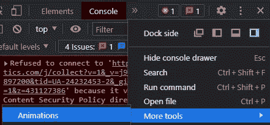

Example where is animations on DevTools

简单的动画被添加到动画面板，我们可以改变添加更多的时间改变它或增加持续时间。

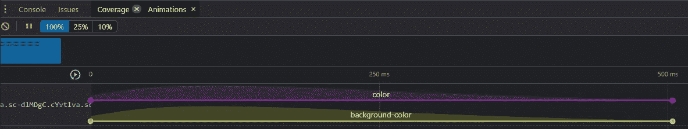

Example what we can do on the animation section on DevTools

# 颜色；色彩；色调

当您需要帮助时，您可以为 DevTools 获取颜色，这部分可以帮助我们了解颜色在我们的项目中，并可以帮助我们搜索颜色、添加自定义颜色、检查对比度或建议颜色，所有这些都在下面:

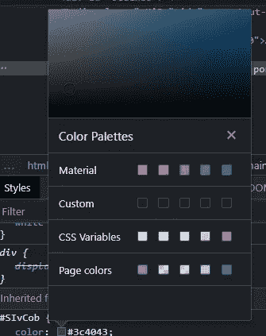

Example Colours with the help of DevTools

# 框阴影和文本阴影

它比 CSS 生成器好，在网上找到的

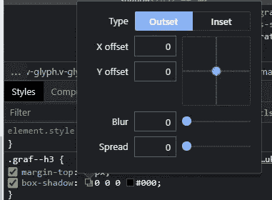

Box-shadow options inside DevTools

我们可以使用这个工具在 DevTools 的帮助下不用离开页面就可以定制我们的盒子阴影。

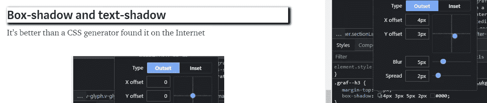

Example Box-shadow inside Medium

# 检查加载文件

当你谈论性能的时候，这是很棒的，因为它与性能相关，我们需要检查我们是否使用了所有的代码。

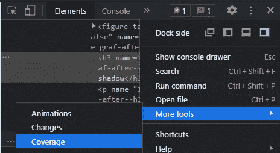

Example Coverage

我们需要重新加载页面来获取所有文件。

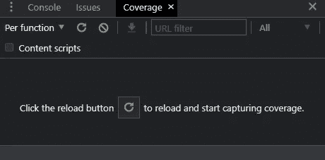

Example options Coverage

红色部分是我们根本没用的代码。

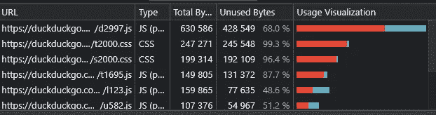

Example all the files that we are using and his usage visualization

我们可以点击图表检查所有代码，它会在我们正在使用或未使用的所有代码下方显示类似的内容。当您想要增加灯塔的等级时，这很有帮助。

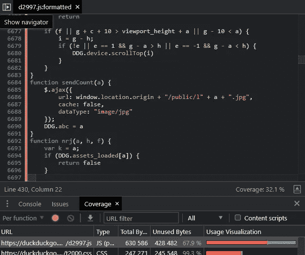

Example usage code on one file

# 将 DevTools 用作 IDE

这真是太神奇了！这就是我告诉你的 Chrome DevTools 太棒了！我们可以添加代码，更改将保存在我们的文档中，这就像一个魔术，但对开发人员来说更好，因为我们可以实时看到我们的更改，而不必在 IDE 上浪费时间，并在页面上同时返回这一更改。

转到源代码，在左边搜索配置“文件系统”，你需要点击“添加文件夹到工作区”，你需要选择你的项目。

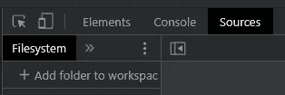

Example where can start changing our local documents

这一步非常重要，因为 DevTools 会提示一个警告，因为它需要对你的文件进行编辑的许可

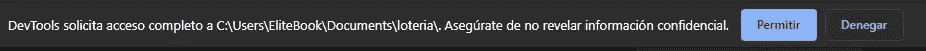

然后它会打开您的项目，您可以进行更改，并将其保存到您当前的文件中，这真是太棒了。

这是一个关于墨西哥游戏“Loteria”的小项目，它很有趣，让我们做一些改变！

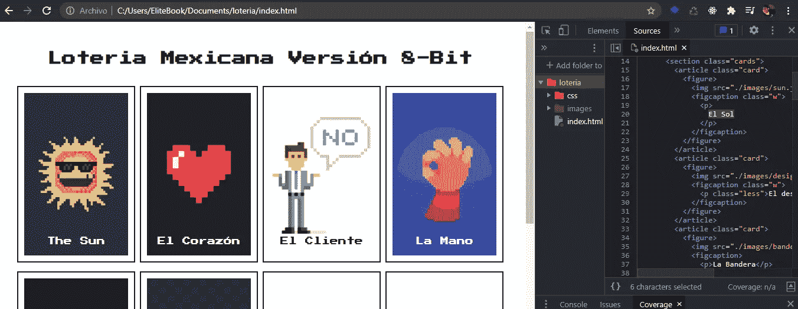

Example insert project inside DevTools to work with

我将把“太阳”改为 El Sol，把“El corazón”改为 Heart，把“La Mano”改为 hand，不要忘记保存 DevTools Chrome 文件！！

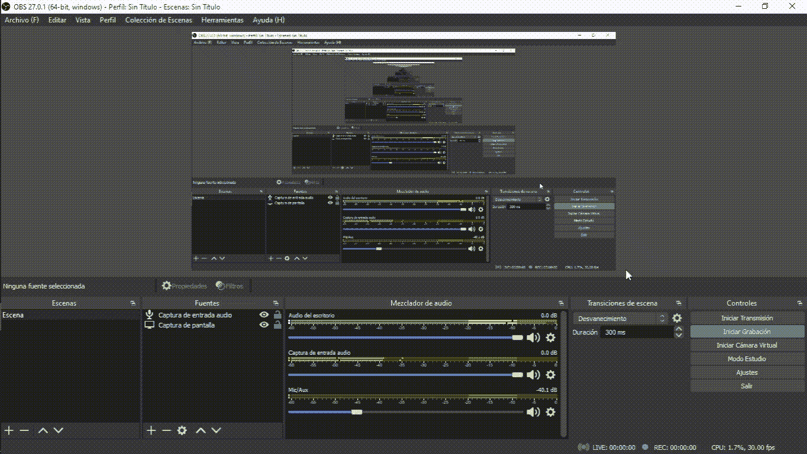

Example save document on Chrome DevTools and it is saved on our local files

# 我们可以模仿手机

使用响应式工具，我们可以改变我们项目的视口，这样我们就可以让我们的项目适合每一部手机或电脑。

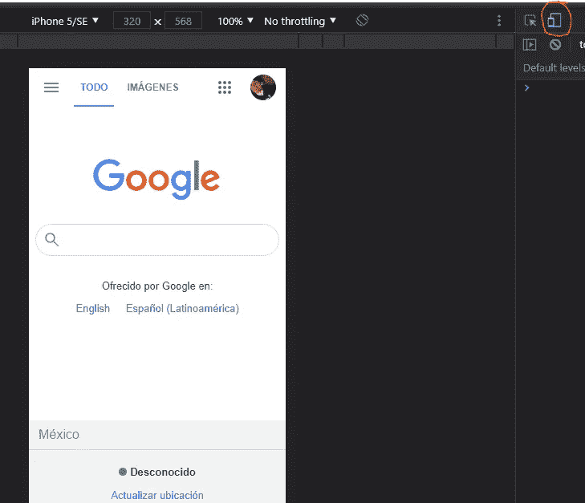

Example Responsive web design using DevTools

我们甚至可以改变设备

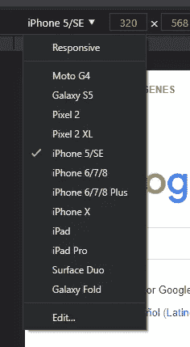

Change device viewport

# 模拟网络

这真的很难，因为我们可以让我们的网络变慢，并在它上面尝试我们的页面，类似于低速网络的条件，看看我们的页面是否运行流畅，没有问题。

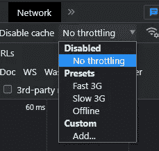

Example emulate network

# 传感器

这是 ypu 与服务人员和 PWA 一起工作的时候，但令人惊讶的是，它可以显示手机或 GPS 的传感器，因此工作得更好，没有问题。

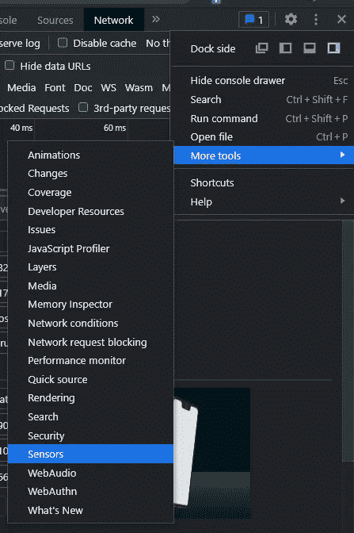

Example Sensors DevTools

改变坐标，并尝试在手机处于准确位置时触发事件。

Example location and orientation on DevTools

# 排除故障

您可以使用 DevTools 进行调试，您可以使用保留字调试器，也可以使用 DevTools！！

使用保留字调试器

你可以明确地把这个词加在你能做断点的那一行上。

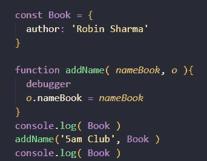

Example debugger

打开您的 DevTools，它将停止在这一行开始调试

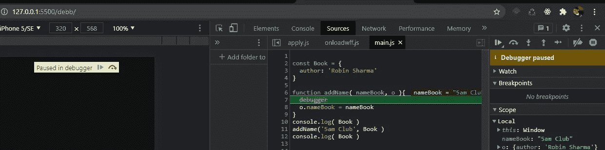

Example debugging DevTools

你可以在 DevTools 中的文件行上添加一个断点，它会改变颜色，并停止下一次刷新

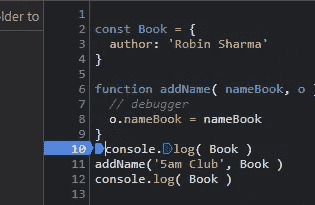

Example breakpoint inside DevTools

向事件添加断点，在这部分我们可以在每次事件被触发时添加一个断点，在这种情况下我添加了一个点击事件

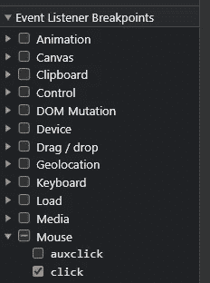

Example event breakpoint

# 网络

你可以使用网络来检查什么文件正在加载，网页的加载时间和什么样的文件需要太多的时间，假装一个缓慢的互联网连接

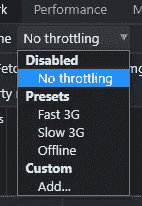

Example make slow conecction

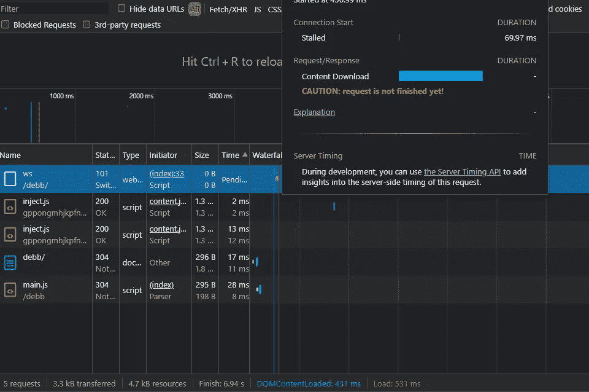

Example data with Network

# 表演

您可以检查页面的性能，如果您需要搜索导致网页性能下降的瓶颈，这将非常方便。

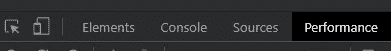

Go to the performance part

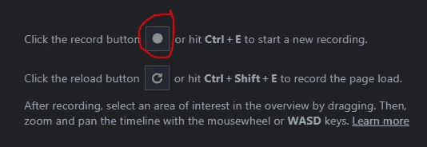

Click to start recording

或者单击重新加载页面开始分析重新加载页面，它会显示类似这样的内容。

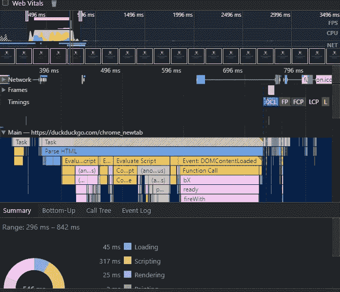

Example performance analizer

有了它，我们可以分析图形加载、脚本编写、渲染等，还可以检查主要信息，检查是否存在某种瓶颈，这很有帮助，因为我们可以检查代码的确切部分在哪里。

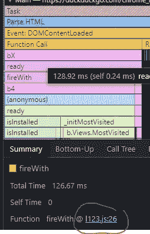

Example Analyzing

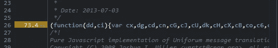

Shows the load of the page

# 灯塔

Lighthouse 是 Google DevTools 最重要的部分之一，因为它帮助我们检查我们的页面或另一个页面是否具有可访问性，如果页面是 PWA，性能，更好的做法，SEO，甚至我们可以检查移动和桌面，这是一个非常棒的工具，如果你想检查我之前所说的一切，你只需点击生成报告，它就会完成剩下的工作**记住，你需要在匿名页面上运行审计，因为扩展不能帮助使审计整洁！**

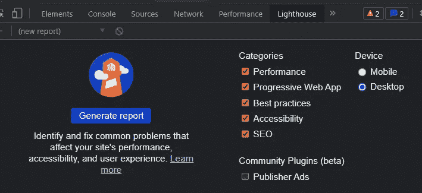

Example Lighthouse audit

我用过灯塔的一些页面

角页

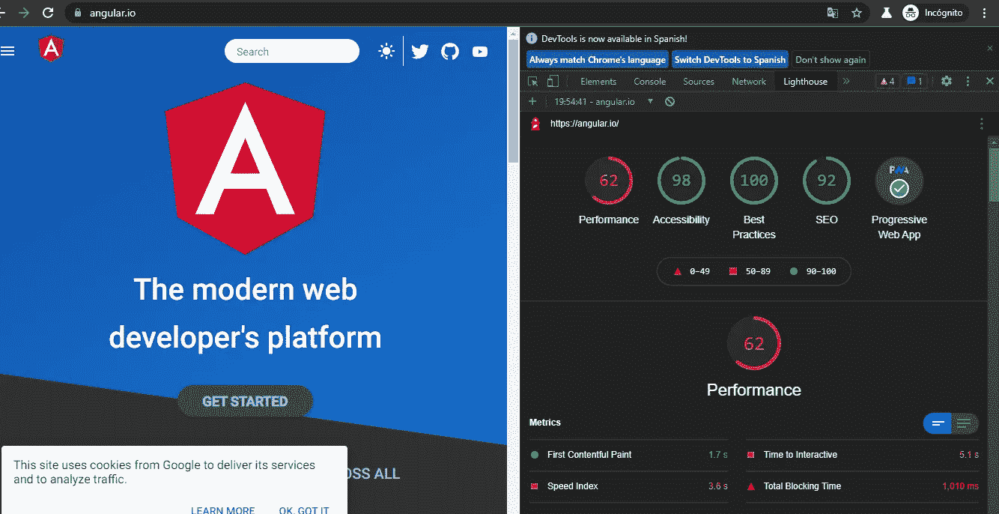

Example audit on Angular main page

反应页面

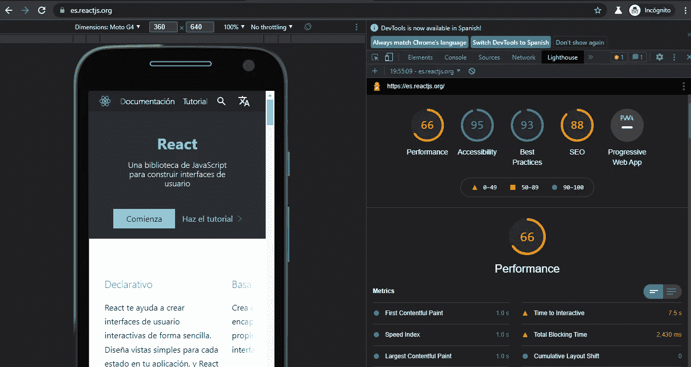

Example audit on React main page

Vue 页面

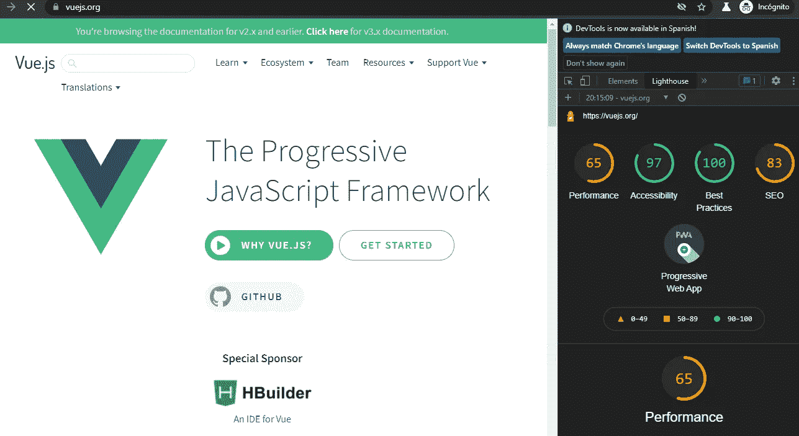

Example audit Vue main page

如果你注意的话，Lighthouse 有助于识别错误和警告，这使我们试图解决一切，这使我们的网页在各个方面都更好。

# 结论

DevTools 对开发者来说是最好的工具，非常友好，它有很多令人惊讶的新功能，比如使用 DevTools 作为我们的 IDE，我们可以实时改变我们的动画，检查我们的页面是否加载了所有需要的文件，我们可以用 JavaScript [和 TypeScript 在 DevTools 上调试，](/geekculture/how-to-debug-typescript-files-with-chrome-browser-83a4911996e2) 我们还可以审核我们的页面或其他页面，看看我们是否可以让它成为更好的移动工具，它有移动事件传感器，这真的是一个非常棒的工具，它在很多方面都帮助了我，相信我，这对谷歌来说是一个不可思议的工作，让我们的网站在各个方面都变得更好！

# 来源

 [## Chrome DevTools - Chrome 开发者

### Chrome DevTools 是一套直接内置于谷歌 Chrome 浏览器的网络开发工具。

developer.chrome.com](https://developer.chrome.com/docs/devtools/)  [## react——用于构建用户界面的 JavaScript 库

### React 使得创建交互式 ui 变得不那么痛苦。为应用程序中的每个状态设计简单的视图，并反应…

reactjs.org](https://reactjs.org/)  [## 有角的

### Angular 是一个构建移动和桌面 web 应用程序的平台。加入数百万开发者的社区…

angular.io](https://angular.io/)  [## vue . j

### 已经会 HTML，CSS，JavaScript 了？阅读指南，立即开始制作物品！可增量采用的…

vuejs.org](https://vuejs.org/)