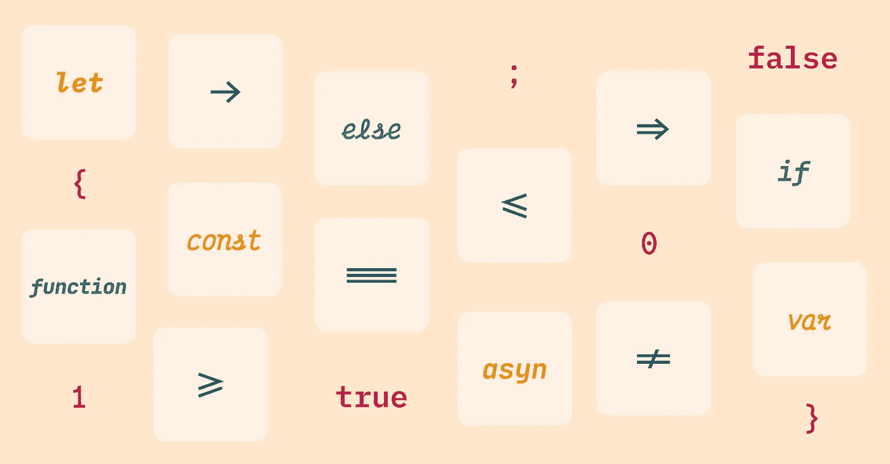
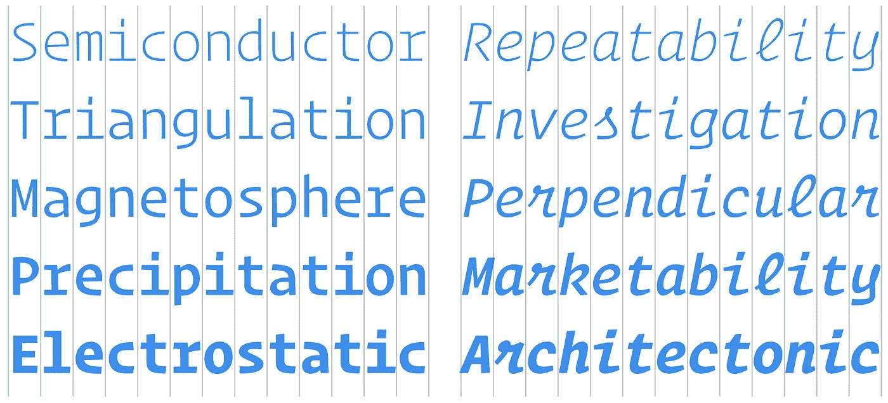
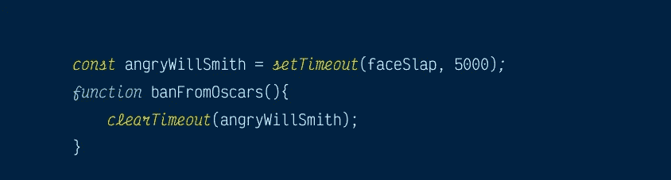
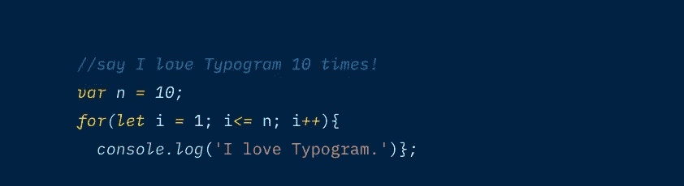
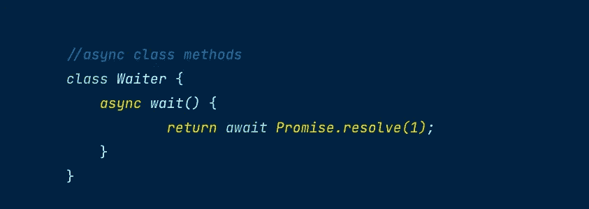
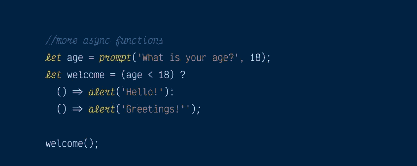
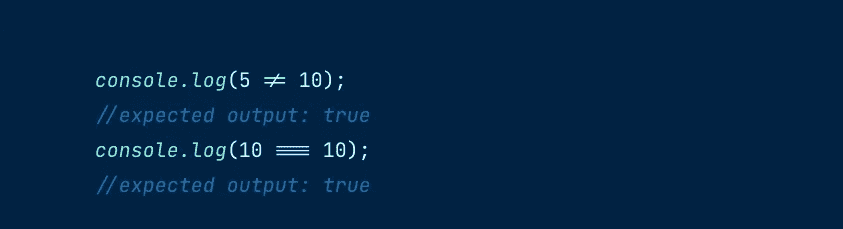

# 斜体字和编程连字的最佳编码字体

> 原文：<https://medium.com/geekculture/best-coding-fonts-with-italics-and-programming-ligatures-cb4a15c5022e?source=collection_archive---------8----------------------->

运营商 Mono 是最受欢迎的付费编码字体之一。快速搜索会发现互联网上有几篇评论字体的帖子。

运营商单声道是我想为我的日常使用；然而，作为一个努力创业的斗志昂扬的企业家，放弃 200 美元不是一个选择。自然地，我寻找类似于 Operator Mono 的开源替代方案，我可以在我的代码编辑器中使用它们来增加工作流。

在谈论[操作符 Mono](https://www.typography.com/blog/introducing-operator) 的好的免费替代品之前，我想指出它最独特的设计特征——操作符 Mono 的“真斜体”，它通过使评论和关键词更快地被识别来改善编码体验。

Operator Mono regular and Italic

# 具有真斜体的等宽编码字体

对于上下文，斜体有两种风格:假的和真的。许多字体提供了从原始字体衍生而来的略微倾斜的版本。这种倾斜的斜体被称为[假斜体。](https://typogram.co/blog/essential-terms-you-must-know-about-typography#FauxFontStyle)

另一方面，真正的斜体提供了更多的视觉独特性:而不是简单的倾斜，它们看起来与常规字体非常不同——斜体字母是独特的。[真斜体](https://typogram.co/blog/essential-terms-you-must-know-about-typography#FauxFontStyle)的灵感来自操作员 Mono 的书法或草书。

由于许多 IDE 主题使用斜体来表示注释和关键字，因此使用独特的不同斜体非常有助于突出这些主题，使其更易于阅读。

这里有三种奇妙的、免费的、开源的真斜体编码字体，类似于 Operator Mono。

# 维克多·莫诺

与 Operator Mono 一样， [Victor Mono](https://rubjo.github.io/victor-mono/) 从草书风格的字体中汲取灵感，创造出真正的斜体，让关键词和评论脱颖而出。

Victor Mono Italics

# IBM Plex Mono

虽然草书风格的字母看起来很独特，但它们可能不是每个人的最佳阅读体验。 [IBM Plex Mono](https://fonts.google.com/specimen/IBM+Plex+Mono) 是一种很棒的编码字体，如果你觉得不用草书字体阅读更轻松的话。它的斜体样式受到了 cursives 的影响，但看起来仍然是等宽的，并保持足够的独特性，从正常版本中脱颖而出。

IBM Plex Mono Italics

# JetBrain Mono

JetBrains Mono 是一个安静的反叛者，它的斜体比我们介绍的所有编码字体都更加柔和，以最大限度地减少阅读中断。JetBrains Mono 只对它的三个字母“a”、“y”和“f”使用真正的斜体结构，并且具有小程度的倾斜。

JetBrain Mono Italics

# 带连字的等宽编码字体

在研究 Operator Mono 时，我还用连字掉进了兔子洞，这是许多程序员追求和攻击的一个流行功能。话虽如此，也有很多。一些人认为使用连字扰乱了代码的语义。

在字体中，连字是组合两个或更多字符的特殊字符。例如，字母“f”与“I”和“l”一起出现的频率很高，就像在“figure”和“flower”这样的词中一样为了提高这些特定情况下的可读性，字体设计人员创建了连字作为解决方案——常见的字母组合，如“fi”和“fl ”,将被组合起来以创建一个独特的字符，当两个字母一起键入时，该字符将替换这两个字母。因此，如果一种字体有一个连字箭头“= >”，连字“= >”将替换两个字符“=”和“>”

虽然 Operator Mono 目前不支持任何连字，但我们在这篇文章中介绍的两种字体支持——Victor Mono 和 JetBrains Mono。Fira 代码也有一个流行的连字集，许多程序员使用它来配置字体，如 Operator Mono 或 Source Code Pro，它们缺少自己的编程连字。

# 维克多·莫诺

除了真正的斜体，Victor Mono 的另一个好处是它有编程连字，使得像 arrow，" = > "这样的事情变得容易。编码连字是 Mono 还没有的特性。

Victor Mono Programming Ligatures

# JetBrains Mono

JetBrains Mono 提供了一组优秀的编程连字，可以减少代码中多个字母的干扰。

JetBrains Mono Programming Ligatures

# Fira 代码

[Fira Code](https://fonts.google.com/specimen/Fira+Code) 是最受欢迎的连字编码字体之一。它非常受欢迎，以至于许多人使用 Fira Code 的连字来添加到其他没有编码连字的编程字体中。Fira 代码也没有任何斜体。

Fira Code Programming Ligatures

# 总结一下…

Victor Mono 和 JetBrains mono 都是带有连字和真斜体功能的编码字体。当谈到真正斜体的视觉噪音时，它们是光谱的极化端。Victor Mono 类似于 Operator Mono，具有非常明显的斜体，而 JetBrains Mono 则更加低调，并与代码的其余部分融为一体。

如果您不喜欢连字，IBM Plex Mono 作为真正斜体的编码字体是一个很好的选择。在 Victor Mono 和 JetBrains Mono 中也可以停用连字。Fira 代码也有一套优秀的编程连字。

*舒华致力于* [*Typogram*](https://typogram.co/) *，这是一款面向创始人和绝对设计初学者的下一代标志设计工具。如果你喜欢这篇文章，请订阅我们的***更新，分享我们的创业之旅！**