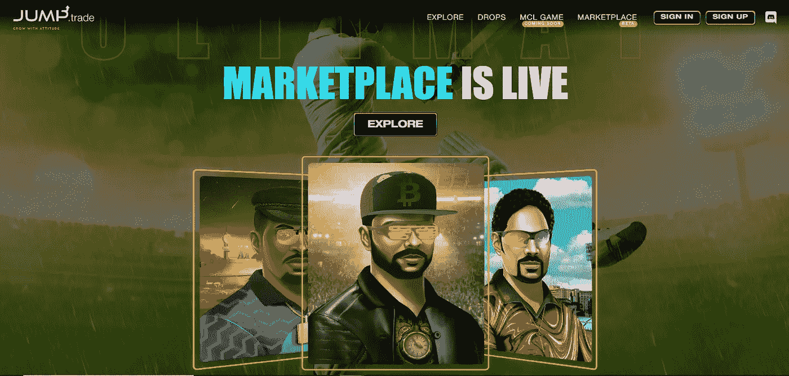
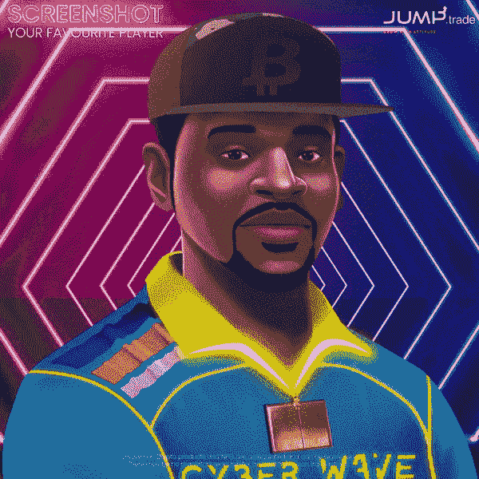

# 2022 年最佳板球 NFT 市场投资

> 原文：<https://medium.com/geekculture/best-cricket-nft-marketplace-to-invest-in-2022-976c47eea56?source=collection_archive---------13----------------------->

板球是地球上第二受欢迎的运动。这可能是世界上人口第二多的国家印度最具宗教色彩的游戏。板球经历了与时代潮流相一致的演变。人们很容易回忆起 20 世纪 90 年代，当时板球统计卡是最有趣的游戏之一。

板球也随着科技的发展而发展。EA 运动板球游戏是最受认可的电脑游戏之一…至少对普通印度人来说是这样。

快进到 21 世纪 20 年代，板球也进入了不可兑现的代币领域。

# 什么是不可兑现的代币？

不可兑现的代币是区块链上代表特定资产所有权的合约。在大多数情况下，这些资产是独一无二的、不可替代的，并且具有某种稀有性。

不可伪造的代币(通常缩写为 NFT)主要代表数字艺术或品牌收藏品或游戏资产。

## **板球和 NFTs**

自 NFTs 成立以来，许多 [**板球 NFTs**](https://www.jump.trade/nft-marketplace) 已经被引入，这与板球通常的能力相符。

这些 NFT 包括但不限于扑克牌、视频片段、纪念品、所有门票等等。这些非功能性食物大部分都可以在市场上买到。

## **有点跑题了……**

此时此刻，我们需要理解什么是 NFT 市场。顾名思义，NFT 市场是人们交易非金融资产的平台。这些平台大多是中介而非控制。这意味着人们可以为他们在市场上列出的非功能性食物定价。

市场也提供了有趣的投资选择。由于加密空间的易变性，NFT 已经确立了其作为一种投资或高于其他投资的可靠性。一些政府已经开始监管这一领域，这一事实增加了非金融交易市场和 NFT 市场作为投资选择的可信度。

对于一个加密投资者来说，看到一个新的板球 NFT 平台涌现出来并不奇怪……这种情况经常发生，这要归功于能够创造市场的技术的可及性。

因此，它成为投资者的一部分，行使他们的勤奋，找出最好的板球 NFT 市场，为他们投资的当务之急。

## **指针**

虽然在理论上看起来很复杂，但通过使用一些指针，很容易区分可靠的板球 NFT 平台和平庸的平台。

*   一个可靠的板球 NFT 市场是一个有适当的路线图和效用的 NFTs 的家。
*   一个好的板球 NFT 市场是由著名的名字认可的，也得到大量的新闻报道。
*   在大多数情况下，一个值得投资的 NFT 板球市场是一个已经在加密/NFT 领域建立了声誉的品牌的创造。
*   创建/认可市场的品牌通常与社区保持联系，不会陷入长时间的沉默。
*   板球 NFT 市场中的 NFT 根据它们的属性和特性被适当地分类。这绝不是偏离或无组织的上市。
*   最重要的是，市场上的非功能性交易总是经历一些健康的交易量。

虽然这个列表可能并不完全详尽，但这些建议肯定有助于你选择投资 NFT 板球市场。

# **jump . trade——板球 NFT 市场的选择之一**

如你所知，Jump.trade 是 GuardianLink(帮助推出阿米特巴·巴强 NFTs 的同一技术推动者)的产物，它在 2022 年 4 月底放弃了 NFTs。这种下降是非常特殊的，因为这些 NFT 收藏拥有进入世界上第一个 P2E 板球比赛的钥匙。

Meta Cricket League，通常缩写为 MCL，是一项每天都在推出的板球运动。你可以从市场中推断出每个 NFT 都有自己的属性。你还会注意到，NFT 滴剂已经获得了相当多的新闻报道，并得到了一些印度板球明星如 Harbhajan Singh 的认可。

时至今日，Jump.trade 市场见证了大量的非功能性交易，社区也因为大量的交流而变得活跃。该平台还拥有每周至少举办一次社区讲座的殊荣。他们还举办吸引投资者、收藏家、游戏玩家和爱好者的竞赛。

在贸易市场上出售的非功能性食品的价值已经大幅飙升，证明这些非功能性食品在未来具有一定的可靠盈利用途。随着世界上第一场 P2E 板球比赛由这些 NFT 支持，价值的增加似乎是可能的和可以接受的。

考虑到所有这些因素，Jump.trade 作为一个 [**板球 NFT 市场**](https://www.jump.trade/nft-marketplace) ，拥有成为你在 2022 年投资的最佳平台之一的所有资质。

## **结论**

GuardianLink 为您带来的 Jump.trade 是一个购买 NFT 的平台，为世界上第一个 P2E 板球比赛 MCL 提供动力，考虑到板球在印度的受欢迎程度和 P2E 模式的利润丰厚，它一定会取得巨大成功。

NFT 也抵抗了 2022 年第二季度的加密惨败，并且在最近几天也获得了很多接受。所有这些因素使得 Jump.trade 成为 2022 年 NFT 最佳板球市场之一。