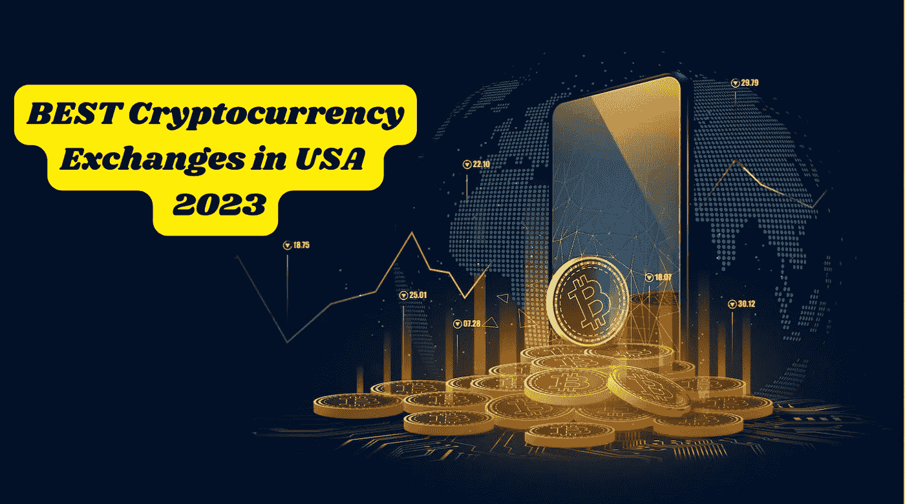
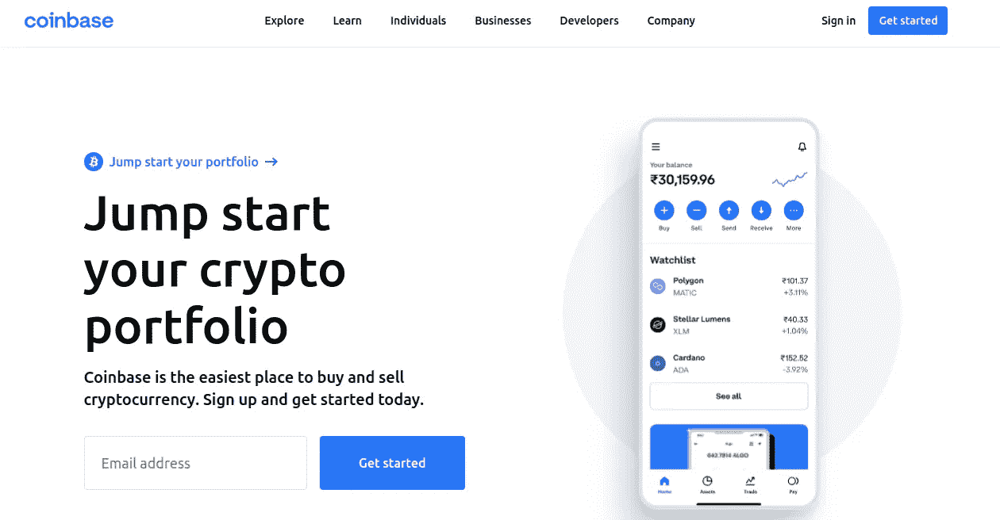
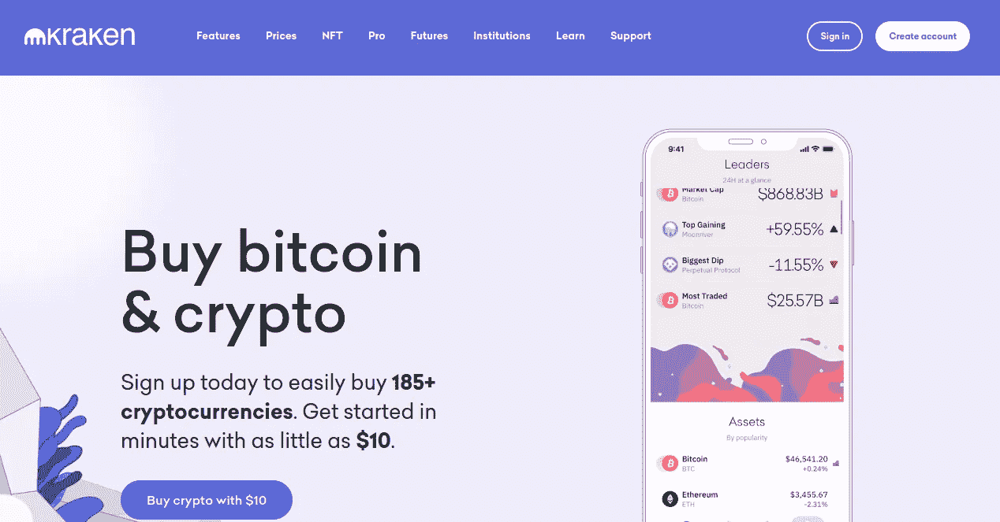
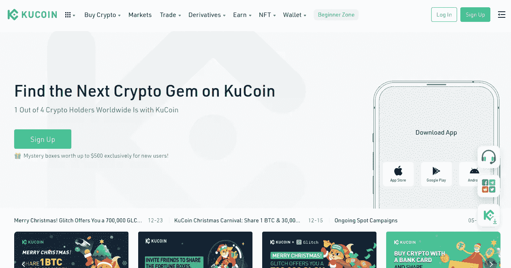
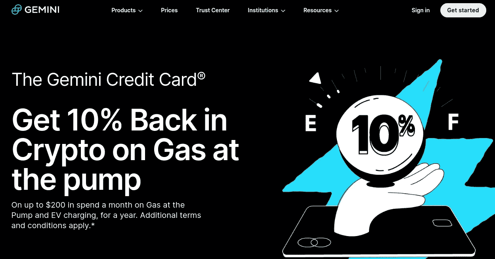

# 2023 年美国最佳加密货币交易所(更新)

> 原文：<https://medium.com/geekculture/best-cryptocurrency-exchanges-in-usa-2023-updated-2b9d4f6628bd?source=collection_archive---------7----------------------->

在美国，货币兑换是对企业最好的祝酒辞。当 cryptos 选择进入全球市场时，有交换的要求。于是加密货币交易所的兴起应运而生。因此，许多公司利用这一点作为生意，以赚取无尽的财富。因此，人们很难在 2023 年找到美国最好的密码交易所。因此，现在是通过收购美国顶级交易所来围绕加密交易所建立市场的时候了。让我们看看！

> [***加密货币交易所:让加密货币算数的权利！***](https://bit.ly/3WzuqKe)

## 【2023 年美国最佳加密交易所

## [**比特币基地**](https://www.coinbase.com/)

比特币基地是美国一家安全、声誉良好的加密货币交易所。超过 9800 万验证用户交易 200 多种受支持的加密货币，比特币基地已成为世界顶级加密交易所之一。比特币基地的受欢迎程度在很大程度上可以归因于其灵活的最低存款选项、用户友好的界面、三个比特币基地移动应用程序、有竞争力的交易费用以及面向所有类型投资者的产品选择。对于寻求最安全的加密货币交易的投资者来说，比特币基地安全协议被视为业内最佳协议之一。

## [**币安美国**](https://www.binance.us/)

美国币安是顶级加密货币交易所之一。母公司加密货币交易所币安的子公司于 2019 年首次亮相，作为专门针对美国市场的平台。然而，由于运营和监管问题，币安停止了在美国提供服务。如果你想知道美国币安是否安全，答案是肯定的。他们有一个出色的安全协议，还没有妥协，使他们成为加密货币交易所之一，如果不是最安全的话。

## [**北海巨妖**](https://www.kraken.com/)

自 2011 年首次亮相以来，北海巨妖因其开放的团队而越来越受欢迎。“不是你的钥匙，不是你的密码”是这位首席执行官经常重复的一句口头禅，他还积极倡导自我监管。这些行动帮助该平台发展到超过 600 万用户，交易超过 200 种不同的硬币，使其成为顶级加密货币交易所之一。这个交易所被认为是美国顶级加密交易所之一。他们有独特的能力，通过交换最广泛的加密货币来让事情变得更好。

## [**库币**](https://www.kucoin.com/)

美国最主要和最值得信赖的密码交易所之一是库币交易所。KuCoin 是最好的加密货币交易所之一，拥有超过 1800 万用户，支持 700 多种交易货币。由于 KYC 要求低，硬币选择广泛，费用实惠，它们是顶级的加密货币交易所之一。在 2020 年发生安全漏洞后，许多投资者质疑加密货币是否安全。由于采取了安全预防措施和数字资产保险，您的加密货币仍然是一项安全的投资。

## [双子座 ](https://www.gemini.com/)

Gemini 是美国十大加密货币交易所之一，成立于 2014 年，将安全放在第一位。他们是世界上第一家 SOC 1 Type 2 和 SOC Type 2 的认证交易所和托管机构。目前有超过 1300 万人在积极使用它们。用户喜欢他们将安全放在第一位，他们有一个强大的合规性策略来保护用户的资产。他们的安全措施，包括地址列表、2FA 和对硬件安全密钥的支持，都有助于保持平台的安全。

## **包装完毕！**

2023 年美国最佳加密交易所是企业在基于 web3 的未来获得一席之地的唯一原因。这些密码交易所已经完全透明，从而使人们获得他们的服务，以增强交易体验。但是，如果你想搭建一个类似上面提到的顶级交易所的平台，**[**crypto exchange 开发公司**](https://bit.ly/3WzuqKe) 很乐意帮忙。因此，获得一个平台，以可承受的价格创造无尽的财富。这绝对是在加密领域取得成功的顶级解决方案之一。**