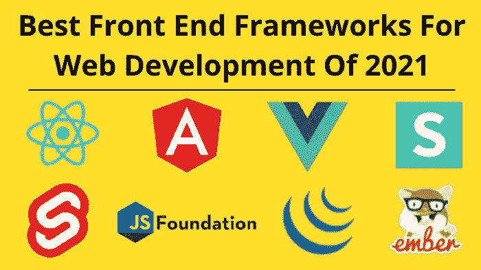
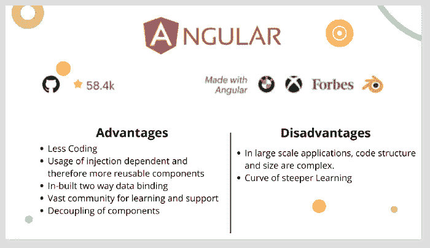
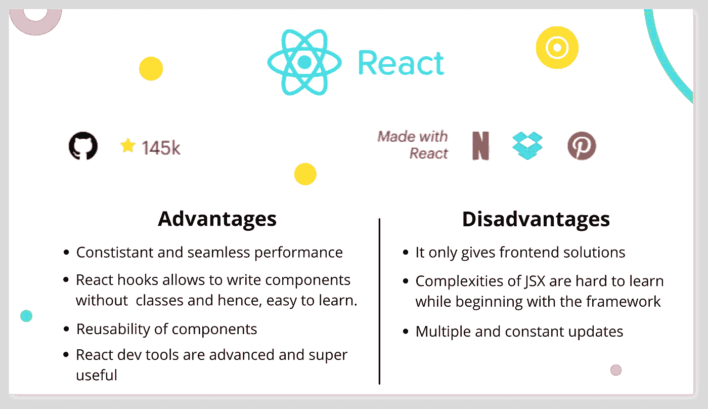
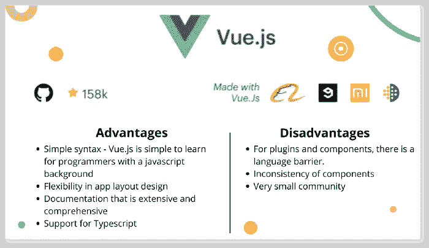

# 2021 年最佳 Web 开发前端框架:完整指南

> 原文：<https://medium.com/geekculture/best-front-end-frameworks-for-web-development-of-2021-the-complete-guide-ec30098fd1d0?source=collection_archive---------3----------------------->

Best Front End Frameworks For Web Development Of 2021

前端框架是软件开发过程的基础构件。然而，在创建具有高用户体验的视觉上吸引人的应用程序时，有许多选择可以考虑。**我们已经编制了一份 2021 年最佳前端框架的列表，来帮助你解决**。让我们仔细看看他们！

如今，每个企业的首要任务都是提供尽可能好的用户体验。作为一名开发人员，即使你收到的项目简介也提到了用户界面的简单性。无论环境中发生了什么样的动态任务和过程，用户看到的和感受到的都必须是无缝的。

> *网飞、脸书、Instagram 和其他非常受欢迎的企业都遵循这一原则。*

拿这些网站中的任何一个来说，你会发现它们功能强大、简单，并且有一个出色的用户界面。

这都要归功于运行在引擎盖下的无数框架。然而，随着客户和市场需求的增加，在可用性和功能性方面，不断需要提高质量。这时担忧就开始出现了。

# 最佳前端框架的现状

相对受欢迎程度方面，下图描绘了 2021 年**最佳前端框架**中提到的**各框架的整体受欢迎程度。**

Overall Popularity Of Each Frontend Frameworks Of 2021

我们可以看到 **VueJs 和 ReactJs** 自 2020–21 年以来一直处于**高需求**。

React and VueJs Popularity in 2020–21

关于 **jQuery** ，它的需求量一直很高。对此的解释是，一旦你不用使用像 **Angular 和 React** 这样的巨型框架，但需要以最少的功能进行更快的开发，jQuery 仍然表现出色。

Jquery High Demand In a Long Time

在下一节中，我们将看看**每个框架**如何在其**当前状态**中定义自己，以及我们如何为我们的**未来发展需求**选择一个。

Current State Of Each Frontend Framework For Future Development

# 让我们来看看 2021 年前三大前端框架

> *根据 JavaScript 2019 年的状态，React、Angular、Vue 是开发者中最常见的前端框架，也是 2021 年排名前三的前端框架。*

让我们仔细看看其中的每一项。另一方面，Emberjs 和 Svelte 的情况很独特。

*Svelte 是一个仍处于早期开发阶段的通用框架，但它已经引起了开发人员社区的关注。*

Emberjs 更有能力，但由于其传统的学习曲线方法，它还没有被大量开发人员使用。

# #1 角度

Angular Pros and Cons

*没有 Angular，就不可能有最好的前端开发框架列表。*

**这个列表中唯一基于 TypeScript 的框架是 Angular。** Angular 是谷歌在 2016 年创建的，旨在填补日益增长的*技术需求*和产生性能的传统理念之间的差距。

**Angular 与 React** 不同，它有一个**双向数据绑定**特性。它确保模型和视图在**实时**中同步，这意味着模型中的任何变化都会立即反映在视图中，反之亦然。

如果你正在做一个包括开发智能手机或网络应用的项目，Angular 是个不错的选择。此外，您可以使用这个平台来构建多页面和渐进式 web 应用程序。**BMW、Xbox、Forbes、Blender 等企业都在使用基于角度构建的应用。**

> ***棱角比反应过来的*** *更难理解。尽管有大量可用的文档，但它们要么太抽象，要么读起来令人沮丧。*

# 让我们来看看使用 Angular 的利与弊:

赞成者:

*   默认情况下，双向数据绑定等最重要的特性都是可用的，这减少了代码量。
*   将模型更改更新到视图的内置功能，反之亦然。
*   通过注入依赖，可以轻松地重用和管理组件。
*   一个巨大的学习和支持社区。
*   通过将它们标识为外部元素，组件从它们的依赖关系中分离出来。

**缺点:**

*   学习曲线更加陡峭，因为 Angular 是一个完整的动态解决方案，有多种方式来执行操作。
*   另一方面，On 使新来者学习概念和技术变得简单。
*   动态应用程序有时会因为其复杂的结构和大小而表现不佳。
*   缺点是代码优化和最佳角度实践。

# 什么时候使用 AngularJS:

Angular 通过立即动态更新**内容**来提高**基于浏览器的应用**的性能，因为**采用了双向数据绑定**。

Angular 是**企业级软件**和**动态 web 应用**的完美选择。

# 何时应避免成角:

如果你有一个较小的团队，可以避免有棱角的 js，难度较小，语法简单。

**Angular 作为前端平台，是一个全包**。如果你选择创建小范围的**应用，你将无法使用 Angular 提供的工具。**

# #2 反应

React Pros and Cons

React 是脸书创建的最容易学习的框架之一，用于解决由于应用程序不断包含新功能而导致的代码可维护性问题。

> React 因其虚拟文档对象模型(DOM)而与众不同，它提供了卓越的功能。对于那些期望大量流量并需要一个可靠平台来管理流量的人来说，这是一个很好的结构。

**React 被推荐用于涉及创建单页 web 应用程序和渐进式 web 应用程序(pwa)的项目。**

# 让我们来看看使用 React 的利弊:

**优点:**

*   它允许你不用类就能编写组件，并且比用反应钩子编写更容易学会反应。
*   项目可重用性促进了应用程序其他领域的协作和重用。
*   React dev 仪器非常先进，非常有用。
*   数字 DOM 允许一致和无缝的结果。

**缺点:**

*   由于框架内的多次不断更新，正确的文档变得难以制作，因此影响了初学者的学习曲线。
*   只提供领先的解决方案。
*   当开始使用 JSX 时，开发人员发现很难理解框架的复杂性。

# 什么时候使用 React:

在开发单页面应用程序时，React 用于设计用户界面。*由于组件可以重复使用，这是在更短时间内创建交互界面的最稳定的前端架构。*

# 当你不应该使用 React 时:

如果您之前没有任何 Javascript 经验，React 不是最好的选择。对于没有经验的开发人员来说，JSX 的学习曲线也有些艰难。

# #3 Vuejs

Vue.js Pros and Cons

**Vue.js** 是一个简单明了的**前端系统**是当今最常见的系统之一。它擅长**缓解 **Angular 开发者**必须处理的问题**。

它体积更小，有两大好处:**可视化 DOM** 和**基于组件的**。这也是一种双向绑定。

Vue.js 是一个**灵活的工具**，可以用于多种用途。从 **web 应用**和**移动应用**到渐进式 **web 应用**，它可以轻松管理**基本流程和复杂流程**。

> *尽管它是为了* ***提高 app 效率*** *和处理复杂性而设计的，但它并不被市场领导者普遍使用。*
> 
> *比如:* ***阿里巴巴，9gag，路透社，还有小米，都用这个平台*** *。*

尽管硅谷用户越来越少，但采用 VueJs 的人数仍在持续增长。

# 让我们来看看使用 Vue.js 的利弊:

**优点:**

*   广泛而全面的文档。
*   **简单语法** — Vue.js 对于有 javascript 背景的程序员来说很容易学会。
*   应用布局设计的灵活性。
*   广泛而全面的文档。

**缺点:**

*   组件不一致。
*   对于插件和组件，存在语言障碍。
*   非常小的社区。
*   大部分插件都是用**中文**写的。

# 你什么时候使用它？

对于**柔性结构**，推荐使用 Vuejs。它可以让你从头开始设计一切，也可以成功开发大型项目。

# 何时避免使用它:

此外，由于框架的组件**稳定性问题**，需要**稳定组件**的应用**不应设计 Vuejs** 。

如果你认为**支持社区**会对**复杂性**， ***Vuejs 不是前进的方向。***

 [## Marketitup |网站设计和开发|数字营销| Seo 服务|内容营销

### Marketitup 在 2021 年开始了它的旅程。我们是孟买/德里/任何地方，基于网站开发公司。我们的…

市场推广](http://marketitup.in/)