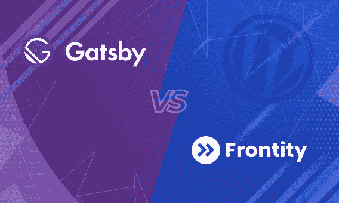
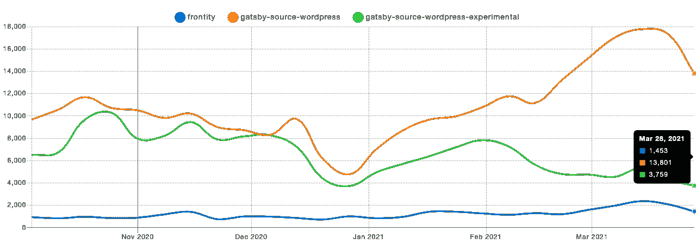

# WordPress 最佳前端框架:盖茨比 vs Frontity

> 原文：<https://medium.com/geekculture/best-frontend-framework-for-wordpress-gatsby-vs-frontity-db5e6854c9cd?source=collection_archive---------19----------------------->

# 介绍

长期以来，WordPress 一直是最流行的内容管理系统(CMS)。今天，几乎 40%的网站以某种形式使用 WordPress，这本身就是一个很大的成就。它的受欢迎程度在于它是开源的、用户友好的、安全的、SEO 友好的，最重要的是，它充满了主题和插件，使得开发过程更易于管理。

WordPress 最初是作为一个整体系统来设计和使用的，插件和主题驻留在同一个服务器上。但事情在 2016 年发生了变化，当时 WordPress 推出了他们的 REST API，这使得无头 WordPress 网站的创建成为可能。

这也意味着 ReactJS 等现代前端框架可以与它结合使用。它给 WordPress CMS 解决方案带来了更好的安全性、可伸缩性和可用性。

这些年来，ReactJs 在 web 开发人员中得到了广泛的关注，因为它快速、易学、基于组件，促进了不重复(DRY)原则并支持服务器端渲染。随着 ReactJs 团队不断推出新特性，ReactJs 成为最受欢迎的前端库之一也就不足为奇了。

由于它的流行，基于 ReactJs 的新框架开始以特定的用例出现。两个最流行的框架是 NextJs 和 GatsbyJS，主要分别用于服务器端呈现和静态站点生成。

如果 ReactJS 这么好，WordPress 也很棒，为什么不把它们结合起来，用现代网络开发工具建立一个由 CMS 驱动的网站呢？开发者开始结合 ReactJS 使用 WordPress 是显而易见的。在这篇博客中，我们将仔细研究结合了 WordPress 和 ReactJS 的两个这样的框架，即 Frontity 和 GatsbyJs。

# 简短的

在我们开始深入研究这些框架之前，公平地说，这两个框架在它们的方式上都很棒。

GatsbyJS 是一个静态站点生成器。它被用来创建速度惊人的网站，这些网站本质上是静态的，很少有内容更新。GatsbyJs 通过使用其插件提供了灵活性和可扩展性。Gatsby 插件提供了广泛的功能，如使网站离线，添加内嵌 SVG 支持，添加谷歌分析，等等。

这些插件可以直接安装，使用方便。在它提供的所有不同插件中，gatsby-source 插件尤其用于使用 GraphQL 从本地或远程数据源获取数据。这些来源可以是 JSON、CSV 文件，也可以是 WordPress 和 Prismic 之类的 CMSs。

尽管 Gatsby 是一个巨大的 ReactJS 框架，可以与 WordPress 一起工作，但它并不是专门为 WordPress 设计的。因此，仍然有一些额外的工具和复杂的配置留给开发人员。

这就是前沿性发挥作用的地方。Frontity 是一个专门为 WordPress 设计的 ReactJS 框架。它使开发者能够用基于 ReactJS 的前端构建无头 WordPress 站点。它旨在简化创建分离站点的复杂过程。

这个框架的每个部分都经过了优化和简化，以便与 WordPress 一起使用。开发者不再需要弄清楚使用什么工具来处理 CSS 和状态管理之类的事情，而是直接使用 ReactJS 创建一个新的 WordPress 主题。它还提供插件，提供广泛的功能。它还支持节点包的使用。

# 类似

Gatsby 和 Frontity 的初始页面加载时间都很短，应用内路由由这些使用预取概念的框架处理，这意味着用户永远不必等待应用内的导航。

这两个框架都拆分了代码，并发送应用程序工作所需的最少代码，从而提高了性能。

这两个框架都提供了 PWA 兼容性和对服务人员使用的离线支持。

这两个框架都提供了插件，使得开发者开发复杂的特性变得容易。这两个框架都支持使用来自 npm 的外部包。

这两个框架都经过优化，在 Lighthouse 中得到了最高分，包括性能、SEO 和可访问性。

# 前沿的额外特征

一切都已经连接好了:React、Webpack、Babel、SSR、Routing、CSS-in-JS、WP REST API、TypeScript、林挺、测试等等。

不需要复杂的配置；开发人员经常需要这些工具，比如对交付内容的 API 的查询，这是预先配置好的。

Frontity 有自己的状态管理器，它为 CSS 使用[情感。由于这一点，开发人员不需要学习 Redux 等技术的复杂性。同时，它支持非常灵活的可扩展性模式，更类似于 WordPress 本身，而不是其他 JavaScript 框架。](https://emotion.sh/docs/styled)

使用相同的 ReactJs 代码库，Frontity 可以输出适合 Google AMP 的 HTML

在使用 Gatsby 时，开发人员通常需要 GraphQL 的知识。Frontity 消除了这个麻烦，因为它内置的状态管理器提供了数据。

# 如何用盖茨比实现 WordPress？

这就像创建一个 wordpress 站点一样简单；你需要在 Gatsby 和 WordPress 上进行快速配置。

1.  你必须添加 [WPGatsby](https://wordpress.org/plugins/wp-gatsby/) 和 [WPGraphQL](https://github.com/wp-graphql/wp-graphql/releases) 插件到你的 WordPress 站点
2.  然后你将需要官方的 Gatsby WordPress 插件到你的 Gatsby 站点
3.  之后，用你的 WordPress 凭证和主机 URL 配置插件
4.  按照上面的三个步骤，你将能够在 GraphQL 网站上使用 GraphQL 查询来访问你所有的 WordPress 数据

这里的重要限制是你不能在 Gatsby 站点上使用 WordPress 主题；此外，WordPress 网站上使用的插件在前端是不可用的，所以为了同样的功能，你也需要 Gatsby 插件，有时很难维护两边的代码。

为了解决这个重要的问题，Frontity 被引入，它是一个渲染引擎；以前，在 WordPress 端，开发者必须依赖 PHP 渲染引擎。Frontity 消除了这一点，可以通过使用 WordPress 数据来呈现 HTML。

下面是盖茨比-source-wordpress-experimental，盖茨比-source-wordpress 和 frontity 的 [NPM 趋势](https://www.npmtrends.com/frontity-vs-gatsby-source-wordpress-vs-gatsby-source-wordpress-experimental)对比图。正如我们所看到的，尽管 Frontity 只支持 WordPress，但 gatsby 在 WordPress 中仍然很受欢迎。

此外，我们已经采取了实验包，因为它是一个比标准的 gatsby wordpress 源代码插件更稳定的版本。

通过观察 Frontity 的使用速度，建议 WordPress 用户至少在较小的项目中尝试 Frontity，并帮助社区发展。这将鼓励 Frontity 和 WordPress 的开发者提出更多对开发者友好和可行的解决方案来一起使用它们。

如果你不想冒险在你的项目中尝试一项新技术，你可以选择盖茨比，因为它在游戏中已经存在很长时间了，你将能够得到更多的支持，不像 Frontity。

# 结束注释

这总是取决于您收到的项目需求和您应该使用的框架。但是现在你有了两个最流行的框架之间的比较来明智地做出决定。

我们在 ZealousWeb，总是精通任何技术及其框架的所有更新。当我们为客户提供更好、更强大的框架时，我们会为迎合他们并更新他们的商店而感到自豪。当你有一个很棒的想法要实现时，我们再谈吧！

【https://www.zealousweb.com】最初发表于**。**