# 表单的最佳便捷正则表达式

> 原文：<https://medium.com/geekculture/best-handy-regex-for-forms-ade3c94c783d?source=collection_archive---------1----------------------->


这些是我的一些创作，其他的我也在寻找和改进，最后，我会分享所有的资源。

别忘了这个**难写**，**难读**，还有**难维护/修改！但是有用！！！**

我用这个页面测试这些正则表达式，非常有用，如果你不想浪费时间测试，我测试了下面所有的正则表达式，以帮助你保证一切都会很棒✌.
https://regex101.com/

# 没有“”或“”的完整名称的正则表达式，只有简单名称

```
/^[A-z\sa-z\sA-Z]{1,30}$/
```

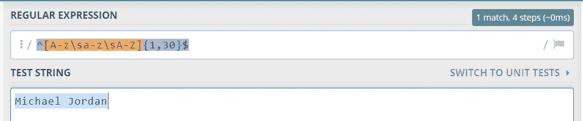

Example Regex for names

# Unicode 简单名称的正则表达式

```
/^[a-z A-ZáéíóúÁÉÍÓÚ]{8,40}$/
```

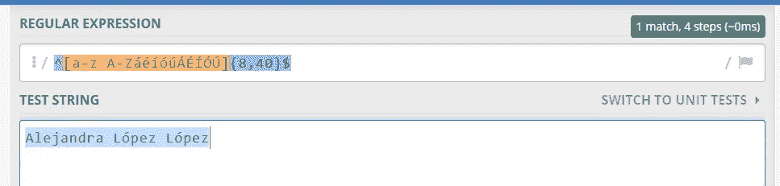

Example Regex for names

# 通用名称的正则表达式

```
/^[a-z ,.'-]+$/i
```

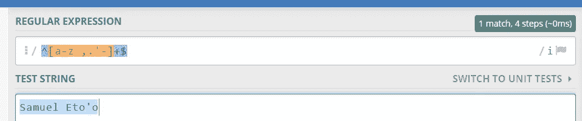

Example Regex for universal names

# 带 Unicode 的正则表达式通用名称

```
/^[a-zA-ZàáâäãåąčćęèéêëėįìíîïłńòóôöõøùúûüųūÿýżźñçčšžÀÁÂÄÃÅĄĆČĖĘÈÉÊËÌÍÎÏĮŁŃÒÓÔÖÕØÙÚÛÜŲŪŸÝŻŹÑßÇŒÆČŠŽ∂ð ,.'-]+$/u
```

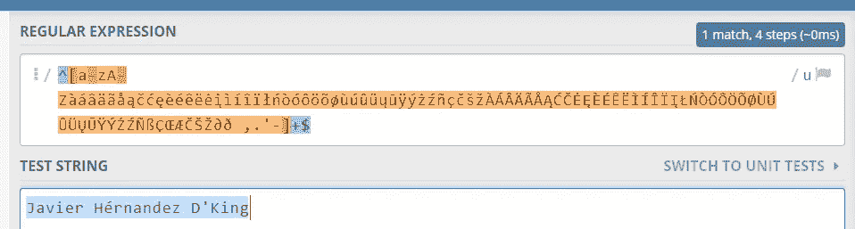

Example Regex for universal names with unicode

# 电子邮件的正则表达式

```
/^(([^<>()\[\]\.,;:\s@\"]+(\.[^<>()\[\]\.,;:\s@\"]+)*)|(\".+\"))@(([^<>()[\]\.,;:\s@\"]+\.)+[^<>()[\]\.,;:\s@\"]{2,10})$/i 
```

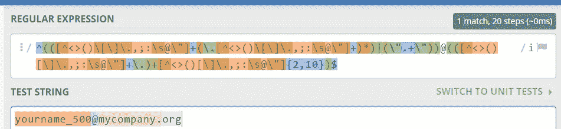

Regex for Email

```
^([a-z0-9!"\-\._"])+(@{1})(gmail|hotmail|outlook|yahoo)(\.)(es|com)$
```

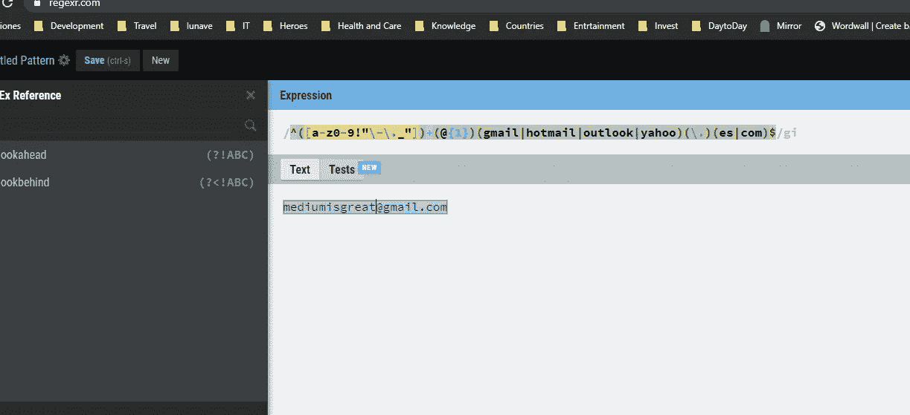

Regex for Email and only gmail outlook or yahoo

# 不含+且长度为 10 的数字的正则表达式如果要更改，请更改{}之间的数字 10

```
/^[0-9]{8,10}$/
```

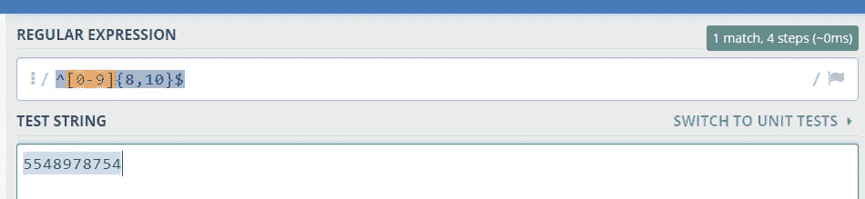

Example Regex for numbers without +

# 另一个通用数字的正则表达式

## 开头带有+的只接受+后面的 1 到 3 位数字和 8 到 10 位数字

```
/^([+0-9]{1,3}[0-9]{8,10})$/
```


Example Regex for universal numbers

# 带空格和括号的数字的正则表达式

```
/^(?:\+\d{1,3}|0\d{1,3}|00\d{1,2})?(?:\s?\(\d+\))?(?:[-\/\s.]|\d)+$/
```

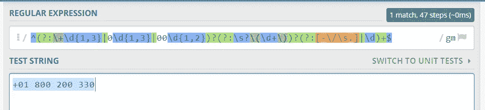

Example Regex for universal numbers with spaces

# 只接受字母和特殊字符的消息的正则表达式

```
/^[\WA-z a-z A-Z]{10,100}$/
```

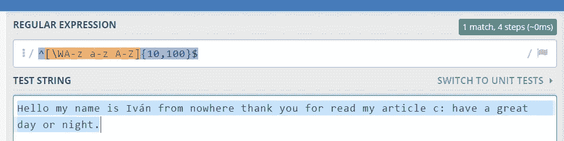

Example Regex for messages with especial characters

# 只需要字母的消息的正则表达式

```
^([^\W][A-z a-z A-Z]{10,100})$
```

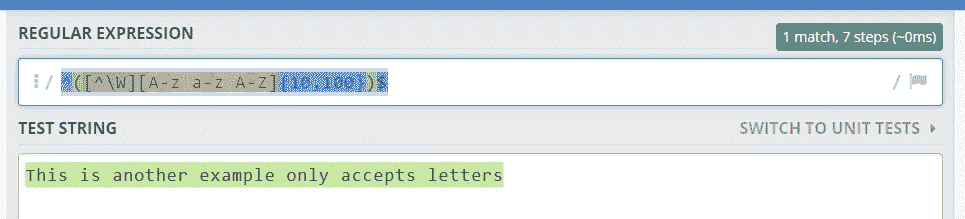

Example Regex for messages with only letters

# 只接受 Unicode 字母的邮件的正则表达式

```
/^([^\W][A-z a-z A-ZZàáâäãåąčćęèéêëėįìíîïłńòóôöõøùúûüųūÿýżźñçčšžÀÁÂÄÃÅĄĆČĖĘÈÉÊËÌÍÎÏĮŁŃÒÓÔÖÕØÙÚÛÜŲŪŸÝŻŹÑßÇŒÆČŠŽ∂ð]{10,100})$/
```

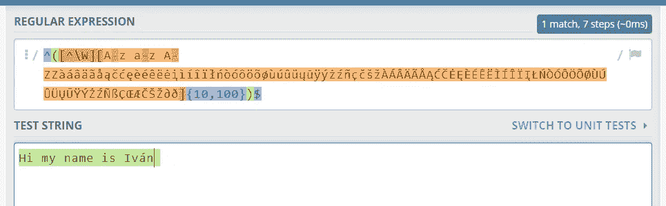

Example Regex for messages it accepts letters with unicode

# 密码的正则表达式

至少接受一个数字、一个大写字母、一个小写字母和零个或多个特殊字符。它不接受空格、制表符和换行符，长度至少为 8 到 16 个字符。您可以在这一部分中只更改 8 个或更少的字符{8，16}

```
/^(?=.*[0-9])(?=.*[A-Z])(?=.*[a-z])(?=.*\W*)(?!.*\s).{8,16}$
```

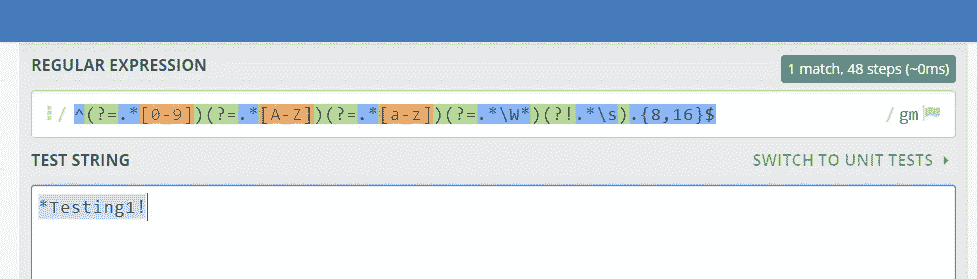

Example Regex for Passwords

# 日期的正则表达式

日期受理`dd/mm/yyyy`、`dd-mm-yyyy`或`dd.mm.yyy`

```
/^(?:(?:31(\/|-|\.)(?:0?[13578]|1[02]))\1|(?:(?:29|30)(\/|-|\.)(?:0?[13-9]|1[0-2])\2))(?:(?:1[6-9]|[2-9]\d)?\d{2})$|^(?:29(\/|-|\.)0?2\3(?:(?:(?:1[6-9]|[2-9]\d)?(?:0[48]|[2468][048]|[13579][26])|(?:(?:16|[2468][048]|[3579][26])00))))$|^(?:0?[1-9]|1\d|2[0-8])(\/|-|\.)(?:(?:0?[1-9])|(?:1[0-2]))\4(?:(?:1[6-9]|[2-9]\d)?\d{2})$/
```

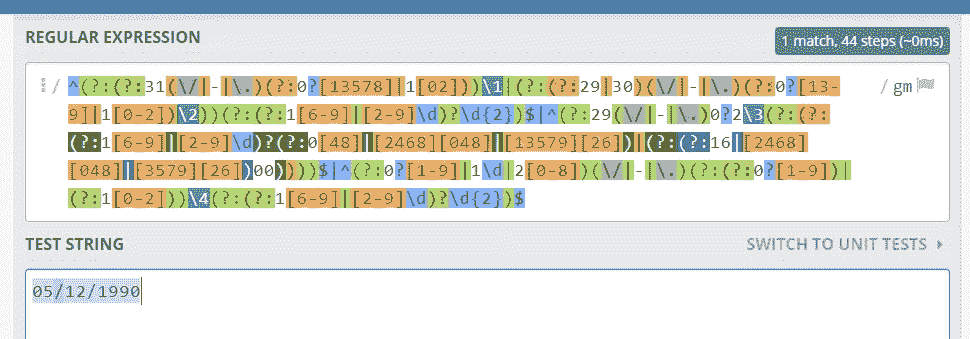

Example Regex for Date

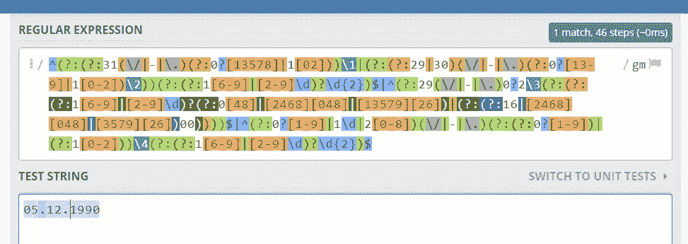

Example Regex for date

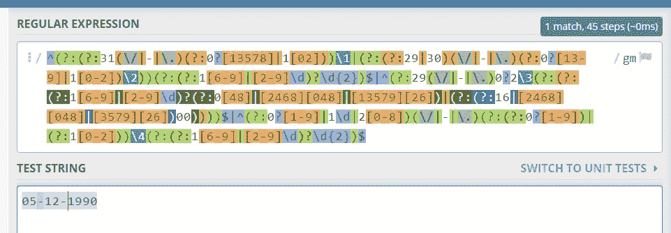

Example Regex for date

# 时间的正则表达式

```
/^([0-1]?[0-9]|2[0-3]):[0-5][0-9]$/
```

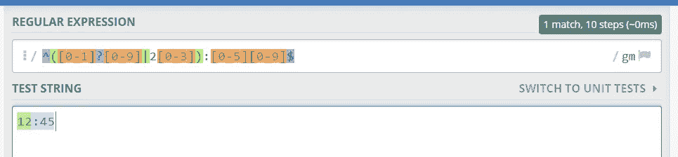

Example Regex for Time

# 日期时间的正则表达式-本地

```
^(?:(?:31(\/|-|\.)(?:0?[13578]|1[02]))\1|(?:(?:29|30)(\/|-|\.)(?:0?[13-9]|1[0-2])\2))(?:(?:1[6-9]|[2-9]\d)?\d{2})$|^(?:29(\/|-|\.)0?2\3(?:(?:(?:1[6-9]|[2-9]\d)?(?:0[48]|[2468][048]|[13579][26])|(?:(?:16|[2468][048]|[3579][26])00))))$|^(?:0?[1-9]|1\d|2[0-8])(\/|-|\.)(?:(?:0?[1-9])|(?:1[0-2]))\4(?:(?:1[6-9]|[2-9]\d)?\d{2})T([0-1]?[0-9]|2[0-3]):[0-5][0-9]$
```

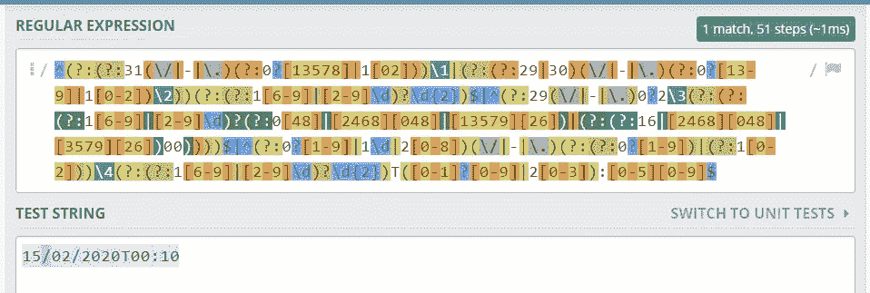

Example Regex for date time

# 来源

[https://stack overflow . com/questions/2385701/regular-expression-for-first-and-last name](https://stackoverflow.com/questions/2385701/regular-expression-for-first-and-last-name)
[https://stack overflow . com/questions/2370015/regular-expression-for-password-validation](https://stackoverflow.com/questions/2370015/regular-expression-for-password-validation)
[https://stack overflow . com/questions/13719367/what-is-the-the-best-regular-expression-for-phone-numbers](https://stackoverflow.com/questions/13719367/what-is-the-best-regular-expression-for-phone-numbers)