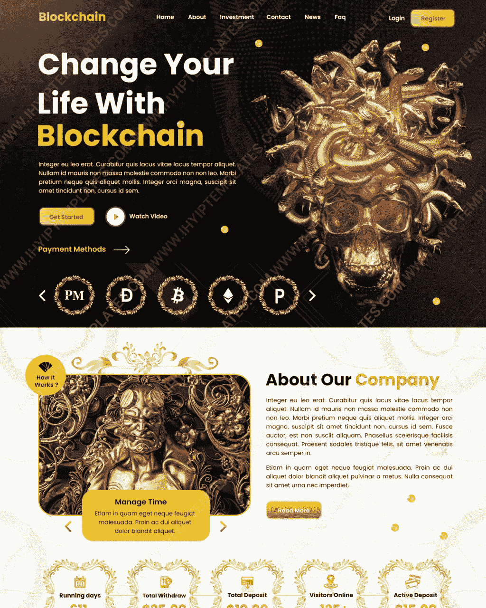
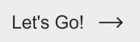

# 你的商业网站的最佳 HYIP 模板

> 原文：<https://medium.com/geekculture/best-hyip-templates-for-your-investment-business-website-1c39e8692688?source=collection_archive---------11----------------------->

## **如何以及在哪里选择**

## HYIP 模板比以往任何时候都更受欢迎，因为今天的在线投资业务需要创新和诱人的模板来设计一流的网站。

[**IHYIP 模板**](https://www.ihyiptemplates.com/) 因此在这里为所有的商业网站提供制作精美的模板，让他们能给新访客留下深刻印象。

因为大多数访问者通过封面来判断一本书，所以以最好的方式维护你的商业网站是很重要的。因此，我们为各种业务平台提供最独特的设计，例如

*   智能合同模板
*   金牌编码器模板
*   MMM 网站
*   HYIP 和 HYIP 箴言报
*   加密交换网站
*   比特币挖矿和倍增网站
*   最初的硬币提供平台和列表网站

我们在图库页面上提供了大量的设计，但是在为你的商业网站选择合适的模板时，你很自然会感到困惑。

为了概述选择最佳网站模板的程序，我们创建了这个指南。

*   在我们的图库中，为你的网站选择一个独特的模板设计，因为它们可以增强你网站的整体感觉，帮助你在人群中脱颖而出。
*   颜色增加你的品牌认知度，并吸引人们对特定网站元素的注意。因此，选择合适的模板，颜色要赏心悦目，与你的商业网站完美融合。
*   一个强大的排版组件会鼓励访问者访问你的网站，一个令人愉悦的字体、页眉、页脚和标题会给演示文稿增添活力。在我们的库中选择网页设计时，请检查这些组件是否适合您的业务。
*   在你的网站上，图片比文字更有说服力。因此，选择合适的图片是很重要的，它应该与你的网站的文本兼容并服务于目标。
*   大多数企业可以从横幅和图标的圆滑外观设计中受益。然后选择合适的横幅图像和图标，因为这是增强网站用户体验的简单方法。

这些基本因素足以为你的网站选择完美的模板。但是，在选择正确的之前，还有很多事情要考虑。然而，从头开始设计你的商业网站是非常耗时、费力和昂贵的。如今许多现成的 [**最佳 HYIP 模板**](https://www.ihyiptemplates.com/) 包含了所有必需的组件，非常易于使用。

IHYIP Templates 是一家客户满意度很高的公司，为各种投资业务网站提供具有轻量级代码的有吸引力的模板。我们的产品采用了最新版本的 bootstrap responsive，可以在各种尺寸的屏幕上优雅地显示。

> 在 IHYIP 模板库中，有许多令人惊叹的设计供您选择！！

除了网站设计，我们还提供其他网络服务，如徽标和横幅设计、域名和托管、模板集成以及其他定制服务。因此，在我们经验丰富的设计师和开发人员的帮助下，我们为您的网站提供端到端的解决方案。

此外，我们专门的支持团队随时提供有效的在线支持。联系我们，活跃你的网站。

