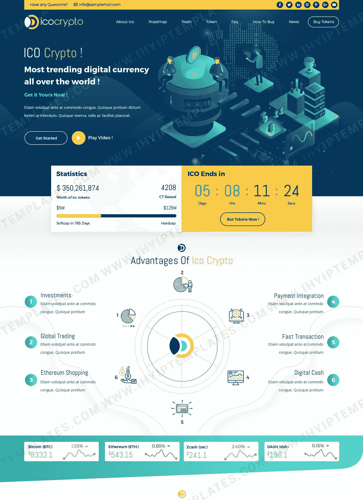
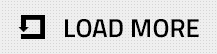

# 最佳 ICO 网站模板！

> 原文：<https://medium.com/geekculture/best-ico-website-template-f5f021f598a0?source=collection_archive---------11----------------------->

## **7 提示选择**

专业设计的 [**ICO 网站模板**](https://www.ihyiptemplates.com/ico-website-templates) 是您最初的投币平台的理想选择。因为它已经完全构建了网页，这些网页包含了你启动商业网站所需的一切。它使您能够快速、轻松、经济地建立一个具有专业外观的网站。

看完这些建议后，选择一个 ICO 模板看起来并不困难。这里有一些建议来指导你选择优秀的模板。

*   始终选择一个独特的模板，因为它可以提升公司网站的整体外观，并保证在行业中名列前茅。
*   颜色会影响访问者对网站的感觉，增加品牌认知度，并吸引人们对关键网站内容的注意。因此，选择一个与颜色完美搭配的模板至关重要。

*   强大的排版组件，如标题、页眉、页脚和内容，以及令人愉悦的字体可以为演示文稿增添活力。
*   图像应该完全适合你网站的内容，并服务于它的目标。使用合适的图片，因为这是增强网站用户体验的简单方法。
*   寻找具有最新版本的引导响应和快速加载功能的模板，因为这两者都会影响用户体验和网站性能。
*   易于导航的网站允许用户快速访问他们需要的信息。所以要选择好用的设计。
*   争取搜索引擎优化友好的模板，因为一个缓慢加载的网站会影响你的网站的排名。因此，请确保模板的编码很简单。

> 尽管如此，清单上还有很多，但这些建议足以帮助你为你的初始硬币提供平台选择最好的 [**ICO 模板**](https://www.ihyiptemplates.com/ico-website-templates) 。

如果你决定使用模板来创建你的网站，请访问 IHYIP 模板库页面。在那里你会发现世界级的商业网站设计。所有的模板都是简单编码的，并且是 SEO 友好的，可以帮助你优化你的网站。

此外，我们的模板具有快速加载功能和最新版本的 bootstrap responsive，这有助于提高您的网站在各种设备屏幕分辨率上的性能。所以拥有一个好的设计将会把你的生意带到一个更高的高度，并向你的目标受众展示你的品牌的独特性。

