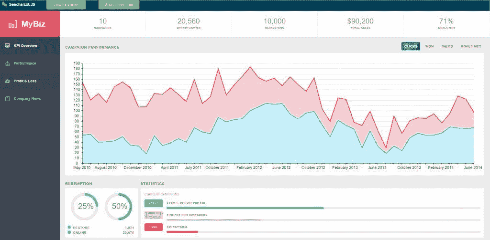

# 开源的最佳 JavaScript 框架替代方案

> 原文：<https://medium.com/geekculture/best-javascript-framework-alternatives-to-open-source-3d95faa3d236?source=collection_archive---------18----------------------->

Photo by [Tegan Mierle](https://unsplash.com/@tegan?utm_source=unsplash&utm_medium=referral&utm_content=creditCopyText) on [Unsplash](https://unsplash.com/s/photos/open-source?utm_source=unsplash&utm_medium=referral&utm_content=creditCopyText)

每个组织都有不同的工具来支持内部流程。随着公司规模的扩大，IT 团队面临着日益复杂的用户需求，这些需求往往超出了消费者软件的能力。

各地的 IT 主管都专注于定制解决方案，以更好地满足其组织的需求。

本文将深入探讨为企业应用程序选择开发框架的关键领域。此外，您将了解开源软件面临的共同挑战，以及是什么让 **Sencha Ext JS** 成为[最佳 JS 框架](https://www.sencha.com/products/extjs/)的替代解决方案。

# 开发企业软件时需要考虑什么

不管使用领域如何，每个高性能企业软件的基础都归结于开发框架。如果你负责创建一个新的应用程序，你可能会考虑像 React 或 Angular 这样的开源框架。

现在，开源软件包带来了一系列完全不同的挑战:

**安全风险:**企业应用程序处理敏感数据，因此您需要控制系统可访问性和用户权限。如果您依赖于由更广泛的社区开发的开源项目，那么对源代码贡献的控制可能很少。

维护工作:企业软件有独特的需求。不幸的是，由于第三方代码的性质，许多开源框架并不适合您的特定用途。您还需要牺牲 IT 团队所需的标准支持。

**用户采用的易用性:**缺乏 UX 的专业知识或带宽使得很难交付最佳的用户体验，除非你的团队在每个项目中都有可重用的 UI 组件。

考虑到上述因素，您应该[小心处理开源框架](https://sdtimes.com/cloud/open-source-commercial-software-development-handle-care)，尤其是对于关键任务环境。

理想的开发框架还应该提供:

*   使用本机调试器的版本控制或类似 IDE 的体验
*   强大而精细的访问控制功能
*   自我托管的选项

# 为什么选择专有框架？

构建和部署应用程序越容易，就越能有效地满足用户不断提出的功能需求。这只是闭源框架的众多优势之一。

**企业级安全**

安全性可能是企业采用闭源的主要驱动力。对于企业软件来说，控制和授权对源代码的访问是至关重要的。

**专门的支持和培训资源**

您不必担心通过搜索文档或社区论坛来找到问题的答案。使用商业框架，您将从供应商那里获得专业支持。可用的文档和用户指南也直接迎合您的使用案例。

**高代码质量**

开源框架不一定像商业框架一样关注质量。相反，专有选项为您提供了完全的定制能力来设计满足特定需求的软件，因此您的团队可以节省开发时间，同时确保代码在安装后立即可用。

除了这些好处之外，您还将获得一份带有赔偿和担保的标准许可协议。这意味着更少的开源许可条款和合规性问题。

# Ext JS:用于定制软件开发的健壮 JavaScript 框架

Ext JS 是一个 JavaScript 框架，它为构建富客户端、跨平台的 web 应用程序提供了一个组件库。它特别适合处理具有大量数据的企业应用程序。

使用 Ext JS，您可以访问超过 140 个预建的 UI 组件，包括表单生成器、日历、表格、图表等等。另外，您将能够使用 Sencha 数据透视表和 D3 适配器来可视化和分析数据。

各种其他工具将帮助您轻松交付软件:

*   森查试验
*   GXT
*   煤矿管理局
*   IDE 和代码编辑器
*   插件
*   建筑师
*   主题
*   模板
*   检查员

让我们深入了解一下 **Sencha Ext JS** 对于开发定制软件的一些主要好处。

# 加快发展速度，提高质量

你可以使用 [Sencha Architect](https://www.sencha.com/products/architect/) 在更短的时间内高效地构建像素完美的 ui。自动生成的代码针对高性能进行了优化，因此与手动编码相比，您可以避免错误。

使用 [Sencha Cmd](https://www.sencha.com/products/sencha-cmd/) 提高您的工作效率，这是一个强大的命令行工具，提供了广泛的选项，从代码生成和最小化到包的动态加载，以及渐进式 web 应用程序的生成。

您将享受 Sencha Ext JS 开发任务的自动化功能，包括编译主题文件、切片和切割图像，以及运行开发 web 服务器以在本地运行您的代码。

# 用于高效原型制作的漂亮用户界面

在丰富的 UI 组件库之上，Sencha 还通过 [Themer](https://www.sencha.com/products/themer) 帮助提升应用程序的外观和感觉。Ext JS 7 和更高版本为 Classic Toolkit 提供了一个新的、现代外观的材质主题，这是一个描述应用程序的可视组件和布局、可能的交互以及颜色、形状和运动等品质的统一表达的设计系统。

Ext JS 的另一个提高生产率的特性是工具的集成。构建定制 web 应用程序所需的一切都在一个地方。

使用开源软件通常需要您为每个组件浏览大量的框架和库，这可能很乏味。但是 Sencha 组件和附加工具的互操作性允许您显著加快软件开发过程。

# 强大的数据包

该框架包含一个强大的软件包，能够处理具有许多功能的数据密集型应用程序:

它由许多具有高功能模型的类组成，支持客户端数据收集访问和使用来自任何后端源的数据，这要归功于它的协议无关的连接器，通过会话管理功能简化了多个客户端操作，并最大限度地减少了到服务器的往返行程。

# 专业服务和支持

最重要的是，作为 Ext JS 的客户，您将获得专门的 [Sencha 支持团队](https://www.sencha.com/support/)的专业服务。没有必要每次都浏览数百个论坛帖子来解决问题。

如果你想和其他 Ext JS 开发者联系，加入我们的 [Discord 社区](https://discord.com/invite/RfxMGSbHXT)或者关注我们的 [GitHub](https://github.com/sencha) 。

# 试试 Sencha Ext JS

成功的企业信任 Ext JS 来构建广泛而复杂的系统，如 ERP(企业资源规划)、CRM(客户关系管理)、CMS(内容管理系统)、OMS(订单管理系统)等等。

*由 Linh Pham 撰写。原帖发布于:*[*https://www . sencha . com/blog/best-JavaScript-framework-alternative-to-open-source*](https://www.sencha.com/blog/best-javascript-framework-alternative-to-open-source)