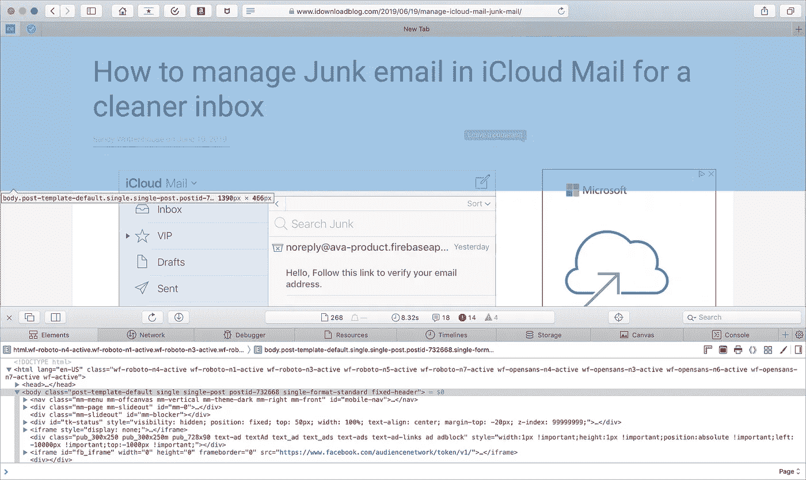
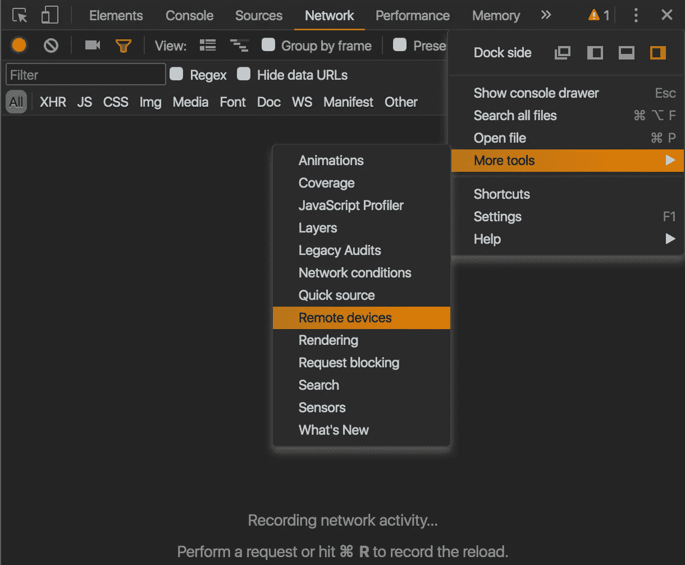
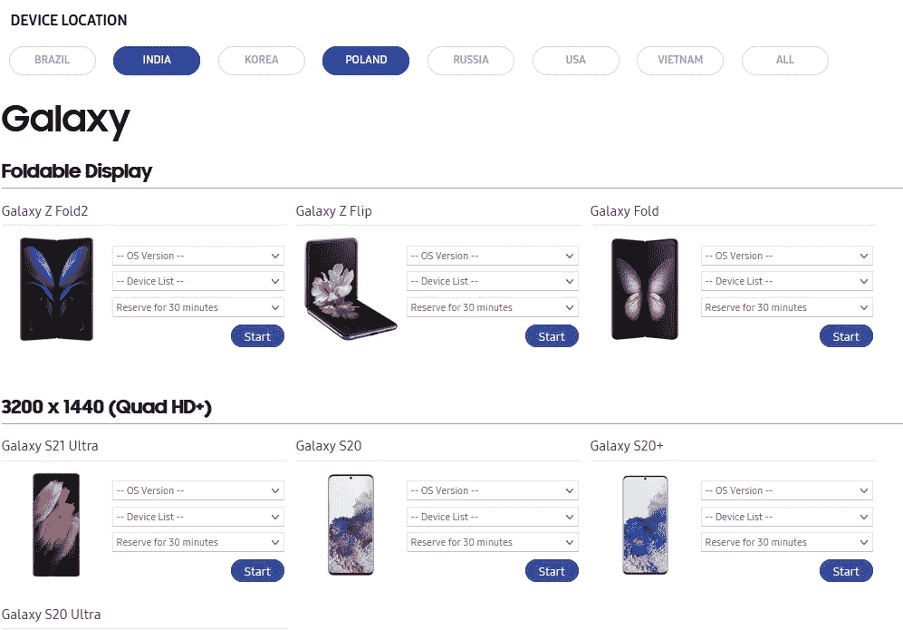

# 2021 年值得考虑的最佳移动网络开发工具

> 原文：<https://medium.com/geekculture/best-mobile-web-development-tools-2d1a511033c3?source=collection_archive---------15----------------------->

## 在移动设备上调试 web 应用程序的 4 个工具

Photo by [William Hook](https://unsplash.com/@williamtm?utm_source=unsplash&utm_medium=referral&utm_content=creditCopyText) on [Unsplash](https://unsplash.com/s/photos/mobile-device?utm_source=unsplash&utm_medium=referral&utm_content=creditCopyText)

如果您选择开发 web 应用程序，您可能会困惑地发现您的应用程序——在桌面上运行很好——在同一浏览器的移动版本上出现不同的外观和行为！

这有点出乎意料，因为移动浏览器实现了与桌面浏览器相同的 W3C 规范。不幸的是，[移动浏览器有不同的规范实现。](https://caniuse.com/?compare=safari+15,ios_saf+14.5-14.7&compareCats=all#results)

因此，在实际的移动设备上调试 web 应用程序是明智的。

# 移动网络应用的开发工具

## 1. [Safari 浏览器(macOS)](https://developer.apple.com/safari/tools/)

iOS 设备的 Web 检查器和调试器。

[https://www.idownloadblog.com/2019/06/21/how-to-use-safari-web-inspector-ios-mac/](https://www.idownloadblog.com/2019/06/21/how-to-use-safari-web-inspector-ios-mac/)

**优点:**

*   调试 web 应用程序的强大工具。
*   您可以检查元素、编辑 CSS、添加断点、查看本地存储、监控网络等等。

**缺点:**

*   需要通过 USB 电缆将您的移动设备连接到 Mac 复杂的设置。
*   iOS 设备专属；仅在 macOS 上运行。

## 2. [Chrome DevTools (Windows、macOS 和 Linux)](https://blog.campvanilla.com/debug-website-on-mobile-device-5c27c8809d39)

Android 设备的网页检查器和调试器。

[https://developer.chrome.com/docs/devtools/](https://developer.chrome.com/docs/devtools/)

**优点:**

*   调试 web 应用程序的简单工具。
*   完整的 DevTools 功能，很像 Safari Web Inspector。

**缺点:**

*   需要通过 USB 电缆将您的移动设备连接到桌面设备，并且可能包括驱动程序安装。
*   安卓设备专属。

## 3. [Scepter(任何带有浏览器的设备)](https://github.com/barhatsor/scepter)

开源移动 web inspector 在移动设备上作为 web 应用程序运行，并使用触摸界面检查元素。

[https://github.com/barhatsor/scepter](https://github.com/barhatsor/scepter)

**优点:**

*   跨平台。不需要安装；简单易用。
*   这是一个为移动设备开发不同类型的 web 开发工具的新尝试，无需物理连接到桌面设备。

缺点:

*   到目前为止，该工具仅限于检查元件和控制台。不支持 JavaScript 调试，CSS 属性，断点等。

## 4.[远程设备群(Windows、macOS 和 Linux)](https://developer.samsung.com/remotetestlab/galaxy/rtlDeviceList.action#502)

远程设备上的一个时间段，客户端应用程序安装在开发人员的桌面上(例如[三星](https://developer.samsung.com/remotetestlab/galaxy/rtlDeviceList.action#502)、[浏览器堆栈](https://www.browserstack.com/))。

[https://developer.samsung.com/remotetestlab/galaxy/rtlDeviceList.action#502](https://developer.samsung.com/remotetestlab/galaxy/rtlDeviceList.action#502)

**优点:**

*   没有设备型号时很有用。

**缺点:**

*   非常慢。客户端下载需要时间。
*   调试很复杂。

# 结论

移动设备上的 web 开发工具还有很多需要改进的地方。

在我看来，随着越来越多的 JS 框架采用移动优先的设计，应该会有更多的工具在移动设备上调试代码。

# 参考

*   [手机上的 Web 调试](https://webplatform.github.io/docs/concepts/mobile_web/mobile_debugging/)
*   [浏览器规格。支持比较](https://caniuse.com/?compare=safari+15,ios_saf+14.5-14.7&compareCats=all#results)
*   [Android 设备上的调试站点](https://blog.campvanilla.com/debug-website-on-mobile-device-5c27c8809d39)
*   [权杖](https://github.com/barhatsor/scepter)
*   [三星远程测试实验室](https://developer.samsung.com/remotetestlab/galaxy/rtlDeviceList.action#502)