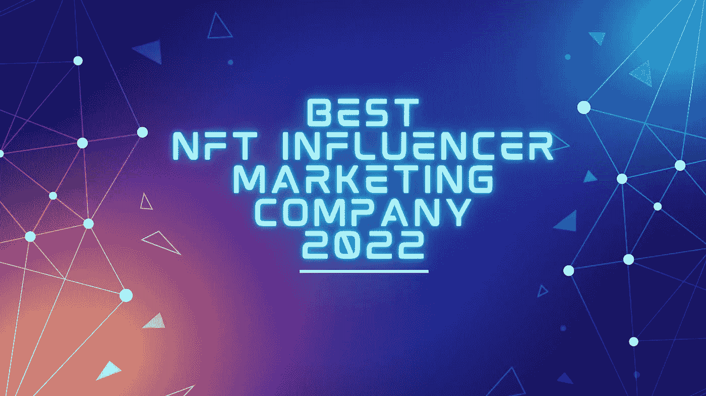
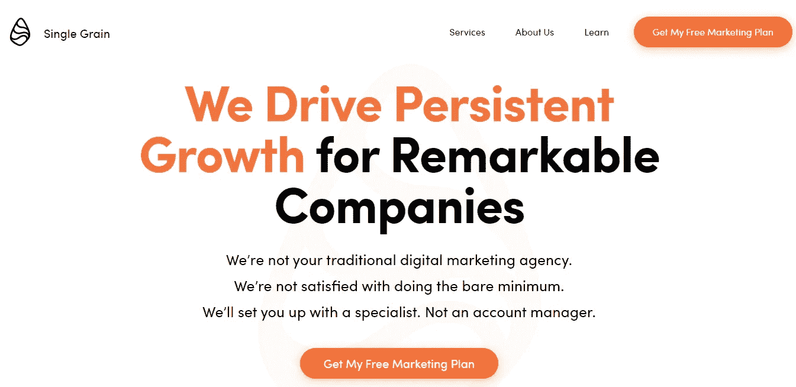
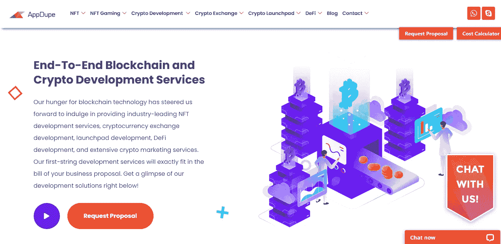
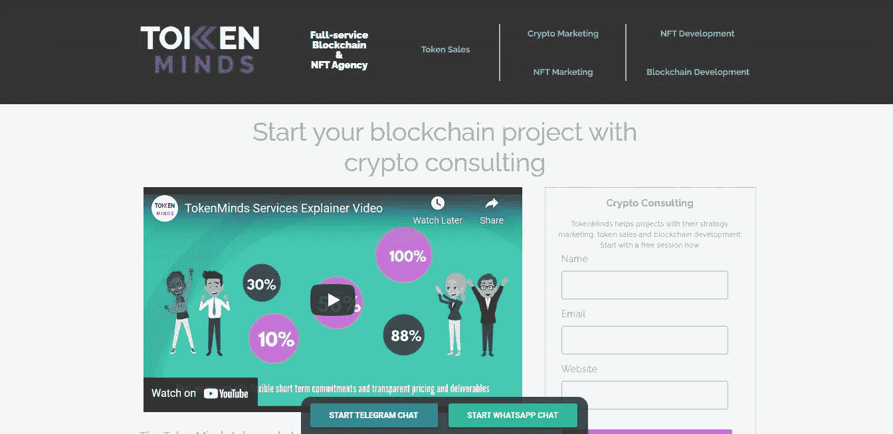
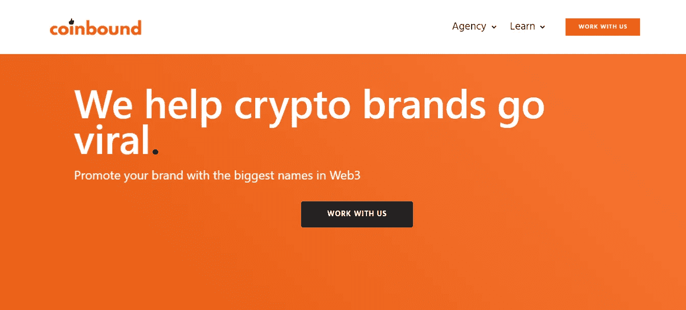

# 2022 年最佳 NFT 影响力营销公司

> 原文：<https://medium.com/geekculture/best-nft-influencer-marketing-company-2022-921126f8c59e?source=collection_archive---------18----------------------->

N **FTs！**自从他们进入数字领域以来，他们的增长是无止境的。它们已经成为每个人生活中的一个普遍因素。如今，这就像如果你拥有一辆 NFT，你就可以拥有一个充满可能性的数字世界。这里的决定因素是什么？自从数字时代开始以来，有人说 NFT 的商业正在走向一个没有人预料到的水平。几乎所有的东西都被转化成了 NFT 的作品，不再出售。如果你打算获得 NFT，那么你必须有一个数字营销人员！

为了什么？拥有一辆 NFT 是一个明确的要求吗？答案很简单，如果你拥有一辆 NFT，并想让它到达那些渴望购买的人手中，你肯定需要一个营销商来把你的非功能性卡车推向最高水平，并把它们传播出去。

然而，要在短时间内实现，你需要一个 NFT 影响者营销机构，它可以更好地接触到广泛的影响者。要了解更多关于 **NFT 影响者营销策略**的信息，看看 NFT 影响者营销指南。

> 此外，NFT 影响者营销机构数量众多，选择正确的一个总是具有挑战性。由于有强大的公司统治着影响者营销，**我们写了一篇关于 2022 年前 5 名和最佳影响者营销公司的文章。试一试，为你的事业选择一个让你成为企业家的人。**

## **参与 NFT 影响者营销的前 5 家公司**

## **# 1**T12**区块链 App 工厂**

NFT 营销的先驱，为更好的接触制定世界级的策略。区块链应用工厂有一个专家团队来处理范围，可以在更快的阶段将您的收藏推向目标受众。

**关键营销服务**

➤影响者营销

➤社交媒体营销

➤社区营销

➤视频创作/营销

➤内容营销

➤联盟营销

➤媒体公关

➤ SEO 战术

**他们专攻:**

✅执行吸引优质观众的策略是他们的出路。

来自区块链应用工厂的✅质量领导帮助品牌达到顶峰，这是任何人都没有想到的，当他们第一次做到这一点时，每个人都惊叹不已。

✅他们的服务也帮助你创造一个品牌形象，确保巨大的成功。

> **定价** : 他们根据您的业务需求，以合理的价格提供优质的服务。

## **#2** [**单粒**](https://www.singlegrain.com/)

一个有效的营销机构，为您所有的 NFT 项目提供专家级的推广。

出席 Single Grain 的这些专家有助于开展大规模投资回报活动。

有了广泛的影响者，他们已经准备好创造营销历史。

**关键服务**

➤需求生成

➤ SEO

➤付费广告

➤·克洛伊

➤内容营销

➤社交媒体营销

➤社区建设(Discord，Twitter)

➤影响者营销

➤ Defi 营销公司

➤加密公关

**他们专攻:**

✅:他们有一个世界级的营销人员，通过开展营销活动来获得最大的投资回报。

✅:他们会把你带到一个目的地，在那里你可以获得足够的流量，让你的梦想成真。

✅单一谷物的搜索引擎优化专家帮助您建立一个以结果为导向的有机搜索活动，以获得更多的线索，并提高品牌知名度。

✅他们也有经验丰富的内容作家，他们可以在博客、时事通讯、公关等方面讲述你的品牌故事。

> 定价:他们根据您的业务需求设计定制方案。

## **# 3**[**app dupe**](https://bit.ly/3OrfKcf)

**Appdupe**

一个世界级的营销公司，为提高你的品牌带来明智的想法，并在短时间内销售你的 NFTs。

他们有一个创新的团队，可以推动您的公司取得更大的成果。

**关键营销服务**

➤电报营销

➤影响者营销

➤不和谐营销

➤社交媒体广告

➤社区营销

➤电子邮件营销

➤视频营销

➤公关外联

**他们专攻:**

✅ Appdupe 是专家，在建立一个社区，并推动人们朝着你的目标前进。

✅:他们有专家可以在 NFT 平台上获得你的数字化资产。

✅ Appdupe 还利用一切从视频营销，影响者营销，社交媒体等，以促进您的增长。

✅将正确的目标与正确的影响者联系在一起始终是他们的目标。

> **定价** : Appdupe 的定制定价方案让你惊叹不已，因为它们针对不同类型的业务需求提供了多种定价选项。

## **#4** [**令牌心术**](https://tokenminds.co/)

**Token Minds**

一家有效的数字营销机构，在世界级 NFT 影响者的帮助下，在产生潜在线索方面胜过其他公司。

他们是 NFT 影响者营销在正确的时间获得追随者的正确选择。

**关键服务:**

➤影响者营销

➤ NFT 加密社区大楼

➤ NFT 社交媒体集团营销

➤公关营销

➤ IDO 营销

➤赏金营销公司

➤加密广告营销

**令牌心灵的特长:**

✅ Token minds，顾名思义，了解您的愿景，然后制定最佳策略来发展您的社区。

✅:他们有专门的经理可以全天候管理社交媒体。

✅:他们已经增加了有影响力的人来为你的资产增加吸引力。

✅:他们有每周的目标要完成，而且他们会准时给你发报告，让你知道你的进度。

> **定价**:他们的目标是根据你的需求提供定制定价方案的优质服务。

## **# 5**

**Coinbound**

就影响者营销而言，最大的是 Coinbound 营销公司。他们在短时间内提供高质量的销售线索。

**关键服务:**

➤ SEO 营销

➤ NFT 营销

➤ Defi 营销公司

➤推特管理

➤加密公关

➤不和谐社区建设

➤博客管理

**他们专攻:**

✅采用内容第一的策略，在购买过程的每个阶段为顾客提供价值。

✅:根据他们处理的网络，他们有广泛的影响者，如 Twitter，YouTube，Titok，Instagram 等。

✅他们有维护不和谐社区的专家。

✅他们有一群熟练的公关专业人员，他们的工作是确保在世界顶级加密出版物中的自然品牌覆盖率。

> **定价**:他们根据您的业务需求定制定价方案。

## **结论**

NFT 影响者营销机构已经遍布各地，可以在你需要的时候找到。开发您的项目，并让他们参与进来，以获得更广泛的影响。选择任何一家专门从事这些业务的顶级营销机构。