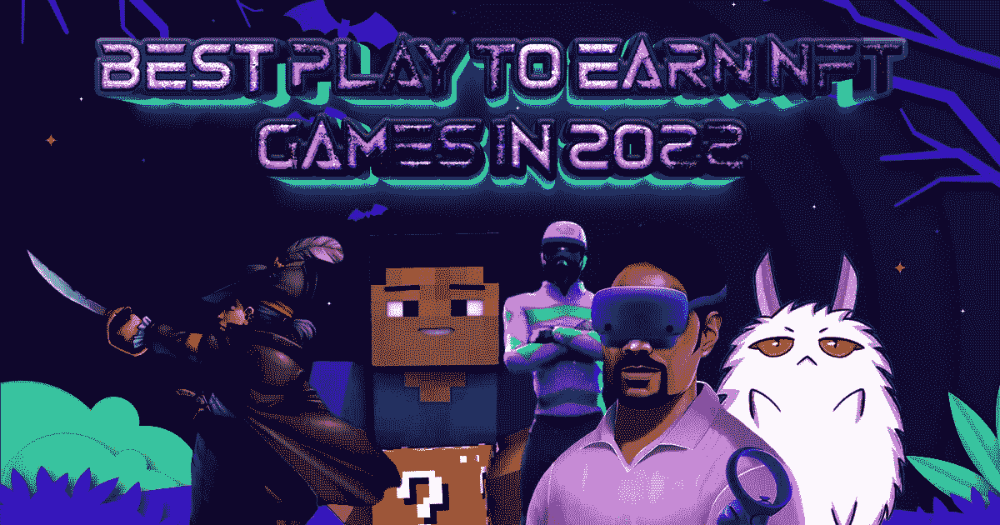

# 赢得 2022 年 NFT 奥运会的最佳比赛

> 原文：<https://medium.com/geekculture/best-play-to-earn-nft-games-in-2022-37a48fd472cc?source=collection_archive---------11----------------------->

## **板球和板球运动的演变**

**Best Play To Earn NFT Games In 2022**

你第一次尝试玩游戏是什么时候？你胜利了吗？你的小组胜利了吗？难道这些年来我们玩的所有游戏没有给我们带来很多回忆吗？许多游戏玩家认为游戏超越了屏幕和设备。游戏玩家既庆祝胜利，也庆祝失败。更具体地说，游戏玩家之间有一种神秘的友情。通过研究和定期玩游戏，玩家积极地为游戏的推广做出了贡献。有些人花很多时间玩一个游戏。有些人喜欢同时玩很多游戏。很少有玩家会渴望更迷人、更吸引人的体验。一些游戏玩家选择带有特定主题的游戏。体育专用主题、奇幻专用主题等。让我们来看看这个博客中的一些 2022 年顶级游戏。

**博彩业的一场变革**

尽管游戏的整体风格和模式在变化，但有一个方面多年来没有改变。它是游戏玩家的支持和精神。至关重要的是，开发商要确保为玩家提供一个健康的游戏氛围，因为这个行业非常依赖社区。鉴于玩家迄今为止一直使用传统模式，标准游戏模式现在可能看起来更加熟悉。然而，对于玩家来说，开放的思维、灵活的适应能力和尝试各种游戏类型总是更好的。

> “如果你像我一样为了赢而比赛，比赛永远不会结束。”~斯坦·米基塔

**NFTs 首次进入游戏行业**

我们使用不可替换的令牌，通常称为 NFT，来表示特定资产的所有权。NFT 可以用任何东西来创作，包括数码艺术品、音频和视频样本。那么，这些 NFT 给游戏带来了什么危害呢？

由于将 NFTs 引入游戏产业(P2E)，一种被称为“玩赚游戏”的新型游戏已经出现。在 NFT 游戏中，游戏中的物品，奖金，甚至游戏的设置都可以通过令牌化转换成 NFT。在传统的游戏设置中，玩家在游戏期间购买的所有物品在游戏结束后都将变得无用。

然而，随着 NFTs 的引入，这个缺陷被完全弥补了。

NFT 奥运会的资产是象征性的，所以每个玩家实际上都拥有自己的资产。此外，他或她还可以在每次再次出售资产时获得特许权使用费。为了在游戏中升级，玩家甚至可以将资产出租给其他玩家。游戏玩家可以通过玩视频游戏以这种方式获得被动收入。

考察一些 2022 年值得购买的顶级 P2E 游戏会有所帮助。

✅ **元板球联赛**

世界上第一个“玩到赚”的元宇宙 NFT 板球比赛被称为 [**元板球联盟**](https://www.jump.trade/?fsz=Karthik) (MCL)。要参与游戏，用户需要拥有板球 NFT。Jump.trade NFT 市场是玩家可以购买 NFT 的地方。许多游戏玩家称赞该平台迷人的美学和引人注目的游戏性。MCL 比赛是板球爱好者和 NFT 爱好者同时比赛并赢得激动人心的奖品的绝佳机会。

✅ **帛**

鉴于它模拟实际的赛马，这个项目被认为是最有趣的 NFT 游戏的想法之一。游戏中相当于玩家选择的马在现实生活中赢得战斗将获得奖励。

✅ **幸运块**

这个玩家对战总共有 8 支队伍。玩家游戏。通过粉碎各种颜色的幸运方块，玩家可以获得各种武器和盔甲，用于与游戏中的敌人战斗。

✅ **轴协无穷大**

最知名的 Web3 游戏是 Axie Infinity。2018 年，游戏发布。基于以太坊的游戏用户必须收集可爱的微型怪物，并在战斗中使用它们。这些轴是游戏的 NFT。它们可以被生产出来赚钱。

✅ **盗版 x 盗版**

关于游戏的主题，游戏的名字是不言自明的。游戏玩法相当基础。简单地牵引其他玩家，组装飞船，并与其他玩家进行战斗是所有需要的。游戏中的货币叫做 PXP，你可以通过与其他玩家战斗来获得。

✅ **幸运积木**

这个玩家对战总共有 8 支队伍。玩家游戏。通过粉碎各种颜色的幸运方块，玩家可以获得各种武器和盔甲，用于与游戏中的敌人战斗。

**最终想法**

游戏玩家在探索各种游戏模式方面已经走了很长的路。“玩到赚”的 NFT 游戏绝对值得一试，尽管偏离游戏规范可能会有点令人生畏。最热门的 [**即玩即赚 NFT 游戏**](https://www.jump.trade/?fsz=Karthik) 应该马上开始。