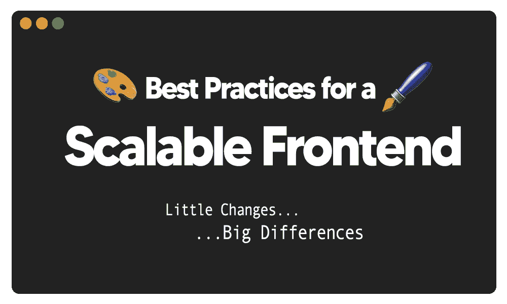

# 可扩展前端的最佳实践

> 原文：<https://medium.com/geekculture/best-practices-for-a-scalable-frontend-64c08ebec941?source=collection_archive---------10----------------------->

嘿伙计们，这是一段时间，但我回来了一个新的文章！一直忙于应付学校、工作和生意。

但最终在工作中推出了我们的新项目，所以我有一些时间，所以坐下来写一篇新文章。

此外，我目前正在磨 Leetcode ( [*盲 75*](https://leetcode.com/discuss/general-discussion/460599/blind-75-leetcode-questions) )，和**不是有最好的时间，但肯定是在正确的轨道上！**