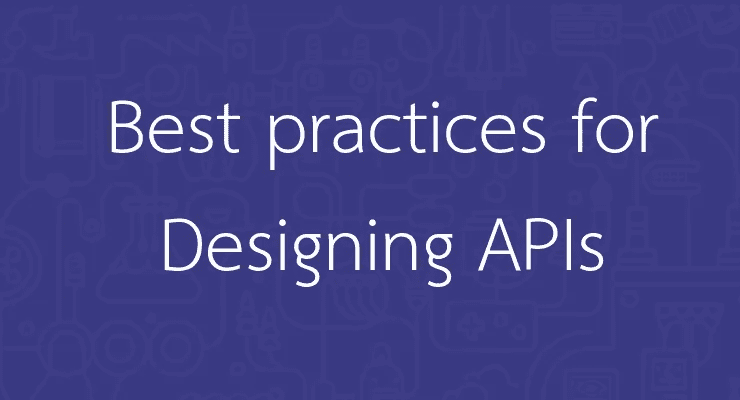

# 设计 REST APIs 的最佳实践

> 原文：<https://medium.com/geekculture/best-practices-for-designing-rest-apis-e52808c7f8e1?source=collection_archive---------3----------------------->

Best Practices For Designing REST APIs

在本文中，我们将探讨如何设计易于理解的 REST APIs，以及了解用例的重要性。

# 什么是 API 设计？

API 设计是指开发应用程序编程接口(API)的过程，该接口公开数据和应用程序功能以供开发人员和用户使用。

# 了解用例的重要性:

**当你了解你的软件将如何被使用时，你就能更好地设计它。**API 设计中最大的错误是根据你的系统如何工作来做决定，而不是你的消费者需要支持什么。为了围绕用例进行设计，你需要与消费者交谈，或者至少包括那些更了解他们的人。

**软件很少完全由工程师构建。整个组织中都有利益相关者。尽管许多工程师可能非常注重产品，但他们并不总能看到全局。如果你的组织有一个产品组，那通常是最能听到客户声音的地方。在设计 API 时，让任何了解 API 使用方式的人参与讨论。当你让其他人参与到 API 设计中时，你会做得更好。**

# API 设计最佳实践:

有了对用例的理解，就可以开始 API 设计了。每个项目都是不同的，因此最佳实践可能并不总是适合您的情况。

一般来说，有效的 API 设计具有以下特征:

*   **易于阅读和使用**
*   **难以误用**
*   **完整简洁**

下面是您在准备 REST API 时应该考虑的 8 个最佳实践。

# 1.提供 API 文档:

文档很重要。总是为 API 提供文档。

# 2.保持基本 URL 简单:

基本 URL 应该由复数名词组成，应该避免使用动词。

# 3.接受并回复 JSON:

JSON 是传输数据的标准。REST APIs 应该接受 JSON 作为请求负载，并向 JSON 发送响应。

# 4.简化关联:

资源对象通常具有某种功能层次结构，或者彼此相关。例如:`GET api/users/1/assets`该 URL 将返回该特定建筑的所有资产，您可以使用`POST api/users/1/assets.`为该建筑创建资产

# 4.查询字符串下的复杂性:

当您预先知道您将需要关于相关资源的额外信息，并且您的目标是减少 API 对性能的请求时，查询字符串标志可用于资源扩展。在这种情况下，您可以选择指定在查询字符串中展开哪些关系。`api/users?expand=assets`

# 5.HTTP 状态代码和消息的错误处理:

没有人喜欢看到他们对你的 API 做出的响应中的错误。但是如果他们这样做了，最好给他们提供足够的信息，让他们知道发生了什么以及可能的原因。因此，在 API 开发中，正确的错误处理应该被视为最佳实践之一，因为越早发现问题，修复它就越快、越便宜、越容易。

标准的 HTTP 错误代码处理是必须的。有 71 种不同的错误代码，为什么不使用它们呢？

例如{“状态”:400，代码:21，消息:“未指定名称字段”}

# 5.版本控制:

软件应用程序永远不会结束，它们在不断地进化，无论何时你的 API 发生突破性的变化，你都不可避免地需要引入一个新的版本。从一开始就对 REST API 进行版本控制是一个很好的方法。版本化通常用`/v1/`、`/v2/`等完成。添加在 API 路径的开头。

# 6.camelCase 中的属性名称:

如果您使用 JSON，遵循 javascript 的命名约定是有意义的，尤其是如果消费者应用程序可能也是用 JavaScript 编写的。snake_case 很容易读懂，但是要尽量避免。

# 7.缓存数据以提高性能:

缓存的好处是用户可以更快地获取数据。我们可以添加缓存来从本地内存缓存返回数据，而不是每次我们想要检索用户请求的一些数据时都查询数据库来获取数据。

# 8.始终使用 HTTPS/SSL/TLS 并保持良好的安全实践:

这里没有例外。HTTPS 很重要。默认情况下，所有通信都应该是安全的，并且总是使用 SSL/TLS 来加密与 API 的通信。

感谢阅读。如果你发现这篇文章很有用，别忘了**拍拍**和**与你的朋友和同事分享。:)如果你有任何问题，请随时联系我。
**与我接通👉**[**LinkedIn**](https://linkedin.com/in/hiteshmishra708)**，**[**Github**](https://github.com/hiteshmishra708)**:)****