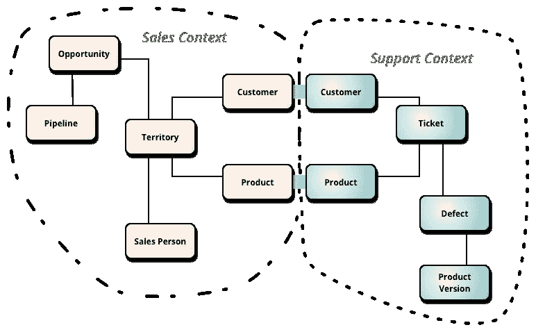
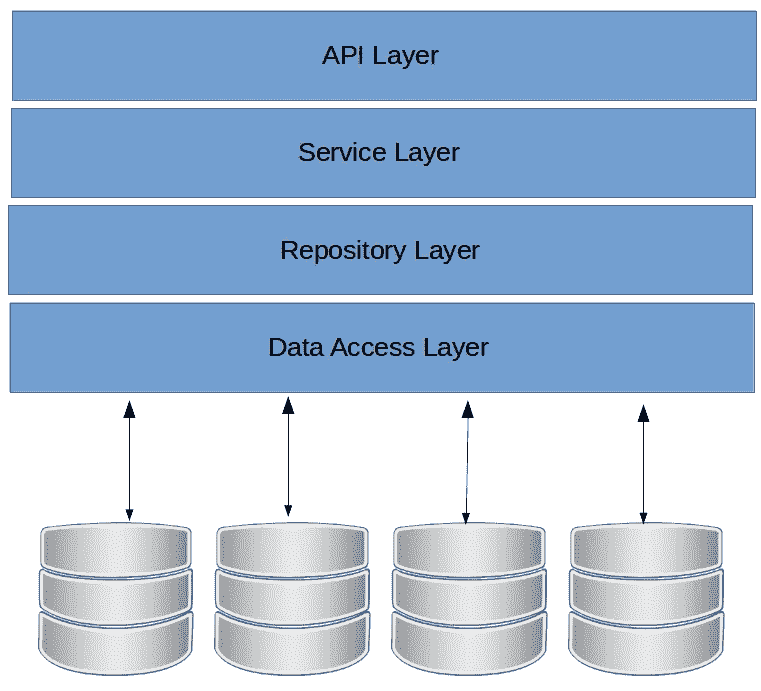
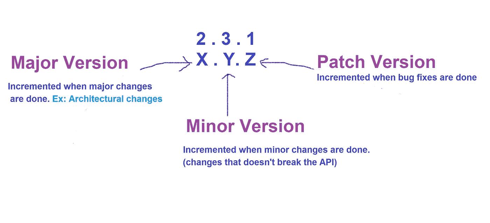
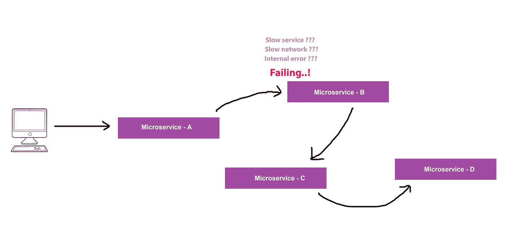
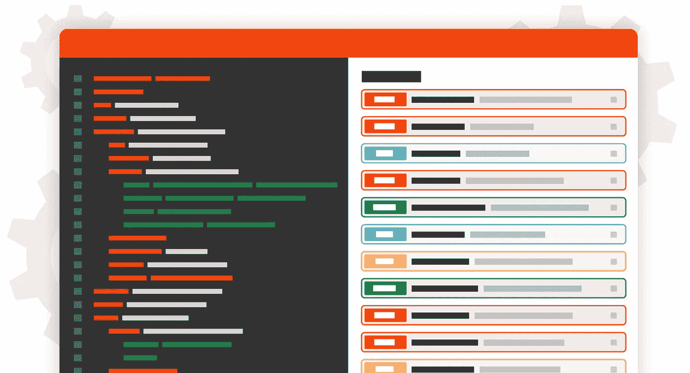

# 微服务的最佳实践

> 原文：<https://medium.com/geekculture/best-practices-for-microservices-191d17ebdb43?source=collection_archive---------3----------------------->

Source:[https://ebookslibrarydownloads.blogspot.com/](https://ebookslibrarydownloads.blogspot.com/)

如果你是微服务的新手，我建议你通过我的[以前的文章](https://hasithas.medium.com/web-application-to-microservices-do-we-use-it-or-not-d0ca2104ce4)来了解一些关于微服务的必须知道的概念。

因此，如果您擅长微服务，请准备好了解微服务的常见错误和最佳实践。

1.  设计。
2.  硬编码值。
3.  伐木。
4.  版本控制。
5.  授权和认证机制。
6.  依赖性。
7.  制定可执行的合同。
8.  容错。
9.  文档。

# 设计

Source: [https://martinfowler.com/](https://martinfowler.com/)

🌟设计应该是**领域驱动设计(DDD)** 。

🌟想象一个内置微服务架构的电子商务应用。这个电子商务应用程序有几个服务，如客户服务、运输服务、订单处理服务。

🌟客户可能同时出现在客户服务和运输服务中，但是是两个不同的方面。在客户服务中，有客户注册、档案管理(客户创建部分)。

🌟但是在装运模块中，可以用不同的方面来表示客户。但是运输服务的主要范围应该是向客户运送产品。

🌟所以基本上，当你设计一个系统或者考虑迁移到微服务时，确保你有一个全新的领域驱动设计。

🌟让我来解释另一个错误，一些人非常想使用微服务，只是因为它是流行的和受欢迎的。

🌟假设电子商务应用程序具有以下服务，

*   客服。
*   运输服务。
*   订单处理服务。
*   卖家服务。
*   库存服务。

🌟有些人把这些服务放在一起，只创建一两个服务，然后说“现在我们在微服务上”。但这是错误的做法。

🌟即使你可以重写应用程序，这也取决于公司的预算。现在你可能不需要从头开始写所有的东西，但是你需要从头开始重新思考。

🌟如果你的服务有一些与你的服务无关的东西，那就应该去掉。在这种情况下，我们不需要重新设计和重写一切，但我们可以隔离服务，使我们的服务尽可能独立

# 硬编码值

🌟考虑应用程序的配置参数。

🌟因此，还记得在[之前的文章](https://hasithas.medium.com/web-application-to-microservices-do-we-use-it-or-not-d0ca2104ce4)中，我们谈到了当我们使用微服务架构(这是微服务架构的一个缺点)时，在服务之间共享 monolith 应用程序的复杂性(或元数据)。

🌟假设客户已经将所有商品添加到购物车中，并且已经完成付款。现在，要做的就是交货。所以，我们的客服打电话给货运服务。

🌟客户服务应该有运输服务的地址(主机名/ URL/ IP 地址)来调用该服务。在这种情况下，大多数开发人员所做的是将另一个服务的地址硬编码到另一个服务中(客户服务中运输服务的硬编码地址)。

🌟当它被硬编码时，客户服务将知道在哪里找到运输服务。但是，如果网络团队决定更改主机名、网络地址或类似的东西，问题就出现了。由于地址已经更改，客户服务将无法再与运输服务进行通信。所以现在您必须更改地址并发送另一个部署。

🌟这是不对的，也不是最佳做法。

🌟这种场景的理想解决方案是使用**网络发现机制**。(例如:你可以使用一个**服务注册中心**或者一个**代理**)。因此，您需要使用某种网络发现工具来发现其他服务，并确保不要硬编码外部服务地址。

# 记录

🌟拥有太多的日志而没有任何日志，会让开发人员的日子不好过。

🌟为了更好地理解这一点，让我们考虑一个电子商务 web 应用程序(不是微服务)。假设有一个验证购买者的服务。假设这个服务在内部调用了其他几个方法。

🌟当您尝试验证客户时，您的请求会发送到服务层。

Source: [https://garywoodfine.com/](https://garywoodfine.com/)

**场景 1**

当您尝试验证客户时，请求会发送到服务层，然后会发生一些异常。因此，它记录在服务层中。

**场景 2**

当您尝试验证客户时，请求到达服务层，然后到达存储库层，您调用 [hibernate](https://en.wikipedia.org/wiki/Hibernate_(framework)) 。因此，您会得到一个异常，并将其记录在存储库层。现在，您的存储库是从服务层调用的。现在，服务层发现了这一异常，并将其记录在服务层中。所以同一个错误被记录了两次。

🌟这很糟糕，因为现在当你试图调试或访问日志时，你会看到相同的错误被记录了两次。

🌟因此，最佳实践是稍后让快速日志失败。因此，如果出现故障，立即返回，但不要记录日志。(日志记录是最后一层的责任)

🌟因此，简单地解释一下，假设你的应用程序有三层 A、B 和 c。

🌟第一层呼叫，第二层 B and B 呼叫第三层。在第三层发生了一些异常。但是不要在那里记录(在 C 层)。不要登录到 b 层。但是要登录到最后一层。也就是 a 层。

🌟这直接不适用于微服务。因为从微服务的角度来看，你可能不会维护这样的东西。但是重点是，不要记录太多或者不要到处记录。记录你开始这个过程的地方。确保记录到堆栈跟踪(stack backtrace 或 stack traceback ),并确保在此过程中没有丢失任何信息，这样您就可以很好地理解错误。你必须清楚地知道错误真正发生在哪里。

🌟所以，在这次澄清中，我没有涉及任何关于微服务的内容。但是，当我们涉及微服务时，还有一件事我们应该讨论。

🌟假设服务 A 收到了一个请求。现在，该请求通过服务 A 的几个层并调用服务 B。然后，该请求通过服务 B 的几个层并调用服务 c。

🌟现在，如果发生错误，需要调试它，会发生什么呢？嗯，那可能是一场噩梦，因为你不知道那个请求去哪里，它做什么。你只能看到它失败了。但是你不知道它失败在哪里。

🌟在这种情况下，您可以尝试的最佳做法之一是拥有一个唯一的 id。让我给你解释一下它是如何工作的

🌟当请求到达初始服务时，您可以生成一个惟一的 id。有时，您的 web 服务器可以在请求到达服务层之前生成这个惟一的 id。这个唯一的 id 被称为**相关 id** 。

🌟以我们的电子商务应用程序为例。假设客户请求(从运输服务)无人机递送包裹。

🌟因此，在这个请求到达服务层(微服务层)之前，您可以使用 web 服务器(使用脚本、代理)或服务层在最开始的时候生成一个 id(例如:00001)。

🌟现在，当请求到达服务 A，第 1 层时，您可以使用消息进行信息级日志记录(例如:服务已启动)。当我们在每个日志条目中这样做时，您可以随时跟踪您的服务呼叫。

🌟伟大的..！现在，使用这种方法，如果在运输服务中发生异常，您可以转到日志，查看请求发起的位置、服务请求经过的位置以及异常发生的位置。

🌟但是，如果你有单独的日志文件，这将是困难的。因为您必须查看多个日志文件。如果您使用一个框架来记录日志，事情会简单得多。

例如:Splunk、Logstash

# 版本控制

Source: [https://apifriends.com/](https://apifriends.com/)

🌟你认为你应该如何版本化你的服务？当您进行服务的下一次部署时，版本号应该是多少。嗯，版本控制的最佳方法是使用 [**语义版本控制**](https://semver.org/) 。

🌟使用语义版本化(也称为 SemVer ),您可以以一种有意义的方式对您的服务进行版本化。

🌟根据语义版本化，一个版本号有 03 个部分，分别是**大版本、小版本**和**补丁。**

Semantic Versioning

1.  **主要版本变更**:当您做出不兼容的 API 变更时递增。使用该服务的消费者将受到影响。
2.  **次要版本变更:**当您以向后兼容的方式添加功能时。
3.  **补丁版本变化:**当你做向后兼容的 bug 修正时。

🌟有了这种版本控制，任何人都可以知道更新的服务版本与服务的现有版本的兼容性，只需查看版本号。

🌟既然您已经熟悉了良好的版本管理实践，那么让我们学习一下强制升级弹性机制。

## F **强制升级**

🌟我们有一个服务 A。这个服务 A 调用服务 b。现在你需要更新服务 b。在这个更新过程中，你做了一个重大的改变。由于这是一个重大的变化，现在服务 A 将与新版本不兼容。因此，您可以增加主版本号，并将此更新作为单独的服务进行部署。

🌟现在有两种服务。服务 B 1.0.0 和服务 B 2.0.0。但是流量还是去 1.0.0。

🌟所以，应该让消费者知道这个版本的变化。然后，您可以为消费者提供一个将他们的版本更新到版本 2.0.0 的时间表。当所有用户都迁移到版本 2.0.0 时，您可以关闭并停用版本 1.0.0

## **弹性机构**

🌟假设您有 5 个消费者，并且您正在运行服务 a 的 1.00 版的 10 个实例。当消费者迁移到 2.0.0 版时，您可以增加 2.0.0 版的实例，也可以减少 1.0.0 版的实例。使用这种方法，您可以管理您的服务，而不会破坏任何消费者。

# 授权和认证机制

Source: [https://afteracademy.com/](https://afteracademy.com/)

🌟如果每个服务都试图验证用户，这可能会增加往返行程的延迟

例如:假设当一个买家试图将产品运送给客户时，运送服务调用其他 3 个不同的服务。您使用 OAuth 令牌来验证消费者(假设验证令牌需要 20 毫秒)。当请求到来时，它会经过 3 个不同的服务，如果所有 3 个服务都尝试单独验证此令牌，则会将往返时间增加 60 毫秒。

🌟所以，你可以做的是，你可以有一个单独的身份验证服务，无论到达服务层的请求是什么，你都可以将其定向到身份服务，如果成功，你可以将其定向到路径的其余部分。这就是强制转发避免延迟的方法。

🌟此外，通过强制转发，您可以根据需要随时更改验证过程。

# 属国

🌟服务之间的依赖是应该避免的。

🌟假设您有 3 个不同的服务，分别名为 A、B 和 C

🌟你想部署 A，但是如果你不能一起部署 B 和 C，那么它们不能被认为是独立的服务。服务必须是独立的。我们应该能够分别部署服务 A、B 或 C，而不用担心其他服务。

# 签订可执行的合同

🌟在通常的应用(非微服务)中，用户是消费者。因此，我们有 UX(用户体验/消费者体验机制)来确保用户对应用程序感到满意。和他们一样，服务也有用户。那些是消费者。可能是前端应用程序。

🌟所以，让他们开心是你的责任。因此，在您的 A、B 和 C 服务结构中，当您部署 B 服务时，如果一些消费者出现问题，您就没有做好工作。那么如何避免这种情况。

🌟想想服务和消费者之间的契约(例如:API 规范)。你怎么能确定这个合同没有被破坏？

🌟你可以把这个合同转换成可执行的合同。但是你是怎么做到的呢？

🌟好吧，你可以准备一些测试用例，测试脚本，或者一个执行请求(由 CI/CD 工具执行)，无论你何时构建一个特定的服务(从我们的服务 A、B 或 C 中的一个构建)。所以，如果这些测试没有失败，你就没有破坏你的消费者。

# 容错

🌟现在，您已经有了多种微服务架构的服务，您也有了多种失败的可能性。所以，你需要正确地管理你的服务。

Service B failing

🌟假设您的服务 A 调用服务 B，服务 B 调用服务 c。如果服务 B 超时(服务 B 正在慢慢失败/服务 B 需要很长时间来响应),那么您需要确保您很快失败。因为当您等待服务响应时，您可能会在后面创建一个队列。

# 证明文件

Source: [https://www.moesif.com/](https://www.moesif.com/)

🌟嗯，我们大多数开发人员可能不喜欢写文档，但不幸的是，没有简单的方法摆脱这种情况。无论如何，像我们这样不喜欢写文档的懒惰的开发人员有一个选择，这个选择就是**。**

**🌟使用 Swagger，您不需要从头开始编写所有内容。因为 Swagger 也提供了用户界面，所以用户也可以浏览文档并尝试服务。**

**所以这篇文章到此为止。接下来，我们来谈谈一些你可以用在微服务上的设计模式。请在下面评论你的想法和观点。谢谢你。**

# **参考**