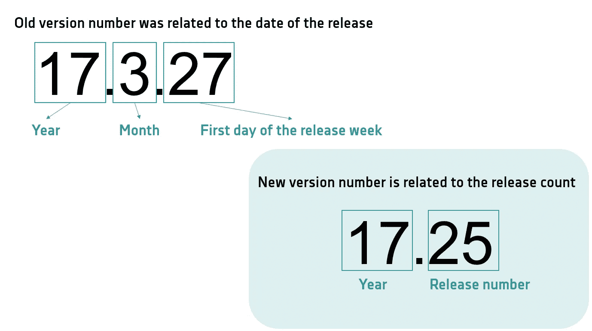
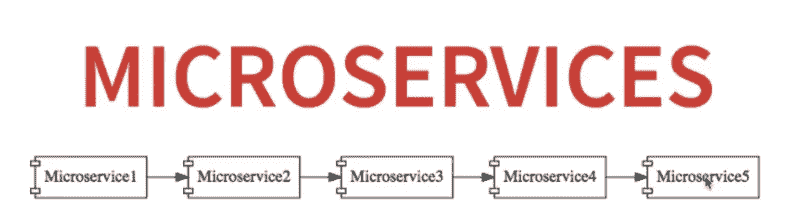

# 微服务的最佳实践(微服务-第 2 部分)

> 原文：<https://medium.com/geekculture/best-practices-for-microservices-microservices-part-2-43def18d73b6?source=collection_archive---------29----------------------->

在这篇博客中，我将谈论我们在进行基于微服务的实施时应该遵循的良好实践。当我们知道最佳实践时，您可以避免常见错误。

让我们一个一个来看…

# 1.设计应该是领域驱动的设计

微服务是一种架构设计模型，具有特定的受限上下文、配置和依赖关系。这些源于领域驱动设计和 DevOps 的架构原则。领域驱动设计是通过代码解决组织问题的思想。

业务目标对业务用户很重要，具有清晰的界面和功能。这样，微服务可以独立于其他微服务运行。此外，团队还可以独立工作，这实际上是微服务架构的要点。

许多开发者声称微服务让他们更有效率。这是由于在小团队中工作的能力。这允许他们开发不同的小部分，这些小部分随后将被合并为一个大的应用程序。

他们花更少的时间与其他开发人员协调，花更多的时间开发实际代码。最终，这为最终用户创造了更多的价值。

## 领域驱动设计中的重要术语

1.  领域逻辑
2.  领域模型
3.  子整环
4.  设计模式
5.  限界上下文
6.  无处不在的语言
7.  实体
8.  值对象和集合
9.  域名服务
10.  贮藏室ˌ仓库

如果你需要了解这些重要的术语，请点击下面的链接

 [## 领域驱动设计的概念解释- DZone 微服务

### 使用微服务意味着从松散耦合的服务中创建应用程序。该应用程序包括几个…

dzone.com](https://dzone.com/articles/the-concept-of-domain-driven-design-explained) 

# 2.不要使用硬编码的值

硬编码一个值意味着它已经被声明为不变的，不能被直接改变。当一个值被硬编码时，它在计算机程序的整个执行过程中保持不变。

如果我们看到 ***的例子*** :
假设有两个服务为 **X** 和 **Y** 。现在服务 X 正在调用服务 **Y** 。要打电话给 **Y** ，你应该有它的地址。所以大多数开发者硬编码了这个地址(可能是主机名、IP 地址、URL 等等)。)上的发球**一个**。—但这不是一个好的做法

如果您的网络团队决定更改主机名、URL 等。那么你将不得不面对问题。因为你需要发送其他部署。所以这不是一个好办法。为了远离这种情况，我们可以使用某种服务发现工具来发现第二个服务。

# 3.记录

在微服务架构中，这个日志记录过程存在一些挑战。因为有太多的服务&它们通过接口相互通信。因此，正常的记录程序将不适用。

例如，假设一个应用程序有网络问题。开发团队查看日志并找出原因。但是在日志文件夹中可能包含来自不同服务的日志，这将很难识别正确的日志。

## 3.1 微服务测井提示

1.  **服务之间的关联**—一旦你的所有日志都在一个地方，你会在调试时注意到一些东西:它们很吵。如果您在一个高流量的网站上工作，您的应用程序每小时会生成数百万个日志条目。太多了，看不透！即使所有的日志都在一个地方，追踪早期的 bug 仍然很困难。为了解决这个问题，我喜欢包含一个由客户机向服务器发出请求时生成的唯一标识符*。标识符在完成请求所需的每个服务之间传递。现在，如果您试图对一个错误进行故障诊断，您的第一步是识别与请求一起传递的惟一标识符。如果您的错误处理在错误日志中包含惟一 ID，那就更好了。当您使用集中式微服务日志记录方法时，这一技巧可以为您节省无数调试应用程序的时间。如果你从这些技巧中吸取了一样东西，那就是:把你的日志放在一个地方，让跟踪微服务之间的单个请求变得容易。*
2.  ***将所有内容放在一个地方** —将来自不同系统的所有日志放在一个地方，可以更简单、更快速地解决问题。*
3.  ***监控您的日志** —在您的微服务架构的每个级别都能看到您的日志是非常重要的。事后调试问题是不够的。相反，您需要在问题出现时就知道。好的微服务日志记录使用日志在事情失控之前告诉你。*
4.  ***不要在搜索中沉睡—** 高质量的微服务日志记录解决方案需要一种快速简单的方法来搜索这些日志。找不到的日志不会带来任何好处。*

# *4.版本控制*

*不管架构模式是微服务还是整体架构，有两种标准版本技术在软件社区很流行。我们将简要介绍它们是什么以及何时使用它们。*

## *4.1 语义版本化*

***什么事？** 语义版本化用三个非负整数的组合(主要。MINOR.PATCH)并且每个整数都暗示着某种意义。*

**

*   ***MAJOR:** 当前版本与新版本不兼容时，增加此数字。*
*   ***MINOR:** 当前版本兼容新版本，但内部业务逻辑发生变化时，增加此编号。*
*   ***补丁:**当以前的版本与新版本兼容，但新版本中修复了一个 bug 时，增加这个数字。*

***三个整数中任何一个的增量对消费者来说都自动意味着某种特定的含义。***

***什么时候用？***

*当你在一个有许多模块的项目中工作，并且每个模块都相互依赖于另一个模块时，那么语义版本控制肯定会是一个救星。*

## *4.2 .日历版本*

***是什么？***

*日历版本化是另一种类型的语义版本化，但它不是使用非负整数，而是主要由日历日期驱动，即年、月和日的组合。不是固定特定的日期格式，而是允许您选择下面列出的各种组合。*

**

***年份:***

*YYYY —全年*

*YY——短暂的一年*

*0Y —零填充年*

***月份:***

*毫米—月份*

*0M —零填充月份*

***日:***

*登陆日*

*0D —零填充日*

***我们可以选择上述年、月、日组合中的任何一种，用于特定于您的应用的版本控制。***

***什么时候用？当应用程序受时间限制时，这种版本控制非常有用。一些领先的操作系统将其支持周期与日历版本联系起来。对于主要版本，他们提供几年的支持，次要版本提供几个月的支持，他们的支持期直接从相应的版本开始。Ubuntu 就是一个例子。***

> ****对于使用微服务的企业业务应用，我会推荐语义版本化的方法。日历版本管理更适合支持和可用性周期由持续时间驱动而不是由使用情况驱动的产品。****

# *5.微服务中的授权和认证机制*

*在我们的系统中，每个系统都开始验证用户，这将导致延迟增加。但是，如果有一个单独的身份验证服务来验证每个服务，那就更好了，您可以直接将所有到达服务层的请求调用到它们的身份验证服务。一旦验证成功，我们就可以引导他们走剩下的路。*

# *6.依赖性管理*

*假设有三个不同的服务，分别是 X、Y 和 z。如果您需要部署 xan，而未能一起部署其他两个服务，那么这将导致一系列问题。因此，我们应该避免任何依赖性，应该独立部署。*

# *7.容错*

*微服务需要极其可靠。*

*当我们构建微服务架构时，有大量的小型微服务，它们都需要相互通信。*

*让我们考虑下面的例子:*

**

*假设微服务 5 在某个时间点停机。*

*所有其他微服务都直接或间接依赖于它，所以它们也都关闭了。*

*这个问题的解决方案是在微服务失败的情况下有一个后备。微服务的这个方面叫做**容错**。*

# *8.证明文件*

*当涉及到文档时，文档应该清楚地解释软件或服务是如何运行的。可以是文字，也可以是插图。对于开发人员来说，这份文档非常重要，因为要清楚地了解特定的服务。*

**

***Swagger** 是一个流行的开源工具，有助于记录任何规模的 API。支持我们设计、构建、记录&消费 REST APIs。*

# *参考资料:*

* [## 最佳架构设计的 10 项微服务最佳实践| Capital One

### 1.单一责任原则就像代码一样，一个类应该只有一个改变的理由…

www.capitalone.com](https://www.capitalone.com/tech/software-engineering/10-microservices-best-practices/)  [## 微服务架构的 10 个最佳实践- DZone 微服务

### 切换到微服务架构将解决您所有的软件架构问题。对吗？好吧，它不会…

dzone.com](https://dzone.com/articles/10-best-practices-for-microservice-architectures)  [## 2019 年要遵循的 12 项微服务最佳实践

### 曾经有一段时间，应用程序传统上是作为整体开发的，被打包成一束代码…

marutitech.com](https://marutitech.com/microservices-best-practices/)*