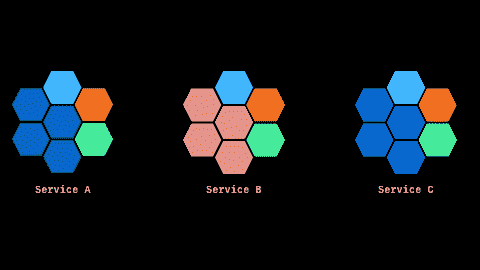
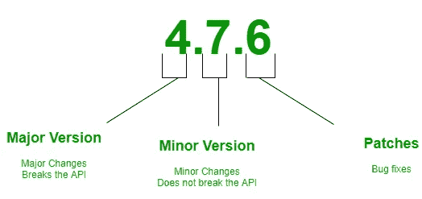
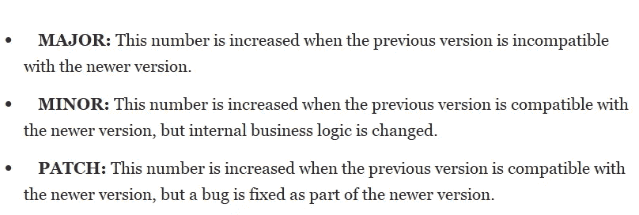
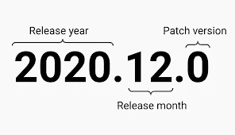
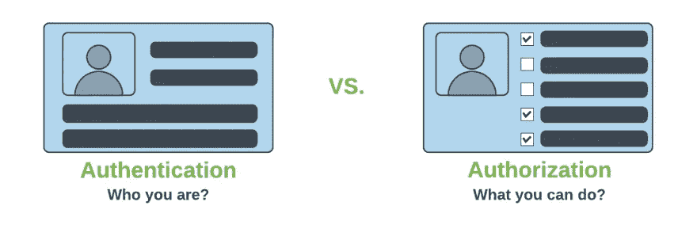
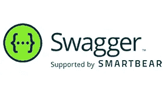

# 微服务的最佳实践📳(微服务—第 2 部分)

> 原文：<https://medium.com/geekculture/best-practices-for-microservices-microservices-part-2-a8646f3e1753?source=collection_archive---------29----------------------->

微服务:✨最佳实践

在本文中，我将讨论您在处理微服务时应该遵循的九个最佳实践。

# ①总是考虑使用领域驱动的设计。

✹:它应该有一个明确的范围。考虑下面的例子，

*举例:*

*假设有一个“租车”应用程序。有一个客户，它可以代表两种不同的服务，但来自两个不同的方面。将这些视为客户注册和支持服务。因此，同一个客户参与了两个模块，但涉及两个不同的方面。如果我们考虑支持服务，本模块的主要目的/领域是客户支持。*

因此，我们应该清楚地了解每个服务的边界，并且应该能够确保每个服务的功能不被其他服务所需要，而只被特定的服务所需要。

# ②不要使用硬编码值

✹硬编码一个值意味着它已经被声明为不变的，不能被直接改变。当一个值被硬编码时，它在计算机程序的整个执行过程中保持不变。

让我们通过下面的例子来理解这一点:

假设有两个服务，分别是🅰和🅱.现在🅰服务公司称🅱.服务公司要打电话到🅱，你应该有它的地址。所以大多数开发者硬编码了这个地址(可能是主机名、IP 地址、URL 等等)。)在服务🅰.上

但是这是**而不是**一个好的做法😑,

如果您的网络团队决定更改主机名、URL 等。那么你将不得不面对问题。因为你需要发送其他部署。所以这不是一个好办法。为了远离这种情况，我们可以使用某种服务发现工具来发现第二个服务。

✹:总之，你不应该硬编码主机名、URL 等，因为它们会动态变化，因此应该使用服务发现工具。

# ③测井

有太多的日志或者没有日志都是不好的🤢

**为什么🙄**

因为当您尝试通过日志访问/通过日志调试时，相同的错误会记录两次。所以会很辛苦。但是如果没有日志，应用程序将失去控制。此外，如果我们为每个服务进行日志记录，并且服务的数量开始增加，这可能是一个非常困难的问题。如果你需要调试或者识别一个问题，你将不得不仔细检查每个服务的日志来识别正确的日志，所以这将是一个非常困难的工作。

因此，这方面的一些良好做法是:

> ***使用相关 ID***

您可以为传入的请求分配一个关联 ID(唯一 ID ),这将有助于在每个服务中唯一地识别请求。

示例:

我想有三种服务，分别是🆇、🆈和🆉。我们用关联 ID 标记了每个调用。假设您在🆈服务中心发现了一个问题，那么您应该知道该问题/错误是由来自🆇服务中心的请求还是发送到🆉.服务中心的请求造成的因此，纠正这一错误的最便捷的途径是找到并了解服务(🆇和🆉)中与服务🆈.相关的所有可能的请求既然我们现在有了相关 ID，那么我们要做的就是在日志系统中查找特定的唯一 ID。我们将能够从服务中获得所有日志记录细节，这些服务是应用程序主请求的一部分。

📍最好添加上下文，因为如果我们有关于错误或问题的足够信息，这将非常有用。下面是一些可以添加的特定字段，

*   日期和时间
*   服务器的 IP 地址
*   客户端请求的 IP 地址
*   服务的名称
*   堆栈错误

# ④版本控制

下面是版本控制中两种流行的标准技术。

> ***语义版本化***

这通过使用三个非负整数在“**T5”大调中来表示每个版本。MINOR.PATCH** "格式(如下图所示)，这些整数中的每一个都表示确切的含义。

> ***日历版本***

日历版本化也具有与语义版本化相似的格式。日历版本化使用基于日历的格式，将发布日期反映到版本号中。(如下图所示)

示例:

假设有一个名为🅰的服务，🅱称这个服务为🅱.现在你必须更新服务🅱.因此，当您更新🅱服务请求会有所不同。如果您部署服务🅱的更新的新版本，服务🅰will 中断。

为了避免这种情况，您可以增加主要版本号，并将其作为单独的服务进行部署。但是，如果流量仍然采取了以前的版本，你可以告诉消费者，请他们更新到新版本的🅱.完成所有使用者的迁移后，您可以关闭以前的版本。为此，我们可以使用弹性机制。

# **⑤微服务中的授权和认证机制**

✹如果每个系统都开始验证用户，那么将会导致延迟增加。因此，为了避免这种情况，最好有一个单独的身份验证服务来验证服务，您可以将所有到达服务层的请求定向到它们的身份验证服务。如果验证成功，您可以将他们引向路径的其余部分。

例如:在一个“租车”系统中，当用户试图给客户分配一辆车时，假设它调用了三个不同的服务。假设您正在使用身份验证令牌来验证客户。如果验证身份验证令牌需要 20 毫秒，那么分别验证每个服务可能需要 60 毫秒。因此，为了避免这种情况，最好有一个独立于验证服务的身份验证服务。

✹:所以这是一个很好的实践，因为你可以在任何给定的时间根据你的算法/服务决定来改变验证或认证或授权过程。

# **⑥依赖性**

✹应该避免任何依赖，应该独立部署。

示例:假设有三种不同的服务🅰、🅱和🅾.如果您需要部署🅰，并且如果您未能一起部署其他两个服务，那么这将导致一系列问题。

所以**独立是必须的！**🤗

# **⑦签订可执行合同**

✹让我们通过下面的例子来理解这一点，

示例:假设有三种不同的服务🅰、🅱和🅾.在这种结构中，如果您部署服务🅱，某些消费者将会崩溃。为了避免这种情况，你可以和消费者签订合同。这份合同是可执行的。

这个契约可能包括测试用例、测试脚本等等。所以无论何时你做一个构建，那些测试都会自动执行。(如果所有的测试用例都通过了，那就意味着你没有破坏任何消费者。但是如果这些测试中的任何一个失败了，你可以修复它们。)

# **⑧容错**

✹什么是容错？

✹:由于微服务架构有多种服务，因此有可能出现故障。为此，我们需要容错。

示例:假设有三种不同的服务🅰、🅱和🅾.然后🅰打电话给🅱和🅱calls 🅾.如果服务 **🅱** 快没时间了，那就意味着，服务🅱正在慢慢失败。这意味着你会很快失败。所以，为此，我们需要容错。

✹我们可以通过使用断路器、超时、重试来实现容错..等等。

# **⑨文件**

✹文档更为重要，因为应该有文档让其他人清楚明白。

✹为此，我们可以使用 Swagger 以一种技术的方式来编写文档。

**Swagger** 可以定义为支持我们设计、构建、记录&消费 REST APIs 的开源工具集合。

# 参考

 [## 微服务架构教程

### 微服务架构是面向服务架构的一种特殊设计模式。这是一个开源的…

www.tutorialspoint.com](https://www.tutorialspoint.com/microservice_architecture/index.htm)  [## 最佳架构设计的 10 项微服务最佳实践| Capital One

### 1.单一责任原则就像代码一样，一个类应该只有一个改变的理由…

www.capitalone.com](https://www.capitalone.com/tech/software-engineering/10-microservices-best-practices/)  [## 领域驱动设计

### 在编程时，我经常发现将事物表示为一个复合物是很有用的。2D 坐标由一个 x 值组成…

martinfowler.com](https://martinfowler.com/tags/domain%20driven%20design.html)