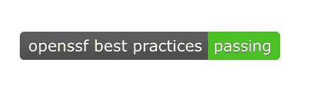
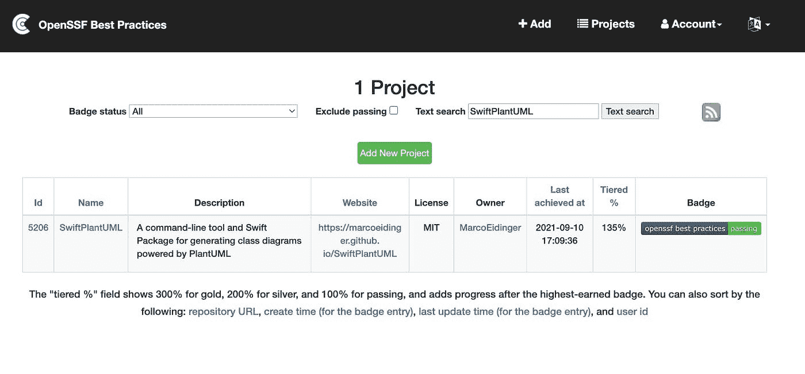
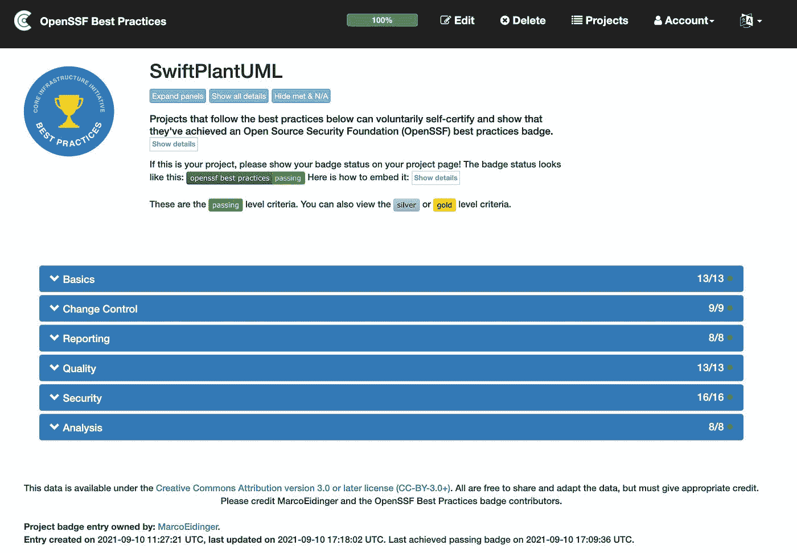

# 开源项目的最佳实践

> 原文：<https://medium.com/geekculture/best-practices-for-open-source-projects-d447e2b235fe?source=collection_archive---------10----------------------->

你从事开源项目吗？你想让你的消费者对你的项目的质量和管理有信心吗？您可以免费获得并展示 [OpenSSF 最佳实践徽章](https://bestpractices.coreinfrastructure.org/en)来实现这一点。

开源安全基金会(OpenSSF)最佳实践徽章计划允许您自我证明它遵循最佳实践的程度。

> *OpenSSF 最佳实践徽章项目的真正目标是鼓励项目应用最佳实践，并帮助用户决定哪些 FLOSS 项目这样做。我们相信实现最佳实践的 FLOSS 项目更有可能产生更好的软件，包括更安全的软件。*

您可以获得以下三种徽章之一:

*   **Passing** 关注运行良好的 FLOSS 项目通常已经遵循的最佳实践。获得通过徽章是一种成就；只有大约 10%追求徽章的项目在任何时候都能达到及格水平。
*   银级是一组比通过更严格的标准，但预计小型和单个组织的项目可以实现。
*   **金牌**比银牌更加严格，包括小型或单一组织项目无法达到的标准。

700 多个项目至少达到了**通过**的水平。[这里的](https://bestpractices.coreinfrastructure.org/en/criteria)是所有徽章等级的完整标准集。

回答完问题并满足所需徽章级别的要求后，您可以通过 Markdown 或 HTML 将徽章添加到您的项目页面。

你可以找到我的开源项目 [SwiftPlantUML](https://bestpractices.coreinfrastructure.org/en/projects/5206) 作为项目之一。

我花了大约 30 分钟完成问卷。通过在 GitHub 上托管我的开源项目，我已经自动满足了一些需求。也学到了一些新的做法。总的来说，这个练习是有价值的

*   供开发人员学习
*   让您的项目消费者获得信心和信任

*最初发布于*[*https://blog . ei dinger . info*](https://blog.eidinger.info/best-practices-for-open-source-projects)*。*