# 2022 年最佳屏幕监控软件

> 原文：<https://medium.com/geekculture/best-screen-monitoring-software-in-2021-69cba129bb0?source=collection_archive---------10----------------------->

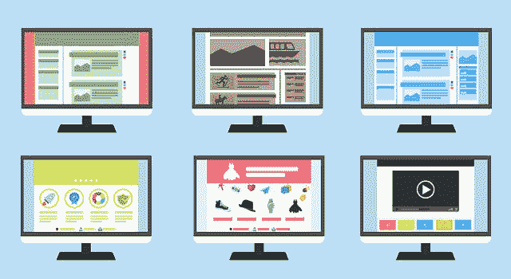

Best Screen Monitoring Software in 2022

[**来源**](https://www.comparitech.com/net-admin/internet-monitoring/)

理想的员工**屏幕监控软件**可以管理网络访问权限，提高生产效率，增强安全性。

[**屏幕监控软件**](https://www.workstatus.io/best-employee-monitoring-software-online?utm_source=gp&utm_medium=medium-rn&utm_campaign=RN) 与监控结缘由来已久。然而，如今，可能更多的是确保合适的人能够访问合适的应用程序。因此，在某些情况下，员工屏幕监控系统现在可以类似于项目管理工具。

在当今世界，不仅数据治理、安全性和访问控制变得越来越重要，如今企业内部也发生了企业数据泄露事件。这些事件可能是由于用户未能为访问受恶意软件污染的网站的用户激活所需的设置而导致的。

虽然一些**员工跟踪软件**仍然用于时间跟踪和效率管理，但其他软件的功能更像网络监控应用程序，专注于广泛的 IT 网络活动，并寻找可能表明安全问题的模式。这经常需要使用人工智能和机器学习来检测威胁。

除此之外，因为通过放错地方的设备(如笔记本电脑)丢失数据正变得越来越常见，所以特定的屏幕监控程序会检查并远程锁定和擦除任何无法再找到的驱动器，以防止敏感信息被泄露和滥用。

无论您在寻找哪种员工屏幕监控软件，我们都根据贵公司的需求，在市场上提供了大量优秀的产品。

**为什么任何业务都需要屏幕监控软件工具？**

最初，**屏幕监控软件**可能看起来是雇主越权的反面例子，企业跟踪他们的员工，以确保他们没有滥用权力。

**屏幕监控软件**可能对任何企业都有好处，但它也有助于解决生产率和保留率等问题。然而，还有其他的原因，为什么企业可能想要测试员工屏幕监控软件，我们已经在这个博客中包括了。

本次审查试图包括一系列用于**监控屏幕**的工具，其中一些比其他工具更具侵入性，有助于时间记录或网络监控。

是时候从 2022 年的 20 大**屏幕监控软件**工具开始了-

**2022 年 20 大屏幕监控软件工具**

1. **ClickUp**

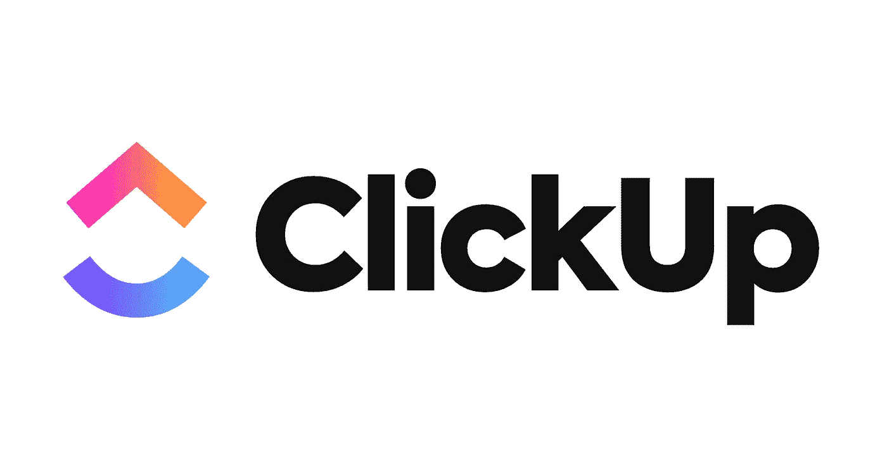

**ClickUp**

一个名为 ClickUp 的项目管理工具允许你安排、计划和跟踪你的所有活动。它还可以自己从其他程序中提取当前工作流。

ClickUp 将所有内容保存在一个地方。它允许你自动跟踪你的项目，并在每个月底查看报告。

**购买理由**

*   简单的本地时间跟踪
*   实时聊天
*   看板板

**定价**

*   免费永久计划
*   无限制-5 美元/会员/月
*   商务-9 美元/会员/月
*   商务+19 美元/会员/月
*   企业-定价联系人

**2。波德奥**

**Podio**

Podio 是一个**屏幕监控软件**，它将权力收回到你的手中，让你管理自己的进程，而不是让别人来控制它。使用 Podio 更有效地管理您的时间，创建独特的工作流程以满足您的特定要求，并一目了然地获得所有信息。

**购买理由**

*   音频和视频电话会议
*   即时消息选项
*   多项目功能

**定价**

*   免费计划-针对 5 名员工
*   基本计划-9 美元/用户/月
*   外加-14 美元/用户/月
*   高级-24 美元/用户/月

**3。Monday.com**

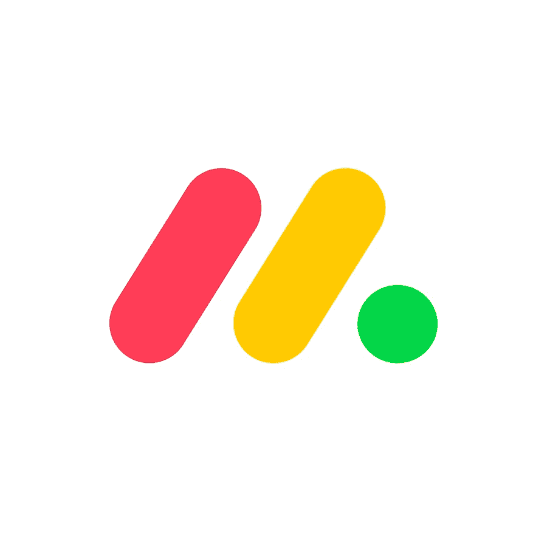

**Monday.com**

Monday.com 是一个著名的**桌面监控**软件，它可以让你使用几种工具来管理你的工作日程和项目，比如用三种不同类型的图表来监控任务(看板可以用来处理短期优先事项)，计划冲刺等等。

**购买理由**

*   易于管理多个工作流程
*   项目管理
*   便于人力资源和招聘

**定价**

*   免费试用
*   基本计划-每月 25 美元
*   标准-每月 39 美元
*   大约 59 美元/月
*   企业-定价联系人

**4。** **工作状态**

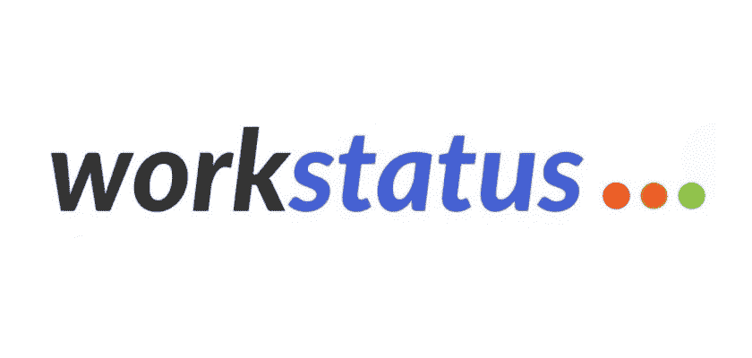

[**Workstatus**](https://www.workstatus.io/?utm_source=guest-post&utm_medium=medium-negi&utm_campaign=RN) 是一款出色的**屏幕捕捉软件**，是一款经济实惠的解决方案，适用于人力资源专业人员、业务管理员和经理等。Workstatus 让我们更好地理解为什么员工没有全力工作或协作。

它能让 It 人员准确地看到用户正在持续工作的内容。这对于确定员工的日常工作特别有用。

**购买理由**

*   **活动监控**带截图
*   易于与其他应用程序集成
*   使用每周工时计算器到测量生产率
*   **生产力跟踪器**带**监控工具**

**定价**

*   永远免费套餐:永远 0 美元
*   初级套装:4.99 美元/用户/月
*   扩展包:9.99 美元/用户/月
*   企业套餐:18 美元/用户/月

**5。MeisterTask**

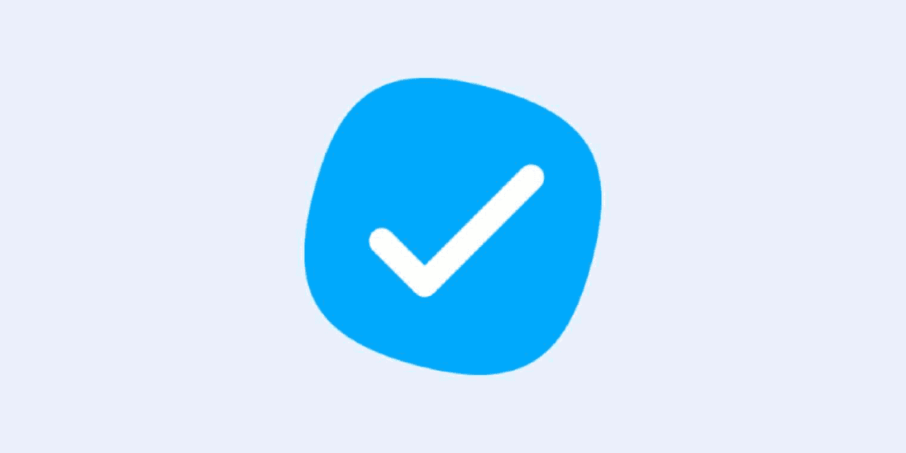

**MeisterTask**

MeisterTask 是一款出色的**屏幕监控软件**，因为它提供了广泛的功能来提高员工的工作效率。该软件旨在简化您的工作，因此它可以帮助您进行屏幕跟踪，并通过强大的任务管理工具改善成员之间的交流来节省时间。因此，这使得这个应用程序非常容易使用，并具有出色的性能。

**购买理由**

*   任务板视图
*   更好的协作工具
*   甘特图视图

**定价**

*   基本计划-免费
*   专业计划-每月 4.19 美元
*   商业计划-10.39 美元/月
*   自定义企业计划

**6。Zoho 项目**

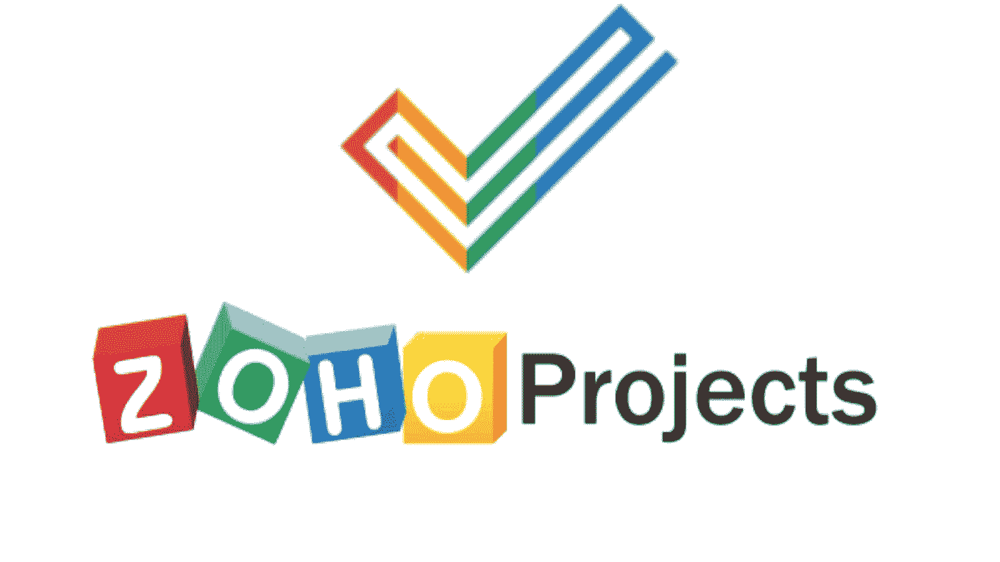

Zoho Projects 是一款在线**屏幕监控软件**，可以让你有效地管理你的任务。它更侧重于有效地在线创建和管理项目。

监控远程员工、自由职业者甚至同事，实时查看他们在屏幕上做什么。Zoho Projects 绝不亚于你今天在市场上看到的任何其他软件。

**购买理由**

*   生成强大的报告
*   更好的发票管理
*   简单的项目管理
*   员工跟踪

**定价**

*   免费计划
*   标准计划-每月 20 美元
*   快速计划-40 美元/月
*   高级计划-每月 85 美元
*   企业计划-125 美元/月

**7。任务世界**

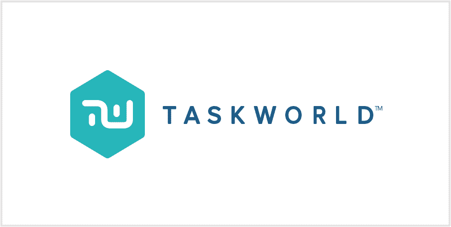

Taskworld 是一款优秀的电脑监控软件，可以让你实时跟踪员工的活动。这是一个简单的项目管理软件，适用于较小的团队。

**购买理由**

*   任务编辑
*   高分辨率图像预览
*   直接消息和任务注释

**定价**

*   专业计划-10.99 美元/用户/月
*   企业计划-定价联系人

**8。** **大本营**

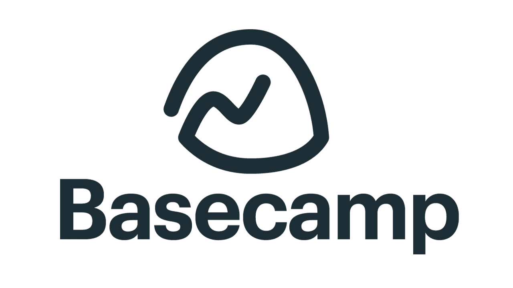

Basecamp 功能的简单性和灵活性使其在竞争中脱颖而出。您可以使用一个平台来管理任务的所有方面，如计划、调度、跟踪和报告。

它可以让你与他人实时互动，同时也允许同时就同一主题或不同主题进行小组讨论。

**购买理由**

*   与您的日历轻松集成
*   项目的交互式图表
*   任务调度

**定价**

*   它提供每月 99 美元的标准价格

**9。吉拉**

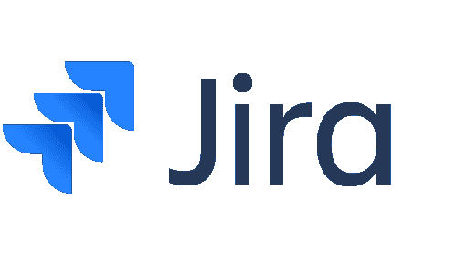

JIRA 是一个多功能的项目管理软件，帮助您管理您的活动和问题和错误。JIRA 为开发人员提供了几个独特的功能，让他们在日常工作之外寻找更多。

**购买理由**

*   多个搜索过滤器
*   易于计划项目时间表
*   问题跟踪器

**定价**

*   免费- 7 天试用
*   付费计划每月 10 美元起

**10。流量**

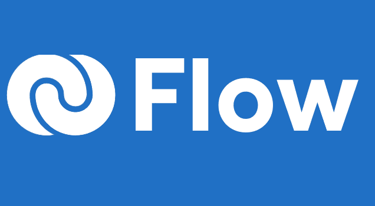

Flow 是一个很好的员工屏幕监控软件，因为它可以监控员工在工作电脑上浏览的内容，这有助于雇主识别不怀好意的员工。如果您担心员工可能会不恰当地查看特定内容，那么该流程将识别这些类型的操作何时为您发生。

**购买理由**

*   易于规划的项目
*   对任务的私有和公共访问
*   任务注释和文件附件

**定价**

*   流量-4.79 美元/用户/月
*   flow Pro-7.99 美元/用户/月

**11。智能任务**

SmartTask 是最棒的任务管理器，允许企业自动确认员工是否准备好轮班。员工现在可以使用智能任务的新功能，这将使他们能够使用 iPhone/Android 应用程序查看他们的时间表，而无需打电话。

**购买理由**

*   轻松与团队成员协作
*   从一个位置管理所有任务
*   轻松跟踪您的项目

**定价**

*   永远免费

**12。点击任务**

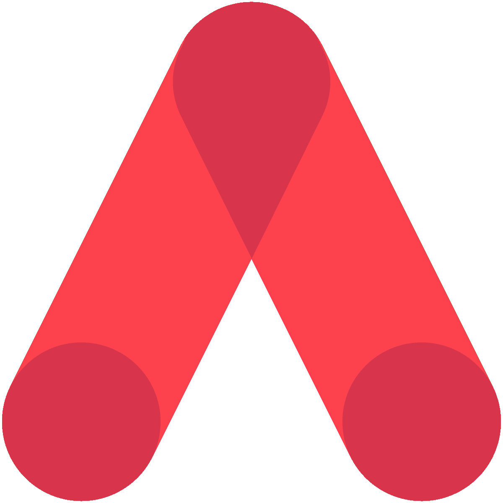

Hitask 是一款**员工监控软件**，提供雇主和员工的双向沟通。它能够捕捉那些讨厌的缺席，因为它不仅仅依赖电子邮件或文本作为通知，以及跟踪任何给定任务花费了多少时间。

员工可以在完成工作前向经理提交他们的工作时间和任务，如果需要的话可以请求批准，所有事情都会自动记录，因此不会对报告和批准的内容产生任何混淆。

**购买理由**

*   即时消息
*   容易为每个任务设置多个提醒
*   移动推送通知

**定价**

*   免费计划
*   团队业务-每月 25 美元
*   企业-120 美元/月

13。里克

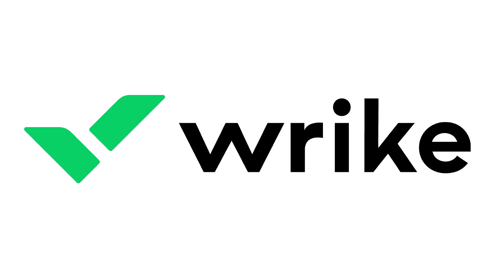

Wrike 是一款**电脑监控软件**，对于雇主来说有两个基本特性。首先，它可以让你准确地看到你的员工在做什么。第二，Wrike 软件可以捕捉他们活动的截图，所以他们不能否认他们后来做了什么。

**购买理由**

*   设置周期性任务
*   获取实时新闻
*   任务中的小组讨论

**定价**

*   免费计划:0 美元用户/月
*   专业计划:9.80 美元/用户/月
*   商业计划:24.80 美元/用户/月

**14。ActiveCollab**

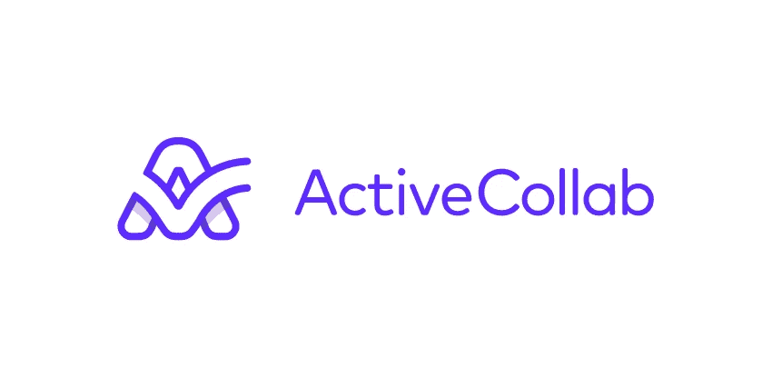

ActivCollab 是一个好员工**屏幕监控软件**，因为它以合理的价格提供了令人信服的好处。它允许远程管理和近乎实时的监控，并具有多层身份验证和一次在不同设备上查看的能力等安全功能。

**购买理由**

*   轻松同步您的日历
*   获取未完成任务的报告
*   在列表视图、分栏视图或甘特图视图中组织任务

**定价**

*   25 美元/月- 5 个用户

**15。团队合作**

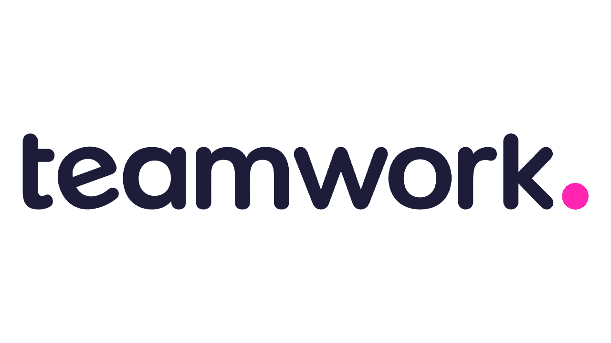

Teamwork 是一个优秀的**屏幕监控软件**，具有各种功能，从基本任务组织到时间跟踪和发票。团队合作将帮助你在一个屋檐下组织你的防御，无论你是在一个小的还是大规模的项目中工作。

**购买理由**

*   项目跟踪器
*   轻松安排项目和任务
*   从 Excel 导入任务

**定价**

*   免费计划- 5 个用户
*   专业计划-9 美元/用户/月

**16。ProofHub**

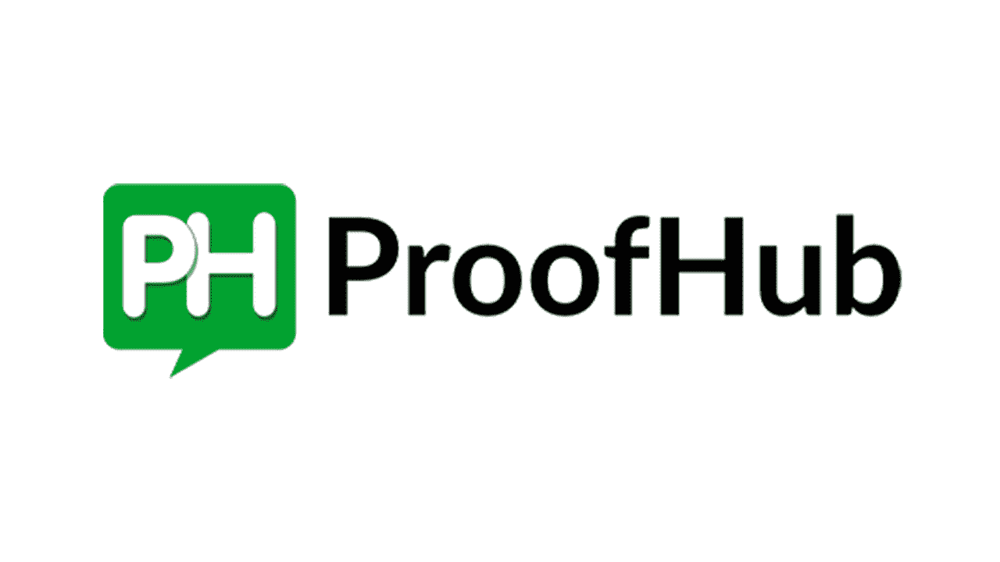

ProofHub 是一款很好的员工**屏幕监控软件**因为它可以很方便的跨平台监控员工。此外，它的灵活性允许您远程监控整个组织。第三，它捕捉电脑、互联网活动和花在应用程序上的时间的所有截图。最后，它还可以通过单击按钮来报告详细的管理报告。

**购买理由**

*   资源管理能力
*   易于向成员分配角色
*   易于创建子任务

**定价**

*   89 美元/月-无限用户

17。 **工作流**

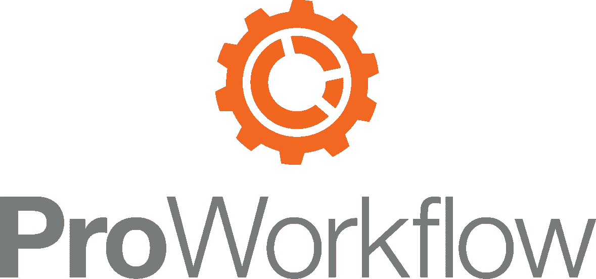

Proworkflow 是一款任务管理软件，允许您通过使用预定义的模板来控制您的流程。通过几个简单的步骤来组织您的一天并提高工作效率:设置符合您需求的自定义工作流程，并一目了然地获得您需要的所有数据。

**购买理由**

*   易于组织项目进度
*   计划图编制
*   警报和通知

**定价**

*   单人——10 美元/用户/月
*   专业-20 美元/用户/月
*   高级-30 美元/用户/月

18 岁。特雷罗

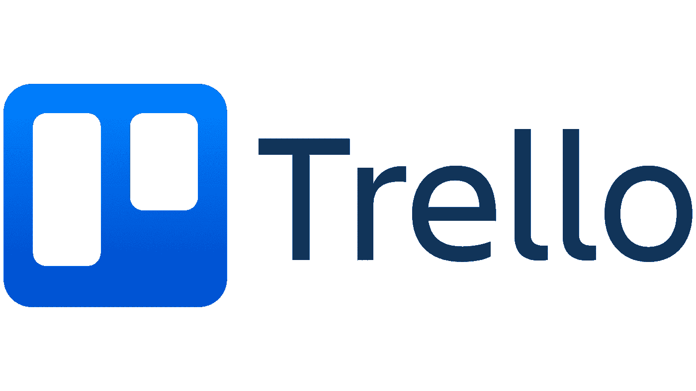

Trello 是一个众所周知的员工监控程序，很多人都在使用。它的优点是看板风格的板，这是互动的，易于使用。Trello 最与众不同的特性是它的动态卡片，它允许你快速简单地在列之间移动任务。

**购买理由**

*   将电子邮件转换成卡片和纸板
*   良好的管理能力
*   易于创建清单

**定价**

*   免费计划-无限用户
*   商业计划-9.99 美元/月

19。AYOA **(早先的 DropTask)**

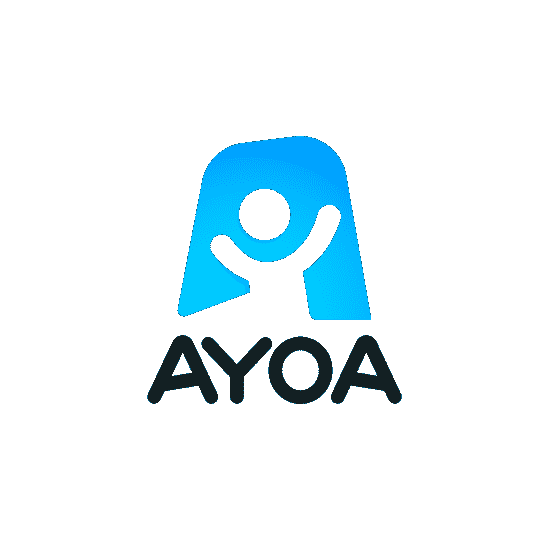

AYOA 是一个任务管理软件，已经被世界上一些最著名的专家在几个领域认可，已经获得了认可。

它将使你的日常工作更愉快，更容易与文氏图，彩色标签，快速学习曲线。

**购买理由**

*   有组织的项目时间表
*   易于分配任务
*   获取项目管理工具
*   项目跟踪器

**定价**

*   免费计划
*   个人计划-5 美元/月

**20。俏皮**

Nifty 是可用的最棒的任务管理软件，拥有你在游戏中保持领先所需的一切！它具有许多面向团队和项目管理的能力。

对于寻找专业且经济的解决方案来完成任务的小团队来说，Nifty 非常值得一看。

**购买理由**

*   管理每个成员的通知
*   添加或删除团队成员
*   轻松过滤任务

**定价**

*   基本计划-8 美元/用户/月

**最终想法**

我们列出的**屏幕监控软件**工具可以以多种方式帮助您。无论是提供员工工作的即时更新，还是让他们无需离开屏幕即可相互协作和交流，这些解决方案都旨在为任何试图保持竞争力的企业节省时间和资金。

找到一个适合您的需求并且您负担得起的工具是非常重要的，所以在做出决定之前，请花一些时间来比较每个选项。

我们推荐 **Workstatus** 、 **ClickUp** 和 **Nifty** 作为您业务的最佳**屏幕监控软件**工具。

我们希望这篇文章能帮助您确定哪个计划最适合您的企业！