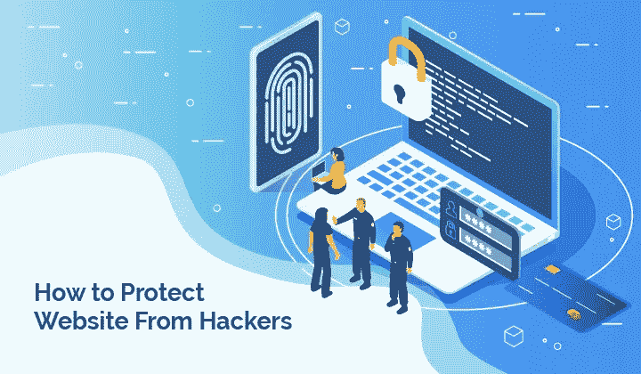

# 保护您的网站免受黑客攻击的最佳安全提示

> 原文：<https://medium.com/geekculture/best-security-tips-to-protect-your-website-from-hackers-28335bdd0159?source=collection_archive---------11----------------------->

## **1。如何让您的软件保持最新**

黑客总是在寻找新的方法来利用软件中的漏洞。不幸的是，过时的软件是他们访问网站或计算机系统最容易的方式之一。这就是让你的软件保持最新的原因。