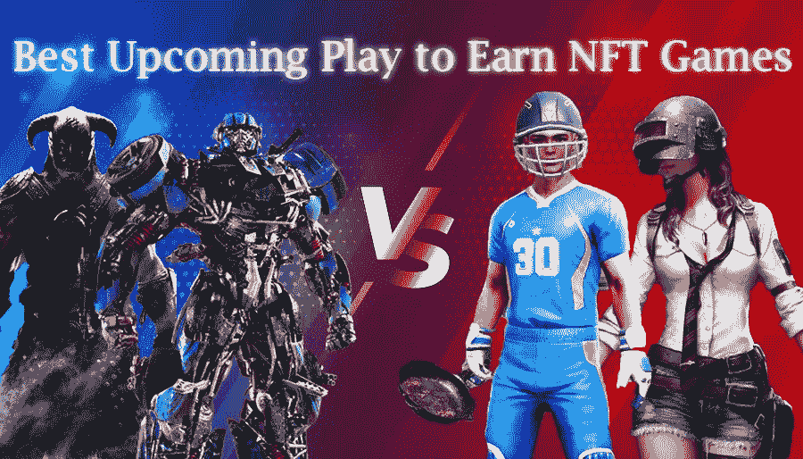
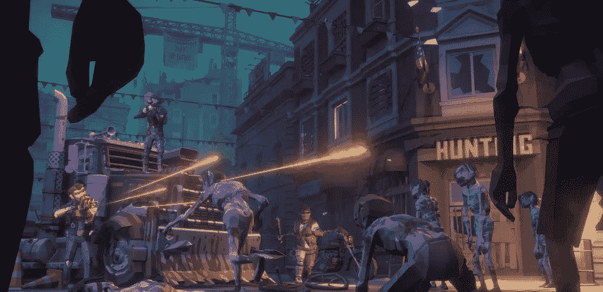
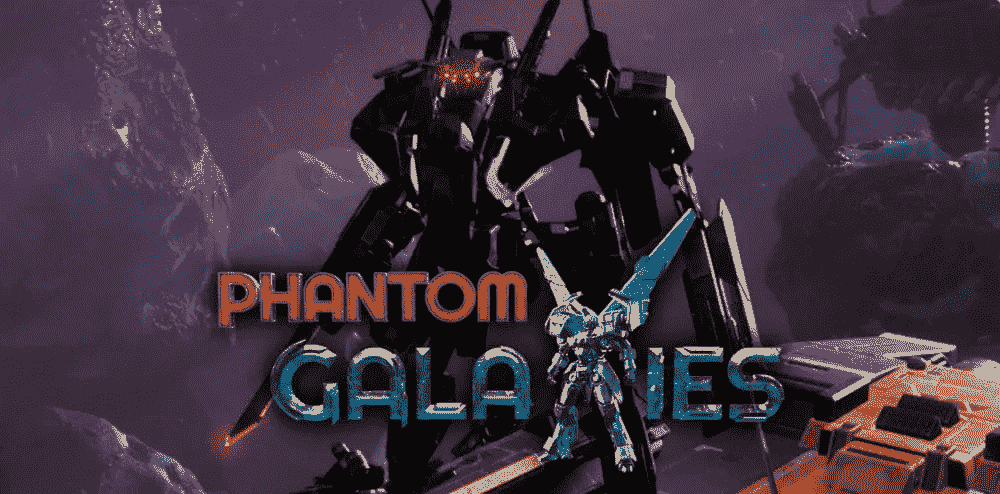
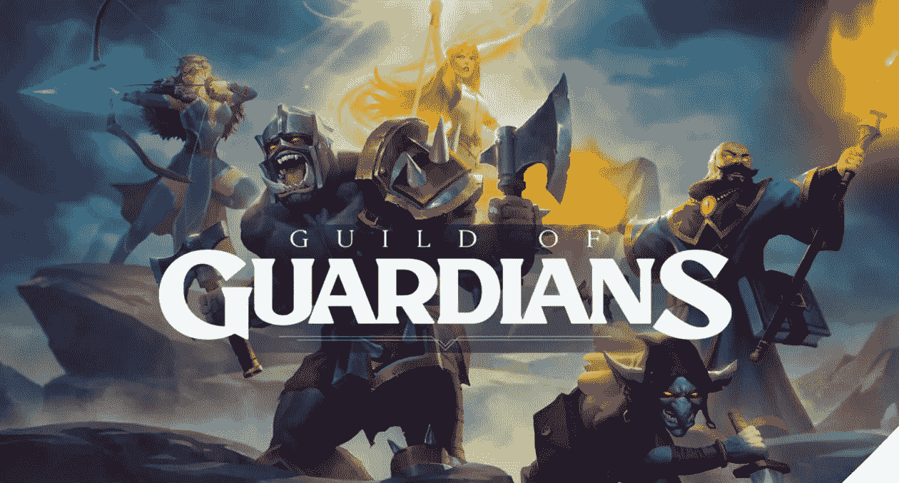
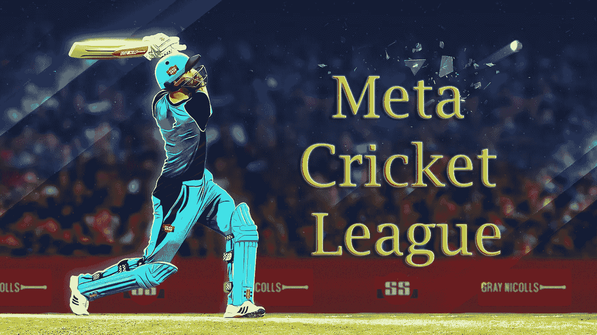

# 最佳 P2E NFT 运动会

> 原文：<https://medium.com/geekculture/best-upcoming-p2e-nft-games-463a7e00ab53?source=collection_archive---------12----------------------->

## 2022 年即将推出的“赢取”( P2E) NFT 游戏平台列表

**Upcoming Play to Earn NFT Games**

嘿伙计们，你们好吗！希望每个人都喜欢这个炎热的夏天。

今天，我们将探讨一个与这个数字社会相关的有趣话题。

在过去的十年里，这个领域有了新的发展！

有什么猜测吗？

是的，你们猜对了，这就是即将到来的 NFT 游戏世界

有人知道或者猜测吗？

耶！正如我之前在标题中提到的。这个博客将会是全球玩家和游戏流的一大享受。

不浪费一微秒的时间，让我们一头扎进信息的池子里

**简介**

在过去的五年里，我们都见证了现代世界中游戏产业的繁荣。这一新的游戏革命给我们带来了许多新的精彩游戏动态游戏控制台，最重要的是在全球范围内产生了许多游戏流。在当今世界，游戏被认为是商业世界中最赚钱的公司之一。如果我们看一下游戏行业过去十年，我们可以见证这个行业是如何以自己为中心发展的。每周都有许多新游戏推出，每个游戏开发商都在尽力满足和吸引他们的用户。这样他们就能为自己的品牌赢得更多的用户粉丝群和观众。

同时，我们可以在日常生活中避免区块链、NFTs、加密货币这些威严的名词。我们都看到了区块链公司在当前数字世界的惊人增长。

甚至许多传奇科学家都在描述区块链技术的发明将为数字元宇宙领域铺平道路。

如果这两个蓬勃发展的行业合作，为他们的观众再现视觉盛宴。是的，这将是一个伟大的对待每一个 NFT 和游戏爱好者。以下许多发挥赚取 NFT 游戏。2022 年是成功的一年，对于即将到来的新玩家来说，这将是赢得 NFT 游戏的伟大一年。

我们已经体验了像 Axie Infinity 和其他类型的东西玩赚 NFT 游戏。这些游戏对游戏行业产生了巨大的影响，并创造了许多新的游戏百万富翁。

> 为赢而玩，但享受乐趣——大卫·奥格威

**玩赚 NFT 游戏机/平台是如何运作的？**

这将是一个引起每个人思考的严肃问题。这和你的 PC/PS/RPG 游戏一样简单。一旦您赢了，您可以通过代币或加密硬币赢得数字资产奖励。你所要做的就是证明你的游戏技巧来赢得游戏。您的奖励将安全地转移到您的钱包中，您可以轻松地转移到您的本地个人钱包中。

让我们深入这篇文章，以了解更多关于即将到来的玩赚 NFT 游戏。让我们进入游戏世界，探索新的游戏。

# **即将到来的 2022 年 NFT 玩赢游戏**

在我最近的研究中，我发现很多人并没有获得很好的赚钱机会。像 Axie Infinity 这样的游戏赚钱项目仍然不为某些人所知。所以我的最终目标是让每个人都知道所有的事情。每个人都应该有机会证明自己的技能。

这些是一些即将到来的 NFT 游戏的列表。下面几段简单看看。

1.  **蓼属** —免费的跨应用程序多人游戏
2.  **幻影星系** —区块链上的星际战斗机对战游戏
3.  **守护者协会** —角色扮演 NFT 游戏平台(RPG)
4.  **元板球联赛**——世界首次元宇宙 NFT 板球比赛
5.  **RaceFi**——Solana 生态系统上集成了人工智能和机器学习的赛车游戏

# 详细了解 2022 年 NFT 5 大游戏

这里有一个最好的 NFT 游戏的详细概述，让玩家在娱乐的同时获得可观的收入。

**1。蓼属**

蓼是一款即将推出的跨应用视角多人游戏。这就像最后一个人生存模拟游戏，让玩家能够在他们的建筑市场交易游戏资产。除此之外，它还允许玩家定制和创建他们的部落和地区。蓼属生态系统治理的本地令牌是 POG 币。你可以通过交易你的游戏资产和在游戏中生存到最后来赚钱。坚持到最后的人将会得到奖赏。

**Polygonum**

**2。幻影星系**

幻影星系顾名思义，这是一款机甲星际战斗机战斗游戏，你需要完成所有的里程碑来获得奖励。这款游戏让你感受和体验到类似正统 RPG 3D 游戏的东西。玩家可以购买幻影银河机甲、角色、皮肤和装备作为 NFT。

这款游戏的座右铭是通过单窗口元宇宙平台建立一个超过 100 万玩家的巨大游戏社区。该游戏在区块链账本的支持下提供了一流的体验。现在注册加入他们的候补名单。

**Phantom Galaxies**

**3。守护者协会**

《守护者协会》是一款即将推出的幻想导向(RPG)角色扮演 NFT 游戏。NFT 游戏的开发方式主要关注玩家的策略和游戏技巧。因此，用户不需要任何资本投资来启动游戏。守护者协会游戏中使用的原生令牌被称为宝石。你所要做的就是向这个世界展示你的游戏技能，以赚取你的奖励资产。

**Guild of Guardians**

**4。元板球联赛**

元板球联赛是最值得期待的发挥，以赚取板球 NFT 游戏。全世界几乎超过 10 亿的板球爱好者都在急切地等待体验这项运动。这款游戏由 NFT 市场 GuardianLink 提供支持。你需要从 Jump 购买板球 NFTs。交易 NFT 市场，体验元宇宙板球经验。所以我希望这次 MCL 会成为全球板球爱好者的一次盛宴。Cricket NFTs 被称为使用第 2 层协议制造的无气体 NFT。立即注册并购买他们的 NFT 来玩他们的 MCL 并获得奖励。

**Meta Cricket League**

**5。Race-Fi**

种族 Fi！是啊，你猜对了！这是索拉纳生态系统上的世界上第一款基于人工智能 ML 的赛车游戏。在 RaceFi 中，玩家可以参与，通过首先完成比赛获得奖励，并拥有一些土地或游戏的体育场并从中获利。游戏的最终结果是由他们的 inbuild AI 算法计算出来的，游戏的原生令牌被称为 Race Fi。

**Race-Fi**

# 最后的想法

这里是一些即将到来的玩赚 NFT 游戏，可能会在未来几天推出。正如我们之前讨论的游戏产业是如何在最近蓬勃发展的。

> 如果你像我一样为了赢而比赛，比赛永远不会结束

我很肯定这些游戏将帮助许多年轻人实现他们的目标，并形成许多新的百万富翁。因此，这些游戏将很快统治游戏以赢得 NFT 市场，所以我的建议是注册自己并加入他们的白名单/等候名单，以获得他们的常规访问权。

**免责声明** : Crypto 和 NFT 是不正规的数字资产。我不是一个财务顾问，所以在进入之前做自己的市场调查。