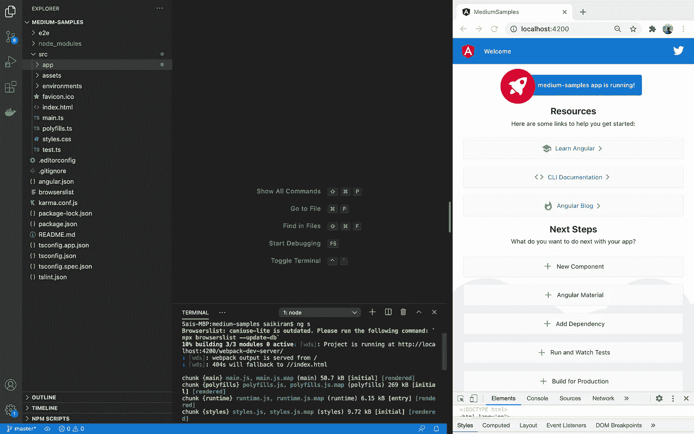
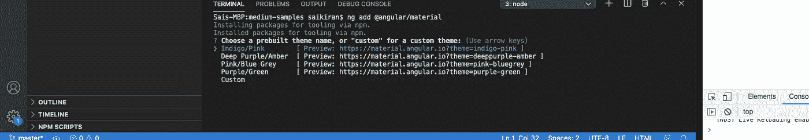
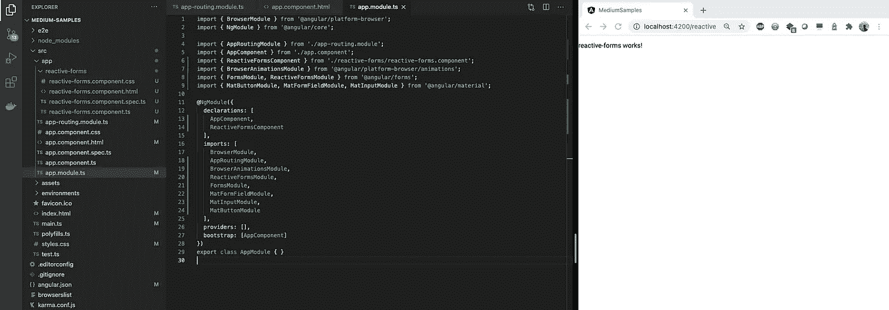
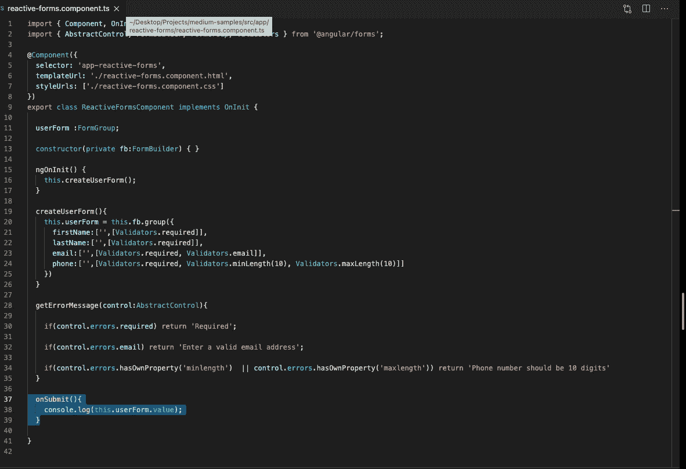
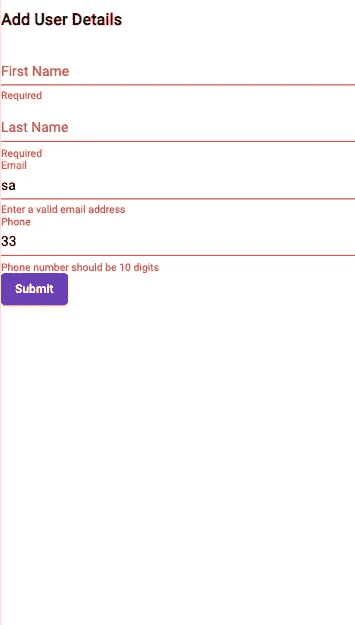

# Angular 中的有效形式验证

> 原文：<https://medium.com/geekculture/best-way-to-implement-angular-reactive-forms-c2918e3b3a5?source=collection_archive---------6----------------------->

许多人有不同的方法来实现角形，每种方法都有自己的价值。这是我喜欢的实现角反应形式的最好方法。

首先，什么是角反应形式？

反应式表单是为应用程序的各种功能实现可重用表单的一种方式。它使用完整的角度特征来绑定数据并将数据设置到表单控件。

反应形式的关键组成部分:

1.  表单控件:它跟踪单个表单控件的值和验证状态。
2.  **表单组:**它为一组表单控件跟踪相同的值和状态。
3.  **表单数组:**跟踪表单控件集合的相同值和状态。

在这篇文章中，我们将研究上述所有组件，以了解更多关于反应式表单的知识，以及它们对于构建表单的有效性。

首先，我们将使用以下命令创建一个新的 angular 项目。

`ng new sample-project`

这将在您指定的目录下创建一个角度项目。现在在你最喜欢的代码编辑器中打开 angular 项目。我在这篇文章中使用了 Visual Studio 代码。

现在，在编辑器中打开终端，运行以下命令启动 angular 应用程序。打开谷歌浏览器，查看 localhost:4200 网址。

`ng serve`



Start the angular applcation

现在从底部的终端窗口打开新的终端，并创建一个名为 **reactive-forms** 的新组件。您可以通过以下命令创建一个新组件。

`ng generate component reactive-forms`

或者你可以点击下面的快捷方式

`ng g c reactive-forms`

现在将路径添加到 **app.routing 文件**中的反应式表单组件。

```
const routes: Routes = [{path: 'reactive', component:ReactiveFormsComponent}];
```

现在删除**app.component.html**中的所有 html，并在其中添加以下代码。这将使 App 组件可以访问这些路线。

`<router-outlet></router-outlet>`

对于这个项目，我们将使用角材料作为应用的设计组件。以下是在您的角度应用中安装角度材料的步骤。

在代码编辑器中打开终端，并运行以下命令

`ng add @angular/material`

这将提示您选择预先构建的主题名称。选择你喜欢的主题。如果您希望在应用程序中使用手势控制和动画，还可以设置 HammerJs 和浏览器动画。



Select theme for the Angular Material

现在让我们开始建立角反应形式！！

首先让我们导入这个项目所需的所有模块。app.module.ts 中的导入部分应该包含以下模块。

```
imports: [BrowserModule,AppRoutingModule,BrowserAnimationsModule,ReactiveFormsModule,FormsModule,MatFormFieldModule,MatInputModule,MatButtonModule]
```



app.module.ts

现在让我们通过“ng serve”重新启动 angular 应用程序。然后转到反应式表单组件文件。首先，我们应该为表单创建一个表单组。初始化构造函数上方的窗体组。

`userForm:FormGroup;`

在构造器中导入 FormBuilder，以使用 form builder 创建表单。

```
constructor(private fb:FormBuilder) { }
```

现在让我们创建用户表单。我们的用户表单将有以下表单控件来绑定和设置表单数据。

1.  名字:因为它是必填字段，所以需要进行验证。
2.  姓氏:因为它是必填字段，所以需要进行验证。
3.  电子邮件:因为这是一个必填字段，这将有必要的验证，因为它有电子邮件类型，我们可以包括电子邮件验证器。
4.  电话:因为它是必填字段，它将具有所需的验证，电话应该至少有 10 个字符。所以我们添加了最小长度=10 和最大长度=10 的验证器。

下面的函数将创建带有验证的表单。

```
createUserForm(){this.userForm = this.fb.group({firstName:['',[Validators.required]],lastName:['',[Validators.required]],email:['',[Validators.required, Validators.email]],phone:['',[Validators.required, Validators.minLength(10), Validators.maxLength(10)]]})}
```

在 ngOnInit()函数中初始化该表单，以便在组件初始化后立即初始化该函数。

```
ngOnInit() { this.createUserForm(); }
```

现在让我们创建一个 Error 函数，它根据表单控件的验证器状态返回错误。

```
getErrorMessage(control:AbstractControl){if(control.errors.required) **return 'Required'**;
if(control.errors.email) **return 'Enter a valid email address';**
if(
control.errors.hasOwnProperty('minlength')  || control.errors.hasOwnProperty('maxlength')) 
**return 'Phone number should be 10 digits';**}
```

上面的函数将表单控件作为参数，并根据表单控件的错误返回一个字符串。现在添加 onSubmit()函数，它在表单完成时提交表单。

```
onSubmit(){ console.log(this.userForm.value); }
```

您的最终组件文件将类似于这样。



component.ts

现在让我们去组件的 html 文件。html 文件将输入作为表单控件。以及一个 mat 错误标签，它将根据所显示的验证来显示错误。

```
<mat-error *ngIf="userForm.controls.firstName.invalid"> {{getErrorMessage(userForm.controls.firstName)}}</mat-error><mat-error *ngIf="userForm.controls.lastName.invalid"> {{getErrorMessage(userForm.controls.lastName)}}</mat-error><mat-error *ngIf="userForm.controls.email.invalid"> {{getErrorMessage(userForm.controls.email)}}</mat-error><mat-error *ngIf="userForm.controls.phone.invalid"> {{getErrorMessage(userForm.controls.phone)}}</mat-error>
```

下面是用户详细信息表单的完整 html 文件。

```
<h3> Add User Details </h3><form [formGroup]="userForm" (ngSubmit)="onSubmit()"><mat-form-field>
<mat-label>First Name</mat-label>
<input matInput type="text" formControlName="firstName">
**<mat-error *ngIf="userForm.controls.firstName.invalid"> {{getErrorMessage(userForm.controls.firstName)}}</mat-error>**
</mat-form-field><mat-form-field>
<mat-label> Last Name </mat-label>
<input matInput type="text" formControlName="lastName">
**<mat-error *ngIf="userForm.controls.lastName.invalid"> {{getErrorMessage(userForm.controls.lastName)}}</mat-error>**
</mat-form-field><mat-form-field>
<mat-label>Email</mat-label>
<input matInput type="text" formControlName="email">
**<mat-error *ngIf="userForm.controls.email.invalid"> {{getErrorMessage(userForm.controls.email)}}</mat-error>**
</mat-form-field><mat-form-field>
<mat-label> Phone </mat-label>
<input matInput type="text" formControlName="phone">
**<mat-error *ngIf="userForm.controls.phone.invalid"> {{getErrorMessage(userForm.controls.phone)}}</mat-error>**
</mat-form-field><button mat-raised-button color="primary" type="submit"> Submit </button>
</form>
```

现在，如果您进入浏览器并检查表单验证。您根据用户输入测试验证。



Browser Output

就是这样。在角坐标中实现角坐标反应形式是最容易的。感谢阅读这篇文章。如果你对角反应式有任何疑问。请随时给我发邮件(saikiran1298@gmail.com)。