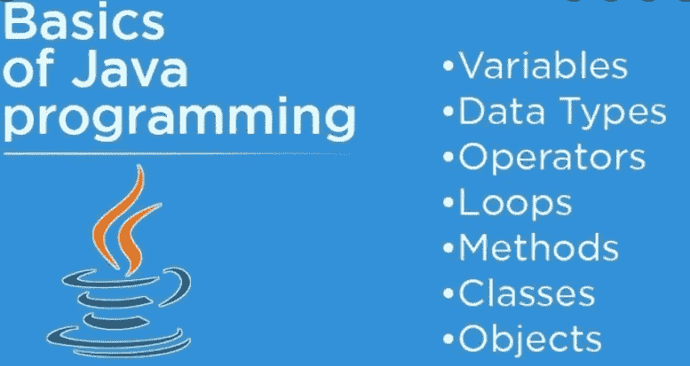

# 学习 Java 编程的最佳方法

> 原文：<https://medium.com/geekculture/best-way-to-learn-java-programming-5896f7e9e64?source=collection_archive---------7----------------------->

我写这篇文章是为了献给我所有的年轻伙伴们(*或者我应该说初学者*)，他们想在 Java 技术上达到一定的熟练程度，并且希望得到我的建议。

如果你不喜欢我建议的学习 Java 的方法，忽略这篇文章，继续学习最适合你的。更好的是，向别人建议你认为学 Java 快还是快比较好。

让我们首先列出第一件事。确保您已经准备好了 Java 开发环境，也就是说，您已经安装了 JDK/JRE 和一个 IDE

# 1.学习语言基础

这是第一步，原因不言而喻。如果你不知道最基本的，你永远不知道下一步该做什么，或者你做错了什么。

最初，我并不期望你掌握所有基本的 java 概念，如关键词、核心概念或基本编码技术。我对你的期望只是阅读下面链接中的所有文本，即使它在第一次尝试中对你来说没有意义。继续读下去。

1.  http://docs.oracle.com/javase/tutorial/java/nutsandbolts/
2.  [Java 教程](https://howtodoinjava.com/java/basics/java-tutorial/)

请记住，以上两个链接并不是基础知识的唯一链接。你可以在谷歌上快速搜索一下，找到许多类似的链接。

当你完成了上面两个链接后，第二遍再读一遍。请不要跳过任何一部分。这一次，事情将开始对你更有意义，你将能够自己在各种概念之间建立联系。

如果你仍然不能把分散在不同地方的信息联系起来，那么就重复这个步骤，直到你开始把核心概念联系起来。不要担心你是错是对；把他们联系起来，更好地做笔记。笔记将帮助你测量你的 java 学习曲线。

认真学习[面向对象编程概念](https://www.mygreatlearning.com/blog/oops-concepts-in-java/)。就像其他流行的编程语言一样，Java 也是一种面向对象的编程语言。

# 2.开始用小程序编码

一旦你确信你已经熟悉了基本的关键词和概念，并能以某种方式将它们联系起来，你就可以进入第二步了。在这里，你将不得不开始编写一些基本的 java 程序，例如，hello world，简单的加法和减法等。

当编写程序时，请记住，最初的几个程序对你来说是坚定不移的。但是一旦你完成了它们，你就不会在下一套程序中面临类似的难度。

你可能会遇到很多困难，以至于你可能无法自己输入你的 hello world 程序。不要犹豫，打开谷歌，搜索类似的程序。

记住。不要从任何来源或网页复制和粘贴程序。只需阅读程序，并把它输入你自己的 IDE。解决你打字时得到的不正确语法导致的编译错误(基本上我假设你会犯小写/大写的错误)。

请为几个程序这样做，并记住总是先尝试自己创建一个程序，然后使用谷歌。我在下面列出了一些基本的 java 程序，你可以考虑开始使用。

*   显示一些文本消息。
*   在新行中显示数字列表(1 到 50)。
*   求两个数之间的最大值和最小值。
*   使用任何你知道的技术在两个数字之间交换。
*   建立一个能够加/减/乘和除数字的计算器程序。
*   创建两个类(超类/子类)并练习方法重载和覆盖概念。
*   创建一些涉及数组的程序，例如在控制台中以数组格式打印输出。
*   诸如此类…

上面的程序给你一个开始，让你明白我所说的基本程序是什么意思。这个列表可能很长，我建议你添加更多的条目，并为它们创建程序。

# 3.学习 Java APIs，编写几个复杂的程序

当你完成了大部分的基本程序，最重要的是，你已经习惯了创建这样的基本程序，跳到下一步。

在这里，我建议你在学习 Java 集合内部的 Java APIs 和 java IO 上下功夫。只需开始探索这些 API 中涉及的各种类和接口，并开始为它们创建程序。

请注意，您应该总是试图找到一个现有的 API 来完成特定的任务，并且您不应该在这里创建您的逻辑。您的目标是熟悉这些 API，所以总是只在这些 API 中寻找解决方案。

我再次建议你可以从几个基本程序开始。以后你可以尽可能多地包含更多的 API 和这样的程序。

*   从控制台获取输入并打印出来
*   从文件系统中读取文件并在控制台中打印其内容
*   创建一个新文件，并向其中写入一些数据
*   从 URL 中读取数据，并对其内容进行搜索
*   将元素存储在一个列表中，然后遍历它
*   使用 HashMap 存储随机的键值对，并以多种方式迭代它
*   创建一些用于搜索和排序集合元素的程序
*   诸如此类…

你在这一步构建的程序越多，你就会获得越来越多的自信。一旦你擅长使用这些 API，就跳到下一节最重要和最具挑战性的任务。

# 4.创建一个桌面应用程序和一个 Web 应用程序

这一步会给你面对任何 java 面试所需要的信心，并在与 Java 相关的讨论中证明你的勇气。

这个想法很简单。您必须选择至少一个 java 桌面/GUI 应用程序(例如，桌面计算器)和一个 web 应用程序(例如，医院管理)。现在，当你有了最基本的知识，开始探索构建你的两个应用程序所需要的一切。

向专家(我也会尽自己的一份力量来帮助你)、你有经验的朋友、同事以及你认识的每一个能帮助你的人寻求帮助。

在寻找解决方案和学习概念时，阅读所有可用的好材料。买一些与你所陷入的概念相关的书。做构建这些应用程序所需的一切。让它们成为你几天(或几周甚至几个月)的唯一目标。

让我向你保证，当你完成这两个练习时，你会比以前对 Java 更有信心。更重要的是，它帮助你养成不惜一切代价完成工作的习惯。这种态度对你职业生涯的长远发展非常重要。

# 5.参加好的 Java 博客和论坛

完成以上四个步骤后，你会变得更加自信，能够像几个月前一样帮助他人。

找到了解较少的人，帮助他们解决问题，即使这需要你花费一些时间。像 stackoverflow.com 这样的论坛是开展这些活动的好地方。当你开始了解别人正在犯的错误时，它只是在不同的方向上打开了你的思维，提高了你的思维处理能力。

其实最后一步就像一个死循环，在时间允许的情况下，你要坚持做下去。当你意识到自己变得多么成熟时，你会感激结果的。

以上就是我对学习 Java 的最佳方法的想法。如果你碰巧同意我的观点，请发表评论。如果你不同意我的意见，就放弃你的建议。如果你的想法真的很好，我会把它写进文章里。

快乐学习！！