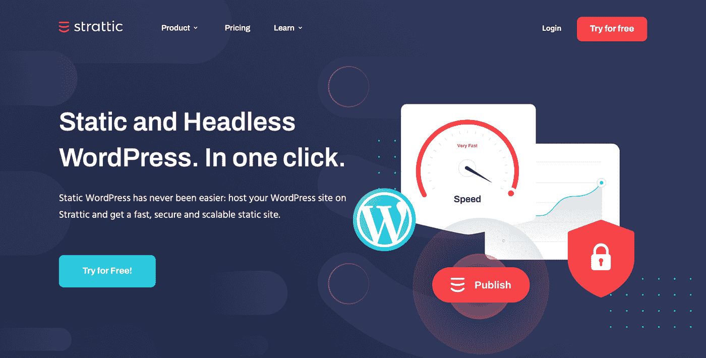
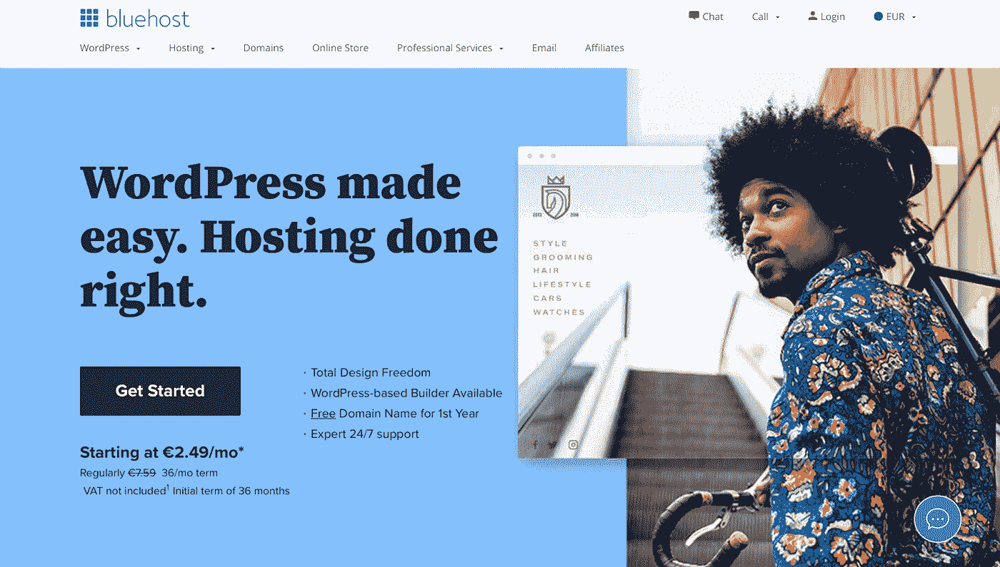
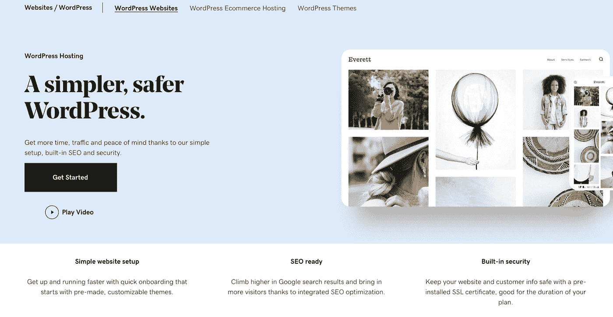
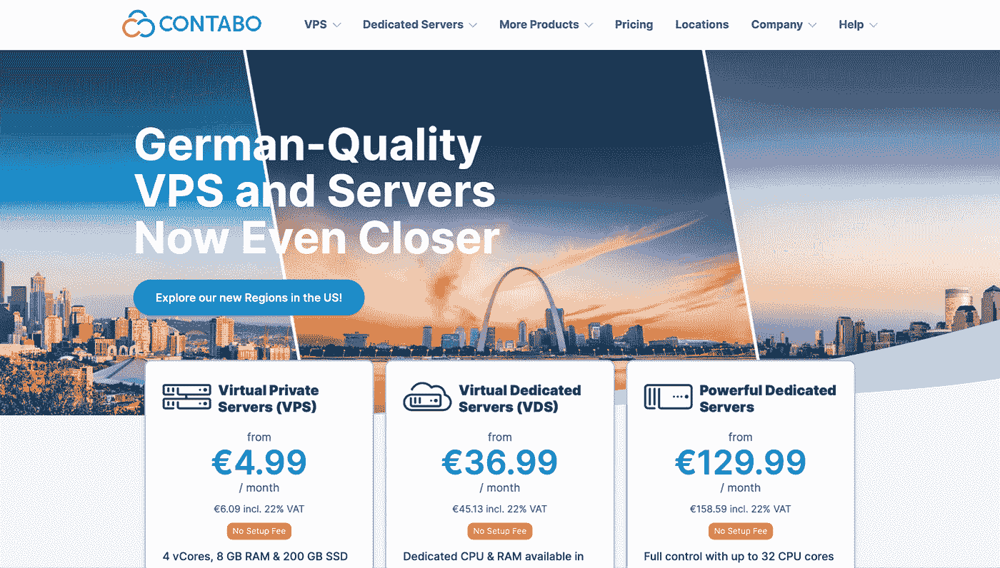

# 2021 年最佳安全 WordPress 托管解决方案

> 原文：<https://medium.com/geekculture/best-wordpress-hosting-solutions-for-security-in-2021-133601c7d8ff?source=collection_archive---------46----------------------->

Photo by [Stephen Phillips - Hostreviews.co.uk](https://unsplash.com/@hostreviews?utm_source=medium&utm_medium=referral) on [Unsplash](https://unsplash.com?utm_source=medium&utm_medium=referral)

WordPress 是当今最流行的 CMS 平台之一。这是因为 WordPress 可以被任何人使用，从没有网站建设知识的内容创建者到希望使用代码手工定制和调整他们的网站的网站开发者。

一旦你为你的网站建设选择了 WordPress，下一步就要开始了。WordPress 需要在某个地方运行，这就是托管解决方案发挥作用的地方。在这篇文章中，我们将分析许多托管你的 WordPress 的解决方案，这样你就可以选择最适合你需求的解决方案。

挑选的评估指标:

*   WordPress 最低要求拟合
*   支持
*   易于安装/使用
*   速度
*   安全性
*   定价

# Strattic

Strattic Homepage

Strattic 是一项字面上为 WordPress 设计的服务，通过静态和无头的 WordPress 主机服务，它非常注重安全性。如果你不知道什么是 Headless CMS，这是一种使用 WordPress 作为内容和静态构建接口的后端的方法——Strattic 通过 API 与 WordPress 后端“对话”。这使您可以提高性能和安全性，因为静态版本的网站比网站渲染要快得多。使用静态网站也意味着用户永远不会直接接触数据库。

这显然并不意味着你不会有一个数据库或者开发者不能在上面托管像电子商务网站这样的东西。这意味着，如果你需要托管这种服务，你的网站将使用专门为该功能创建的 API，Strattic 将其集成到他们的生态系统中。对于他们提供的每个计划，你都可以使用非常重要的集成服务，如用于多语言支持的 WPML、Contact Form 7 和 Gravity Forms、Algolia Search(速度快得惊人)和 AMP 支持，这些可能会促进你的 SEO。

价格是硬币的另一面:基本服务(面向小型企业)起价为 45 美元/月，如果您按年计费，则变为 37.5 美元/月。在基本服务中，它们还包括 CDN(仅在某些国家可用)、staging area 和 AWS SSL(重申了它们对安全性的关注)。如果你想增加更多的 WordPress 用户，你必须支付更多的费用。基本服务只包括 1 个用户。因此，如果你有一个有文案、设计师和其他员工的小组织，并且你想为每个用户提供不同的访问，你必须升级到商业计划(250 美元/月，或者 208 美元/月，如果你按年计费)。

总之，如果你非常注重速度和安全性，并且你有很大的在线预算，那么这个服务是非常值得推荐的。

# 蓝色主机

Bluehost Homepage

在 WordPress 的信任和推荐下， [BlueHost](https://www.bluehost.com/) 为 WordPress 用户提供特价——从€2.41 英镑/月到€4.05 英镑/月(不含增值税)。举例来说，你要开一家公司，你想要最好的套餐。他们从€4.05 英镑/月开始，你必须预付 36 个月的费用(30 天退款保证)。这意味着你将向€支付 145.71 英镑，36 个月后，你将每月向€支付 13.89 英镑，外加域名费用。

他们有你托管你的 WordPress 所需要的一切:他们给你无限的磁盘空间，一个免费的域名(第一年)，自动备份，免费 SSL，和一个 WordPress 安装工具。这个包还包含一些 WordPress 爱好者和高级用户可能知道的精华:SSH 访问、WP-CLI 和一个 staging 环境。其他值得一提的功能是网站缓存、免费 CDN、垃圾邮件防护、分析仪表板和自动更新。

对于新手用户来说，缓存管理、CDN 或分析等功能似乎很有吸引力。但我认为高级用户更喜欢完全控制这些方面。将缓存和 CDN 集中到一个包中可能会有所帮助，因为这样你就知道如果你有缓存问题该去哪里找了。在 WordPress 上，你可能会有很多级别的缓存，你自己处理它会有很大的提高。类似地，自动更新并不总是好的:如果你使用依赖于某个特定功能的定制插件，而这个功能已经被废弃或删除了，你的网站将会立即消亡。

BlueHost 极大地简化了 WordPress 的管理，这意味着一个没有经验的用户可以直接进入、支付和使用这项服务，除了内容和美观之外不用担心任何事情。

# GoDaddy

GoDaddy Homepage

[GoDaddy](https://www.godaddy.com) 是另一家知名的主机服务提供商，提供大量的网络服务和计划，包括 WordPress 定制计划。他们的 WordPress 自定义计划是四个。我们将分析终极计划和电子商务计划，这两种计划的起价分别为€9.75 英镑/月和€21.95 英镑/月(如果你提前两年付款)，或者€18.29 英镑/月和€28.05 英镑/月。

他们的价格策略非常吸引人。您会注意到，在终极层服务两年后，您的价格几乎翻了一番。比较终极和电子商务层，它们都有以下共同特征:它们都提供免费的 SSL 证书、免费的域名和商务电子邮件(仅第一年，之后你必须付费)。

这些层还提供每 90 天免费备份和每日恶意软件扫描(他们将安装 [Sucuri](https://sucuri.net/) 进行扫描，这是一个巨大的优势)。但是备份需要手动启用和配置。你也可以通过在你的 WordPress 上安装 Yoast 来利用他们的 SEO 优化功能。我不认为这是一个附加值；WordPress 有很多 SEO 插件，所以你可以自己管理。像 BlueHost 一样，他们提供了一个临时区域，可以方便地私下测试你的 WordPress。你可能还会注意到他们非常注重安全性:正如我之前所说，他们会每天使用 Sucuri 扫描你的网站，如果攻击者进入你的网站，他们还会免费清除恶意软件。

终极版和电子商务版的真正区别在于，在电子商务版中，你可以安装 WooCommerce(对于了解 WordPress 环境的人来说，这实在不是一个好消息),还可以访问 WooCommerce Premium 扩展。在我看来，后者才是这个套餐真正的附加值。

总之，GoDaddy 以他们的价格提供了良好的服务。他们的价格策略旨在让你进入市场，然后在最初的促销期过后继续上涨。他们的服务非常注重安全性，这意味着你不需要担心网站受到恶意攻击——他们会为你处理(但请记住使用强密码)。GoDaddy 的缺点是每个服务都需要配置，并且不是每个用户都知道如何配置。但是他们为此提供了足够的帮助。

# 康塔博

Contabo Homepage

[Contabo](https://contabo.com) 是一家虚拟主机提供商，以低廉且有竞争力的价格提供各种服务。他们的服务并不专注于 WordPress，也没有严格针对 WordPress 进行优化，但是他们提供的服务价格**让你无法忽视**。我把它们作为 DIY 服务，因为由于它们的低价 VPS，你可以为自己构建一个优化的 WordPress 解决方案，同时节省资金并获得出色的性能。

因此，考虑设置一个定制的 VPS，其价格为€4.99 英镑/月，包括一个 4 核 vCPU、8GB RAM 和 200 GB SSD 以及 1 个快照。您可以添加 Plesk Web Admin Edition，仅€6.99 英镑/月，€3.99 英镑/月，100 GB FTP 存储用于备份。如果你不熟悉 Plesk，你应该知道它非常注重安全性，并且有一个 WordPress 工具包，它为你提供了一个优化的 WordPress 环境，设置时间几乎为零。

您还可以使用与 Rootkit Hunter 和其他 Plesk 集成服务交互的 Watchdog 集成来启用恶意软件的定期扫描。这样，你可以得到一个高性能的环境和一个 web 面板来管理你的 WordPress 周围的所有服务。但是如果你面临任何与你的 VPS 操作系统相关的问题，比如一些服务在执行中停滞或者类似的情况，你应该使用 SSH 之类的工具手动修复它。所以这个解决方案应该面向高级用户。

# 判决:我该选哪个？

嗯，之前分析的每项服务都非常强大，并且为每项服务考虑了一个用例场景，它们表现得非常好，它们都很安全，只是方式不同，并且为您提供了许多插件。

如果我不得不选择两个作为“最佳情况”，我会选择 GoDaddy 给那些刚刚开始使用 WordPress 或者不想在优化或配置上浪费时间的新手用户，以及 Strattic 给那些强烈关注性能、安全性和优化的高级用户。

做出这些选择，你将总是有很好的性能，一个很大的安全焦点，你的 WordPress 将总是被优化以给你的用户最好的体验！