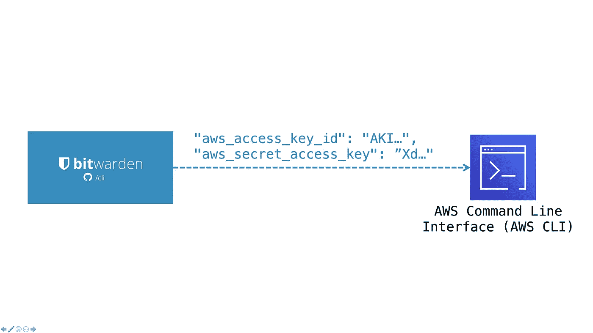
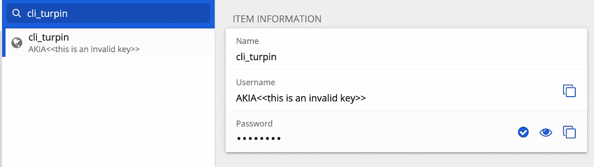

# 使用 Bitwarden 更好地保护您的本地#AWS 密钥

> 原文：<https://medium.com/geekculture/beter-protect-your-local-aws-keys-with-bitwarden-9f63055544dc?source=collection_archive---------15----------------------->

对于不想在`.aws/credentials`文件中以普通 **文本**存储**AWS 键的人。这很容易实现。**

可能有其他解决方案来实现同样的目的，但这是一个快速简单的设置，提供了一个**相当不错的额外安全级别**。

`.aws/credentials`文件提供了运行定制流程的能力。像 AWS 记载的[。我正在使用 macOS 和一些基本的 bash 脚本。](https://docs.aws.amazon.com/cli/latest/userguide/cli-configure-sourcing-external.html)

这样做的`.aws/credentials`文件看起来像这样。

*注意，我这里用的是 2 个 AWS 概要，* `*[turpin]*` *和* `*[micropole]*` *。如果您只有一个 aws 帐户，这将是 AWS 的默认配置文件:* `*[default]*` *。*

将要调用的脚本，名为`awscreds`使用 Bitwarden cli，基本上只用:`bw get username cli_<<profile>>`和`bw get password cli_<<profile>>`对 Bitwarden 做 2 次 cli 调用。

最后，脚本以预期的格式回显收集到的密钥(第 41 行)。

在 Bitwarden 中，您需要尊重命名，并将您的密钥存储在`cli_<<profile>>`下。对于用户名，您提供您的访问密钥 ID，对于密码，您提供秘密访问密钥。

# 在行动！

下面你可以看到如何使用该解决方案。

您首先使用命令`bw unlock`解锁保险库，这将生成一个会话密钥，您需要导出该密钥:

`export BW_SESSION="____#bitwarden_generated_session_key#____`。

之后，您就可以使用 AWS cli，例如`aws s3 ls --profile=turpin`！

为了用硬件 MFA 更好地保护 Bitwarden 帐户，我喜欢使用 [Yubikeys](https://www.yubico.com/products/) ，它也可以无缝地与 Bitwarden cli 配合使用。

提示，在 Bitwarden 应用程序中更新后，可能的更改不会立即反映在 cli 中，要调用 [sync](https://bitwarden.com/help/article/cli/#sync) ，只需执行:`bw sync`。

希望这能有所帮助，泰瑞