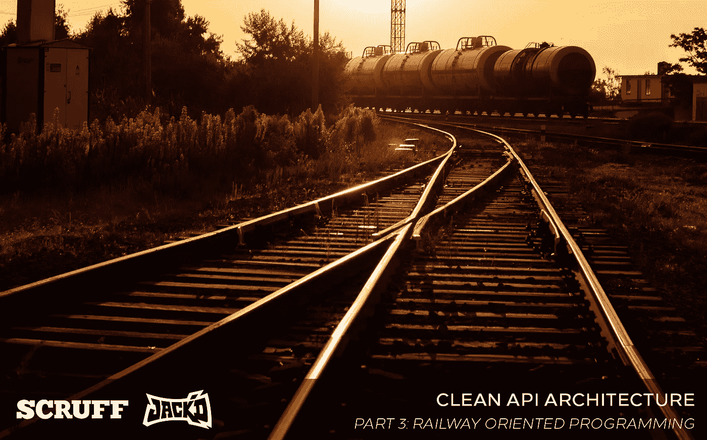
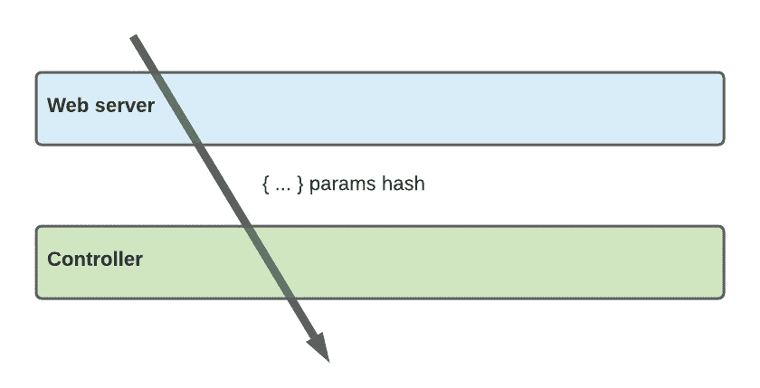
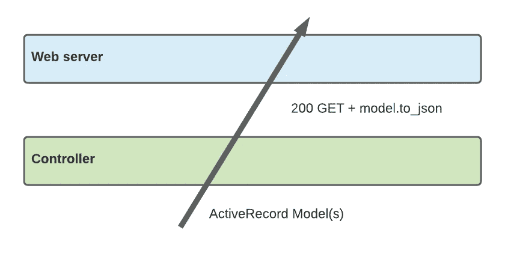
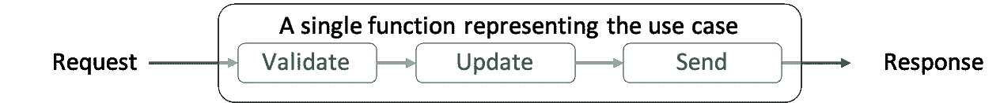
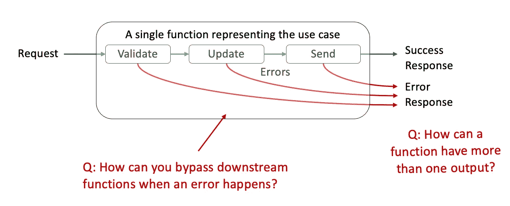
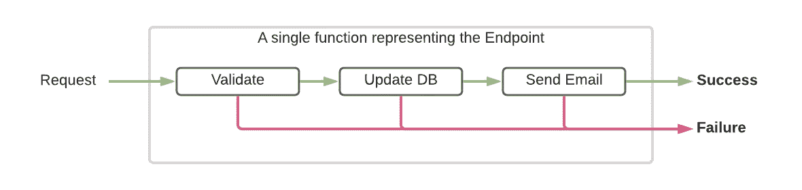
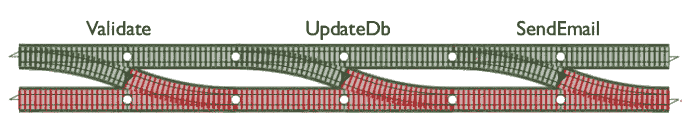
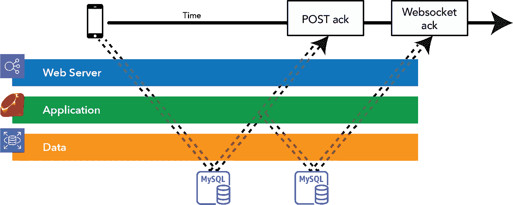

# 面向铁路规划的更好架构

> 原文：<https://medium.com/geekculture/better-architecture-with-railway-oriented-programming-ad4288a273ce?source=collection_archive---------13----------------------->

## 如果你仍然抛出异常，你可能做错了

Light and Dark. Success and Failure. Functional and Reactive. Photo by [Andrew Karn](https://unsplash.com/@jackofthearts?utm_source=unsplash&utm_medium=referral&utm_content=creditCopyText) on [Unsplash](https://unsplash.com/?utm_source=unsplash&utm_medium=referral&utm_content=creditCopyText)

为了让你的代码有一个“架构”，你需要一个地图和一条路径，一个图表和一些箭头。但是，我们所说的“路径”到底指的是什么——箭头的本质是什么，它们是如何表现的？

换句话说，当我们在层间传递数据时，我们传递的是什么？在一个简单的体系结构中，您可能会向下传递各层的参数散列:

并接收各层上的模型对象

最终被映射成某种 HTTP 响应代码+一个响应体。

这种策略适用于简单的 API，但是当我们开始出错时会发生什么呢？

Follow the (functional) road!

# 处理命令式代码中的错误

假设我们有一个简单的 API 端点，`post ‘/user/email’`。我们想要更新客户的电子邮件地址，并通知他地址已经更改。

在我们的 v1 快速而肮脏的方法中，你可能会想到下面的方法(在这里用 [Sinatra](http://sinatrarb.com/) /Ruby 实现):

好的，但是我们如何处理这里的错误呢？我们需要检查它是否有效:

我们还想检查是否没有客户记录:

如果数据库写操作失败怎么办？

如果我们的 smtp 服务没有通知这一变化，该怎么办呢？也许我们想记录这个事实？

对于命令式代码，错误处理至关重要，随着 API 的扩展，更多的错误和边缘情况变得可能或可见。命令式代码中的错误处理使得代码更难阅读。

# 面向铁路的规划

*(注:本节改编自* [*F#为了好玩和利益*](https://fsharpforfunandprofit.com/) *)*

MS actually has a lot of [good](https://en.wikipedia.org/wiki/ReactiveX) [ideas](https://en.wikipedia.org/wiki/TypeScript).

2014 年，一位来自微软的[开发者创造了术语“](https://twitter.com/ScottWlaschin)[铁路导向编程](https://fsharpforfunandprofit.com/rop/)”，它从函数式编程方法中获得了很多灵感。他正确地指出了“设计不愉快的路径”和考虑具有不止一个输出的函数的重要性。

当我们第一次对端点建模时，我们认为它们是具有一个输入和一个输出的简单函数:

随着端点范围的扩大，我们可能会考虑将其分成不同的步骤、层、组件等:

但是在现实世界中，我们知道这些步骤中的每一步都有失败的可能，我们必须在这些步骤中的每一步提供中断控制流的机制:

认识到我们需要返回**多个值**的函数，无论是成功还是错误响应，这是面向铁路编程的基础，也是我们今天 API 设计的基础。

# 成功和失败

Errors are Responses too

失败可能发生在我们处理链的任何地方，我们需要一种简化的方法来退出处理并向客户端返回一个**失败**。或者，如果一切顺利，返回一个**成功**。

用于处理端点的一系列类或步骤代表一个功能单元，它总是导致**成功**或**失败**，其中包含结果数据(例如对于成功的读取操作)或关于所发生的失败的信息(例如在验证期间)。

反过来，每一步可以返回一个**成功**或**失败**，编排器(**控制器**)使用它们来停止或继续处理。

# 面向铁路的规划

我们把上面的功能处理想象成两条平行的铁轨。对于完全成功的请求，列车沿着绿色(**成功**)轨道前进，直到完成。然而，如果沿途任何地方发生故障，列车将切换到红色(**故障**)轨道，我们将错误返回给客户端。

双轨函数的构造和组合是基于函数式编程的理论。有许多重要的规则来管理如何建立和组成“双轨功能”。我们建议在[https://fsharpforfunandprofit.com/rop/](https://fsharpforfunandprofit.com/rop/)通读所有幻灯片

# 在 Ruby 中构建双轨

Haskell humor. See [Stack Overflow.](https://stackoverflow.com/q/3870088)

为了构建双轨执行路径，我们使用[干式单子](https://dry-rb.org/gems/dry-monads/1.3/)。Dry monads 定义了 monads，这是一个特殊的 [ruby mixin](https://www.geeksforgeeks.org/ruby-mixins/) 的正式名称，它定义了两种新的[结果类型](https://dry-rb.org/gems/dry-monads/1.3/result/):成功和失败

现在，任何时候我们可能已经返回了一个值，比如一个 [ActiveRecord](https://guides.rubyonrails.org/active_record_basics.html) 模型对象，我们现在将返回一个`Success(ActiveRecord)`

此外，尽管我们可能已经调用了 raise `SomeError`或者甚至是`halt 4XX`，我们现在将返回一个`Failure(SomeError)`

干燥单胞菌的文档在这里描述[，但是最终的形式可以在这里看到:](https://dry-rb.org/gems/dry-monads/1.3/)

在这个实现中，您可以看到 find_user 现在返回一个 monad，而不是直接返回一个用户。bind 方法解包成功值，并使它们对块可用。借助 ruby 带来的额外元编程魔力，我们可以进一步简化这个模块:

# 与反应式客户端编程的关系

到目前为止，我们一直在谈论服务器端架构，但值得注意的是，我们描述的原则直接映射到客户端架构模式，如[反应式编程](http://reactivex.io/)所述。

在 Swift 中，我们可以在[合并器](https://developer.apple.com/documentation/combine)中重写代码块，它有一个[发布器](https://developer.apple.com/documentation/combine/publisher)的概念，它定义了`Output`和`Failure`类型，类似于上面的干燥单子:

在 Kotlin 中，我们可以使用[单个](http://reactivex.io/RxJava/javadoc/io/reactivex/Single.html)操作符重写 [RxJava](https://github.com/ReactiveX/RxJava) 中的代码块，这再次定义了值和错误输出:

# 更新我们的 W 形执行

在之前的博客文章中，我们描述了 web API 执行流的[模式](/p/9d65232e8a24/)。我们推荐的最后一个模式，W 形执行，可以通过以下方式更新:

Two lanes on each path — one for success, one for failure

我们知道，如果我们在其中一层转换到错误状态，我们将一直处于“错误”状态，直到我们最终通过 POST(或者可能，但不一定总是在 Websocket 中)向用户返回一个值。

# 接下来

是时候我们开始定义一些层了！从 Clean 架构中获得灵感，使用 V-U-W 执行流和面向铁路的编程原则，我们准备好[定义我们今天用于 API 端点设计的架构](/p/2b57074084d5/)。

# 本系列的更多内容

*   [web API 设计的视觉历史](/p/c36044df2ac7/)
*   [web API 执行流程的模式](/p/9d65232e8a24/)
*   面向铁路的编程←你来了
*   [干净的 API 架构](/perry-street-software-engineering/clean-api-architecture-2b57074084d5)
*   [端点责任清单](/nerd-for-tech/the-endpoint-responsibility-checklist-d7763449f44a)
*   [代码示例:保存收藏夹](/perry-street-software-engineering/clean-api-example-save-a-favorite-d45ca6aeba4c)

# 你可能喜欢的其他系列

[**Android 活动生命周期被认为有害**](https://proandroiddev.com/android-activity-lifecycle-considered-harmful-98a5b00d287)**(2021)** Android 进程死亡，不可解释的 NullPointerExceptions，以及你现在就需要的 MVVM 生命周期

[**Xcode 中的 Kotlin？安卓工作室**](/swlh/kotlin-in-xcode-swift-in-android-studio-26a4ace6fc72) 中的 Swift？ **(2020)**
关于在 iOS 上使用 Clean + MVVM 实现一致架构的系列文章& Android

# 关于作者

*埃里克·西尔弗伯格是佩里街软件* [*的首席执行官*](https://www.perrystreet.com/) *，LGBTQ+约会应用*[*SCRUFF*](https://www.scruff.com/)*和*[*Jack ' d*](https://www.jackd.com/)*的发行人，在全球拥有超过 2000 万会员。*