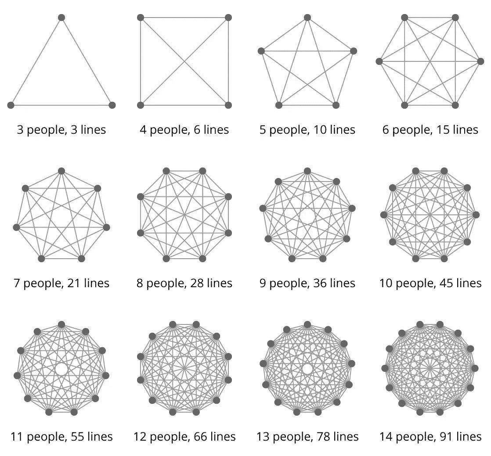
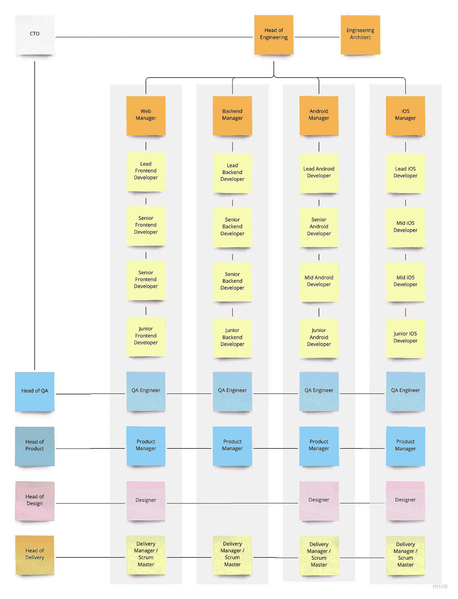
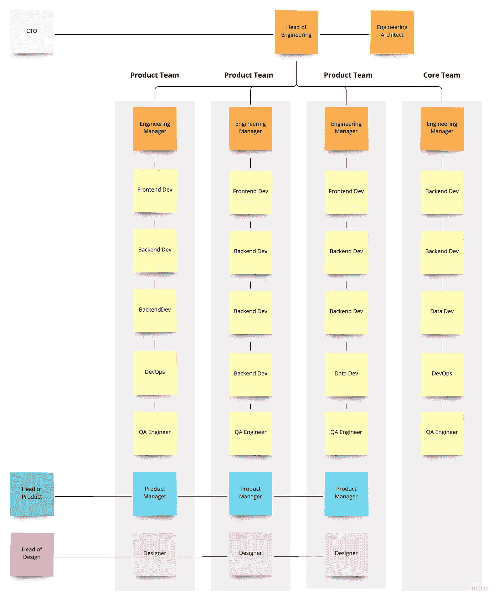
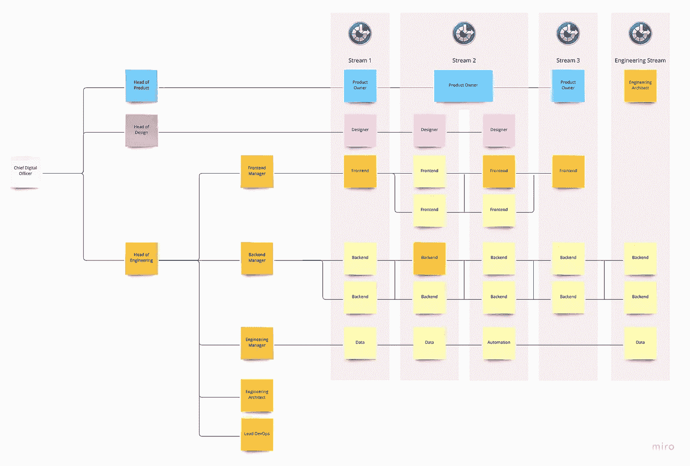

# 更好的软件工程团队——结构、角色、职责以及与常用方法的比较。

> 原文：<https://medium.com/geekculture/better-software-engineering-teams-structures-roles-responsibilities-and-comparison-with-common-fb5c3161c13d?source=collection_archive---------1----------------------->

软件工程团队可能是复杂的，找到一个可靠的方法来组织他们并不容易。很可能，因为没有单一的方法。我的经验告诉我，虽然没有万能的解决方案，但有些方法比其他方法更有优势，成功率也更高。我想分享和回顾一些最常见的团队结构，并深入探讨一个在不同规模和专业的不同组织中对我很有效的解决方案。虽然我没有完美的答案，但对于任何由有技能的人组成的高绩效团队来说，这可能是一个很好的起点，这些人重视贡献和意义，而不是政治和典型的企业废话，这在组织中太常见了。

# 优秀软件工程团队的特征

在我们继续之前，我想总结一下“好的软件团队”意味着什么，因为这可能不是每个人都清楚的。定义至关重要。如果你不同意我的观点，我的结论以后可能听起来很愚蠢，所以让我们排除假设。

*   **明确定义的角色—** 每个团队成员都带来了价值和专业知识，以支持项目和流工作的目标。很清楚为什么有人被选入这个团队以及他们的角色。
*   **均衡的资历——不同类型的人都有足够的工作。高年级学生认为无聊和没有动力的事情，低年级学生可能会觉得有挑战性和令人兴奋。不平衡的团队会导致糟糕的结果和缺乏有意义的工作，尤其是当每个人都高年级的时候。**
*   **责任和所有权—** 每个人都要对自己的工作负责，不能有丝毫闪失。好的团队会在个人和团队层面上对自己负责。
*   **合理规模—** 大团队=复杂沟通。越多的人需要被保持在循环中，完成的工作就越少，产生的混乱就越多。完美的敏捷团队大约有 4-5 名工程师+产品和/或设计师，以保持事情的顺利和简单。

You can see that beyond 5, communication is getting very complicated. In groups beyond 8, effective communication doesn’t exist. PS. Sorry, don’t know the author of this picture to give credit :/

*   **信任—** 人们需要更好地了解彼此，而不仅仅是通过公关计划、站立和争论。一个好的团队是一群相互信任的人，即使他们有不同意见，也能进行诚实和建设性的讨论。这在遥远的第一世界是极其重要的。
*   **透明度—** 团队正在做的事情一目了然。通常，这意味着有一个更新的董事会和与高层公司目标和工作流(路线图)相关的任务。一个好的团队会主动分享他们所做的事情，而不会被追赶着更新。
*   **强大的领导力—** 领导者是团队成功的唯一且最重要的预测者。如果我前面提到的一些要点不在一个地方，如透明度、缺乏明确定义的角色或涉及太多经理，就很难理解它们的影响。

 [## TL；博士:什么是领导，什么不是。好的和坏的。

### 人们通常认为处于领导地位意味着舒适的座位、高薪和发号施令。而且很远…

andrewwinnicki.medium.com](https://andrewwinnicki.medium.com/tl-dr-what-leadership-is-and-what-its-not-the-good-and-the-bad-d8ba85a6dc91) 

最终，一个好的软件工程团队会工作得很好，但是你会惊讶地发现事实往往并非如此。工程领导和开发人员很少挑战组织结构的现状，认为他们知道的敌人比他们不知道的敌人好。这就是为什么如此多的组织工作效率低下。这个世界不得不开发一些愚蠢的短语，如“伟大的辞职”或最近流行的“悄悄辞职”,以引起人们对糟糕领导的注意，这可能不会改变任何事情。

# 深入探究最常见的团队结构

让我们深入研究两种最常见和最有缺陷的方法。当然，还有更多的，但是我已经了解到它们中的大部分只是与我将详述的两个略有不同的变体。

# 有软件经理的单一学科团队

在典型的瀑布设置中，经常可以找到这样的结构。然而，我最近偶然发现了一家公司，他们的工程团队就是这样建立的，并试图变得敏捷。我的第一个目标是远离它，因为它在整个产品中产生了巨大的低效率，工程师们超负荷工作，但却不能交付他们所能交付的。

## 赞成的意见

*   它可以将每个技术团队聚集在一起，并在成员之间建立典型的交流。
*   开发经理很可能是他们领域内的技术专家。
*   当团队很小(每个团队 2-3 人)时，易于设置且感觉直观。通常，对于那些不知道工程团队应该如何构建的人来说，这是一种偏好。
*   通常伴随着团队中非常明确的职责。
*   易于扩展到新的技术领域。
*   面试新员工更容易，因为他们会与同一个经理交谈，这有助于在团队中创造更好的文化。

## 骗局

*   这可能会在科技组织中产生部落主义，因为每个团队成员都只认同一个紧密的团体。这就导致了我们 vs 他们的心态。
*   有时这种方法没有工程经理，由产品或交付人员管理团队，这意味着零职业发展和糟糕的技术专注。团队变成了特性驱动，工程师变成了代码猴子。
*   由于产品经常需要跨多个平台交付，在整个组织内造成孤岛和永无止境的依赖性。团队必须相互依赖和等待，通常有不同的优先级。
*   太多的流程和项目发生在同一个团队中，因为每个团队成员都可能从事不同的工作。
*   偶尔，团队成员不知道他们的同事在做什么，尽管他们在每次站立时都分享更新。他们就是不在乎。
*   更难协调跨平台版本。
*   产品、交付和 scrum masters 成为瓶颈，因为他们混淆了许多请求者，并试图同时协调多个工程师的许多项目。
*   缺乏对其他团队正在做什么和如何做的了解，很少有机会从外部获得帮助。
*   人们很难涉足比他们的团队正在处理的业务领域更大的其他业务领域。对于工程师来说，探索他们还不是专家的新技术和领域几乎是不可能的。
*   人们分享知识和尝试新事物的机会越来越少，比如领导团队、参与不同的项目和扮演不同的角色。
*   更难表现出任何主动性，主要是当一个团队由个性强势或自我中心的长者主导时。
*   如果需要更多工程师，可扩展性有限。一个经理有 7 份以上的报告是有问题的。这会阻塞团队，如果你创建另一个团队，例如两个 web 团队，你将会有两个 web 经理，很可能不一致

# 有软件经理的跨职能团队

这种设置在“敏捷环境”中很普遍，但是带来了许多挑战和问题。我认为，尽管它看起来很现代，但与我之前谈到的由软件经理组成的单学科团队相比，它还是倒退了一步。它有所有世界中最糟糕的，但让高层管理人员感觉良好，可能这就是它受欢迎的原因。太受欢迎了。

## 赞成的意见

*   易于设置。
*   通过添加更多团队，非常容易横向扩展。
*   很容易找到经理，因为他们不需要成为技术专家。他们只是关注人，而不是技术。
*   很容易找到承包商，并将他们分配到特定的小组。
*   创建良好的责任和焦点的筒仓，对于工程团队之外的人来说容易理解。

## 骗局

*   通常太多不同类型的管理者参与到一个敏捷团队中会造成责任和团队领导的混乱。尤其是当出现技术性争论，有人不得不做出不受欢迎的决定时。
*   经理们经常变成“人事经理”，他们的技术专长变得无关紧要并被遗忘。大多数工程经理都曾经是程序员，所以对他们来说可能特别难。
*   在团队之间交换工程师就像开始一项新的工作——新的经理、流程，有时还有应用程序。这可能是一个非常不同的环境，对工程师和公司来说通常都很困难。
*   团队的技能组合变得僵化和预先定义。
*   有时，这种方法没有工程经理和产品或交付人员来管理团队，这意味着零职业发展和糟糕的技术关注。
*   很少或没有激励在团队之间调整工程实践，特别是如果每个团队都在开发不同的应用程序。它会导致不同的标准和不必要的开销或工作方式的差异。
*   它创造了一种团队精神，团队之外的任何人都是敌人，工程师通常与其他团队中从事相同代码库和技术的同事联系较少。
*   更少的机会与工程师同事交谈，挑战可能会在以后伤害公司的决策。
*   经理是前编码员，他们很可能有一个专长，他们的团队通常是跨职能的。这限制了他们的技术贡献，并可能产生偏见。
*   开发人员通常不知道其他团队在做什么，也不知道来自同一专业的同事在做什么。这个是可以解决的，但是通常情况下，都是放任不管。
*   这种设置经常导致一种想法，即只雇佣全栈工程师来解决一些问题(但引入了新的问题)。
*   招聘是一件尴尬的事情，因为一个人可能会被一些他们永远不会密切合作的人面试。那非常糟糕。

这是 Spotify 模式的简化版，除非你是一家负担得起的公司，否则你可能不应该考虑它。Spotify 承认它也不适合他们，所以如果你正在考虑，这应该是一个很好的迹象。还有，他们的小队、联盟、部落和分会的命名惯例在我听来很奇怪。

# 有效的方法——自我管理的跨职能团队

建立软件工程师团队的合理方法是基于信任和我们正在与负责任的成年人打交道的假设。如果团队在环境的引导下，理解团队和公司的目标以及他们的工作对他们的贡献，那么他们可以更好地组织自己来完成工作。

> "每个经理应该能够给他的直接下属提供两个大披萨."—遵循这个规则，团队就会自然成长，可以预测。

这个结构已经由 70 多名工程师和 15 个工作流组成的团队进行了测试(经过一些小的调整)。它已经在 6 个工程师和 2 个流等小组中进行了测试。当然，如果我们将它应用于一个 100 多名员工的技术组织，事情会变得复杂。尽管如此，当您根据产品或应用程序将它分成更小的单元时，它应该不难扩展，但这完全取决于环境。

## **关于该图的注释澄清了几件事:**

*   每个流程中的暗黄色方框=团队领导。
*   工程、产品和设计团队向同一个经理汇报，以建立不同学科之间的紧密联系，但在许多情况下，这实际上是不可能的。
*   图中没有 QA，所以值得将他们作为其他成员添加到每个工作流中。我会加上 QA 经理来监督他们。

## 赞成的意见

*   工程经理对多个工作流有一个总体的了解，并且可以识别不同项目中的挑战和帮助。
*   在真正需要的团队中调动员工更容易。不管是永久的还是暂时的。无论如何，没有必要更换经理。
*   人们的技能或愿望可以更好地匹配路线图中的项目(流)。
*   经理很可能是他们被雇佣来领导的技术领域的专家，这使他们成为人事经理，有助于处理技术问题和指导关键决策。
*   每个工程师都觉得自己是敏捷团队的一部分，是技术团队的一部分。防止工作孤岛和部落主义。
*   更容易面试新员工，因为他们与同一个招聘经理交谈，这有助于在工程团队中创建更好的文化。
*   很容易将学科细分为更细粒度的团队，如设计团队和研究团队，每个团队都有自己的经理，向 UI/UX 负责人报告。
*   管理人员对整个工程团队正在发生的事情有一个总体的了解，而不是只关注一小部分，或者一个项目。
*   更容易带来承包商，因为他们受技术约束，并将成为同一平台组的一部分。在敏捷团队中也很容易调动他们。
*   管理者不仅可以考虑技术，还可以考虑团队的人的方面。这有助于创造稳固的职业发展道路和更多的成长机会。
*   大多数经理仍然是热情的程序员，希望分享他们的知识，帮助 PRs，偶尔写点东西。
*   当发生变化时，更容易替换或替代。
*   鼓励知识共享、挑战决策并在技术堆栈中互相帮助。PRs 是一个例子，开发人员可以查看其他团队的工作。
*   在建立能够快速响应变化的独立、快乐的敏捷团队方面，优点远远超过了缺点。

## 骗局

*   这可能会造成混乱，因为如果工程师没有很强的所有权技能，经理可能会参与多个项目。
*   来自另一个敏捷团队的 PRs 如果没有得到适当的管理或考虑，会造成一些麻烦。
*   它需要每个团队成员的主动性、所有权和责任感，因为他们是敏捷团队中各自技术的代言人。
*   可能很难得到高层管理人员的认可，因为他们必须放弃控制权，而且这种方法需要相信人们是有能力的工程师，而不仅仅是代码猴子。
*   偶尔对构建团队进行额外规划(可能一年发生两次)。
*   这种设置有时会导致每个敏捷团队中有太多的工程师。小心点。
*   有些人会比其他人更频繁地在敏捷团队之间跳槽。
*   例如，如果管理层希望他们在照章办事的 Scrum 中工作，那么就很难实施自上而下的敏捷过程。

# 公司做的其他事与愿违的事情，没有什么奇特的团队结构可以解决

*   专门的、孤立的团队处理设计系统或“核心”团队这样的事情通常是有帮助的，但除非你雇佣 200 多名开发人员，否则他们会违背公司目标和良好的工程实践。
*   **只把赌注压在多面手**，能做任何事情的全栈开发人员身上，没有专注于雇佣对主题有深刻知识的天才工程师来推动数字产品的技术、架构和发展。

 [## TL；DR:全堆栈与半堆栈。为什么公司寻找水管工-理发师-飞行员？

### 底线是——如果你什么都擅长，那你什么都不擅长。这只是概括，还有…

medium.com](/geekculture/tl-dr-full-stack-vs-half-stack-why-companies-are-looking-for-plumber-hairdresser-pilot-4ae75d4ed7ec) 

*   **推行特定的敏捷方法**，并尝试让所有团队都适应相同的方法。例如，2 周，由书 Scrum。不同的团队有不同的需求，如果领导层期望每个人都以完全相同的方式工作，那么所有的团队都会像链条中最差的一环一样脆弱。
*   **一个由非工程师**领导的工程交付团队，比如产品或设计师，是事情不会进展顺利的极好迹象。不了解工程师生活的人，很少能平衡发展和优先级，为公司带来正确的价值。在大多数情况下，它会导致一种特性困扰，在这种情况下，最重要的是交付下一个东西，只是勾选另一个框。
*   痴迷于产品的公司会产生大量被称为“工程积压”的浪费，让每个人的生活都很痛苦，直到为时已晚才意识到这个问题。
*   过于依赖昂贵承包商的公司往往目光短浅，这有可能使他们成为工程劳动力的大多数。事情在此时此地起作用，但将来会让公司付出代价。这是在公司里常见的糟糕的领导方式，在公司里$$$美元是最重要的。
*   **厨房里厨师太多**！你多久见过一个由交付、产品和工程经理组成的团队？除此之外，可能还有参与其中的设计经理和项目经理？在大公司的世界里，这种团队并不罕见。这导致了太多的空谈和无所作为。Scrum masters &每个团队的交付经理带来零价值，并且经常在工程师和产品团队之间制造瓶颈和沟通问题。

 [## TL；功能失调的软件工程团队背后的 DR 思想和原因。

### 我们都经历过，或者也许你们中的一些人现在就在那里。没关系。根据我的经验，这是一个非常重要的…

andrewwinnicki.medium.com](https://andrewwinnicki.medium.com/tl-dr-thoughts-and-reasons-behind-dysfunctional-software-engineering-teams-821190c4b0c3) 

# 最后一句话…

不同的方法可能在不同的环境中更有效。你可能会得出错误的结论，为什么某个特定的设置不适合你。因此，最后一节关于公司所做的适得其反的事情，只是重申了这些结构注定会失败的原因。

去尝试吧，不要害怕尝试。尽管这并不容易。

更多关于团队和工作方式的帖子，你可能会感兴趣…

 [## TL；鼓励你的团队去做他们想做的事情。让他们升级吧！

### 那么，我们为什么要允许团队做他们想做的事情呢？以及为什么技术领导应该做更多来支持这样的…

medium.com](/geekculture/tl-dr-encourage-your-team-to-do-what-they-want-let-them-level-up-40b154e550fb)  [## TL；灾难恢复组织的文化第 1 部分:紧密与松散及其含义？

### 两种类型都有自己的位置，最终一种并不比另一种更好。这种分裂也转化为…

andrewwinnicki.medium.com](https://andrewwinnicki.medium.com/tl-dr-organisations-culture-part-1-tight-vs-loose-and-what-does-it-mean-692010e04130)  [## TL；博士组织的文化第 2 部分:紧密松散及其如何帮助你。

### 我之前没有提到的是一种平衡的方法，它位于中间。然而，它是上升的…

andrewwinnicki.medium.com](https://andrewwinnicki.medium.com/tl-dr-organisations-culture-part-2-tight-looseness-and-how-it-can-help-you-454cbd9700be)