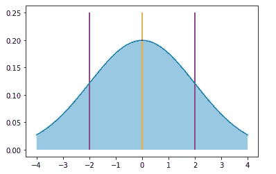
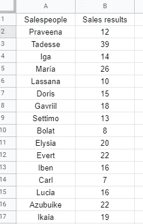
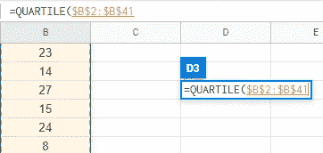

# 比“一般”更好:总结你的数据以获得可靠的细节

> 原文：<https://medium.com/geekculture/better-than-average-summarizing-your-data-to-get-robust-details-ad65bb9b69cc?source=collection_archive---------18----------------------->


Image by [Lorenzo Cafaro](https://pixabay.com/users/3844328-3844328/?utm_source=link-attribution&utm_medium=referral&utm_campaign=image&utm_content=1863880) from [Pixabay](https://pixabay.com/?utm_source=link-attribution&utm_medium=referral&utm_campaign=image&utm_content=1863880)

仅仅用“平均值”来描述你的数据集是危险的。无论你谈论的是人均销售额，还是每个地点的平均不活跃客户，你都没有得到全面的了解。另外，如果你用“平均水平”来衡量单个员工，也许你根本没有衡量任何东西，每个人都会有压力。

让我们从一个现实生活中的例子开始，说明过度依赖平均值会让我们失败。

## 案例研究

美国空军在 20 世纪 50 年代遭受了飞行事故率高的痛苦。这些事故的原因，经过调查，很大程度上归咎于“飞行员失误”更具体地说，这些错误是由驾驶舱尺寸造成的飞行员失误造成的:对一些人来说太紧，对另一些人来说太大。毕竟，在够到一个关键的开关时，多几厘米就能有所不同！

这让空军感到困惑，他们花费了大量的资源——时间和金钱——精心记录了 4063 名飞行员身体的 140 多个数据点，并取平均值。他们相信通过使用这些数据，他们已经建造了完美的驾驶舱。那么，出了什么问题呢？他们所有的研究、时间和努力都白费了吗？

通过对所有这些飞行员的平均尺寸进行测量，他们确保了驾驶舱的尺寸不适合 T2，因为没有一个飞行员是“平均的”，只有 T4 和 T5 他们试图将测量范围缩小到 3 个点:脖子、手腕和大腿。猜猜有多少飞行员符合这些测量值的平均值？**只有 3.5%** 。

现在，你可能会想“是的，但是，用人均销售额来总结销售数据是有用的。”就像上面的例子，除非你所有的销售人员都有非常相似的结果，否则你没有详细描述他们中的任何一个，也就是说，你没有描述任何东西，除了如何将你的总销售额平均分成你有多少销售人员。这不能帮助我理解你的数据，我宁愿只知道总销售额，谢谢。

根据我的商业经验，在会议上抛出“平均”统计数据的人通常会接着进入个人的详细分类。那么，谈论平均销售额会浪费时间和你的观众有限的宝贵的注意力！他们已经有一堆数字要记，所以让我们把数据放在重要的地方。

# 我们能快速简单地总结一个大型数据集吗？

介绍**五数汇总！**

我们可以将一组数据分解成五个数字，从而得到一个更加完整的图像。我们如何做到这一点？

## **四分位数**。

你可能还记得高中或大学数学课上的四分位数。**四分位数**是一种*分位数*，这是一个花哨的数学名称，指的是将数据集“切割”成更小范围的点。*百分位数*也是*分位数*的一个类别，它将数据分成 100 个均匀的范围，通常用于描述学生在国家考试中的分数(例如:“*这个学生在第 75 百分位数*”)。学术和科学的其他领域甚至使用像十分位数这样的东西，它分成十个范围的组。

四分位数将您的数据集分成四个大致相等的部分，不管您的数据集中有多少个数据点！这是总结非常大的数据集的有效方法。

第四个四分位数(通常写为 Q4)是数据集中最大的数字，或最大值。

第三个四分位数(Q3)是最大值和集合的整体中间数据点之间的中点。

第 2 个四分位数其实是中位数，是整个数据集的真实中间数；所有数据的一半在这个点以上，一半在这个点以下。你可能已经看到中位数被用于诸如房价、整个国家或行业的工资等等。这是因为中位数不受经常扭曲传统平均值的极值上的大数字的影响。例如，如果你有一个房间，里面有许多 IT 工程师，平均工资可能在 3-4 万左右，但是比尔·盖茨走进房间，平均工资**飙升到 10 万，尽管*其他人都没有变得更富有*——然而**平均工资**并没有因为比尔·盖茨的出现而改变！因此，在统计领域中，中位数通常被称为“稳健”估计量，因为异常值不会对其产生强烈影响。**

第一个四分位数(Q1)是中位数和最小数据点之间的中间数。

看下图。金线是数据集的绝对中心(中位数)，Q2。左边的紫色线截断了数据集底部的 25%,右边的紫色线截断了顶部的 25%。这样，数据集的中间 50%很容易被捕获，这有助于消除数据中的异常值。例如，在现实世界中，你可以看到大多数“普通”销售人员的表现，而不会受到影响团队平均水平的超级明星或表现不佳者的干扰。



The gold line is the center (median) of the dataset: Q2\. Q1 and Q3 are the purple lines on either side.

最后，第 0 个四分位数(Q0)就是最小值，或者说是最小的数。

你会注意到，我们实际上描述了上面的五个数字，尽管它们被称为“四分位数”——有时候这些事情的结果很有趣！

好，让我们在电子表格中做一个真实的例子！

# 真实示例时间！

我用电脑为这些虚构的销售人员生成了一些随机数据。我生成了 40 名销售人员，但这里只显示了一部分:



让我们开始做我们的**五位数总结吧！**



首先在你的电子表格软件中使用“四分位数”功能(Excel 和 Google Sheets 都应该有)。如上所示，选择整个数据范围。我们将从第 0 个四分位数(数据集的最小数量)开始。


总的来说，您的公式应该如下所示:

```
=QUARTILE([your-data-range], 0)
```

现在，对所有四分位数重复这个公式:只需在每个单元格中用 1、2、3 和 4 替换“0”。


Notice the ‘4’ in the formula at the top. This will find the max number in your dataset.

## 我们总结完了！

现在，我们一眼就能看出，我们‘正式’员工中的**中间 50%** 在 12~24 日之间做出了**的销售**。这可以向我们展示“大多数”销售人员的表现。

我们还可以对我们的集团做如下陈述:

**我们的员工 25%****比*** *多卖了 24 台。**

***我们的工作人员卖了***下的 18 台。****

****75%的员工在* *下卖出了****24 台******

****25%的我方人员在* *下卖出了****12 台******

***等等，等等……***

****

**Try looking at how far apart each of the numbers are for a sense of the ‘spacing’ in your data! Are the numbers generally tightly grouped or farther apart?**

**观察这些数字之间的空间可以告诉你很多关于它们之间的数据。例如，如果第三季度和第四季度之间有一个巨大的差距(最大值)，那么很可能你有一些疯狂的异常值(或超级销售人员)。底层的 25%也是如此。**

# **结论**

**只需几个数字，您就可以对数据集进行比仅使用平均值更可靠的分析。您可以看到数据集中的“间距”和间隙/异常值，并轻松地比较不同的部分:如果数据点倾向于彼此靠近，或彼此远离。**

**顺便说一下，在上面的随机数据集中，**平均值为 18.9** 。在这个数据集中，最低**销售额为 3** ，最高**销售额为 39** …。18.9 可以很好地描述我们所有的销售人员吗？**

**[1]:这个关于空军的故事摘自托德·罗斯的优秀著作《平均的终结》**