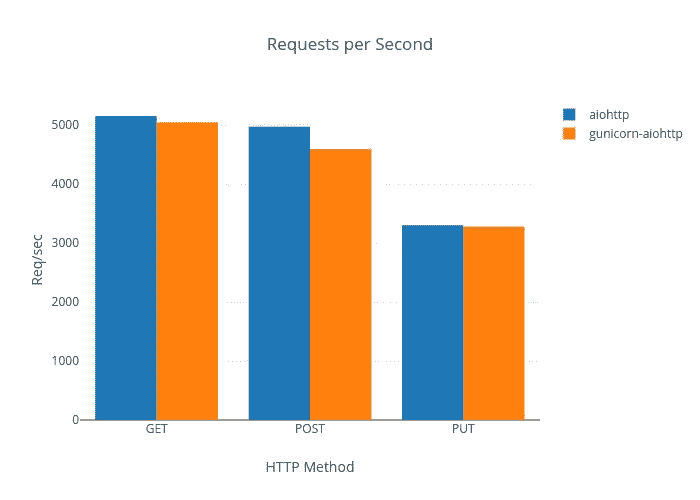

# 超越“Hello World”:Kubernetes 中的现代异步 Python

> 原文：<https://medium.com/geekculture/beyond-hello-world-modern-asynchronous-python-in-kubernetes-f2c4ecd4a38d?source=collection_archive---------0----------------------->

## 在 Kubernetes 上用 Python 3 部署可伸缩的、生产就绪的 Web 服务


在过去的几年里，Python 经历了某种进化。从 Python 3.4 到 3.7 我们已经看到了`[asyncio](https://docs.python.org/3/library/asyncio.html)`的引入、`[async/await](https://docs.python.org/3/library/asyncio-task.html#coroutines)`关键词的引入和形式化，以及对`asyncio`性能的再投资。用 Python 编写异步代码从未像现在这样简单、高效或高效。

除了对 stdlib 的改进，Python 的开源社区也进入了某种复兴。开源社区已经接受了 async/await 的潜力，而`asyncio`库的灵活性已经被证明是一个巨大的福利。`asyncio`的可扩展 API 很容易鼓励替代的事件循环实现，我们现在有了像`[uvloop](https://uvloop.readthedocs.io/)`这样的库，它是一个使用`[libuv](https://github.com/libuv/libuv)`的事件循环的`asyncio`兼容实现。此外，当谈到 web 框架时，没有更多的选项可供选择，而且有[个决定性的基准](https://www.techempower.com/benchmarks/#section=data-r17&hw=cl&test=fortune&l=zijzen-1)在那里对它们进行正面交锋。

然而，当构建一个新的应用程序时，很少有人谈论这些基准在如何部署应用程序的上下文中对您意味着什么。它将通过基于云的虚拟机部署吗？直接连接到服务器？那 Kubernetes 或者 Docker Swarm 呢？

# 假设

这篇文章假设:

1.  您已经做出了(明智的)决定，为您的 web 服务使用异步框架
2.  您正在寻找 Kubernetes 部署您的服务。

出于本文的目的，我选择了 aiohttp 框架，因为它成熟且稳定，但是这里提供的一般规则应该适用于当今市场上的任何开源框架。

# 这都是关于缩放

当我们谈论*扩展*时，我们通常指两种主要方法之一:

1.  水平扩展—跨机器和/或环境扩展
2.  垂直扩展—在给定机器的资源上进行扩展。

# 我们正在测试的

更传统的部署需要垂直和水平扩展的混合，重点是*垂直* —通过最大限度地利用机器上可用的 CPU 内核。对于 Python web 服务来说，这通常意味着在 [Gunicorn](http://docs.gunicorn.org/en/stable/index.html) 或另一个类似的生产解决方案之后运行你的应用程序。我同意，对于这些环境，这绝对是合适的策略。

当您的应用程序部署在 Kubernetes 上时，它在前台的小型 Docker 容器上运行，这些容器被安排在 Pods 中，只占用一小部分 CPU 和最小的内存。Kubernetes 利用了*水平*缩放。您不是增加单个 Pod 上的线程或工作进程的数量，而是扩展 Pod 的数量以满足需求。

如果处理得当，用 Docker 进行开发和部署可以为我们提供非常有力的保证:

*   **您开发和调试的应用程序运行时就是您部署的应用程序运行时。**

考虑到这一点，我着手确定以下问题:

*   **在 Kubernetes 的环境中，增加部署的运行时依赖是否值得额外的开销和/或风险？**

# 应用实施和设计

我使用以下库实现了一个简单的 RESTful API，支持 GET/PUT/POST/DELETE:

1.  服务器: [aiohttp](https://aiohttp.readthedocs.io/en/stable/)
2.  数据库: [PostgreSQL](https://www.postgresql.org/)
3.  数据库客户端: [asyncpg](https://github.com/MagicStack/asyncpg)

此外，我安装了以下库来提高整体性能:

1.  [aiodns](https://github.com/saghul/aiodns) (通过`aiohttp[fast]`)
2.  [卡特](https://github.com/PyYoshi/cChardet)(通过`aiohttp[fast]`)
3.  [uvloop](https://uvloop.readthedocs.io/)

`aiodns` & `cchardet`被`aiohttp`自动使用，如果它们可用的话，也是一个空操作。`uvloop`可以通过运行`app.py`顶部的`uvloop.install()`来调用(如果你愿意，也可以在`ifmain`下面)。在这样做之前，确保你没有为你的循环创建一个全局变量😄)!

# 应用程序运行时

现在我们已经有了我们的应用程序，是时候弄清楚如何在生产中运行它了。出于本文的目的，我设置了两个应用程序入口点:

1.  直接调用`python app.py`(使用`aiohttp.web.run_app`)，或者…
2.  通过 [Gunicorn](https://gunicorn.org/) ，通过调用`gunicorn --config=guniconfig app_wsgi:app`

*   Gunicorn 被配置为使用单个`aiohttp.GunicornUVLoopWebWorker`
*   Gunicorn 还配置了 1000 个请求的最大工作生命周期，以应对长期工作人员可能出现的[详细记录的](https://www.google.com/search?q=gunicorn+memory+leak)内存泄漏问题。

应用程序本身构建在 Docker 映像上，使用 Python/Alpine-Linux 基础映像的多阶段构建，以确保映像尽可能小。

*需要注意的是，aiohttp 在* [*其文档*](https://www.google.com/search?q=gunicorn+memory+leak) *中提到，在 Gunicorn 后面运行 aiohttp 服务器会导致性能变慢。*

# 应用程序部署

这两个应用都是使用 Nginx 入口后的 [ankh](https://github.com/appnexus/ankh) 部署的，具有相同的服务定义和以下资源配置文件:

```
replicas: 10
limits:
  cpu: 1
  memory: 512Mi
requests:
  cpu: .1
  memory: 256Mi
```

# 系统地

随着我的应用程序的部署和错误的消除，现在是时候感受一下这两个服务将如何运行了。

## 应用程序性能

以下所有基准测试都是使用 [hey](https://github.com/rakyll/hey) 运行的，设置为 200 个并发连接，持续 30 秒。没有实施速率限制，因为我们的目标是确定在高压力和充分利用资源的情况下的部署性能。

我们为我们的服务器设置了以下服务级别协议。得到:100 ms 以下 99.9%
2。岗位:150 ms 以下 99.9%
3。PUT: 99.9%在 200 毫秒以下



[Requests Per Second — Head to Head](https://plot.ly/~seandstewart/6)


[Response Time Distribution within 99.9% — GET — 1ms Buckets](https://plot.ly/~seandstewart/8)


[Response Time Distribution within 99.9% — POST — 1ms Buckets](https://plot.ly/~seandstewart/16)


[Response Time Distribution within 99.9% — PUT — 1ms Buckets](https://plot.ly/~seandstewart/14)


[Head-to-Head Distribution, All Quantiles. Click through to play around!](https://plot.ly/~seandstewart/22)

## 资源利用

对于简单的`aiohttp`部署，副本集以大约 1.15Gi 内存和<0.01 CPU 整体运行(大约 115Mi 内存和大约 0 CPU/pod)。在负载情况下，CPU 的利用率限制在 90 %- 100%之间(大约 90%用于 GET 测试，100%用于 PUT)，但是内存使用从未超过 1.5Gi，远低于我们的 5Gi 限制。

Gunicorn 部署始终使用大约 30%以上的内存，CPU 利用率略高，约为 95%-105% ***** 。

******* *Kubernetes 通过节流来强制执行 CPU 限制，而不是像内存限制那样通过杀死容器。这意味着您可能会看到偶尔的峰值略高于您配置的限制。我发现* [*这篇文章*](/@betz.mark/understanding-resource-limits-in-kubernetes-cpu-time-9eff74d3161b) *对理解这个机制很有帮助。*

## 初步评估

总而言之，两种部署的性能几乎是相同的，Gunicorn 带来的轻微服务降级不一定是交易的破坏者，这取决于您的特定应用程序必须满足的 SLA。然而，如果 Gunicorn 实际上妨碍了这个部署架构中应用程序的性能和可靠性，那么是否应该使用它呢？

# 附加基准

有了这些数据，我决定试试能否测试一个更“标准”的 Gunicorn 式部署，以便利用 Gunicorn 的垂直扩展能力，遵循 [Gunicorn 文档](http://docs.gunicorn.org/en/stable/settings.html#workers)中提到的古老经验法则。

我登陆了以下 Gunicorn 部署的资源配置文件:

```
replicas: 2
limits:
  cpu: 5
  memory: 3Gi
requests:
  cpu: 5
  memory: 2Gi
```

每个 Pod 有 11 个工作线程，因此副本集总共有 10 个 CPU、6Gi 内存和 22 个工作线程。

## 应用程序性能

这是我们在上面看到的图表，混合了这种部署…


[Response Time Distributions within 99.9% — GET — 1 ms Buckets](https://plot.ly/~seandstewart/33)


[Response Time Distributions within 99.9% — POST — 1 ms Buckets](https://plot.ly/~seandstewart/31)


[Response Time Distributions within 99.9% — PUT — 1 ms Buckets](https://plot.ly/~seandstewart/29)


[Head-to-Head Distribution, All Quantiles. Click through to play around!](https://plot.ly/~seandstewart/27)

副本集中共有 22 个工作线程，超过 2 个 pod，该部署超出了 10 个 CPU 的限制，并始终以大约 3.5Gi 的内存运行。这大约增加了 43%的 CPU 和 2 倍的⅓内存。

不仅如此，就性能和可靠性而言，这一部署甚至无法与前两者相提并论，而且远远超出了我们针对所有运营的服务级别协议。有人可能会说，扩大每个 Pod 或扩展副本集会改善这种情况，他们是对的。然而，在这一点上，我们已经使用了大量的资源来实现低于标准的结果，并且为了满足替代部署的性能而向上或向外扩展违背了 Kubernetes 部署的核心思想:可以按需向外扩展的小型轻量级容器。

# 最终评估

虽然没有一个应用程序是相同的，但我相信上面的数据显示了基于历史解决方案假设部署策略的谬误。虽然 Gunicorn 在正确部署的情况下不一定会妨碍我们应用程序的性能，但它的使用是以下列成本为代价的:

1.  这是一个额外的依赖项，它改变了应用程序在生产环境中的运行时间和在开发环境中的运行时间。
2.  还有一层需要学习和调试，并确保您的同事也很熟悉。
3.  如果配置不正确，至少会多出~ **43%** 的 CPU 和 **2⅓x** 的内存，如果配置正确，大约会多出 **~20%** 的内存。

我的建议(如果你还没猜到的话)是完全放弃这种生产依赖。在 Gunicorn 之后的 Kubernetes 上部署 web 服务，在性能或稳定性方面并没有带来额外的好处，代价是需要更多的资源。