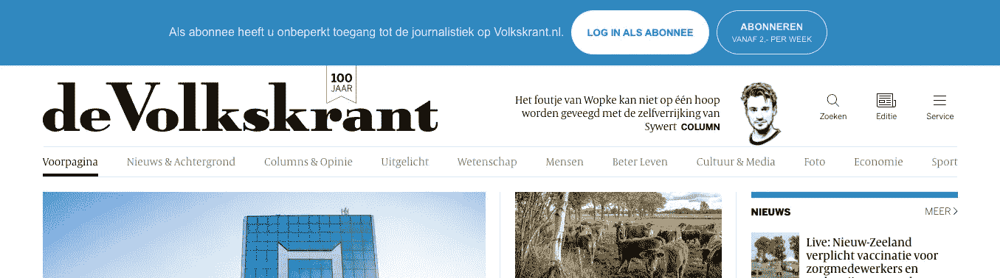
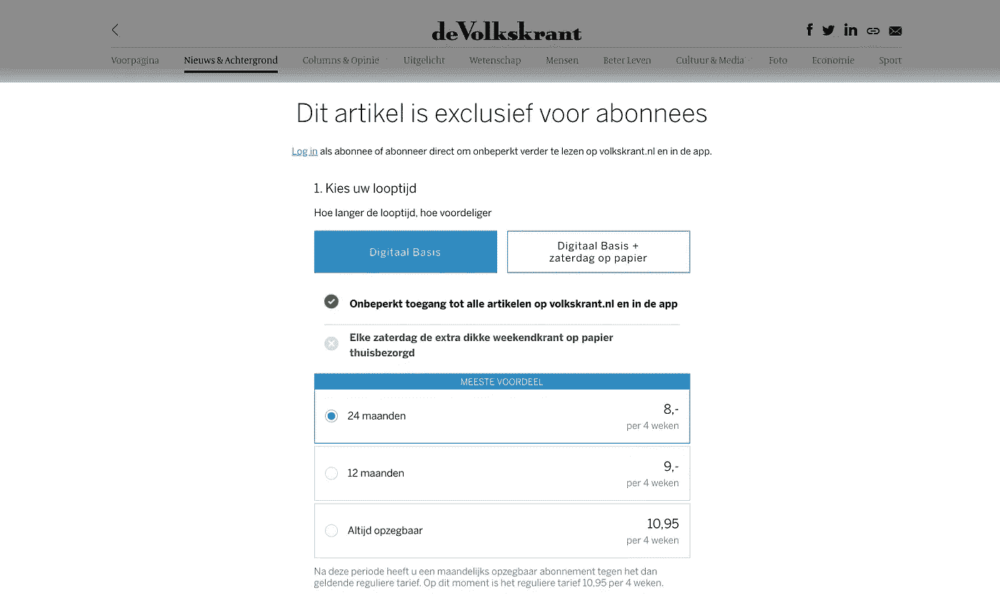
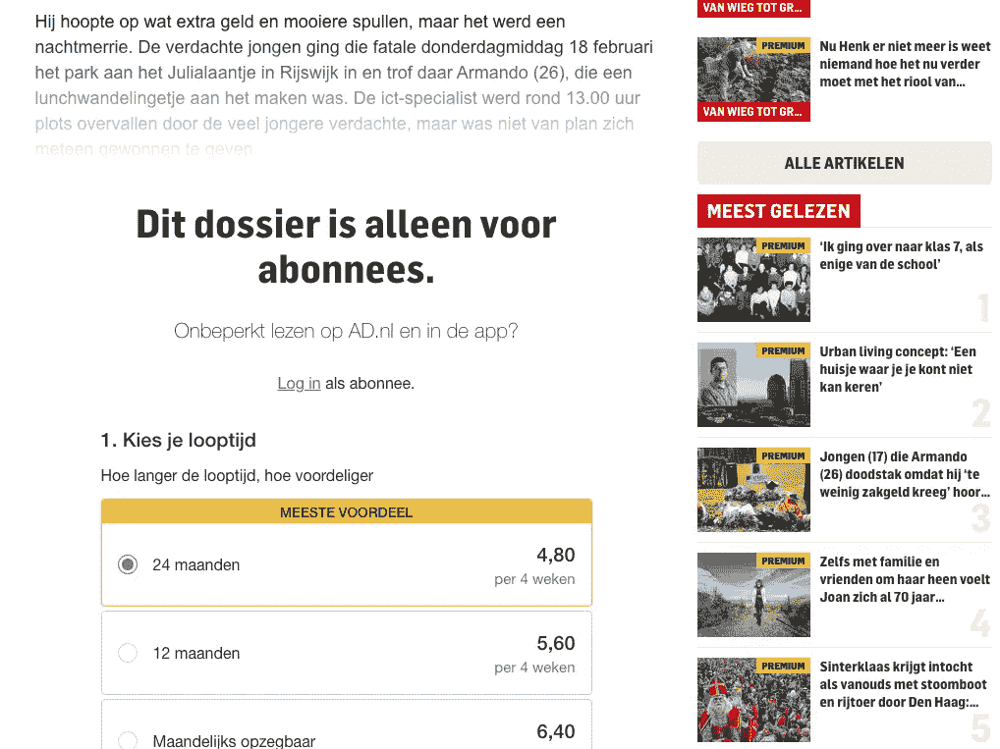

# 在付费墙外和诱惑队的人一起

> 原文：<https://medium.com/geekculture/beyond-the-paywall-with-the-folk-from-the-seduction-squad-559d6cd3bb03?source=collection_archive---------14----------------------->

由前端开发商 DPG 媒体的耶鲁安·范登贝赫撰写

**对于没有受过专业训练的人来说，在线付费墙可能看起来很简单，而且可能很烦人。但是，付费墙在技术上非常先进，对 DPG 媒体的收入流至关重要——付费墙处于我们新闻品牌内容货币化的最前沿。诱惑小队带我们越过长城。**

付费墙和营销信息有各种形状和大小。有时它是一个简单的、无阻挡的顶栏，带有一些文本和一个按钮，有时读者可以在遇到阻挡其余内容的付费墙之前访问一小部分内容。

Top bar subscription message for de Volkskrant

# 数据，还有什么？

要开发有效的付费墙或营销信息，了解客户是必不可少的。数据，数据，数据。数据推动了应用程序的业务规则。一旦有人访问该网站，浏览器就会向服务器发送消息。有了这条消息，服务器就可以知道谁在看新闻，以及应该提供哪些信息:比如，他们会不会遭遇付费墙？嗯，看情况。

In-article paywall for de Volkskrant

这取决于数据——还有什么？几年前，DPG 媒体的付费墙是静态的。它们在今天基于数据的个性化体验中不断进化。例如，付费墙显示给有一定付费倾向的人。你可以看到 1 到 100 之间的一个数字。它表达了人们为内容付费的可能性。如果某个特定用户的付费倾向高于某个数字，他们就撞上了付费墙。显然，有更多的度量标准和业务规则来最佳地支持营销工作。

# 付费墙的复杂性

致力于付费墙和营销信息的技术团队被称为诱惑队，因为他们诱惑和引诱人们订阅、登录或注册时事通讯。他们面临的挑战之一是企业对改进的持续需求。[前端开发人员耶鲁安·范登贝赫](https://www.werkenbij.dpgmedia.be/nl/verhaal/frontend-developer-jeroen-van-den-berghe-bouncing-pay-walls)解释道:“我们总是在测试一些东西。例如，我们可能有一个交易周，并提供一两个月的免费期。什么最有效？此外，从长远来看:经过一段试用期后进行转化的人更投入，还是相反？”

所有的付费墙模板都是市场营销和诱惑团队的共同努力。营销控制着 AB 测试；耶鲁安和他的同事创造了模板。唱反调的人可能会质疑这里的工程挑战，耶鲁安在某种程度上同意这一点。“当然，改变按钮的颜色或者替换一个链接并不是火箭科学。当然，这并不是让我们兴奋的事情。正是这些新功能和复杂的业务规则让研究这一主题变得非常有趣。”

不过，该团队正试图找出如何让营销同事更好地控制他们的模板。拖放编辑器可以吗？可能不会，因为——幸运的是——请求要复杂得多；很少“只是”改变按钮的颜色。拖放编辑器很快就会达到它的极限，但是对于简单的顶栏来说，它非常方便。耶鲁安:“长期的解决办法可能是折中的办法。我们必须看一下用例:模板是否简单，然后编辑器听起来很符合逻辑。对于更复杂的请求，我们总是需要编码。”

In-article paywall on AD.nl

# 自我管理团队，自制应用

虽然模板是特定于品牌的，但系统的核心是为许多不同的品牌服务的。几年前，一个外部团体开始提供付费墙服务。耶鲁安还记得办公室里用来处理所有流量的大量巨型服务器。“这是一项巨大的投资，而且服务不够灵活。我们中的一些人不得不实现这个应用程序，并且觉得它在许多方面都有不足。额外的功能不是一个选项或者很难添加。这是你不希望你的应用程序处于快节奏的营销环境中的一切。”

沮丧和鼓舞之下，该团队做了一个概念验证，并想出了如何自己构建付费墙服务。今天，我们在 AWS 上自制了一个应用程序，包含几个微服务。DPG 媒体为技术团队提供了很大的自由来选择他们喜欢的技术。如果用例是强大的，几乎任何事情都是可能的。小队主要使用 Java 作为编程语言。有了 Lambda，诱惑小队使用 Quarkus，因为它提供了一个小的内存占用和减少启动时间。如果用例足够强大，Golang 也是一个选项。

In-article paywall for HLN

# 墙外是什么？

球队不断优化付费墙服务。他们目前面临的技术挑战之一是访问和使用 DPG 媒体中存在的大量数据。解锁所有数据使团队能够创造更加个性化的体验。

另一个难题是:这项服务的巨大负荷——准确地说，每天有 4500 万到 5500 万个电话。耶鲁安解释说:“虽然新闻网站可以依赖 CDN 作为客户端和来源之间的缓存层，但我们不能。因为我们提供个性化服务，对我们新闻网站上每个页面的每次访问都会导致对我们的呼叫——不可能在客户端和源之间进行任何缓存。因此，为了管理成本和性能，需要对整个基础设施进行完美的调整。这绝对是个脑筋急转弯。”

对付费墙工程师来说，脑力激荡并没有停止。他们被设定为物品内购买。现在，付费墙将人们发送到订阅系统，但为了提供无摩擦的购买体验，该团队再次将事情掌握在自己手中，并将自己构建系统。一步一步，一点一点。