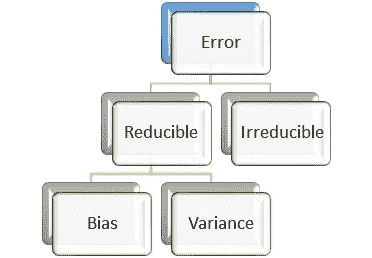
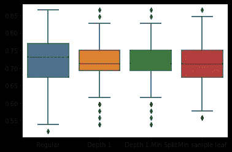

# 偏差和差异——深入挖掘

> 原文：<https://medium.com/geekculture/bias-and-variance-digging-deeper-1dc2486bb2e0?source=collection_archive---------45----------------------->

这两只动物要驯服


[https://unsplash.com/photos/8RXmc8pLX_I](https://unsplash.com/photos/8RXmc8pLX_I)

和人类一样，机器学习模型也会出错。我们需要努力把错误减到最小。但在此之前，我们需要更熟悉错误。下图总结了误差的不同组成部分。



Fig 1: Components of Error ( Image Source: Author)

我们感兴趣的是可约成分，即偏差和方差。机器学习模型和你认识的学生很像，他们可以采取不正当的手段(死记硬背，留小抄)来出类拔萃。你已经知道这种趋势被称为过度拟合，模型越复杂，过度拟合的趋势就越明显。为了掌握情况，我们不会将全部数据展示给模型来记忆，而是保留一部分来测试理解。

现在可以有两种类型的学生。

*   第一类，它们在预测中总是偏离目标，但是在一个小范围内
*   类型 2，它们不是很离谱，但有时向左一点，有时向右一点，有时向上，有时向下一点。这意味着误差是随机的。

第一类误差称为偏差，第二类误差称为方差。让我们用决策树进一步发展这种直觉。

**第一步:设置实验**

```
import pandas as pd
import matplotlib.pyplot as plt 
import numpy as np
from sklearn.metrics import accuracy_score

sonar=pd.read_csv("/kaggle/input/sonar.csv")
sonar.head(5)
```

声纳是用于二元分类的数据集。该数据集有 60 个独立的属性，基本上捕捉声纳波的特征。这两类分别是‘R’(摇滚)和‘M’(金属)。你可以在这里阅读更多关于数据集[的信息](https://archive.ics.uci.edu/ml/datasets/Connectionist+Bench+(Sonar,+Mines+vs.+Rocks))。

**步骤 2:我们将使用不同的种子值**创建不同的训练测试对。为了再现性，我们将创建一个具有 200 个不同种子值的 ab 数组。

```
sds=np.array([ 7201, 65639, 79429, 97556, 83446,  4040, 19136, 60465,  4508,85159, 47490, 78933, 38786, 71735, 40947, 93921, 23817, 49387,29389, 77211,  9631, 51530, 42189, 39644, 26031, 92416, 43836,
14515, 98603, 89179, 36509,  6660,  1014, 63248, 71190, 85926, 30030, 39332, 60098, 75754,  2610, 21638, 75559, 90547, 88348, 63420, 61094, 47382, 62301,  2633, 45287,  4219, 46123, 84365, 35592, 94491, 21469, 85004, 35004, 99191, 34292, 70491, 76716,
30571, 80030,  9096, 94893, 99482, 24740, 17996,  6926, 29095,52196, 99592, 73362, 78224,  4137, 28615, 43236, 90798, 27307,64625, 29798,  9837, 12678, 66675,   458, 55317,   371, 70754,7143, 97278, 24314,  4906, 73279, 92083, 22524, 11067, 40521, 29496, 79254, 72593, 26576, 83370,  9189, 46891, 41156, 68492, 19550, 50102, 99913, 41639,  7876, 40158, 29276, 27296, 51437, 91329, 90905,  9766, 91473, 35803, 56797, 91852, 11818, 82792,11675,  1815, 88774, 94928, 66445, 27668, 97092, 96118, 44631, 82373, 24251, 84652, 70962, 82970, 13656, 93935, 25024, 65802,37281, 23082, 47794,  2920, 46094, 98047, 77605,  6782,  8969,86184,  8220, 58567, 42360, 40531, 89866, 85664, 47358, 89345,61521, 21490, 28711, 35516, 73557, 75779,  5745, 85077, 90047,
3622, 98625, 57135, 22317, 57947, 45689, 30491, 43600, 63679,
64541, 19675, 77626, 35308, 28497, 35008, 85613, 15440, 52657,
6497, 47109, 41854,  4720, 64677, 86208, 88470, 63428,  2000,7064, 51788])
```

**第三步:我们将创建决策树的不同变体，具有不同的复杂性**

*   树 1:普通的树
*   树 2:最大深度= 1 的树
*   树 3:最大深度= 1 且要分割的最小样本为 200 的树
*   树 4:树叶中最小样本数为 10 的树

```
acc1=np.empty(200)
acc2=np.empty(200)
acc3=np.empty(200)
acc4=np.empty(200)
i=0
for k **in** np.nditer(sds):
    X_train, X_test, y_train, y_test = train_test_split(X, y, random_state=int(k))
    tree_clf = DecisionTreeClassifier(random_state=42)
    tree_clf.fit(X_train, y_train)
    y_pred_tree = tree_clf.predict(X_test)
    acc1[i]=accuracy_score(y_test, y_pred_tree)
    *# Max Depth = 1*
    tree_clf1 = DecisionTreeClassifier(random_state=42,max_depth=1)
    tree_clf1.fit(X_train, y_train)
    y_pred_tree = tree_clf1.predict(X_test)
    acc2[i]=accuracy_score(y_test, y_pred_tree)
    *# Max Depth and minimum sample to split*
    tree_clf2 = DecisionTreeClassifier(random_state=42,max_depth=1,min_samples_split=100)
    tree_clf2.fit(X_train, y_train)
    y_pred_tree = tree_clf2.predict(X_test)
    acc3[i]=accuracy_score(y_test, y_pred_tree)
    tree_clf3 = DecisionTreeClassifier(random_state=42,min_samples_leaf=10)
    tree_clf3.fit(X_train, y_train)
    y_pred_tree = tree_clf3.predict(X_test)
    acc4[i]=accuracy_score(y_test, y_pred_tree)
    i = i + 1
```

**步骤 4:验证结果**

在验证之前，让我们发展一些相同的概念。所以，这四个模型将会在不同的测试集上给出一系列的精度。尺码是多少，是 200 对吧！。我们怎样才能将它们形象化？嗯，一个方框图可能不是一个坏主意。如果模型简单，那么它们将具有高偏差，即低分类精度和较小的方差，即较小的盒子分布。如果它们是复杂的，分类精度会更高，但是相应盒子的分布会更大。

```
dftree = pd.DataFrame({'Regular': acc1, 'Depth 1': acc2, 'Depth 1,Min Split':acc3,'Min sample leaf':acc4})
import seaborn as sns
sns.boxplot(data = dftree)
```



Figure 2: Comparing the bias, variance using decision trees (Image Source: Author)

**结论**:

我们可以肯定地看到，与其他三种树相比，常规树具有最高的中值准确性以及最高的盒子分布。