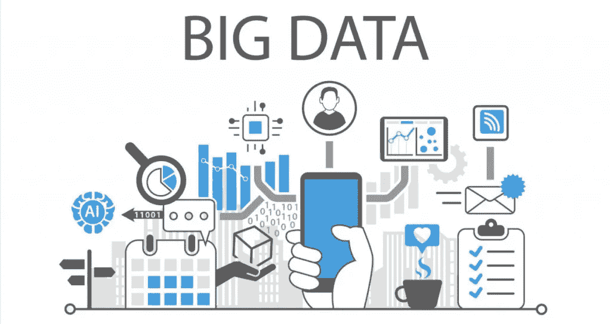
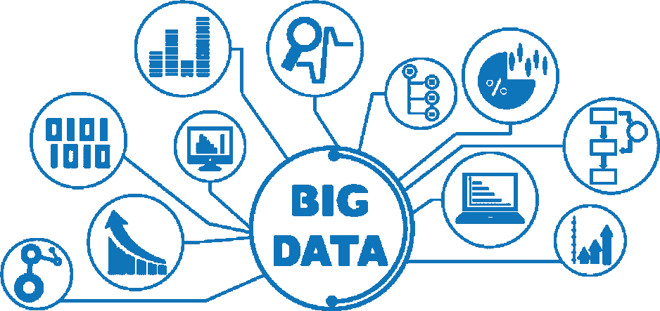

# 大数据:比你想象的更近

> 原文：<https://medium.com/geekculture/big-data-closer-than-you-think-aa8260e63453?source=collection_archive---------24----------------------->

## 数字眼睛和耳朵

当然，至少有一次，当你刚刚想到冬靴时，它们立即出现在推荐中。很简单——这是基于你的搜索查询或兴趣显示的上下文广告。眼球追踪和桌面时间追踪呢？

## 趋势

先说数据库:大数据是分析海量匿名化个人信息的工具和方法。为什么以便随后将所有这些用于特定的任务。例如，预测顾客在商店的行为，或者在你的 Instagram feed 上建立推荐。

直到 2011 年，大数据还被作为科学研究的一部分进行分析，而今天所有的 IT 巨头都在积极参与信息工作。由于来源的数量每天都在增长，对处理技术的需求也越来越大。存储数百万张 Instagram 食物照片的方式也是如此。

> 为此，使用了拥有最强大服务器的物理数据中心和云存储。当需要数据时，将使用水平可伸缩性原则，这允许同时在大量服务器上处理信息。

在一台计算机上分析如此大量的数据将花费很长时间。

## 隐藏跟踪器

如果说广告是贸易的主要引擎，那么统计就是它的燃料，统计是通过收集公共领域的信息获得的。有趣的不是你用你的页面做什么，而是你如何与陌生人互动。

根据 Instagram 上的照片很容易理解一个人的爱好是什么，但根据你拥有的 prolakin 的人创造一个有吸引力的广告形象已经是一个带星号的任务了。万亿字节的信息通过数字搅拌机传递，这样你就能在正确的时间得到正确的推荐。

让我们模拟一下情况。你在社交网络上运行常规页面，有时以昂贵的汽车为背景拍照。你会得到豪华车的广告吗？是的，如果广告商打算浪费预算的话。拥有专业团队的品牌明白，这样的形象不是他们的目标受众。

> 数据分析师表示，如今广告细分的最大挑战之一是识别高收入用户。以**福布斯百强**为例。事实证明，这个名单上很少有人使用社交网络和现代智能手机。

因此，广告代理公司和应用程序开发人员将他们的兴趣转向了那些明天将成为百万富翁的人。特殊的追踪器出现在移动游戏中，当你连续移动球时，它会记录下你所做的决定。如果现在它只是有价值的信息，那么几年后在此基础上预测行动将是可能的。这无疑是一个粗糙的乌托邦，这样的赛博朋克还没有等着我们，但预测反应的方向已经显而易见。

## 皮卡迪利广场的银幕

如果你去皮卡迪利广场，你可以在伦敦看到它是如何实时运作的。2017 年，他们在那里安装了一个屏幕， [**根据环境调整**](https://www.itsnicethat.com/news/piccadilly-lights-facial-recognition-technology-261017) 内容。一个由摄像头和传感器组成的系统检测路人的年龄、性别和脸上的情绪，以及路过车辆的颜色。

所有这些都有助于智能屏幕为附近的观众定制广告。此外，图像还取决于天气、新闻日程或体育赛事的变化。顺便说一下，这个显示屏有四个网球场那么大——是当今欧洲最大的。

## 窃听你的电话？

也许吧。如果你是为女王服务的外国特工或者只是一个有趣的人。当你与语音助手交流时，智能手机可以用铅笔记下一些单词。但不是整个对话都被记录在那里，而只是可以被初始编程的关键词。

比如“出租车”、“披萨”、“电影票”。进一步，根据这类标签应用的次数和时间，可以形成上下文推荐。比方说，你晚上去了一家酒吧，三个小时后，服务员会友好地提供一辆出租车，因为明天七点你必须起床去工作。

> 但是如果现在你旁边有一部电话，那么不要担心，扎克伯格没有偷听。实时识别音频流是毫无益处且非常昂贵的。

好吧，但是当我没有寻找任何东西，但是谷歌**提供了昨天闲聊的内容时，情况又会如何呢？这都是关于我们大脑的工作。有时候，我们只是忘记了我们以前通过点击我们喜欢的图片或材料，或者通过对该主题的某个内容的短暂搜索，曾经遇到过这种内容。过一会儿，搜索引擎就会更主动地抛出类似的查询。**

有时，我们最终会成为统计样本。例如，在一个星期五的晚上，你渴望吃比萨饼，而该品牌正在为周末推出有针对性的广告——在你的地区，针对你的年龄组。如果最近你正在寻找原味鹰嘴豆泥的配方，同时点了豆奶，那么你也会得到一份素食披萨。

或者是**巴纳姆效应**，在查看星座运势时经常可以看到。这是一个模糊的预测，几乎适合任何人。今天你是等待成功的水瓶座，昨天工作上确实有问题，像射手座，明天你准备好重新审视你在这个世界上的位置——这肯定是关于双鱼座的。因为对预言实现的期望开始支配我们的行为和我们对周围世界的看法。

大数据也是如此。你想买一部新的智能手机吗？决定了型号，并决定在发工资前一周再买，这时你突然开始注意到到处都是标志。在这里，零售商有一个促销活动，在过渡阶段有一个广告，您的同事对这款手机的评价很好。

以及一个季度重复一次促销活动，广告已经挂了六个月，一个朋友在购买当天在社交网络上发布了一个新东西，你放心地错过了。事实是，你以前已经看到和听到了这一切，但那时它不是你感兴趣的对象，因此你没有背叛它的任何意义。

## 偏执的平衡

大多数情况下，您的数据不会被强行获取，但您会在安装新应用程序时通过点击“下一步/同意”友好地提供这些数据。还记得那些枯燥无味的规则、各方义务和条件吗？就是在那里藏着物品，负责收集用户信息。我们继续并同意了。

像往常一样，拯救适足是最适足者的工作。记住:互联网上的所有东西都将永远留在互联网上。实践数字卫生，选择复杂的密码，仔细阅读许可协议，抵制巴纳姆效应，你将是数字幸福。

**保持更新。**

 [## 区块链算法。第三部分。授权证明和刻录

### 授权证明和刻录

medium.com](/nerd-for-tech/blockchain-algorithms-part-3-proof-of-authority-proof-of-burn-dffeb32c60c5)