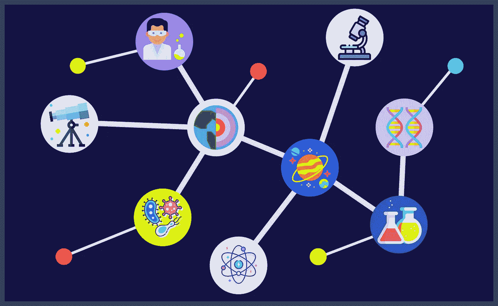

# 大数据正在推动科学领域的巨大变革。

> 原文：<https://medium.com/geekculture/big-data-is-driving-a-big-change-in-science-bfb2a671643?source=collection_archive---------62----------------------->

您可能已经知道，大数据有几个特征，称为大数据的 V，其中包括数据量、获取数据的速度、数据的多样性、数据的准确性以及数据可以带来的价值。

在科学领域所做的不同实验，如物理学、生物学、天体物理学、天文学、地质学，产生了大量的…