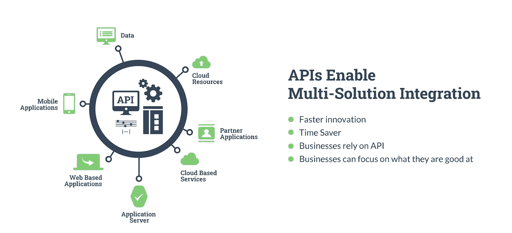
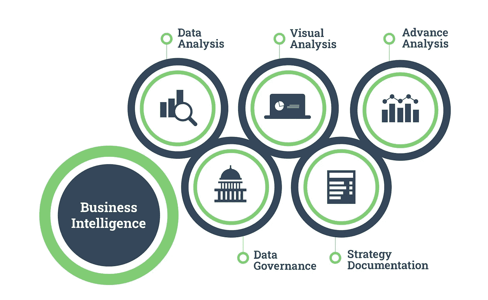
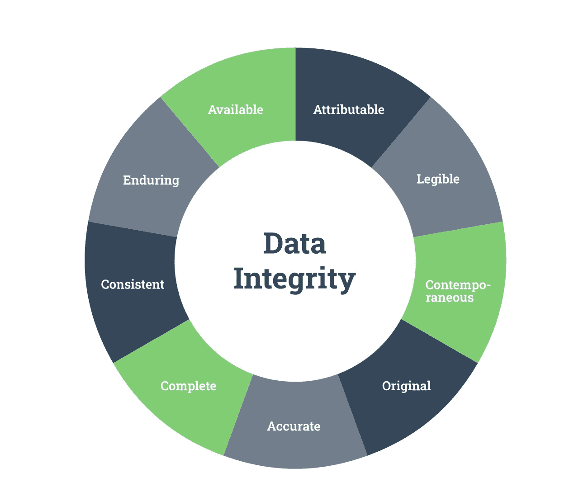
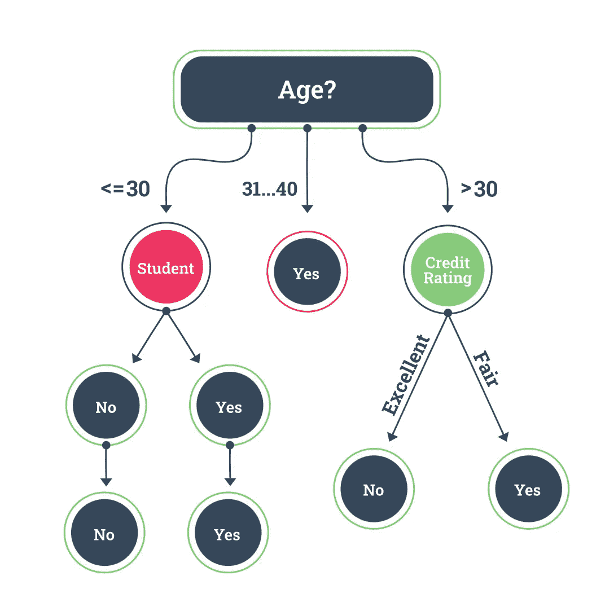
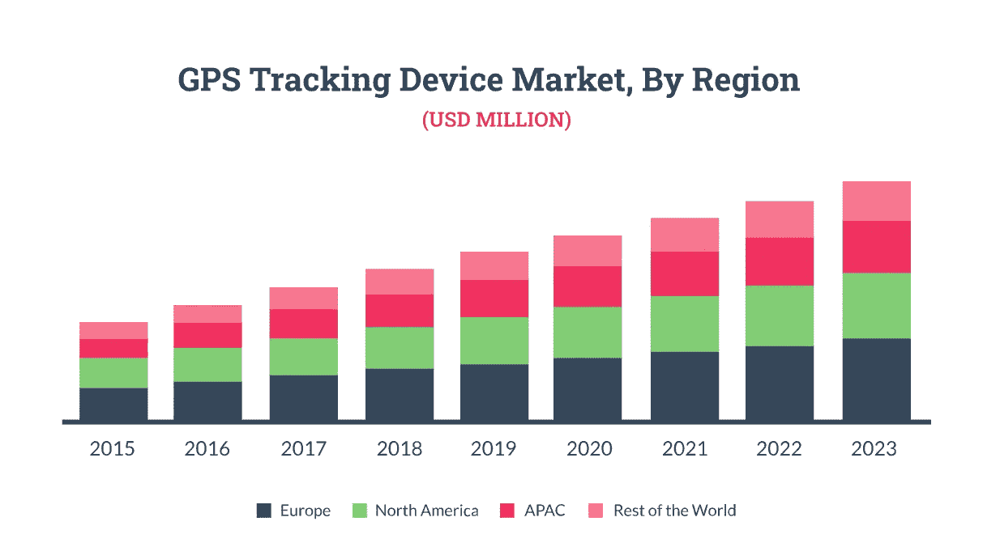
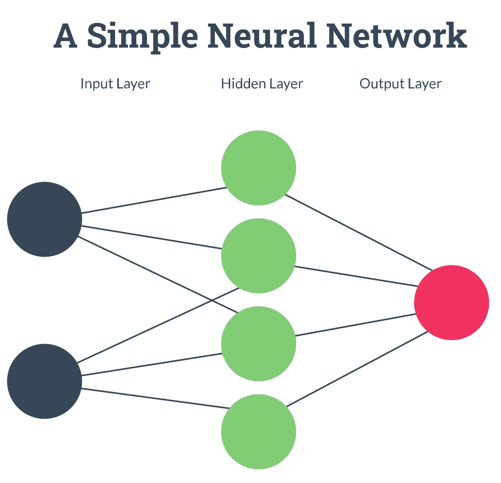
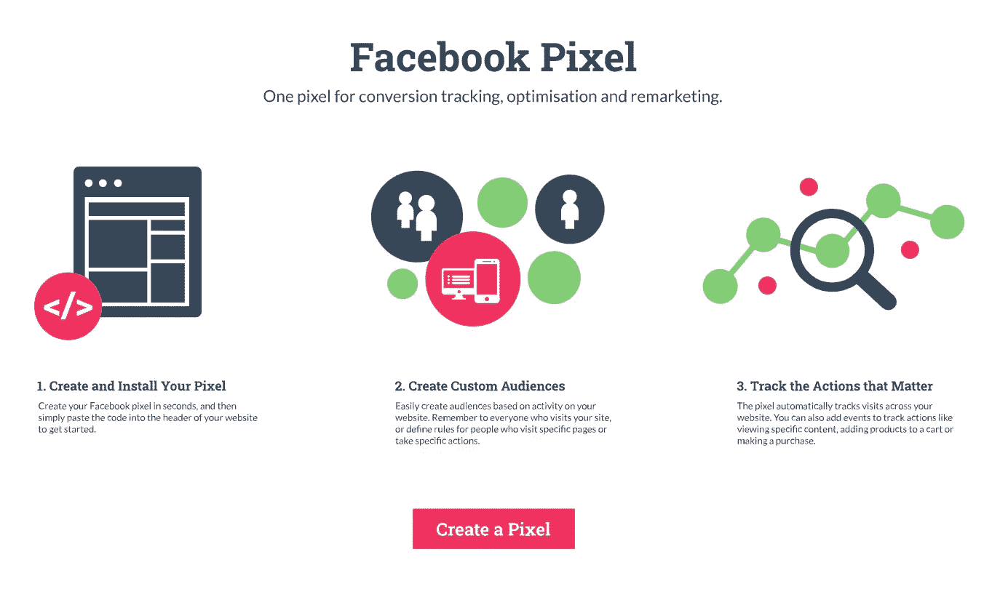
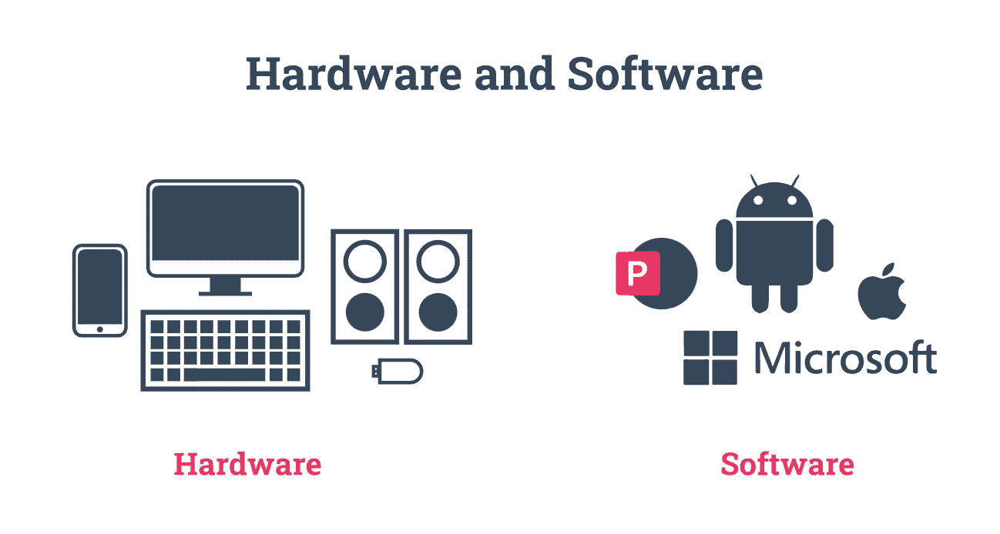
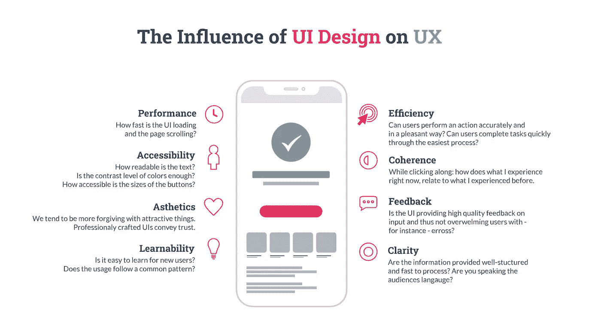

# 大数据术语:每个营销人员都应该知道的 80 个定义

> 原文：<https://medium.com/geekculture/big-data-terminology-80-definitions-every-marketer-should-know-514eba18f4f3?source=collection_archive---------51----------------------->

作为一名营销人员，当你为你的行业写作时，你可能有相当丰富的词汇，你总是紧跟任何新的营销趋势或流行语。我们知道这是真的，因为在 Hurree，我们痴迷于营销人员及其工作方式。更具体地说，我们痴迷于让他们的生活更轻松。

所以我们想，为什么不利用当今市场营销中最重要、最专业的元素之一:[大数据](https://blog.hurree.co/blog/big-data)。不久前，许多营销人员可能还不太了解这一点，但现在他们迫切需要了解这一点。

这就是为什么我们创建了这个每个营销人员都应该知道的大数据术语的庞大列表，从初级短语到高度技术性的定义。在你穿越[数据驱动营销](https://blog.hurree.co/blog/how-to-be-a-data-driven-marketer-8-key-steps)的糟糕世界时，这是一个方便的指南，这样你就总能对大数据术语有一个营销人员友好的解释。

那么，让我们开始吧…

# 大数据术语:每个营销人员都应该知道的定义

**1。抽象层**

将高级请求转换为低级功能和操作的翻译层。数据抽象去除了执行功能所需的基本细节，在系统中留下了复杂的、不必要的数据。复杂的、不需要的数据对客户端是隐藏的，并且呈现一个简化的表示。

抽象层的典型例子是应用程序和操作系统之间的 API(应用程序编程接口)。

**2。API**

API 是**应用编程接口**的首字母缩写，是计算机或计算机程序之间的软件连接。API 不是数据库或服务器，而是允许在服务器、应用程序等之间访问和共享信息的代码和规则。

Source: [ColorWhistle](https://colorwhistle.com/api-development-importance/)

**3。聚合**

数据汇总是指收集数据并以汇总格式呈现的过程。可以从多个来源收集数据，然后组合成一个摘要。

**4。算法**

在计算机科学中，算法是一组定义明确的规则，在实现时可以解决数学或计算问题。算法用于执行计算、数据处理、机器学习、[搜索引擎优化](https://blog.hurree.co/blog/keyword-research-seo-competitor-analysis)等等。

**5。分析**

对大量数据或统计数字进行计算分析和解释的系统和技术。[分析](https://blog.hurree.co/blog/benefits-of-market-segmentation-analytics)用于获得洞察力、发现模式和优化业务绩效。

**6。应用程序**

应用程序是为最终用户执行特定任务而设计的任何计算机软件或程序。应用程序可以是基于桌面、网络或移动的。

**7。Avro**

Avro(或 Apache Avro)是一个开源的数据序列化系统。

**8。二元分类**

二进制分类是一种技术，用于基于分类规则来识别一组两个元素是否在一个组或另一个组中。例如，二进制分类技术用于确定疾病是否存在于医疗数据中。在计算中，它根据内容对用户的相关性或价值来决定是否将内容包含在搜索结果中。

**9。商业智能**

[商业智能](https://blog.hurree.co/blog/marketers-guide-to-data-warehousing-and-business-intelligence)是收集和准备用于分析的内部和外部数据的过程；这通常包括数据可视化技术(图表、饼图、散点图等)。)呈现在[商业智能仪表盘](https://searchbusinessanalytics.techtarget.com/definition/business-intelligence-dashboard)上。通过利用商业智能，组织可以做出更快、更明智的商业决策。

Source: [MPercent Academy](/@mperceptacademy/business-intelligence-the-leap-you-need-58b2742fd186)

**10。字节**

在计算中，字节是八个二进制数字(位)长的数据单位。字节是内存大小的单位；一个字节是最小的存储单位；因此，在计算中，我们通常指千兆字节(GB，十亿字节)和太字节(TB，一万亿字节)。

**11。C**

c 是一种编程语言，也是最古老的编程语言之一。尽管年代久远，它仍然是最流行的系统之一，因为它驱动着像微软视窗系统和 T21 苹果电脑这样的系统。

12。CPU

这个缩写代表**中央处理器** *。*一个 [CPU](https://www.makeuseof.com/tag/cpu-technology-explained/) 通常被称为计算机的大脑——你会在你的手机、智能手表、平板电脑等设备中发现它。尽管是计算机中许多处理系统中的一个，CPU 还是至关重要的，因为它控制着执行计算、采取行动和运行程序的能力。

13。级联

级联是一种设计用于 Hadoop 的软件，用于创建数据驱动的应用程序。级联软件创建了一个抽象层，支持复杂的数据处理工作流，并掩盖了 MapReduce 过程的底层复杂性。

**14。清洁数据**

[清理数据](https://blog.hurree.co/blog/cleaning-your-crm-data)通过从数据集中移除错误、损坏、重复和格式不一致来提高数据质量。

**15。云**

云技术，也就是人们常说的云，是一个由服务器组成的网络，用户可以通过互联网访问这些服务器，以及在这些服务器上运行的应用程序和软件。云计算消除了公司管理物理数据服务器或在自己的设备上运行软件应用程序的需要，这意味着用户现在可以从几乎任何位置或设备访问文件。

虚拟化使云成为可能，虚拟化是一种模仿物理服务器的技术，但以虚拟的数字形式存在，也称为虚拟机。

**16。命令**

在计算中，命令是发送给计算机程序的指示，命令它执行特定的动作。可以通过命令行界面、网络服务协议或作为图形用户界面中的事件来简化命令。

17。计算机架构

[计算机架构](https://www.techopedia.com/definition/26757/computer-architecture)规定了组成计算机系统或平台的硬件和软件的规则、标准和格式。体系结构充当了计算机系统如何设计以及它与什么其他系统兼容的蓝图。

18。连接的设备

通过互联网相互连接以及与其他系统连接的物理对象。[互联设备](https://www.arm.com/glossary/connected-devices)通常由移动应用远程监控，例如通过蓝牙、WiFi、LTE 或有线连接。

**19。数据访问**

数据访问是根据需要以自助方式访问、修改、移动或复制数据的能力。具体而言，数据访问是指 IT 系统，其中的数据可能是敏感的，需要持有数据的组织进行身份验证和授权才能访问。

数据访问有[和](https://www.techopedia.com/definition/26929/data-access)两种形式:

*   随机存取
*   顺序存取

20。数据采集

数据捕获是指从纸质或电子文档中收集信息，并将其转换为计算机可读的格式。数据捕获可以自动化，以减少手动数据输入的需要，并加快这一过程。

**21。数据摄取**

数据摄取是将数据从各种来源移动到中央存储库(如数据仓库)的过程，组织可以在此存储、访问、分析和使用数据。

**22。数据完整性**

确保数据在整个数据生命周期中保持准确、有效和一致的做法。[数据完整性](https://blog.hurree.co/blog/what-is-data-integrity)包括逻辑完整性(一个过程)和物理完整性(一种状态)。

**23。数据湖**

一个[数据湖](https://blog.hurree.co/blog/data-warehouse-vs-data-lake)是一个集中的存储库，存储大量的原始数据——这些数据没有经过准备、处理或操作以适应特定的模式。数据湖包含结构化和非结构化数据，并在数据分析期间使用“读取时”模式。

**24。数据管理**

数据管理是数据使用的总体战略，指导组织通过政策和法规安全、经济地收集、存储、分析和使用数据。

25。数据处理

将原始数据转换成机器可读格式的过程，或者说，将数据转换成有用的东西。经过处理后，企业可以利用数据收集见解并做出决策。

26。数据序列化

数据序列化是一个[数据转换过程](https://devopedia.org/data-serialization)，能够将复杂或大型数据结构或对象状态转换为更易于存储、传输和分发的格式。在序列化和选定的数据操作之后，字节序列可以创建与原始序列完全相同的克隆，这一过程称为去序列化。

**27。数据存储**

指在计算机或其他设备上收集和记录数据以备将来使用。最常见的数据存储方式有三种:文件存储、块存储和对象存储。

**28。数据标记**

数据标记是一种分类过程，允许用户更好地组织数据类型(网站、博客帖子、照片等)。)使用标签或关键字。

29。数据可视化

在这个过程中，大量数据被转换成图形、饼图、散点图等可视化格式。可视化可以更好地被人脑理解，并加快组织的洞察力检索速度。

30。数据仓库

企业可用于支持商业智能(BI)活动(如分析)的集中式信息库。[数据仓库](https://blog.hurree.co/blog/what-is-a-data-warehouse)通常集成来自不同来源的历史数据。

**31。决策树**

决策树是过程和选项的可视化表示，帮助机器在面临许多选择和结果时标记复杂的预测或决策。决策树是[有向无环图](/@kay.schulz10/overview-of-decision-trees-8756369e6bf2),由分支节点、边和叶节点组成，所有数据都向一个方向流动。

Source: [Edureka!](https://www.edureka.co/blog/decision-trees/)

**32。深度学习**

[深度学习](https://www.investopedia.com/terms/d/deep-learning.asp)是人工智能和机器学习的一项功能，它模仿人脑做出决策、处理数据和创建模式的过程。它可以用来处理大量的非结构化数据，这些数据需要人类大脑数年才能理解。深度学习算法可以识别物体和语音，翻译语言等。

33。ETL

用于描述[数据集成](https://info.hurree.co/en-gb/data-integration)过程的首字母缩写词:提取、转换和加载。

34。ELT

用于描述数据集成过程的首字母缩写词:提取、加载和转换。

35。编码

在计算中，[编码](https://www.saedsayad.com/encoding.htm#:~:text=Encoding%20or%20continuization%20is%20the,%2C%20SVM%2C%20neural%20networks).)是指给类别分配数值。例如，男性和女性将被编码为用 1 和 2 来表示。

有两种主要的编码类型:

*   二进制的
*   基于目标的

**36。容错**

术语[容错](https://www.imperva.com/learn/availability/fault-tolerance/)描述了一个系统(例如，一台计算机或一个云集群)在一个或多个组件出现故障的情况下继续不间断运行的能力。

开发容错功能是为了确保高水平的可用性，并且关键系统或连续性的丢失不会影响任何业务。容错是通过利用硬件、软件和电源解决方案中的备份组件来实现的。

**37。水槽**

Flume 是一个开源软件，它有助于收集、聚合和移动大量非结构化的流数据，如日志数据和事件。Flume 有一个简单灵活的架构，将数据从不同的服务器转移到一个集中的数据存储中。

**38。GPS**

GPS 是**全球定位系统**的缩写，它是一种导航系统，使用来自卫星的数据和算法来同步位置、空间和时间数据。GPS 利用三个关键部分:卫星、地面控制和用户设备。

Source: [MarketsandMarkets](https://www.marketsandmarkets.com/Market-Reports/global-GPS-market-and-its-applications-142.html)

**39。粒度计算(GrC)**

作为大数据中信息处理的一种新兴概念和技术，[粒度计算](https://www.techslang.com/definition/what-is-granular-computing/)将数据细分为信息颗粒或所谓的“实体集合”。这种划分的目的是发现数据在粒度级别上是否不同。

40。GraphX

Apache Spark 的一个 API，用于图形和图形并行计算。GraphX 促进了更快、更灵活的数据分析。

41。HCatalog

最简单的形式是， [HCatalog](https://www.bmc.com/blogs/what-is-apache-hcatalog-hcatalog-explained/) 提供了 Apache Hive、Pig 和 MapReduce 之间的接口。由于所有三种数据处理工具具有不同的数据处理系统，HCatalog 确保了一致性。HCatalog 支持用户以 SerDe(serializer-deserialiser)可以编写的任何格式在网格上读写。

**42。Hadoop**

Hadoop 是一个由程序和过程组成的开源软件框架，通常用作大数据开发项目的主干。Hadoop 由 4 个模块组成，每个模块都有自己独特的用途:

*   **分布式文件系统** —允许数据以任何格式轻松存储在大量存储设备上。
*   **MapReduce** —读取数据并将其翻译成正确的格式，以便进行分析(map)和执行数学计算(Reduce)。
*   **Hadoop Common** —提供 Windows 等用户系统从 Hadoop 中检索数据所需的基准工具。
*   **YARN** —处理执行存储和分析的系统的管理模块。

**43。硬件**

硬件是任何计算机系统的物理组件，例如，线路、电路板、显示器、键盘、鼠标、桌面等。

**44。高维度**

在统计学中，[维度](https://www.statisticshowto.com/dimensionality/)是指一个数据集有多少个属性。因此，高维度指的是具有大量属性的数据集。当高维数据出现时，计算变得极其困难，因为特征的数量超过了观察的数量。

网站分析(例如排名、广告和爬行)是高维度的一个很好的例子。

**45。蜂巢**

[Hive](https://www.ibm.com/analytics/hadoop/hive) 是一个开源的数据仓库软件系统，允许开发人员在 Hadoop 分布式文件系统(HDFS)和 MapReduce 上进行高级工作。Hive 通过使用更简单的 Hive-Query 语言(HQL)使使用这些工具变得更容易，从而减少了开发人员了解或编写复杂 java 代码的需要。

46。信息检索

一种处理组织、存储和检索信息的软件程序，通常是基于文本的格式，来自大型文档库。IR 的一个简单例子是我们都在 Google 上执行的搜索引擎查询。

47。整合

集成是组合来自多个不同来源的数据以实现数据的统一视图的过程，从而实现更简单、更有价值的运营或商业智能。

[数据集成](https://info.hurree.co/en-gb/data-integration)主要有五种形式:

*   指南
*   中间件
*   数据仓库
*   [基于应用的](https://www.hurree.co/marketers-guide-application-integration)
*   统一访问。

**48。**物联网

[物联网](https://www.zdnet.com/article/what-is-the-internet-of-things-everything-you-need-to-know-about-the-iot-right-now/) (IoT)是指连接到互联网并生成、收集和共享数据的物理对象的生态系统。随着技术的进步，微芯片越来越小，物联网已经将以前温和的物体转变为智能设备，可以在不需要人类交互的情况下提交见解。

49。Java

Java 是一种高级编程语言，专门用于减少编程依赖性。然而，它也被用作计算平台。Java 被广泛认为是快速、安全和可靠的。

**50。等待时间**

数据延迟是指数据仓库或商业智能平台完全处理数据查询所需的时间。数据延迟主要有三种类型:零数据延迟(实时)、近时间数据延迟(批量合并)、部分时间数据延迟(仅在需要时访问和更新数据)。

**51。机器学习**

机器学习是一种技术的分支，在这种技术中，计算机自动评估问题，并配置算法模型来解决这些问题，而无需人类交互。

**52。采矿**

众所周知，挖掘或数据挖掘是指使用计算机程序来识别大量数据中的模式、趋势和异常，并使用这些发现来预测未来结果的实践。

**53。NoSQL**

[NoSQL](https://www.ibm.com/cloud/learn/nosql-databases) 也被称为非 SQL 或者非唯一 SQL。这是一种数据库设计方法，它扩展了存储和查询功能，超出了常规关系数据库中的传统表格结构。

相反，NoSQL 数据库使用 JSON 文档将数据存放在一个结构中。这是一种非关系设计，可以处理非结构化数据，因为它不需要模式。

54。非关系数据库

不使用行和列的表格系统的数据库系统。

55。神经网络

一套算法，通过模拟大脑的过程来识别大量数据之间的关系。神经一词指的是大脑中充当信息信使的神经元。

神经网络自动适应变化，而无需重新设计其算法，因此已被广泛用于金融交易软件的设计。

Source: [Investopedia](https://www.investopedia.com/terms/n/neuralnetwork.asp)

56。开源

开源是指其他开发者可以免费使用、重新发布甚至修改某些类型的代码。这种去中心化的软件开发模型鼓励协作和同行生产。

**57。模式识别**

计算机科学的基石之一，模式识别，使用算法和机器学习来识别大量数据中的模式。

**58。猪**

Pig 是一种高级脚本语言，用于创建在 Hadoop 上运行的程序。

59。像素

像素是一小段 HTML 代码，用于跟踪用户的在线行为，例如，当他们访问网站或打开电子邮件时。

**60。编程语言**

程序设计语言是一套正式的语言，使用一组字符串来指导计算机执行特定的任务。程序员使用语言来开发应用程序。编程语言众多，最常见的是 [Python 和 Java](https://statisticstimes.com/tech/top-computer-languages.php) 。

**61。Python**

Python 是一种具有动态语义的高级编程语言，用于快速开发应用程序。Python 优先考虑可读性，由于减少了对程序维护的需求，使得它更容易学习并且更便宜。

**62。查询**

在计算中，[查询](https://www.techopedia.com/definition/5736/query)是针对数据库的信息请求或问题。查询的数据可以以 SQL(结构化查询语言)或数据可视化的形式返回，例如图形、图像表示等。

**63。R**

r 是一个用于统计计算和图形的自由软件环境。

64。拉姆

[随机存取存储器](https://www.digitaltrends.com/computing/what-is-ram/)的首字母缩略词，本质上是指计算机的短期记忆。RAM 存储计算机现在和不久的将来可能需要的所有信息；这些信息是设备上当前运行的所有内容，例如正在使用的任何网络浏览器或您当前正在玩的游戏。

RAM 的快速存取能力使其有利于短期存储，不像硬盘驱动器设备速度较慢，但更适合长期存储。

65。关系数据库

关系数据库的存在是为了容纳和识别彼此之间具有预定义关系的数据项。关系数据库可用于通过包含列和行的表格集来深入了解与其他数据相关的数据。在关系数据库中，表中的每一行都有一个唯一的 ID，称为键。

**66。SQL**

SQL 代表**结构化查询语言**，用于与数据库通信。SQL 是用于关系数据库的标准语言。

67。可扩展性

[数据库的可扩展性](https://www.informit.com/articles/article.aspx?p=2258416)是指适应快速变化的数据处理需求的能力。可伸缩性涉及数据的快速增长(向上扩展)和数据处理需求的减少(向下扩展)。可伸缩性确保了无论处理的数据量有多大，处理速度都是一致的。

**68。模式读时**

一种数据分析方法，在从数据库中提取数据集时，而不是在将数据集拉入数据库时，将模式应用于数据集。数据湖应用一种读取模式，允许它容纳非结构化数据。

69。模式写入时

一种数据分析方法，在数据集被纳入数据库时将模式应用于数据集。数据仓库使用写入模式，这意味着数据被转换成标准化格式进行存储，并准备好进行分析。

70。半结构化数据

半结构化数据不驻留在关系数据库中(行和列)；然而，它仍然有某种形式的组织格式，使它更容易处理，如语义标签。

**71。软件**

与硬件相反，软件是一组虚拟的指令、代码、数据或程序，用于通过计算机执行操作。

**72。火花**

[Spark](https://www.infoworld.com/article/3236869/what-is-apache-spark-the-big-data-platform-that-crushed-hadoop.html) 是一个数据处理和分析框架，可以在非常大的数据集上快速执行处理任务，或者在多台计算机上分配任务。

Spark 的架构由两个主要组件组成:

*   **驱动**——将用户的代码转换成任务，分布在工作节点上
*   **执行器** —运行在那些节点上，执行分配给它们的任务

73。结构化数据

可以格式化为行和列的数据，其元素可以映射到清晰的预定义字段。结构化数据的典型例子有姓名、地址、电话号码、地理位置等。

74。非结构化数据

非结构化数据没有预定义的结构或数据模型，也不是以预定义的格式组织的。例子包括图像、视频文件、音频文件等。

**75。用户界面**

用户界面或 UI 是人机交互的场所；它们是应用程序前端的显示屏，掩盖了在幕后工作的代码。用户界面的设计考虑了可用性，以确保任何用户都可以轻松理解和浏览界面，因为这将影响[用户体验](https://www.hurree.co/CX-UX-HX-guide)。

76。品种

作为大数据的 4[Vs](https://blog.hurree.co/blog/explain-the-3-vs-of-big-data)的一部分，多样性指的是数据现在可以存在的大量数据格式。

**77。速度**

作为大数据 4v 的一部分，速度是指可以处理大量数据的快速速度。

78。准确性

大数据 4v 的一部分，准确性是指大数据在完整性、准确性、隐私性等方面的可信度。

79。音量

作为大数据 4v 的一部分，卷是指全球范围内产生的大量数据每个数据。

80。工作流程

数据科学工作流定义了完成开发项目所需的阶段或步骤。在数据驱动的业务领域中，工作流也在自动化流程、市场营销或销售活动或内部通信方面被使用和引用。

[大数据](https://blog.hurree.co/blog/the-pros-and-cons-of-big-data)是一个不断发展的广阔而复杂的领域，因此，了解基本术语和更多技术词汇非常重要，这样您的营销才能随之发展。

现在，向前迈进，炫耀你的新知识，给你的同事留下深刻印象，并提高你的内容。