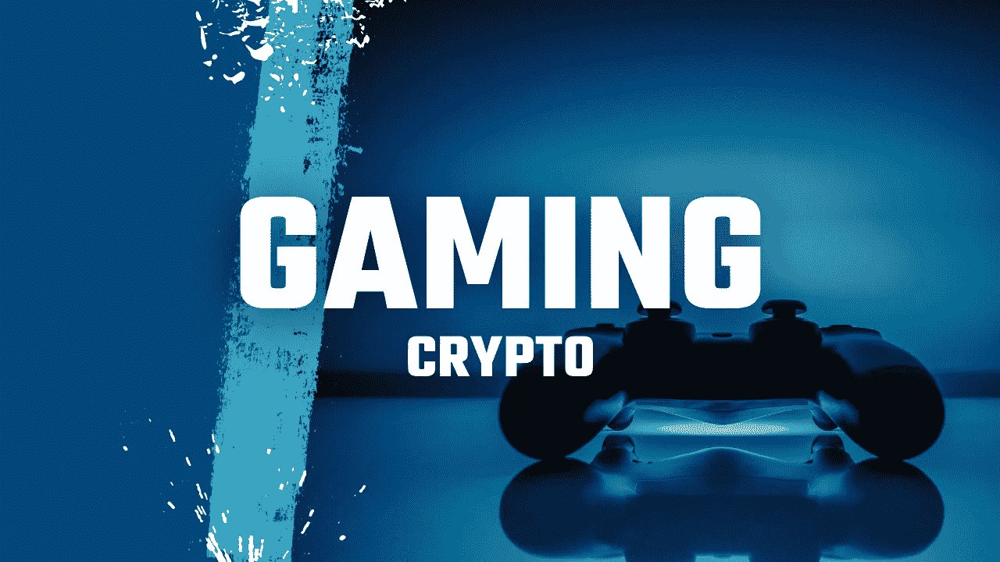

# 密码游戏赚大钱，并承诺更多未来！

> 原文：<https://medium.com/geekculture/big-money-in-crypto-gaming-and-promising-more-to-come-d836085b9c54?source=collection_archive---------14----------------------->

## 目前加密领域最大的子行业之一是游戏。

Thumbnail from [Günter Ederegger](https://medium.com/u/4f0c50d16421?source=post_page-----d836085b9c54--------------------------------)

A 根据 CoinMarketCap 的数据， [170 个与游戏相关的代币](https://coinmarketcap.com/view/play-to-earn/)现在拥有大约 240 亿美元的总市值，11 月初/中旬的交易量为 40 亿美元。